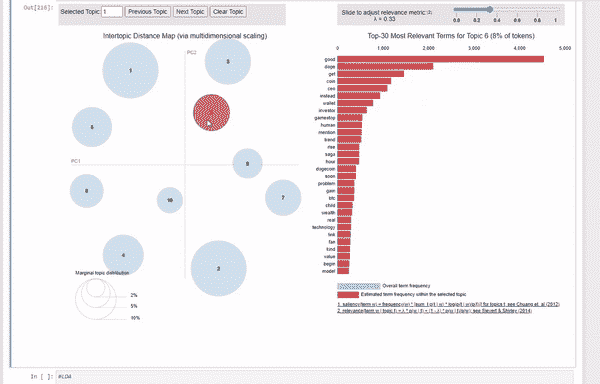
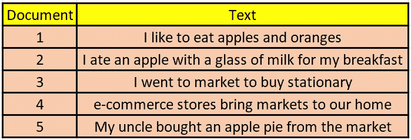
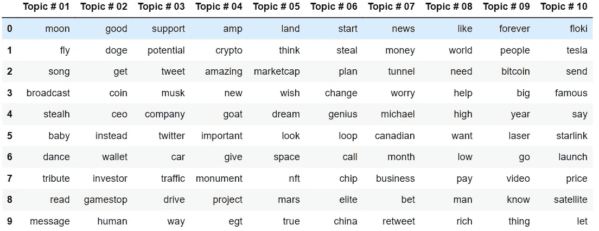

# 使用潜在狄利克雷分配(LDA)对提及埃隆马斯克的推文进行主题建模:第一部分

> 原文：<https://medium.com/mlearning-ai/topic-modelling-with-lda-on-the-tweets-mentioning-elon-musk-687076a2c86b?source=collection_archive---------2----------------------->

> 发现推文中的潜在话题，了解人们在 Twitter 上谈论埃隆·马斯克



LDA Visualization

自然语言处理是当今的热门话题，主题建模是 NLP 技术之一，组织从中受益匪浅。

在本文中，我将尝试解释主题建模背后的思想，并将其应用于使用 [Twitter API](https://developer.twitter.com/apitools/api?endpoint=%2F2%2Ftweets%2Fsearch%2Frecent&method=get) 提取的 Twitter 数据。我将分两部分写这篇文章。在第 1 部分中，我将解释像主题建模和 LDA 这样的概念。我还会进行大量的数据清理和处理。最后，我将实现 LDA 算法并可视化结果。这里，数据集包含了关于埃隆·马斯克的推文。通过对数据应用主题建模，我们将能够深入了解人们在 Twitter 上谈论埃隆·马斯克的内容。

在本文结束时，您将理解潜在的 Dirichlet 分配(LDA)算法，并且能够使用 Python 库实现 LDA。还会学到一些很多时候被忽略的数据准备步骤。最后，您将能够在一个非常酷的仪表板上可视化由 LDA 模型识别的主题，就像您在上面看到的那样。我们开始吧！！

**话题造型**

主题建模是一种无监督的学习技术，用于在多个主题的帮助下表示文本文档。它不需要文档的预定义标签列表，而是分析文本数据来确定一组文档的簇词(主题)。

假设你经营一家初创企业，为你的客户提供 B2C 服务。您希望了解客户对您的服务的评价，以便做出明智的决策。你可以用主题建模算法来分析它们，而不是手动浏览大量的反馈，试图推断出哪些文本在谈论你感兴趣的主题。

有几种方法可以进行主题建模，但是在这篇文章中，我们将介绍潜在的狄利克雷分配(LDA)算法，这可能是最流行的主题建模方法。

**潜在狄利克雷分配(LDA)**

为了理解 LDA 算法，让我们看看这个例子。

假设您有以下文档。



Table by Author

LDA 会发现这些句子包含的潜在主题。给定这些句子，LDA 可能会生成如下内容:

**文件 1 和文件 2:** 100%题目 A

**文件 3 和 4:** 100%题目 B

**文档 5:** 50%话题 A，50%话题 B

其中**话题 A:** 30%苹果，10%橘子，10%牛奶，10%馅饼，10%市场…(人们会将话题 A 理解为关于食物)以及

**话题 B:** 30%市场，10%文具，10%买入，…。(有人会将话题 B 理解为关于食物)

因此，LDA 将文档表示为主题的混合，将每个主题表示为单词的混合。

了解了 LDA 算法的输出之后，让我们看看它是如何学习生成这些输出的。

假设你有 n 个文档，你选择了固定数量的 m 个主题来识别。现在，您想使用 LDA 来了解每个文档的主题分布和每个主题的单词分布。LDA 使用 **Gibbs 抽样**学习这些分布。接下来的步骤是:

遍历每个文档，将文档中的每个单词随机分配给 m 个主题中的一个。

如果我们仔细观察，我们会发现这种随机分配既给出了所有 n 个文档的主题分布，也给出了所有 m 个主题的单词分布。最初，这些分布不会很精确。

为了改善每个文档 d 的分布，遍历 d 中的每个单词 w……对于每个主题 t，计算两个概率:

**1。** **p(主题 t |文档 d)** =文档 d 中当前分配给主题 t 的字数/d 中的总字数

**2。p(word w | topic t)** =主题 t 的赋值在所有来自这个单词 w 的文档中所占的比例。

计算完以上两个概率后，再给 w 重新分配一个新的题目，这里我们选择概率为 ***p 的题目 t(题目 t |文档 d) * p(单词 w |题目 t)*** 。请注意，对于每个单词，我们将获得一个概率向量，该向量将解释该单词属于每个主题的可能性。

在重复上一步很多次后，你最终会达到一个大致稳定的状态，你的任务完成得相当好。因此，使用这些分配来估计每个文档的主题混合(通过统计分配给该文档中每个主题的单词的比例)和与每个主题相关的单词(通过统计分配给每个主题的单词的总体比例)。

**实施**

现在，让我们看看如何实现 LDA。如前所述，我将使用谈论埃隆·马斯克的推文作为数据。但是在将 LDA 算法应用到我们的数据之前，我将做一些预处理。实际上，很多！！

*进口:*

我将使用熊猫、re、缩写和 spaCy 进行数据清理和预处理。我将为 LDA 和 pyLDAvis 生成一个非常酷的交互式仪表板 gensim。

```
import pandas as pd
import unicodedata
import re
import contractions
import string#Gensim
import gensim
import gensim.corpora as corpora
from gensim.utils import simple_preprocess
from gensim.models import CoherenceModel#spacy
import spacy
from nltk.corpus import stopwords#vis
import pyLDAvis
import pyLDAvis.gensim_models
```

*数据加载:*

我已经使用 [Twitter API](https://developer.twitter.com/apitools/api?endpoint=%2F2%2Ftweets%2Fsearch%2Frecent&method=get) 获取了数据，因此我将在这里直接导入数据。你可以从[这里](https://drive.google.com/file/d/1UmzzWlO-PaQbHg3Ggmj7N21WW0gQSYdH/view?usp=sharing)下载数据，或者你可以使用 Twitter API 获取你选择的数据。

```
def load_data(path):
    return pd.read_csv(path)tweets_df=load_data(path)
```

在我的例子中，名为“ *Tweets* 的列包含文本数据，即 Tweets。我将对这个专栏进行数据清理和处理。

*数据清理和处理:*

**小写转换:**首先，我们将整个文本数据转换成小写。

```
def to_lowercase(text):
    return text.lower()#converting every row of the column into lower case 
tweets_df.Tweets=tweets_df.Tweets.apply(to_lowercase)
```

**规范重音字符:**有时，人们会使用像 *é、φ等重音字符。*表示发音时对特定字母的强调。在某些情况下，重音符号还可以澄清单词的意思，如果没有重音符号，意思可能会有所不同。虽然重音符号的使用非常有限，但是将这些字符转换成标准的 ASCII 字符是一个很好的做法。

```
def standardize_accented_chars(text):
 return unicodedata.normalize(‘NFKD’, text).encode(‘ascii’, ‘ignore’).decode(‘utf-8’, ‘ignore’)#testing the function on a single sample for explaination
print(standardize_accented_chars('Sómě words such as résumé, café, prótest, divorcé, coördinate, exposé, latté.'))#standardizing accented characters for every row
tweets_df.Tweets=tweets_df.Tweets.apply(standardize_accented_chars)
```

*输出:*

```
Some words such as resume, cafe, pretest, divorce, coordinate, expose, latte.
```

**删除 URL:**很多时候，人们在推文中使用 URL 来给他们的推文添加额外的信息。让我们使用下面提到的代码来计算数据集中包含 URL 的 tweets 的百分比。

```
def get_number_of_urls(documents):
    print("{:.2f}% of documents contain urls".format(sum
(documents.apply(lambda x:x.find('http'))>0)/len
(documents)*100))# Passing the 'Tweets' column of the dataframe as the argument
print(get_number_of_urls(tweets_df.Tweets)) 
```

*输出:*

```
57.38% of documents contain urls
```

57.38% !！！这是相当多的数据。URL 不提供任何关于文档主题的信息。我们将使用下面提到的函数删除文本中的 URL

```
def remove_url(text):
 return re.sub(r’https?:\S*’, ‘’, text)#testing the function on a single sample for explaination
print(remove_url('using [https://www.google.com/](https://www.google.com/) as an example'))#removing urls from every row
tweets_df.Tweets=tweets_df.Tweets.apply(remove_url)
```

*输出:*

```
'using as an example'
```

**扩展缩写:**缩写是单词或音节的缩短版本。它们是通过从单词中去掉一个或多个字母而产生的。通常情况下，多个单词组合在一起构成一个缩略词。例如， *I will 就承包成 I will，do not 成 don。我们不希望我们的模型以不同的方式考虑我会和我会。因此，我们将使用下面提到的代码将每个收缩转换为其扩展形式。*

```
def expand_contractions(text):
    expanded_words = [] 
    for word in text.split():
       expanded_words.append(contractions.fix(word)) 
    return ‘ '.join(expanded_words)#testing the function on a single sample for explaination
print(expand_contractions("Don't is same as do not"))#expanding contractions for every row
tweets_df.Tweets=tweets_df.Tweets.apply(expand_contractions)
```

*输出:*

```
Do not is same as do not
```

**删除提及和标签:**经过快速分析，我发现在这个例子中，提及和标签对主题建模的相关信息没有太大贡献，因为它们不遵循任何模式，即它们在推文中被随机使用。使用下面提到的功能删除提及和标签。

```
def remove_mentions_and_tags(text):
    text = re.sub(r’@\S*’, ‘’, text)
    return re.sub(r’#\S*’, ‘’, text)#testing the function on a single sample for explaination
print(remove_mentions_and_tags('Some random @abc and #def'))#removing mentions and tags from every row
tweets_df.Tweets=tweets_df.Tweets.apply(remove_tags)
```

*输出:*

```
*Some random and*
```

**仅保留字母:**标点符号、数字和特殊字符，如' *$、%等。*不提供任何信息。因此，我们将只保留字母，并使用下面提到的函数删除文本中的所有内容。

```
def keep_only_alphabet(text):
    return re.sub(r’[^a-z]’, ‘ ‘, text)#testing the function on a single sample for explaination
print(keep_only_alphabet('Just a bit more $$processing required.Just a bit!!!'))#for all the rows
tweets_df.Tweets=tweets_df.Tweets.apply(keep_only_alphabet)
```

*输出:*

```
'Just a bit more   processing required Just a bit   '
```

**去掉停用词(默认+自定义)去掉短词:**停用词像*我，am，me 等，*不添加任何有助于建模的信息。保持它们增加了噪声并增加了我们的单词向量的维数，这严重影响了计算成本和模型精度。因此，我们想删除它们。

此外，在大多数推文中，人们已经用*【伊隆】*和*【马斯克】来*指代伊隆·马斯克。但是，因为我们知道我们正在对谈论埃隆·马斯克的推文进行建模，所以在推文中保留他的名字会增加不必要的信息。

最后，我们将删除包含少于 3 个字母的单词。虽然当我们删除停用词时，其中一些会被删除，但一些会留下来，这可能是由于打字风格(使用俚语，如 GM 表示早上好)或由于打字错误而引入的。这些词不能概括所有样本，因此我们将其删除。

在下面提到的函数中，我使用 spacy 库来移除停用词。自定义停用词可以作为参数传递。

在代码中，在初始化 spaCy 对象时，我使用了 *disable=["parser "、" ner "、" lemmatizer"]* 来避免不必要的计算。

```
def remove_stopwords(text,nlp,custom_stop_words=None,
remove_small_tokens=True,min_len=2): # if custom stop words are provided, then add them to default stop words list
    if custom_stop_words:
        nlp.Defaults.stop_words |= custom_stop_words

    filtered_sentence =[] 
    doc=nlp(text)
    for token in doc:

        if token.is_stop == False: 

            # if small tokens have to be removed, then select only those which are longer than the min_len 
            if remove_small_tokens:
                if len(token.text)>min_len:
                    filtered_sentence.append(token.text)
            else:
                filtered_sentence.append(token.text) # if after the stop word removal, words are still left in the sentence, then return the sentence as a string else return null 
    return “ “.join(filtered_sentence) if len(filtered_sentence)>0 else None#creating a spaCy object. 
nlp = spacy.load("en_core_web_sm", disable=["parser", "ner"])#removing stop-words and short words from every row
tweets_df.Tweets=tweets_df.Tweets.apply(lambda x:remove_stopwords(x,nlp,{"elon","musk",}))
```

**词汇化:**词汇化生成单词的词根。它利用词汇和词形分析来生成单词的词根形式。我们将使用 spaCy 库来执行词汇化。

```
def lemmatize(text, nlp):
   doc = nlp(text)
   lemmatized_text = []
   for token in doc:
   lemmatized_text.append(token.lemma_)
   return “ “.join(lemmatized_text)#testing the function on a single sample for explaination
print(lemmatize('Reading NLP blog is fun.' ,nlp ))#Performing lemmatization on every row
tweets_df.Tweets=tweets_df.Tweets.apply(lambda x:lemmatize(x,nlp))
```

*输出:*

```
'Read NLP blog is fun.'
```

请注意，原来句子中的*读数*变成了*读数。*这就是词汇化的作用。将每个单词转换为其词根形式，以便模型可以将单词的词形变化形式和词根形式视为相同。

**生成文档矩阵和字典:**

LDA 主题模型算法需要文档单词矩阵和字典作为主要输入。

一个**文档-术语矩阵**是一个数学矩阵，描述术语在文档集合中出现的频率。在文档-术语矩阵中，行对应于集合中的文档，列对应于术语。

一个**字典**是文档中存在的所有唯一标记的集合。

为了生成文档-术语矩阵和字典，首先我们将使用下面提到的函数将句子转换成记号。

```
def generate_tokens(tweet):
    words=[]
    for word in tweet.split(‘ ‘):
    # using the if condition because we introduced extra spaces during text cleaning
    if word!=’’:
       words.append(word)
    return words#storing the generated tokens in a new column named 'words'
tweets_df['tokens']=tweets_df.Tweets.apply(generate_tokens)
```

然后我们创建一个字典和一个语料库对象，这是 LDA 模型需要的文档矩阵作为主要输入。使用下面提到的代码来生成唯一令牌的字典。

```
def create_dictionary(words):
    return corpora.Dictionary(words)#passing the dataframe column having tokens as the argument
id2word=create_dictionary(tweets_df.tokens)
print(id2word)
```

*输出:*

```
Dictionary(19692 unique tokens: ['break', 'collaboration', 'influential', 'internet', 'material']...)
```

使用下面提到的函数创建文档矩阵。

```
def create_document_matrix(tokens,id2word):
    corpus = []
    for text in tokens:
       corpus.append(id2word.doc2bow(text))
 return corpus#passing the dataframe column having tokens and dictionary
corpus=create_document_matrix(tweets_df.tokens,id2word)
print(tweets_df.tokens[0])
print(corpus[0])
```

*输出:*

```
['collaboration','ridiculous','break','internet','material','influential','people','visionarie', 'unique', 'personality','people',
 'special'][(0, 1), (1, 1), (2, 1), (3, 1), (4, 1), (5, 2), (6, 1), (7, 1), (8, 1), (9, 1), (10, 1)]
```

**实施 LDA:**

我们将为 LDA 使用 gensim 库。为了生成基本模型，我使用了 *num_topics=10。*我们可以稍后执行超参数调整，并达到最佳主题数量。

```
lda_model = gensim.models.ldamodel.LdaModel(corpus=corpus,
 id2word=id2word,
 num_topics=10,
 random_state=100,
 )
```

**生成 LDA 主题:**

我们将迭代 LDA 模型确定的主题，获得每个主题中的热门词。我们将使用下面提到的函数将每个主题的*前 10 个*单词存储在一个数据帧中。 *top_n_words* 参数控制我们想要为每个主题存储的热门单词的数量

```
def get_lda_topics(model, num_topics, top_n_words):
     word_dict = {}
     for i in range(num_topics):
         word_dict[‘Topic # ‘ + ‘{:02d}’.format(i+1)] = [i[0] for i in model.show_topic(i, topn = top_n_words)];

     return pd.DataFrame(word_dict)get_lda_topics(lda_model,10,10)
```

*输出:*



Table by Author

**可视化主题:**

可视化由我们的模型识别的主题有助于超参数调整。我们将使用 pyLDAvis 库来可视化结果。下面提到的代码将生成一个非常酷的显示结果的仪表板。

```
pyLDAvis.enable_notebook()
vis = pyLDAvis.gensim_models.prepare(lda_model, corpus, id2word, mds=”mmds”, R=30)
vis
```


GIF by Author

瞧啊。！您已经成功地在高度预处理的文本数据上实现了 LDA。但是等等，超参数调优和推断结果呢？此外，LDA 在短文本上与其他方法相比如何？不要担心，我将在本文的第 2 部分讨论这个问题。我希望这有所帮助。第 2 部分见。谢谢！！！

[](/data-driven-fiction/how-to-submit-5e0808dce313) [## 如何提交？

### 数据驱动的小说

medium.com](/data-driven-fiction/how-to-submit-5e0808dce313)