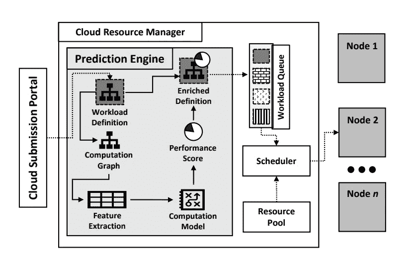
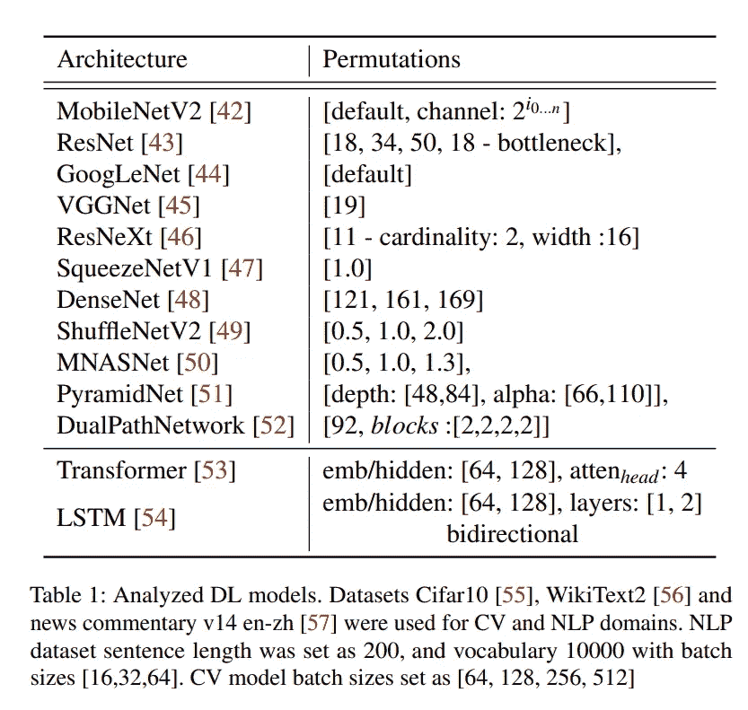
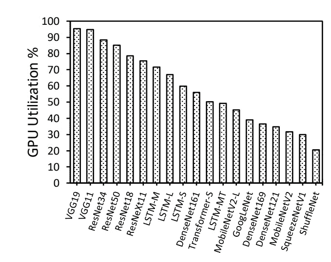
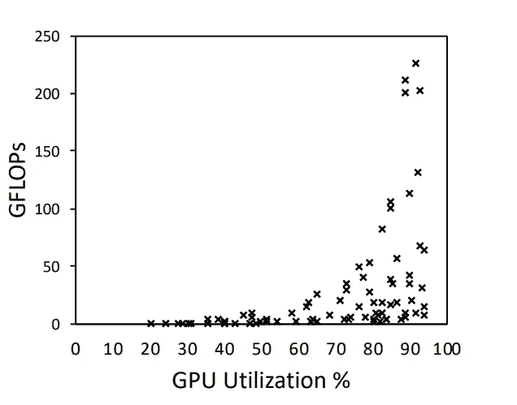
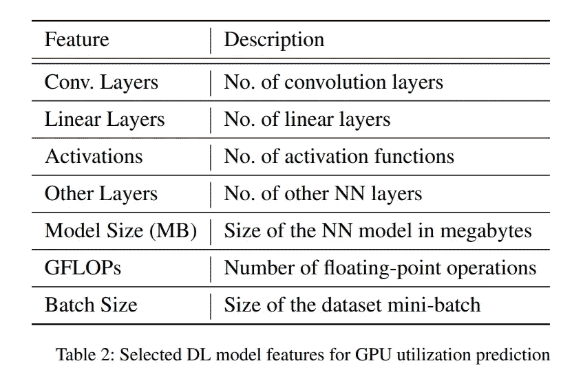
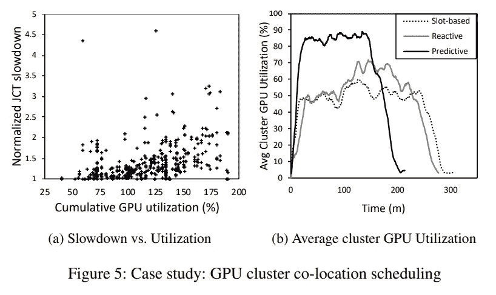

# “面向云深度学习的 GPU 利用率预测”摘要

> 原文：<https://medium.com/mlearning-ai/toward-gpu-utilization-prediction-for-cloud-deep-learning-3572d931be14?source=collection_archive---------2----------------------->

# 介绍

深度学习已经对许多计算领域产生了重大影响。这些工作负载需要很高的计算/内存要求。图形处理单元(GPU)是促进其执行的主要加速器。当前的挑战是集群上这些处理器的利用不足。这是由于 GPU 缺乏精细共享能力和虚拟内存，以及资源管理器和调度器采用的策略。为了提高 GPU 的利用率，想到的第一个解决方案是过度配置 GPU。然而，硬件资源干扰会导致过度供应方法的性能降低。因此，在线分析是监控系统的一种常见解决方案。但是，这种方法**降低了资源可用性**。Yeung 等人[ **1** 提出的机制使用机器学习模型来预测深度学习模型对 GPU 的利用。他们使用来自模型计算图的信息。他们的评估显示，与 Kubernetes 等基于插槽的调度程序和一个间隔为一分钟的在线分析机制相比，**的 GPU 集群利用率为 61.5%** 而**为 47.1%** 。

# 拟议机制

建议的利用率估计器引擎位于集群队列和提交门户之间，如下图所示。

Proposed GPU utilization prediction engine deployed within a cloud resource manager [**1**]

他们用不同的模型和数据集做实验，研究深度学习工作负载特征和 GPU 利用率之间的关系。下表显示了他们在不同配置下使用的模型，包括小批量大小、隐藏维度以及执行和构建数据集的层数，以学习和构建他们的估计器模型。

[**1**]

作者在各种深度学习模型的训练下，对 GPU 的利用做了一个研究。下图显示了不同型号之间的利用率差异。

GPU utilization per model

预测引擎遍历模型，并根据其输入、输出形状和参数[ **1** ]计算每个操作的 FLOPs。例如，FLOPs 中的标准矩阵乘法计算如下:

> **输入形状*输出形状*批量**

对于 LSTM 细胞，他们用两个线性层建模，因为 LSTM 细胞在细胞权重和输入(如输入嵌入和隐藏状态)之间执行矩阵乘法。一旦输入被分成门，门计算可以被建模为激活。它们显示了 FLOPs 和 GPU 利用率之间的关系，如下图所示:

image credit [**1**]

下表列出了用于模型训练的所有功能:

image credit [**1**]

## 模特培训

总共 81 个样本被分成 80%-20%用于训练和测试。他们用不同的回归模型进行测试，最终选择了随机森林[ **2** ，因为它提供了最小的均方根对数误差(**RM LSE**)0.154。

## 估价

评估证明了增加的作业完成时间( **JCT** )，如前面的[ **3** ]所示。是因为 GPU 资源过度分配。下图显示了 JCT 和 GPU 利用率之间的相关性。然而，在配置调度中，利用率估计可用于作业的明智配置，并在管理性能开销的情况下提高利用率。

image credit [**1**]

重要的是，作者建议的以下选项可以添加到该方法中以获得更好的结果:

1.  **通过添加更多配置和更多模型来扩大数据集，如甘、**
2.  **将其推广到其他处理器，如 FPGAs 和加速器**
3.  **考虑 TVM 这样的深度学习编译器**。就其重要性而言，例如，当执行卷积时， **cuDNN** 为后面的配置选择最佳算法。了解这些决策将提高预测器的准确性。
4.  **考虑分布式培训**
5.  **更智能的搭配调度策略**

## **结论**

GPU 配置是解决 GPU 利用不足问题的常见解决方案之一。Yeung 等人提出的机制根据模型的高层信息来估计 GPU 利用率，这些信息是从模型的计算图中获得的。这些信息可用于通过配置作业来提高 GPU 集群的利用率。但是，性能下降(完成时间增加)是该解决方案的伴随挑战，因为它考虑了非常高的利用率指标。

# 参考

【**1**】Yeung，Gingfung，等.**面向云深度学习的 GPU 利用率预测。***第十二届云计算热点话题 USENIX 研讨会(HotCloud 20)* 。 **2020** 。

[ **2** ] " **随机森林回归**，链接:[https://bit.ly/37zUSj4](https://bit.ly/37zUSj4)，访问时间:10–05–2022

**3** 】肖，，等. **Gandiva:深度学习的内省式集群调度。***第十三届 USENIX 操作系统设计与实现研讨会(OSDI 18)* 。 **2018** 。

 [## Mlearning.ai 提交建议

### 如何成为 Mlearning.ai 上的作家

medium.com](/mlearning-ai/mlearning-ai-submission-suggestions-b51e2b130bfb)