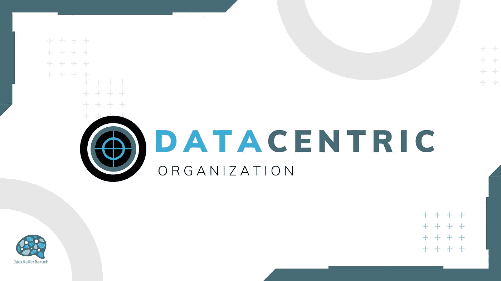
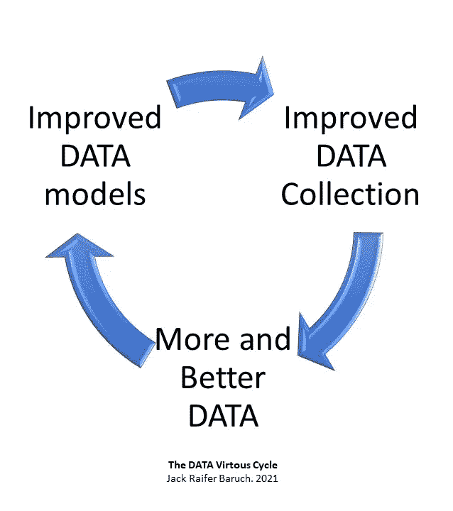
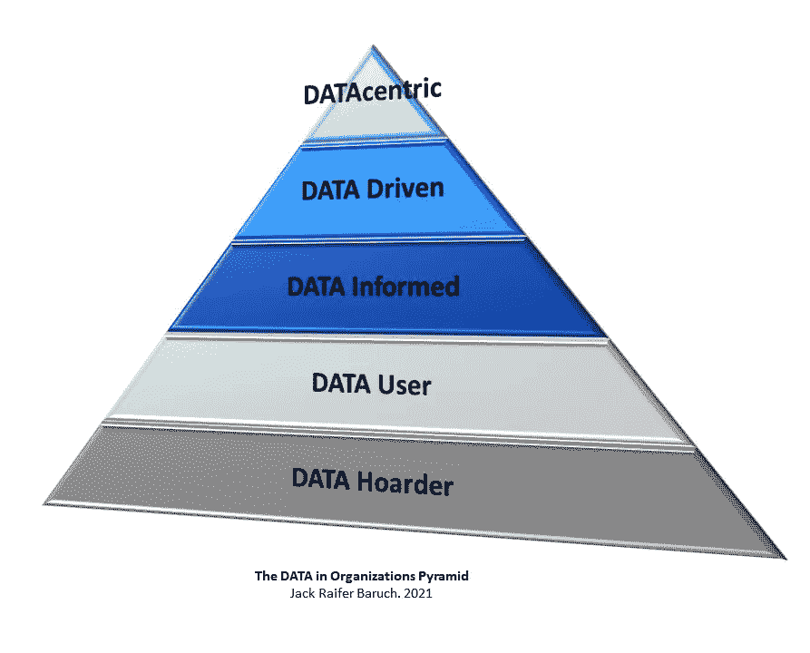

# 迈向以数据为中心的组织

> 原文：<https://medium.com/mlearning-ai/towards-a-datacentric-organization-606e6134e61f?source=collection_archive---------6----------------------->

过去几周，人们一直在问我很多关于如何成为一家可以利用机器学习和人工智能的公司的问题。这可能是一个复杂的问题，因此很难解释。因此，我决定利用我学到的关于组织行为和文化的所有知识，以及我所知道的关于数据科学的所有知识，尝试给出一个简单而又好的解释。

如今，数据已经成为任何组织最重要的资源，至少对于那些希望在几年后仍留在市场上的人来说是如此。虽然我们听到许多公司不断使用诸如“数据驱动”、“基于数据的决策”和“人工智能”等时髦词汇，但事实是，这些只不过是营销口号。

很大一部分问题是，对于什么是以数据为中心的组织，或者数据的采用和使用水平如何，可以让我们更清楚地了解我们目前的状况，以及我们应该将精力和资源集中在哪里，我们都很不清楚。

**我们为什么想要一个以数据为中心的组织？**

让我们从最基本的问题开始:我们应该把有限的资源花在数据上的原因和好处是什么？

我可以看到数据变得越来越重要的三个主要原因:

1.收集数据的能力呈指数级增长，允许以更高的速度和不同的类型和大小收集更多的海量数据。此外，新模型允许快速提高我们的数据质量。

2.新的数学和统计算法使我们能够创建机器学习模型，随着我们提供的数据越来越多，这些模型会不断改进。

3.机器学习模型的计算能力和算法优化正以指数速度增长和改进。

简而言之，正如我们在上面看到的，一个组织拥有和利用的数据越多，它就可以构建更好的数据工具来发展和改进，从而获得更多更好的数据。这成为一个良性循环，推动以数据为中心的组织呈指数级增长。简单地说，在每一步，这些组织都要加倍努力。如果我今天的公司在利用数据方面有两年的延迟，一年后，我将落后四年，两年后，八年后，三年后，十六年后，以此类推。

如果一家公司在 10 年或 20 年内变得过时，今天可能需要几年，有时只需要几个月。

既然我们已经理解了以数据为中心的重要性，下一步就是要认识到我们目前所处的位置，以及我们在数据利用方面的水平。我们可以在下面的金字塔上看到这一点:

**0 级:数据囤积组织**

囤积者从不扔掉任何东西，因为它“可能有一天会很重要”，他们的家里往往堆满了无用的东西。数据囤积组织非常相似，他们收集大量无用和不相关的数据，以最糟糕的方式存储，通常存储在文件和盒子中，几秒钟后就忘记了，但永远不会再看一眼或处理掉。访问任何数据都是一场噩梦，而且从来没有这样做的实际愿望。即使是已经转移到数字世界的公司也可能是囤积者，所有不相关的数据都存储在本地驱动器和服务器上，Excel 表格比比皆是，每个支离破碎的数据隔间都是根据收集数据的人的心血来潮来组织的。

**第一级:数据用户组织**

在这里，我们可以看到在组织内部使用数据的公司。这些通常收集基本信息，如客户姓名、电话号码、电子邮件、交易历史和其他对公司运营至关重要的数据。然而，数据往往分散在部门、团队甚至个人的孤岛中。这些数据的使用往往是操作性的，比如寻找客户的联系信息或确认付款。这里的数据只是一个基本工具，没有潜在的策略或目的。

**第二级:数据知情组织**

在这些工具中，报告、可视化和 PowerPoint 演示很常见，并带有最新仪表板的不寻常外观。他们倾向于认为自己是数据驱动的组织，因为在最好的情况下，他们确实使用报告和分析来指导决策。然而，在做这些决定时，高管们的直觉和想法占了上风。简而言之，公司可以收集数据，在某些情况下有效地组织数据，决策者能够访问和使用它们。这是朝着正确方向迈出的良好一步，但要达到新的水平，还需要对数据进行更深入的探索。

**第三级:数据驱动型组织**

在这个层面上，我们可以看到数据在组织中的巨大好处。这些公司对数据采取科学的方法，他们拥有专业的数据科学家，无论是内部的还是最初外包的，他们都拥有大量关于如何收集、组织和分析数据以满足组织中决策者和员工需求的知识。这些公司往往比竞争对手表现得更好，因为他们的专家总是战略性地、主动地搜索和测试新的见解。

**第 4 级:以数据为中心的组织**

最后，在金字塔的顶端，我们有一组被认为是以数据为中心的精选组织。对于这些公司来说，仅仅由数据驱动是不够的，因此他们决定将数据作为战略的中心。在这里，数据科学团队占据主导地位，并不断寻找新的机会，构建自动化和预测模型，从简单的流程到决策。每个员工都可以在需要时以他们需要的方式访问他们需要的信息。所有数据都与公司的工作流程、营销、销售、运营、发票、采购、IT、C Suite 集成在一起，组织的每个部分都有所需的数据工具、模型和特定信息，以成倍提高其生产力。

了解我们的组织目前处于数据金字塔的哪一级，使我们能够理解我们今天的现实，以便我们能够开始朝着下一级迈出坚实的步伐。

如果您的组织需要帮助了解他们目前的状况或调整他们的数据，请给我留言。

**Jack Raifer Baruch**
*数据科学顾问兼 ADA Intelligence 数据科学主管*

[给我发邮件](mailto: jackraiferbaruch@gmail.com)
[在 LinkedIN 上关注我](https://www.linkedin.com/in/jackraifer)
[查看我的 YouTube 频道](https://www.youtube.com/channel/UC87srlfQBy6AcglQAvlHr3A)
[加入我的数据企业家不和谐频道](https://discord.gg/g3T4GJSFZr)