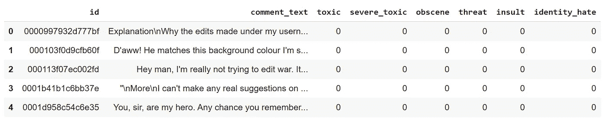
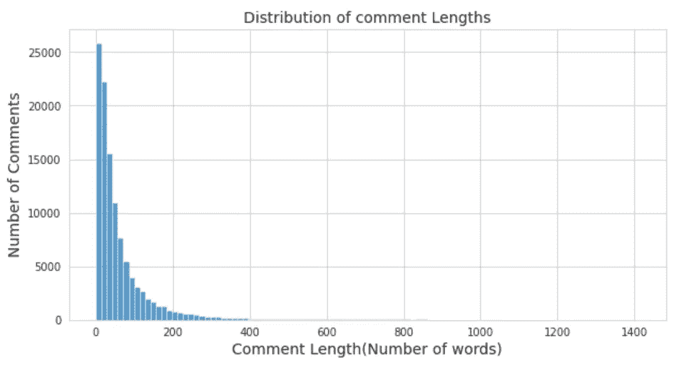
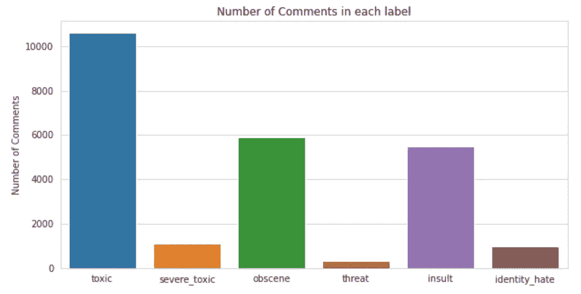
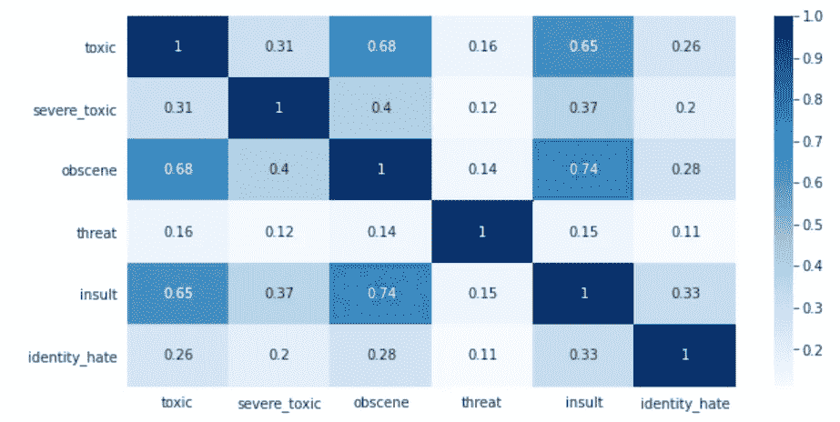
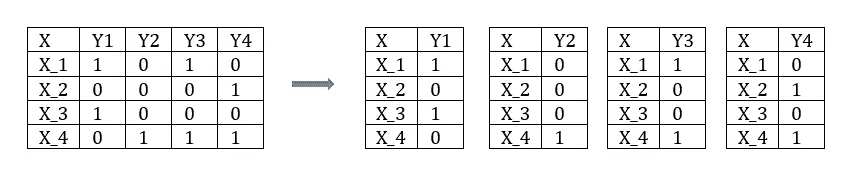
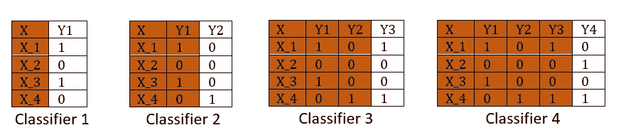

# 有毒评论分类

> 原文：<https://medium.com/mlearning-ai/toxic-comments-classification-8d8a9a9b99e6?source=collection_archive---------1----------------------->


Image taken from [here](https://www.affineanalytics.com/blog/isolating-toxic-comments-to-prevent-cyber-bullying/)

文本数据随处可见，由于其非结构化的性质，从其中提取信息变得困难且耗时。社交媒体平台就是这样一种文本数据来源，在这里人们不断地发表他们对不同话题的看法。然而，越来越多地使用社交媒体平台也增加了在线虐待和骚扰威胁的案件。这被视为社交媒体在线平台的一个主要问题，迫使平台限制或完全关闭用户评论。因此，人们一直在努力确定这些平台上的评论中的毒性水平，以促进更富有成效和尊重的讨论。

在这个帖子里，重点是解决**毒性评论分类**挑战贴[**卡格尔**](https://www.kaggle.com/c/jigsaw-toxic-comment-classification-challenge/) **。**挑战主要是解决多标签分类问题，将评论分类到六个有毒标签中的一个。多标签学习不同于多类学习，因为在多标签中，一个示例或实例可以同时与多个类标签相关联，而在多类问题中，一个示例只能属于一个类。作为一个多标签分类问题，这里一个评论可以被分类为没有标签或者有一个或者多个标签。数据中呈现的六个有毒标签分别是 ***“有毒”、“重度有毒”、“淫秽”、“威胁”、“侮辱”、“认同”。***

> 这篇文章中使用的完整代码可以在 [**Github**](https://github.com/abyanjan/Toxic-Comment-Classification) 获得

# 数据

如上所述，问题数据摘自 [**Kaggle**](https://www.kaggle.com/c/jigsaw-toxic-comment-classification-challenge/data.) 竞赛。作为输入，它包含在社交媒体上发布的评论的原始文本和作为输出的六个标签，表示为二进制标签(1，0)，指示评论标签的存在或不存在。

```
# Read datadf = pd.read_csv("data/train.csv")
df.head()
```



**评论长度**

我们可以先想象一下评论的长度。通过计算评论中使用的字数，我们将看到评论长度的大致分布。



从图中评论长度的分布可以看出，大多数评论的文本长度大约在 200 字以内，而很少有评论的长度很长。

**标签分发**

首先，我们可以看到每个有毒标签的评论数量。这将使我们了解哪些类型的有毒标签被分配到评论中。



更多的评论被贴上“有毒”、“淫秽”和“侮辱”的标签，而其他标签的数量相对较少。此外，我们从 111699 的训练样本中看到，与训练样本中的评论总数相比，标签中看到的评论数量仍然较低。通过进一步查看数据，我们可以发现几乎 90%的评论没有任何有毒标签，这意味着它们是干净的评论。这使得该问题也成为一个不平衡的分类问题。

```
Number of comments with no any labels(clean tweet): 143346 Percentage of comments with no any labels: 89.923%
```

**世界云**

为了快速可视化文本中使用的常用词，可以使用世界云，这样可以了解使用的是什么类型的词。


从词云上看到的常用词目前并没有做出任何有意义的区分。但是，可以清楚地看到，单词大多与在线讨论有关。

要检查标签在评论中出现的频率，我们可以查看标签的相关性。



Correlation between the class labels

相关图显示，有毒与侮辱、有毒与淫秽、淫秽与侮辱标签之间存在良好的关系。因此，当一个评论的标签对中有一个标签存在时，很可能这个评论也会有另一个标签。

# 建模

## 数据分区

对于建模，我们将把数据分成训练和测试部分。在分割之后，我们将在测试分割的训练数据评估上训练模型。

```
Train: (111699, 8) Test: (47872, 8)
```

在我们开始建模之前，我们将定义用于评估模型性能的评估指标。正如我们看到的，这是多标签分类问题以及不平衡数据，我们必须小心选择正确的评估指标。

## 评估指标

根据 Kaggle 竞赛，将用于评估的评估指标是平均列式 ROC AUC。它表示每个预测列的单个 AUC 分数的平均值(一个标签表示为一列)。因此，我们将把它作为我们的主要评估指标。在这里，我们将使用相同的方法来计算精确度和日志损失。

**ROC AUC:** AUC 代表 ROC 曲线下面积，其中 ROC 是受试者操作者特征，即二元分类模型性能的图形表示。它是通过绘制不同阈值下的假阳性率与真阳性率的关系图来创建的。AUC 只是一个总结 ROC 曲线的数值分数，用于评估分类器的性能。它的值介于 0 和 1 之间，其中 1 是满分，0.5 分表示模型不比随机猜测好。如上所述，我们将分别计算每个标签的 AUC 分数，并对其进行平均。

**准确度:**准确度简单地表示所有样本中正确分类的数量。它可以计算为正确预测的数量除以总数据样本。但是，对于多标签分类，准确度可以计算为子集准确度，也称为精确匹配率。这被认为是一个苛刻的度量，其中一个示例的预测标签集应该与实际标签完全匹配。然而，这里我们将简单地遵循 Kaggle 方法，计算每个标签的单独准确度分数，并取其平均值作为最终分数。

**Log loss:** Log loss 又称交叉熵，是基于概率的分类评价度量。它通过比较实际标签与其预测概率来评估分类性能，其中它惩罚远离实际标签的预测。当预测的概率远离实际标签时，它的值增加，并且较低的值指示分类器的良好性能。数学上，对于二元分类，它可以计算为:

```
logloss = −(ylog(p)+(1−y)log(1−p))
```

## 单词包表示法

作为最初的方法，我们将使用单词包表示来呈现使用 TFIDF 矢量化建模的文本。单词包是一种常用的文本或文档分类方法，它从文本文档中提取特征(出现在所有文本文档中的唯一单词)。然后，每个文档都用这些特征来表示，这些特征表示文档中单词(或字数)的存在。使用 TFIDF 矢量化，它代表的不是简单的字数，而是一个分数，该分数解释了该单词与所有文档中某个文档的相关程度。

在将文本转换为单词包之前，我们可以清理文本，删除标点符号、数字、停用词并执行词干处理。

下面给出了应用文本处理之前和之后的示例。

```
**Original Text:** 
"   Happy Birthday!   Hey,  .  Just stopping by to wish you a Happy Birthday from the Wikipedia Birthday Committee!   Have a great day!    "   
**Clean Text:** 
happi birthday hey stop wish happi birthday wikipedia birthday committe great day
```

现在，应用 TFIDF 矢量器，我们可以创建单词包。这里，我们将 TFIDF 矢量器与 1 和 2 的 n 元语法一起使用，即我们将创建包括一个单词和两个单词的单词特征。此外，我们将限制最大功能(词汇量)为 1000。

随着单词袋的创建，我们现在可以开始建模了。对于建模，我们将应用二元相关性和分类器链以及逻辑回归和朴素贝叶斯模型。

**二元关联**

二元相关性是解决多标签分类问题最简单的方法之一。类似于用于多类问题的 one-vs-rest 方法，它将多标签任务转换为多个独立的二元分类任务(每个标签一个)，其中预测每个标签被认为是一个单独的任务。它的缺点是忽略了标签之间的相关性。多标签问题如何转化为二元相关性的示例如下图所示。



Transforming to Binary Relevance

与逻辑回归和朴素贝叶斯的二元相关性的结果显示逻辑回归表现更好。

```
Model               Accuracy    AUC    Logloss
Logistic Regression  0.979     0.960   0.064
MultinomialNB        0.976     0.955   0.071
```

**分类器链**

类似于二元相关分类器链是一种多标签分类的问题转化方法。它试图通过利用标签关联来提高二进制相关性的性能，这在二进制相关性中是被忽略的。分类器链方法生成二元分类器链。这样做时，它在分类器中添加一个额外的输入特征，作为链中前一个分类器的输出。这种方法允许分类器考虑存在的标签关联，有助于提高分类性能。使用分类器链的多标签问题转换如下所示。



classifier chain transformation

使用分类器链，模型的性能没有提高，但我们看到逻辑回归仍然比朴素贝叶斯表现更好。链分类器的性能可能没有提高，因为我们之前看到标签之间没有任何显著的相关性，并且链分类器在标签之间有关联的情况下性能更好。

```
Model                 Accuracy  AUC     Log loss
Logistic Regression   0.979     0.950    0.069
MultinomialNB         0.968     0.946    0.124
```

## 单词嵌入

单词嵌入是一种单词表示方法，它通过具有预定义向量长度的实值向量来表示每个单词。这些向量大多是通过深度学习方法学习的。对于单词嵌入，具有相似含义的单词用相似的向量表示来表示，这允许捕捉单词含义。我们可以训练自己的单词嵌入，或者使用已经在大型文本语料库中训练过的预训练单词嵌入。这里，我们将使用来自 google 的预训练 word2vec 模型来提取单词嵌入。

为了表示具有单词嵌入的句子(句子嵌入)，我们将取句子中单词的单词嵌入的平均值。

如上所述，我们看到二元相关性与逻辑回归表现最好。这里，我们将再次使用二元相关性和逻辑回归进行建模，但是现在我们将使用单词嵌入而不是单词包。

单词嵌入的结果仍然没有给出任何改进，结果非常类似于单词袋方法。我们可以尝试为逻辑回归执行超参数调整，看看我们是否可以实现任何进一步的改进。

```
Model                 Accuracy   AUC    Log loss
Logistic Regression    0.975    0.965    0.071
```

## 深度学习

**与 LSTM 一起造型**

LSTM(长短期记忆)是一种递归神经网络(RNN)。它主要用于与序列预测相关的问题，因为它可以处理序列中的顺序依赖性。LSTM 被广泛用于文本分类问题，因为它有助于保持文本中单词的顺序，从而可以保留文本的语义。

为 LSTM 准备数据的第一步是将单词标记化并表示为整数，其中每个唯一的单词由一个整数值表示。我们还需要指定词汇表的大小，它决定了建模中使用的最频繁的单词的数量。

对文本进行标记后，我们需要执行填充，以确保所有文本序列的长度相同。在给定序列长度的情况下，填充会在句首或句尾后分配 0，以匹配序列长度小于指定长度的示例所需的序列长度，并将截断序列长度大于指定长度的示例。

现在我们准备定义我们的模型并训练它。

LSTM 的结果在指标准确性和对数损失方面优于逻辑回归模型，但 AUC 评分非常相似。因此，随着两个指标的改善，我们仍然可以认为 LSTM 的表现优于逻辑回归模型。

```
loss: 0.0527  accuracy: 0.9816  auc: 0.9634
```

## 用 BERT 迁移学习

迁移学习是深度学习中一种流行的方法，其中预先训练的模型被用作在类似任务中训练新模型的起点。它在计算机视觉和自然语言处理领域越来越受欢迎，因为它节省了在这些任务上建模所需的大量计算和时间资源。此外，利用从预训练模型中获得的知识，迁移学习有助于泛化和性能提高。

随着自然语言处理研究的进展，出现了许多复杂的技术来解决这个问题。BERT(来自变压器的双向编码器表示)就是其中之一，它已经产生了与自然语言处理相关的问题的最新技术成果。它是 Google 开发的基于转换器的机器学习技术，可作为预训练模型使用。杰伊·阿拉姆马[**这里**](http://jalammar.github.io/a-visual-guide-to-using-bert-for-the-first-time/) 有关于伯特的很好的介绍。

Tensorflow Hub 提供了此类预训练模型的广泛列表，包括 BERT 和易于使用的代码示例来微调模型。因此，我们将使用 Tensorflow Hub 针对我们的分类问题微调 BERT 模型。

对于 BERT，由于它是一个预训练模型，我们必须根据预训练模型中使用的过程来处理我们的数据。为此，tensorflow hub 提供了必要的处理助手，我们将简单地使用它。

现在，我们已经准备好了数据，并且指定了 BERT 模型及其文本处理程序的路径。我们现在可以创建模型并训练它。

```
# evaluate modelloss, accuracy, auc = bert_history.model.evaluate(test_ds)Accuracy: 0.9836  AUC: 0.9798  Logloss: 0.042
```

正如我们看到的，与以前的模型相比，使用 BERT 进行迁移学习，我们实现了更高的性能。

## 结论

我们已经介绍了解决多标签分类问题的不同建模方法。到目前为止，我们看到 BERT 模型在测试数据上表现最好，平均 AUC ROC 得分为 0.978。现在，对于最终评估，我们可以从目前为止已经训练的模型中创建提交内容，并提交到 kaggle 页面以获得最终结果，并查看 BERT 模型是否真的表现最佳。

将结果提交给 Kaggle 后，我们得到了模型的以下分数，因此，我们可以确认 BERT 模型实际上表现良好。然而，我们也可以看到我们的基线模型，这是一个使用二元相关性和逻辑回归的简单方法，也给出了良好的结果。

```
# Kaggle Scores
Logistic Regression : 0.95875
LSTM Model          : 0.97128
BERT                : 0.98172
```

## **参考文献**

[https://link . springer . com/article/10.1007/s 11704-017-7031-7 #:~:text = Binary % 20 relevance % 20 is % 20 arbitable % 20 the，(one%20per%20class%20label)。](https://link.springer.com/article/10.1007/s11704-017-7031-7#:~:text=Binary%20relevance%20is%20arguably%20the,(one%20per%20class%20label).)

[https://machine learning mastery . com/what-are-word-embedding/](https://machinelearningmastery.com/what-are-word-embeddings/)

[https://www . tensor flow . org/tutorials/text/classify _ text _ with _ Bert](https://www.tensorflow.org/tutorials/text/classify_text_with_bert)