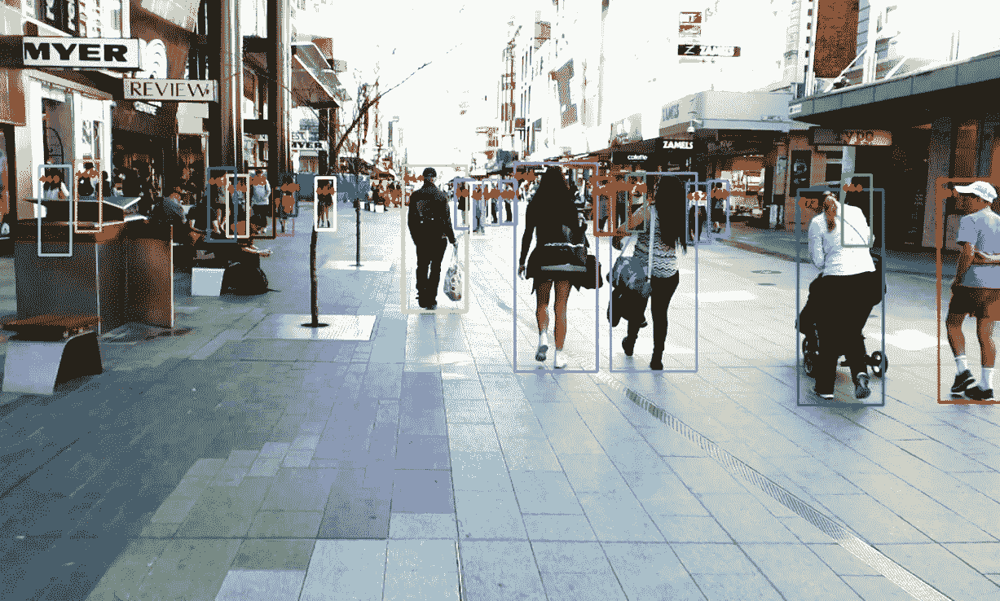

# 跟踪视频中的人和物体

> 原文：<https://medium.com/mlearning-ai/tracking-people-and-objects-in-videos-93918fb5fb71?source=collection_archive---------0----------------------->

## [机器学习艺术](https://mlearning.substack.com)

## 新的 TDT 跟踪器—实时跟踪数据

[mlearning.substack.com](https://mlearning.substack.com)

在**计算机视觉**中，跟踪人和物体是许多应用程序核心的关键工作。为了完成跟踪，必须完成几个子任务。比如**物体识别**和数据关联需要系统识别(可能很多)…