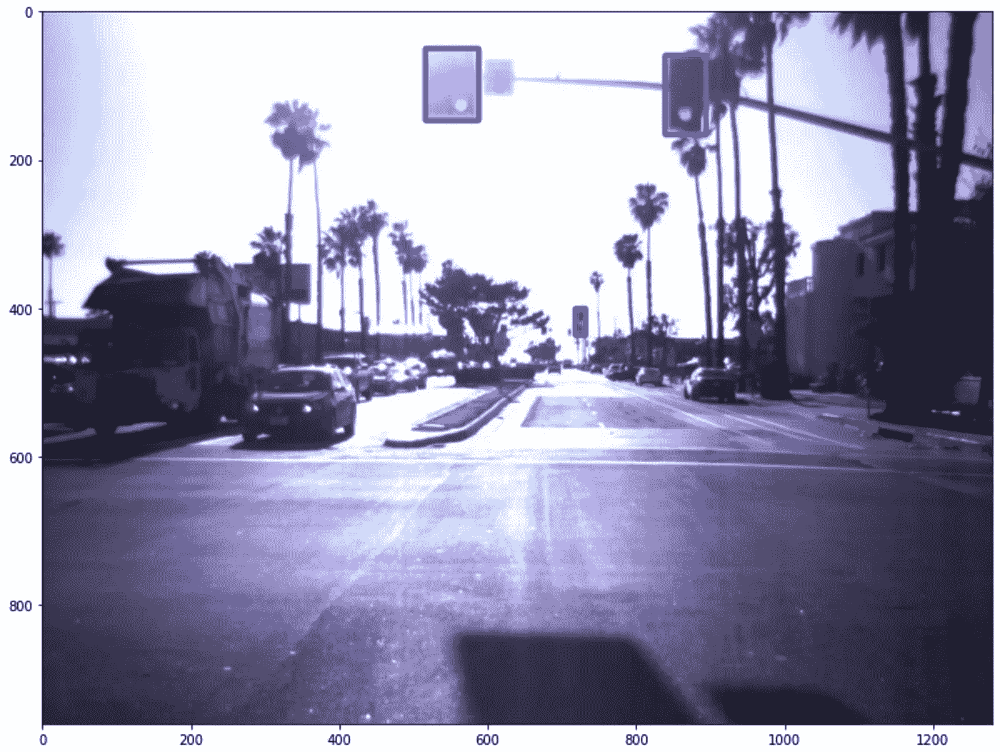

# 交通灯检测与识别系统第 1 部分

> 原文：<https://medium.com/mlearning-ai/traffic-light-detection-and-recognition-system-part-1-15a649906977?source=collection_archive---------1----------------------->


Photo by [Nik Shuliahin](https://unsplash.com/@tjump?utm_source=medium&utm_medium=referral) on [Unsplash](https://unsplash.com?utm_source=medium&utm_medium=referral)

使用计算机视觉、机器学习和深度学习技术可以很容易地构建交通灯检测系统。在本文中，我将整个问题陈述分解为三个部分，并涵盖了第一部分。总共会有 3 篇文章，到最后，你会有一个交通灯检测和识别系统的工作原型。

> 这是**不是初学者友好教程**。在开始这个项目之前，你应该知道对象检测和图像分类算法的基本概念。还要稍微熟悉一下 Python、Keras、Tensorflow 和 OpenCV。

因此，这个交通灯检测和识别系统可以分解如下:

1.  交通灯检测
2.  交通灯的分类
3.  结合检测和分类系统

# 交通灯检测

我使用过预训练的交通灯检测模型，因为它们的性能相当不错。 [TensorFlow 2 检测模型 Zoo](https://github.com/tensorflow/models/blob/master/research/object_detection/g3doc/tf2_detection_zoo.md) 有各种现成可用的对象检测 API。你也可以使用 YOLO 的变体，比如最近的一个 [YOLOv7](https://github.com/WongKinYiu/yolov7) 。然而，我使用了 Tensorflow 检测 API。你不需要数据集来训练它，因为它已经在 [COCO 2017 数据集](https://cocodataset.org/#home)上训练过了。

您可以根据所需速度(毫秒)、COCO mAP 和输出从 TensorFlow 2 检测模型动物园中挑选任何一个模型。如果你对如何选择模型感到困惑，谷歌研究团队提供了一个名为“[现代卷积物体探测器的速度/精度权衡](https://arxiv.org/pdf/1611.10012.pdf)的指南，应该可以帮助你。

## 密码

现在我们已经熟悉了张量流检测模型，我们可以开始编写代码了。

```
import numpy as np
import matplotlib.pyplot as plt
import os
import tensorflow as tf
from glob import glob
import sys
import sklearn.metrics as metrics
from tensorflow import keras
from tensorflow.keras.models import load_model
import shutil
from PIL import Image
import cv2
import time
```

这些是整个项目所需的重要依赖项。现在让我们设置路径，

```
MODEL_NAME = 'faster_rcnn_inception_resnet_v2_atrous_coco_11_06_2017'
MODEL_FILE = MODEL_NAME + '.tar.gz'
DOWNLOAD_BASE = 'http://download.tensorflow.org/models/object_detection/'

model_path = "./"
OUR_PATH = model_path + MODEL_NAME + '/frozen_inference_graph.pb'
```

我使用的是“[更快的 R-CNN Inception ResNet V2 640 x640](http://download.tensorflow.org/models/object_detection/tf2/20200711/faster_rcnn_inception_resnet_v2_640x640_coco17_tpu-8.tar.gz)”型号，它更注重精度而不是速度。您可以使用“SSD _ mobilenet _ v1 _ coco _ 11 _ 06 _ 2017”来获得更快的结果，或者使用“rfcn_resnet101_coco_11_06_2017”、“faster _ rcnn _ resnet 101 _ coco _ 11 _ 06 _ 2017”来获得更快的结果。

*‘OUR _ PATH’*是到冻结检测图形的路径，该图形是用于对象检测的实际模型。

现在，我们将创建从模型动物园下载对象检测模型的函数，加载图形并选择最佳边界框。

```
def download_model():
    import six.moves.urllib as urllib
    import tarfile

    opener = urllib.request.URLopener()
    opener.retrieve(DOWNLOAD_BASE + MODEL_FILE, MODEL_FILE)
    tar_file = tarfile.open(MODEL_FILE)
    for file in tar_file.getmembers():
        file_name = os.path.basename(file.name)
        if 'frozen_inference_graph.pb' in file_name:
            tar_file.extract(file, os.getcwd())

def load_graph():
    if not os.path.exists(OUR_PATH):
        download_model()

    detection_graph = tf.Graph()
    with detection_graph.as_default():
        od_graph_def = tf.compat.v1.GraphDef()
        with tf.compat.v2.io.gfile.GFile(OUR_PATH, 'rb') as fid:
            serialized_graph = fid.read()
            od_graph_def.ParseFromString(serialized_graph)
            tf.import_graph_def(od_graph_def, name='')

    return detection_graph

def select_boxes(boxes, classes, scores, score_threshold=0, target_class=10):
    sq_scores = np.squeeze(scores)
    sq_classes = np.squeeze(classes)
    sq_boxes = np.squeeze(boxes)

    sel_id = np.logical_and(sq_classes == target_class, 
                            sq_scores > score_threshold)

    return sq_boxes[sel_id]
```

现在我们已经定义了必要的函数，让我们创建一个交通灯检测器类，

```
class TLDetector(object):
    def __init__(self):
        self.detection_graph = load_graph()
        self.extract_graph_components()
        self.sess = tf.compat.v1.Session(graph=self.detection_graph)

        # dummy session
        dummy_image = np.zeros((224, 224, 3))
        self.detect_multi_object(dummy_image,0.1)
        self.traffic_light_box = None
        self.classified_index = 0

    def extract_graph_components(self):
        # Definite input and output Tensors for detection_graph
        self.image_tensor = self.detection_graph.get_tensor_by_name('image_tensor:0')
        # Each box represents a part of the image where a particular object was detected.
        self.detection_boxes = self.detection_graph.get_tensor_by_name('detection_boxes:0')
        # Each score represent how level of confidence for each of the objects.
        # Score is shown on the result image, together with the class label.
        self.detection_scores = self.detection_graph.get_tensor_by_name('detection_scores:0')
        self.detection_classes = self.detection_graph.get_tensor_by_name('detection_classes:0')
        self.num_detections = self.detection_graph.get_tensor_by_name('num_detections:0')

    def detect_multi_object(self, image_np, score_threshold):

        image_np_expanded = np.expand_dims(image_np, axis=0)

        (boxes, scores, classes, num) = self.sess.run([self.detection_boxes, 
                                                       self.detection_scores, 
                                                       self.detection_classes, 
                                                       self.num_detections],
                                                       feed_dict={self.image_tensor: image_np_expanded})

        sel_boxes = select_boxes(boxes=boxes, 
                                 classes=classes, 
                                 scores=scores,
                                 score_threshold=score_threshold, 
                                 target_class=10) # Class 10 is for Traffic Lights

        return sel_boxes

start_time = time.time()
tld = TLDetector()
print("--- %s seconds ---" % (time.time() - start_time))
```

这就是我们需要为系统的交通灯检测部分所做的一切。

如果您想测试这个交通灯检测系统，请遵循下面的代码，

```
def get_annots(image_np, sel_box):
    annots_temp = []
    im_height, im_width, _ = image_np.shape
    (left, right, top, bottom) = (sel_box[1] * im_width, sel_box[3] * im_width,
                                  sel_box[0] * im_height, sel_box[2] * im_height)
    annots_temp.extend((left, top,right,  bottom))

    return annots_temp

def tl_detection(test_file):
  start_time = time.time()
  im = Image.open(test_file)
  image_np = np.asarray(im)
  boxes=tld.detect_multi_object(image_np,score_threshold=0.2)
  annotations = []
  if len(boxes)>0:
    for box in boxes:
      temp_annots = get_annots(image_np,box)
      annotations.append(temp_annots)

  img = cv2.imread(test_file)
  img = cv2.cvtColor(img, cv2.COLOR_BGR2RGB)
  print("Found {} annotations:".format(len(annotations)))
  i=0
  for anno in annotations:
      anno_left = int(anno[0])
      anno_top = int(anno[1])
      anno_right = int(anno[2])
      anno_bot = int(anno[3])
      print("\tClass: '{}' at [{},{},{},{}]".format("traffic light", anno_left, anno_top, anno_right, anno_bot))

      cv2.rectangle(img, (anno_left, anno_top), (anno_right, anno_bot), (0,0,255), 5)

      plt.rcParams['figure.figsize'] = [14, 10]
  plt.imshow(img)
  plt.show()
  print("--- %s seconds ---" % (time.time() - start_time))
```

为了在图像上测试它，

```
test_file = 'test.jpg'
tl_detection(test_file)
```

我在属于 [LISA 交通灯数据集](https://www.kaggle.com/datasets/mbornoe/lisa-traffic-light-dataset)的一张图像上测试了它。所以输出是，

> 找到 3 个注释:
> 
> 类别:【839，59，894，166】处的“红绿灯”
> 
> 类别:【718，400，732，436】处的“红绿灯”
> 
> 类别:【516，50，588，147】处的“红绿灯”



Three traffic lights detected

至此，我们终于结束了这个项目的第一部分！

该项目的剩余部分即将推出，敬请关注…

***参考文献***

[](https://github.com/tensorflow/models/blob/master/research/object_detection/g3doc/tf2_detection_zoo.md) [## 主 tensorflow/models 上的 models/tf2_detection_zoo.md

### 我们提供了一组在 COCO 2017 数据集上预先训练的检测模型。这些模型可用于…

github.com](https://github.com/tensorflow/models/blob/master/research/object_detection/g3doc/tf2_detection_zoo.md) 

[https://arxiv.org/pdf/1611.10012.pdf](https://arxiv.org/pdf/1611.10012.pdf)

[](https://www.kaggle.com/datasets/mbornoe/lisa-traffic-light-dataset) [## LISA 交通灯数据集

### 超过 44 分钟的带注释的交通灯数据

www.kaggle.com](https://www.kaggle.com/datasets/mbornoe/lisa-traffic-light-dataset) [](/mlearning-ai/mlearning-ai-submission-suggestions-b51e2b130bfb) [## Mlearning.ai 提交建议

### 如何成为 Mlearning.ai 上的作家

medium.com](/mlearning-ai/mlearning-ai-submission-suggestions-b51e2b130bfb)