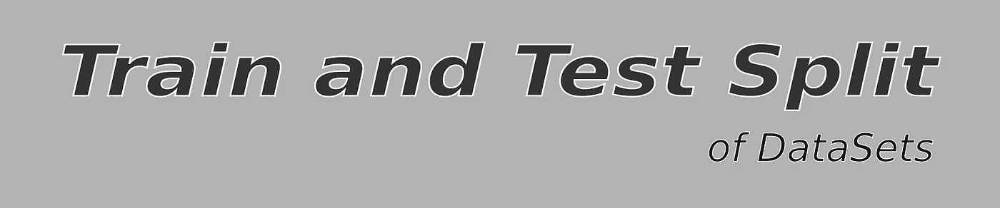
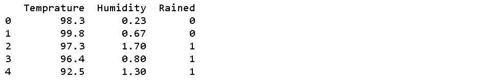
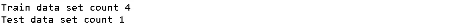
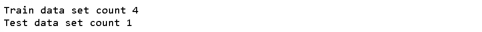
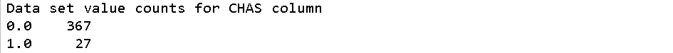
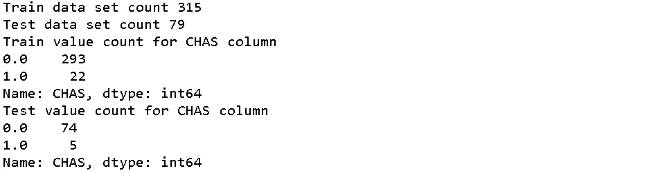

# 训练和测试数据分割

> 原文：<https://medium.com/mlearning-ai/train-and-test-data-split-152bad0afbb2?source=collection_archive---------1----------------------->

## 对于 ML 型号



收到数据后，您应该做的第一步是将数据集一分为二。最常见的比例是 80:20。

这样做是为了让我们或我们的模型看不到一组特定的数据，并留在一边测试我们训练好的模型。并且较大的集合总是用于训练，而后者用于测试。

> 当我们不分割数据集时会发生什么？

然后，我们将不得不在训练模型的同一个数据集上进行测试。虽然这在我们测试时会给我们很高的精确度，但这不是一个好的模型。这可能意味着我们的模型过度拟合，对于任何以前未见过的数据可能表现不佳。

过度拟合是指模型对数据的描述过于精确。下图解释了过度拟合。


The blue line represents a linear model overfitted to exactly replicate the training data this will always give correct label values for the features that it is trained on but when we give a new unseen value it may give a value far off from the optimal value. We always want our model to be like the black line which is much more generalized. It will give some error for trined values but will give reliable values for any unseen data also. [Image credit WIKI](https://www.wikiwand.com/en/Overfitting)

> 现在我们已经理解了拆分数据的必要性，让我们看看如何做到这一点。

## 使用 Python

在这里，我们将使用 python 来实现一个函数，它将为我们完成这种拆分。

首先，我们需要一个数据集。我们将使用 pandas 创建一个样本数据框。

```
**import** pandas **as** pd**df** = pd.DataFrame({‘Temprature’: [98.3, 99.8, 97.3,96.4, 92.5 ], ‘Humidity’: [0.23, 0.67, 1.7, 0.8, 1.3], ‘Rained’ : [0, 0, 1, 1, 1]})
**print(**df**)**
```



This sample data tells us the temperature, humidity and if it has rained on that particular day

现在，我们可以编写一个函数，将数据和拆分比率作为参数，并返回两个数据集，一个用于测试，一个用于训练。为此，我们将使用 NumPy。

```
**import** numpy **as** np*# mannual basic train test spliting funtion*
**def split_train_test(**data, test_ratio**)**:
 shuffled_indicies = np.random.permutation(len(data))
 test_data_size = int(len(data) * test_ratio)
 test_indicies = shuffled_indicies[:test_data_size]
 train_indicies = shuffled_indicies[test_data_size:]
 **return** data.iloc[train_indicies], data.iloc[test_indicies]**train_data, test_data** = **split_train_test(**df, 0.2**)**
**print(**f’Train data set count {len(train_data)}\nTest data set count {len(test_data)}’**)**
```



在这个方法中，我们为数据集的长度创建了一个混洗索引数组。这样做是为了使数据在按特定特征排序时不代表一种模式。然后我们得到测试数据的长度大小。

我们使用这些变量来获得训练和测试数据的索引，并返回测试和训练的数据集。

但是在这种方法中，我们会遇到一个问题。如果我们多次调用这个函数，我们将总是得到一个不同的数据集用于测试和训练，我们使用 np.random 来生成混洗指数。

这将导致我们试图消除的问题，从长远来看，我们的整个数据集将暴露于模型，我们将不会有任何模型看不到的数据。

因此，为了消除这种情况，每次都得到相同的混洗索引，我们可以为 np.random 设置一个种子，这样每次都会创建相同的混洗索引。种子将采用整数值，并且只要种子值相同，就会生成相同的混洗索引。

因此，我们将添加一个名为 random_seed 的参数，并在 split_train_test 方法中将它传递给 np.random.seed()。

```
**import** numpy **as** np*# mannual basic train test spliting funtion*
**def split_train_test(**data, test_ratio, random_seed**)**:# *setting random seed value to genrate same shuffled indicies*         
 np.random.seed(random_seed) shuffled_indicies = np.random.permutation(len(data))
 test_data_size = int(len(data) * test_ratio)
 test_indicies = shuffled_indicies[:test_data_size]
 train_indicies = shuffled_indicies[test_data_size:]
 **return** data.iloc[train_indicies], data.iloc[test_indicies]**train_data, test_data** = **split_train_test(**df, 0.2, 42**)**
**print(**f’Train data set count {len(train_data)}\nTest data set count {len(test_data)}’**)**
```

只要种子值相同，这个方法现在将总是返回相同的数据集，即使它被多次调用。

现在，我们将创建的每个 ML 模型都需要这种数据分割，因此为了使我们的任务更容易，scikit-learn 有一些内置的方法来为我们处理这种分割。

## 使用 scikit-learn 拆分数据。

在 sklearn.model_selection 中，我们有一个 train_test_split 方法，我们可以用它将数据分成训练集和测试集。

下面是实现

```
from **sklearn.model_selection** import **train_test_split**#*basic train test split using sklearn*
**train_data, test_data** = **train_test_split(**df, test_size = 0.2, random_state = 42**)**
**print(**f’Train data set count {len(train_data)}\nTest data set count {len(test_data)}’**)**
```



在这里，我们传递的是我们在上面创建的函数中使用的所有相同的值。

现在，有时我们有一个功能，我们希望平均分为训练和测试数据。

例如，我有一个数据集(Bostan housing 数据集)，其中有一个名为“CHAS”的要素，它包含两个值 0 和 1。

我已经复制了住房数据框中的数据，现在我可以打印“CHAS”功能的值计数。

```
print(f’Data set value counts for CHAS column\n{housing[“CHAS”].value_counts()}’ )
```



这里有 367 个数据点的值为 0，27 个数据点的值为 1。对于数据集中的 0 和 1 分布，这是一个约为 13.6 的比率。

现在，在分析了这些数据之后，我们决定这个特性需要在训练和测试数据中平均分配。

我们可以使用 scikit-learn 的 StratifiedShuffleSplit 来实现这一点

```
from **sklearn.model_selection** import **StratifiedShuffleSplit****split** = **StratifiedShuffleSplit(**n_splits=1, test_size = 0.2, random_state = 42**)**
**for** train_i, test_i in **split.split(** housing, housing[‘CHAS’]):
 **strat_train_data** = housing.iloc[train_i]
 **strat_test_data** = housing.iloc[test_i]

**print(**f’Train data set count {len(strat_train_data)}\nTest data set count {len(strat_test_data)}’))
**print(**f”Train value count for CHAS column\n{strat_train_data[‘CHAS’].value_counts()}”**)**
**print(**f’Test value count for CHAS column\n{strat_test_data[“CHAS”].value_counts()}’**)**
```



这里我们可以看到，对于 0 和 1 分布，训练集的比率约为 13.3，测试集的比率约为 14.8。因此，考虑到“CHAS”特征，数据几乎平分秋色。

这是一个非常简短的介绍，介绍了如何为您的 ML 模型分割训练和测试数据。

> 感谢阅读，如果您有任何意见，请留下评论。
> 
> 享受你的编码！