# 像标签一样训练不会伤害学习:用嘈杂的标签学习

> 原文：<https://medium.com/mlearning-ai/train-like-labels-cant-harm-the-learning-learning-with-noisy-labels-1479da6f49af?source=collection_archive---------3----------------------->

Photo by [Katarzyna Pe](https://unsplash.com/@kasiape?utm_source=medium&utm_medium=referral) on [Unsplash](https://unsplash.com?utm_source=medium&utm_medium=referral)

> 我还不够年轻，不能什么都知道。- [奥斯卡·王尔德](http://www.1000advices.com/authors/wilde_oscar_hq.html)

# **Tl；博士**

我们将了解一种新的图像分类机器学习方法，称为 *DIVIDEMIX* ，它将帮助机器理解和分类带有错误标签(有噪声的标签)的图像。

> 引用:李，2020 年。Dividemix:带噪声标签的学习作为半监督学习。arXiv 预印本 arXiv:2002.07394 。

# **先决条件术语**

> [*IBM*](https://www.ibm.com/au-en/cloud/learn/machine-learning) *:机器学习是* [*人工智能(AI)*](https://www.ibm.com/au-en/cloud/learn/what-is-artificial-intelligence) *和计算机科学的一个分支，专注于数据和算法来模仿人类如何学习，逐渐提高准确性。*

***机器学习/深度学习:*** 用最直白的话来说，机器学习就是我们把已有的数据提供给机器的过程。机器在当前数据中找到模式，称为学习或训练。它可以用于各种任务，如分类、预测等。(深度文章:[想知道深度学习是如何工作的？下面给大家一个快速指南。](/free-code-camp/want-to-know-how-deep-learning-works-heres-a-quick-guide-for-everyone-1aedeca88076))

***图像分类:*** 对图像进行分类对人类来说是一件痛苦的事情，对机器来说却不是。我们可以在给定的带有各自标签的图像上训练我们的机器，以使用各种算法来执行分类任务。(深度文章:[10 分钟内使用 MNIST 数据集进行影像分类](https://towardsdatascience.com/image-classification-in-10-minutes-with-mnist-dataset-54c35b77a38d))

***机器/深度学习算法类型:*** *各种算法取决于*我们拥有的数据类型。几个主要类别是:

1.  **监督学习:**我们有可用于训练的输入和输出特征(标签)，算法试图找到输入和输出特征之间的模式。学习和模式可以对新的未知输入数据的输出进行预测或分类。一些标准的监督技术是线性回归、SVM、神经网络等。
2.  **无监督学习:**在某些情况下，我们只有输入特征，没有关于标签的信息，算法只是试图找到输入特征之间的模式。算法试图在可用数据中找到方向、模式和组。一些标准的无监督技术是聚类等。
3.  **半监督学习:**这是上面两种的混合，其中我们对一些数据有标签，对其余的没有标签。这些对于建模非常有用。一些标准的半监督技术是生成模型、启发式方法、混合匹配等。
4.  **强化学习**通过基于奖励的反馈，帮助机器学习并确定适当的行为，以最大限度地提高性能。奖励就像赋予模型的一个特征，表示模型做得很好，该算法的主要目标是降低风险和增加奖励。一些标准的强化技术是 Q 学习、对抗网络等。

(深度文章:[你应该知道的机器学习算法类型](https://towardsdatascience.com/types-of-machine-learning-algorithms-you-should-know-953a08248861)、[人类的机器学习](/machine-learning-for-humans/why-machine-learning-matters-6164faf1df12))

Photo by [Ian Schneider](https://unsplash.com/@goian?utm_source=medium&utm_medium=referral) on [Unsplash](https://unsplash.com?utm_source=medium&utm_medium=referral)

***在本文中，我们将重点讨论监督和半监督学习。***

如上所述，在监督学习中，我们有带标签的数据。机器找到关系和模式，但找到正确的标签是很辛苦的。

大多数带有标签的数据收集都是人工标注的，这是荒谬且耗时的，并且包含许多错误。如果我们的数据中有错误，我们的机器要么无法学习，要么学习了错误的东西，并在未知数据上表现不佳。

许多提出的算法帮助机器在存在错误标签的情况下正确学习。本文将讨论一种非常著名的方法，称为 ***DivideMix*** 。

DivideMix 的形式化算法如下:

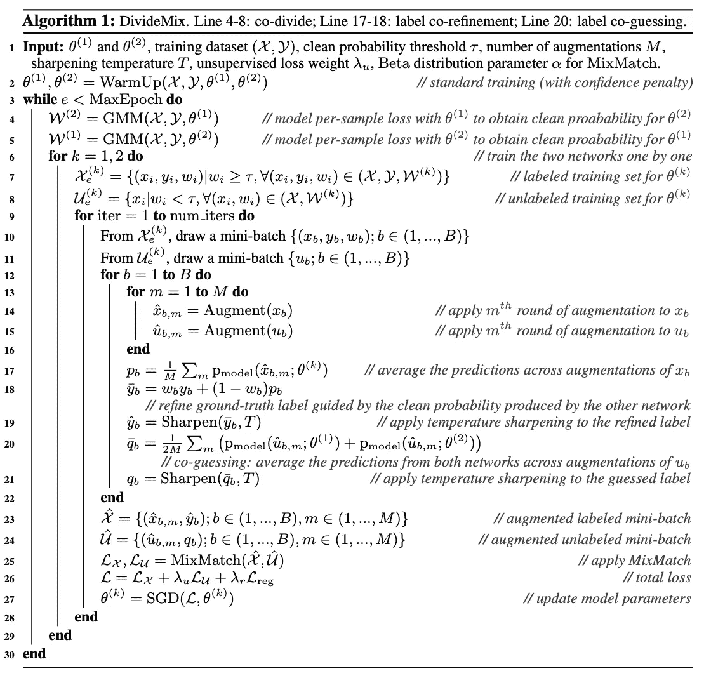

Li, J., Socher, R. and Hoi, S.C., 2020\. Dividemix: Learning with noisy labels as semi-supervised learning. *arXiv preprint arXiv:2002.07394*.

这看起来并不容易，但如果我们把算法分成几个部分，一行一行地进行，就很容易了。

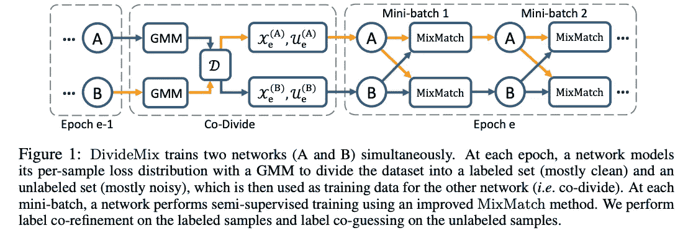

Li, J., Socher, R. and Hoi, S.C., 2020\. Dividemix: Learning with noisy labels as semi-supervised learning. *arXiv preprint arXiv:2002.07394*.

我们将尝试结合使用作者提供的图形和算法来逐步理解这种方法，以使我们的生活变得更容易*(因为生活是简单还是像你认为的那样困难——未知)*

当我们使用算法训练(提供已知信息)我们的模型时，我们在整个数据集上运行这个次数，称为 epochs。样本被定义为一个单一的数据单位，我们在不改变模型(参数)的任何值的情况下运行模型的样本数量称为批量。(深度文章:[神经网络](https://machinelearningmastery.com/difference-between-a-batch-and-an-epoch/)中批次和时期之间的差异)

DivideMix 中使用的方法是我们有各种带有噪声标签的图像。从上图中我们可以看到，两个网络同时被训练，以避免**确认偏差**。(在每个时期过滤彼此的误差)

> 确认偏差:机器学习算法的目的是学习模式以给出更好的结果；为了实现这一点，可能会出现这样一种情况:只重视少数几个结果，而忽略其他结果，因为这样做会得到更好的结果。它每次都向网络提供相似类型的信息。(深度文章:[数据偏差及其对你的机器学习模型的意义](https://www.explorium.ai/blog/data-bias-and-what-it-means-for-your-machine-learning-models/))

对于每个历元，DivideMix 模型执行共除，共除背后的主要思想是在干净的标注数据集和嘈杂的标注数据集之间划分网络。*我们忽略了有噪声的带标签数据集的标签，因此它变成了有噪声的无标签集，我们保留了干净的带标签集的标题*。在这一步，我们的问题从监督学习转换为半监督学习，在这之后，我们可以使用半监督 MixMatch 学习的改进版本。

**但主要问题是如何执行共除？**

研究证明，在干净的样本上学习比在嘈杂的样本上学习更快更容易。

共分的主要目的是找到样本干净的概率。

> 这可以通过将混合模型拟合到每个样本的损失分布来实现。

简单来说，损失定义为对错误结果的罚款，参数是机器学习的首要关键。参数是模型在训练期间学习的一组值，正式表示为θ。(深度文章:[机器学习和深度学习中的参数和超参数](https://towardsdatascience.com/parameters-and-hyperparameters-aa609601a9ac))

**步骤 1** :如第 2 行提到的，算法名为预热阶段，我们需要用噪声数据集训练我们的模型几个时期。我们可以使用作者使用的任何图像分类监督技术 ResNet(参考:[图像分类](/@nina95dan/simple-image-classification-with-resnet-50-334366e7311a))。我们并行运行两个模型，以避免确认偏差。会得到一个双参数集θ_1 和θ_2。

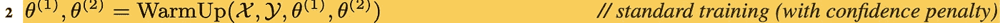

Line 2

**第二步**:我们的目标是使用交叉熵计算每个样本的损失。

> *交叉熵损失*是机器学习中最常用的损失类型，表示模型适合或符合训练数据的程度。它只是建立在给出两个概率分布之间的差异上。数学上，它被定义为:

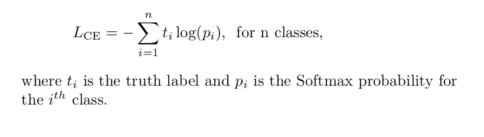

[https://towardsdatascience.com/cross-entropy-loss-function-f38c4ec8643e](https://towardsdatascience.com/cross-entropy-loss-function-f38c4ec8643e)

> 在上面的数学方程中，p_i 是从我们的模型预测的那一类的概率，t_i 是正确的概率。在上面的公式中，计算了交叉熵损失。

Softmax 概率是模型预测的输出。(深度文章: [Softmax 和不确定性](https://towardsdatascience.com/softmax-and-uncertainty-c8450ea7e064))。

在 DivideMix 方法中，我们考虑了具有给定模型参数θ的所有样本的损失，并且我们的数据总共有 *C* 个不同的类别或标签。我们可以将数据表示为 D = (X，Y)，其中 X 表示图像，Y 表示它们各自的标签。因此，所有样本的损耗 *l(θ)* (假设 *N* )为:

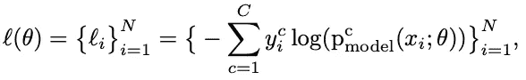

Li, J., Socher, R. and Hoi, S.C., 2020\. Dividemix: Learning with noisy labels as semi-supervised learning. *arXiv preprint arXiv:2002.07394*.

> 在上面的数学等式中，我们使用上面的公式计算每个样本(总共 N 个样本)的交叉熵损失。我们用 y 作为实际样本，p^c 项给出了我们模型的预测类别。

**[第 3–5 行]第 3 步:**我们有所有样品的损失；我们将在两分量高斯混合模型 GMM(聚类机器学习模型)中拟合我们发现的损失 *l* 以获得干净概率。我们将选择具有较小平均值的高斯，并且如果预测的概率大于阈值，则样本被认为是干净的，并且标签被保留；否则，噪声和标签将被移除。

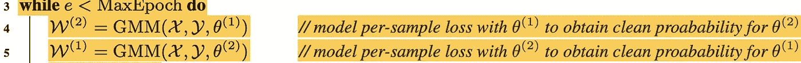

Line 3–5

在两分量高斯混合模型 GMM 中，我们尝试用两个钟形曲线(称为高斯曲线)拟合我们的数据，这两个钟形曲线具有参数均值μ、协方差σ、混合概率π。我们会选择平均值较小、误差较小的钟形曲线。(为了更好地解释 GMM，阅读下一节，或者如果我们有 GMM 背后的基本想法，我们可以跳过下一节)

**要做到这一点，我们需要理解高斯混合模型 GMM 的概念:**

高斯一般表示[正态分布](https://en.wikipedia.org/wiki/Normal_distribution)，这种聚类技术就是基于此。无监督的目标是将数据聚类成固定数量的组件。每个分量也称为高斯分量，由均值μ(中心)、协方差σ(宽度)、混合概率π(高斯小/大的大小，或者我们可以说每个高斯的权重)作为参数组成。

Gaussian Mixture Models in PyTorch: [https://angusturner.github.io/generative_models/2017/11/03/pytorch-gaussian-mixture-model.html](https://angusturner.github.io/generative_models/2017/11/03/pytorch-gaussian-mixture-model.html)

我们将数据作为 X，不需要标签 Y，因为这是一种无监督的学习，所以在数学上，我们需要最大化由下式给出的概率函数:

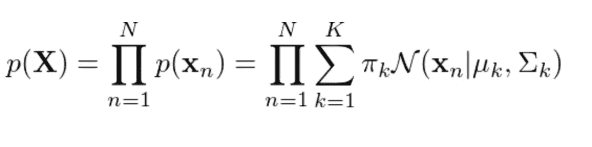

Gaussian density function

> 上面的数学方程给出了其中 K 个总样本的正态分布我们有 N 的概率密度函数，N 是分布总数；这里有 N 个高斯，所以它被称为 N 分量高斯混合模型

( [*R*](https://stackoverflow.com/questions/62603935/expectation-maximization-algorithm-em-for-gaussian-mixture-models-gmms) ef *:* [高斯混合模型的期望最大化算法(EM)](https://stackoverflow.com/questions/62603935/expectation-maximization-algorithm-em-for-gaussian-mixture-models-gmms))

期望最大化(E.M .)方法最大化了上面提到的概率，因为它不可微。根据电磁法:

**步骤 1** :正如我们所讨论的，参数是μ、σ和π，所以用一些随机值初始化这些参数。

**第二步期望**:责任是每个高斯与输出之间的关系，这意味着从该聚类中产生任何数据点的后验概率。在这一步中，我们需要使用参数μ、σ和π找出每个数据点的责任。数学上:

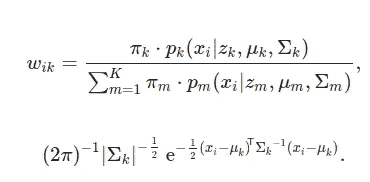

Responsibility

> 上面的数学方程求出了在 K 个数据存在的情况下，以给定的均值(μ)、协方差(σ)和混合概率(π)从高斯(N 高斯)产生数据的概率。

**步骤 3 最大化:**使用期望步骤的职责更新参数μ、σ和π。数学上:

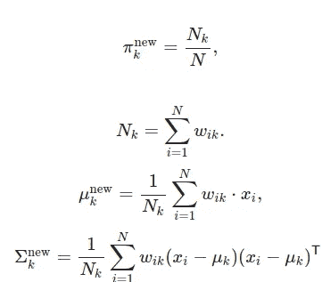

Parameters Update

> 通过训练，我们需要改变参数μ、σ和π，而上述数学方程基于新值对参数进行平均。

**步骤 4** :重复步骤 2 和步骤 3，直到收敛(局部最优)

(深度文章:[高斯混合模型讲解](https://towardsdatascience.com/gaussian-mixture-models-explained-6986aaf5a95))

在使用期望值最大化算法对 2-成分 GMM 模型的损失进行拟合之后。我们有高斯函数所有参数的最佳值。我们将选择具有较小平均值的高斯分量 *(g)* ，因为它将具有最低误差。

我们的目标是使用后验概率 ***p(g|l_i)*** *，*找到干净样本的，其中 g 是具有较小均值的高斯分量，l_i 是每个样本的损失。

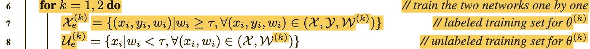

Line 6–8

**【第 6–8 行】第 4 步:**现在我们有了每个样本的干净概率损失，如果大于指定的阈值，那么模型就是干净的，所以标签被保留；否则，选择是嘈杂的，所以标题被删除，它是嘈杂的未标记。(根据研究论文，大多数情况下阈值为 0.5)。

**共同分割的结论:**

> **1。在有噪声的数据集上运行图像分类模型几个时期，以找到参数θ。(步骤 1)**
> 
> **2。使用交叉熵损失，计算每个样本的损失，并使用期望最大化，使用计算的损失来拟合双组分 GMM。(步骤 2)**
> 
> **3。我们有整体损失的高斯分量；选择具有较小平均值的高斯分量。(步骤 3)**
> 
> **4。给定每个样本的损失 l ，我们找到所选高斯分量 g *(较小标准)*的概率 p(g|l );如果它大于阈值 0.5，则它是一个干净的数据集，否则就是有噪声的数据集，因此移除有噪声数据集的标注。(步骤 4)**

在共除步骤之后，我们得到了带有标签的清洁数据集和没有标签的噪声数据集；现在，它是半监督学习。我们将关注 MixMatch 半监督学习方法，因为它的改进版本用于半监督学习的 DivideMix 方法。

**为此，我们需要理解 MixMatch 半监督学习(无旁路)的概念:**

> 引文:d .贝特洛、n .卡利尼、I .古德费勒、n .纸诺、a .奥立佛和 c .拉弗尔，2019 年。Mixmatch:半监督学习的整体方法。 *arXiv 预印本 arXiv:1905.02249* 。

半监督学习包含标记和未标记的数据，但它专注于利用未标记数据的模型。在这种方法中，我们需要关注三个术语:

1.  一致性正则化:当我们对输入做小的改变时，它迫使模型产生相似的输出分布。
2.  熵最小化:它鼓励模型对未标记的数据给出有把握的预测。
3.  通用正则化:很好地概括模型，避免过度拟合数据。

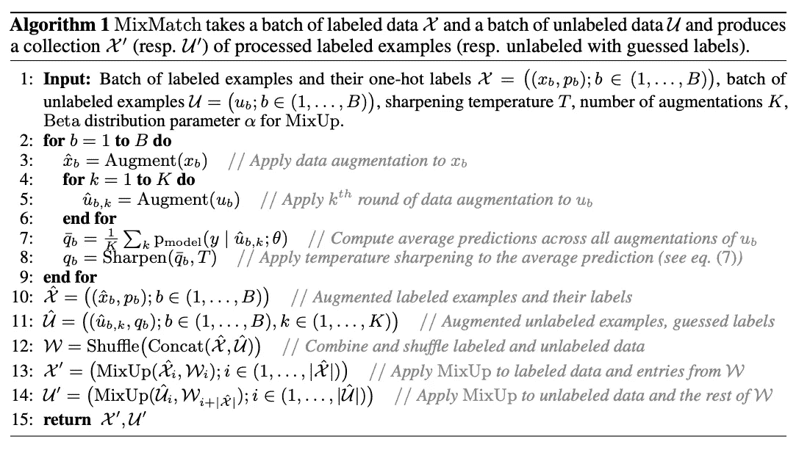

Berthelot, D., Carlini, N., Goodfellow, I., Papernot, N., Oliver, A. and Raffel, C., 2019\. Mixmatch: A holistic approach to semi-supervised learning. *arXiv preprint arXiv:1905.02249*

MixMatch 在训练时结合了这三个特性:

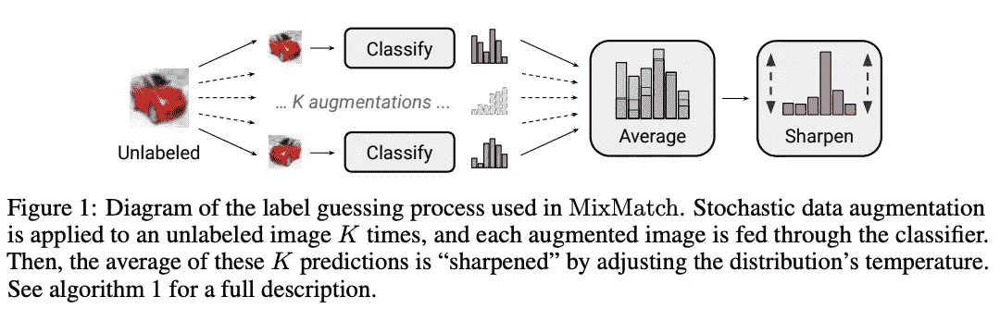

Berthelot, D., Carlini, N., Goodfellow, I., Papernot, N., Oliver, A. and Raffel, C., 2019\. Mixmatch: A holistic approach to semi-supervised learning. *arXiv preprint arXiv:1905.02249*

在不深入这个模型的数学知识的情况下，我们将讨论所遵循的方法。如上所述，我们考虑所有未标记的数据进行一致性正则化，并生成 K 个数据增强(增强是特定图像排列的改变)。我们将预测每幅图像的标签并计算平均值。数学上，

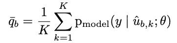

Average (Consistency Regularisation)

> 上面的数学等式猜测从单个图像产生的每 K 个增强图像的标签 y。上述公式对增强图像上的预测进行了平均。

之后，我们执行锐化作为熵最小化步骤。我们这样做是为了减少标签分布的熵(结果的随机性)。我们可以通过调整给定公式中的温度值来实现这一点:

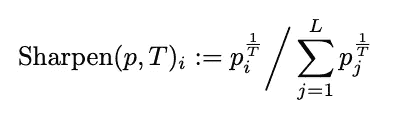

Sharpen (Entropy Minimisation)

> 上面的数学方程取的是概率分布 p，如果我们让 T 更接近 0 (T — > 0)，它将趋近于 one-hot 分布，对预测类取 1，对其他所有类取 0。所以降低温度会减少预测的随机性。

最后一步是概括；我们可以使用 L-2 损耗进行归纳。数学上，

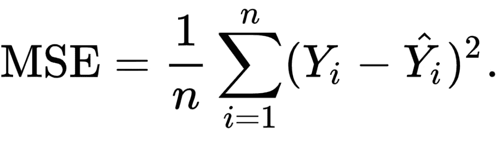

A generalisation (L2 Loss — MSE)

> Y 是上面数学方程中的正确值，Y-hat 是预测值。上面的公式计算了两者之间的距离的平方。它处理图像之间的重大错误或较大差异。它有助于应用于两者的图像重建。

上面解释的所有术语都是从数学公式中自明的。我们可以跳过数学部分，坚持从上面提到的定义来看它们的用处。

# ***最主要的诀窍是如何在 DivideMix 方法中使用***

我们知道，两个网络是并行运行的，所以我们需要一个网络可以帮助教导其他网络的东西。

**[第 12–19 行]第 5 步:**现在，通过共分，我们已经有了标记和未标记的数据，我们需要找到现有图像的增强。对于带标签的样本，我们将原始标签与预测标签相结合，对多个参数进行平均，并锐化结果。

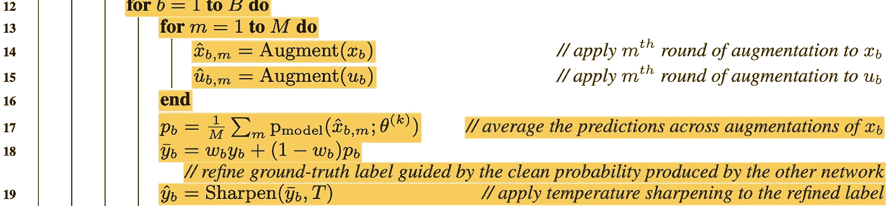

Line 12 -19

在上面的行中，在第 18 行，使用的公式是:

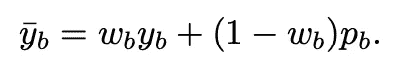

Label co-refinement

> 在上面的公式中，y_b 是实际的标签(记住在这一步中我们只考虑标记的数据)，p_b 是预测的标签，它是多个增强的平均值；我们使用了 w_b，这是来自另一个网络的干净概率(这是两个网络相互作用和相互帮助的地方)。

锐化的整个过程(第 19 行)被称为标签协同细化。

**[Line 20–21]步骤 6:** 现在我们剩下未标记的数据，我们使用两个网络进行预测(这就是为什么我们在第 20 行求平均时有 2M)，这有助于执行更可靠的标签猜测，然后应用锐化，整个过程称为共同猜测。

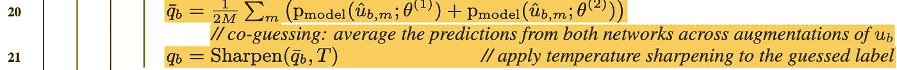

Line 20–21

**【第 23–27 行】:第 7 步 MixMatch**现在，我们有了各种增加的标记样本和未标记数据的猜测标签。然后从这些集合中随机选择数据点，交叉熵，并计算 MSE，精确地说是 MixMatch 方法。因此，我们丢失了标记和未标记的数据，如 L_x 和 L_u(第 26 行)。

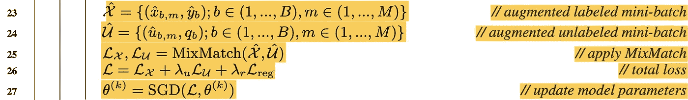

Line 23–27

但是等等，当噪音太大的时候还有一个问题。该模型将只预测相同的类别以最小化损失，因此我们可以使用正则化公式 L_reg 来避免这种情况:

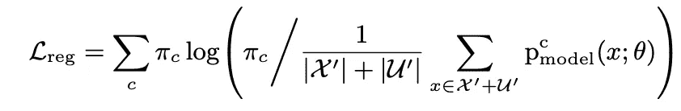

Regularisation Loss

> L_reg 有助于控制特定批次中所有样本的所有输出的模型平均值。上式中，π为 1/C(类)，X/U 为以 p 为预测的标记和未标记数据。

我们将所有损失相加，并使用 **λ，**控制它们的权重，因此我们的总损失是所有这些损失的总和(第 26 行):

Total Loss

在第 27 行中，我们应用随机梯度下降，其主要目的是通过改变参数值来减少损失。(深度文章: [*【随机梯度下降(SGD)*](/@hakobavjyan/stochastic-gradient-descent-sgd-10ce70fea389) )

**改进 MixMatch 的结论:**

> **1。我们考虑了所有的标记数据，找到了扩充版本，并使用地面真相，我们平均预测值。(步骤 5)**
> 
> **2。我们考虑了未标记的数据，并使用两个网络来猜测标记，并对平均值进行集合预测。(步骤 6)**
> 
> **3。在最后一步中，我们应用 MixMatch 并控制高噪声水平的预测，我们使用正则化损失并使用 SGD 和总损失更新参数。(步骤 7)**

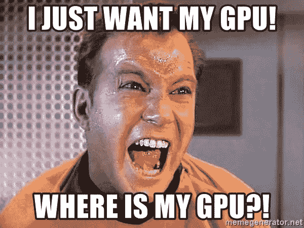

[**UBER SHATNER**](https://memegenerator.net/Uber-Shatner)

总之，DivideMix 是 co-divide 步骤和改进的 MixMatch 方法的混合，并且在噪声数据集上给出了极好的分类结果。DivideMix 对 CIFAR-10 和 CIFAR-100 的影响:

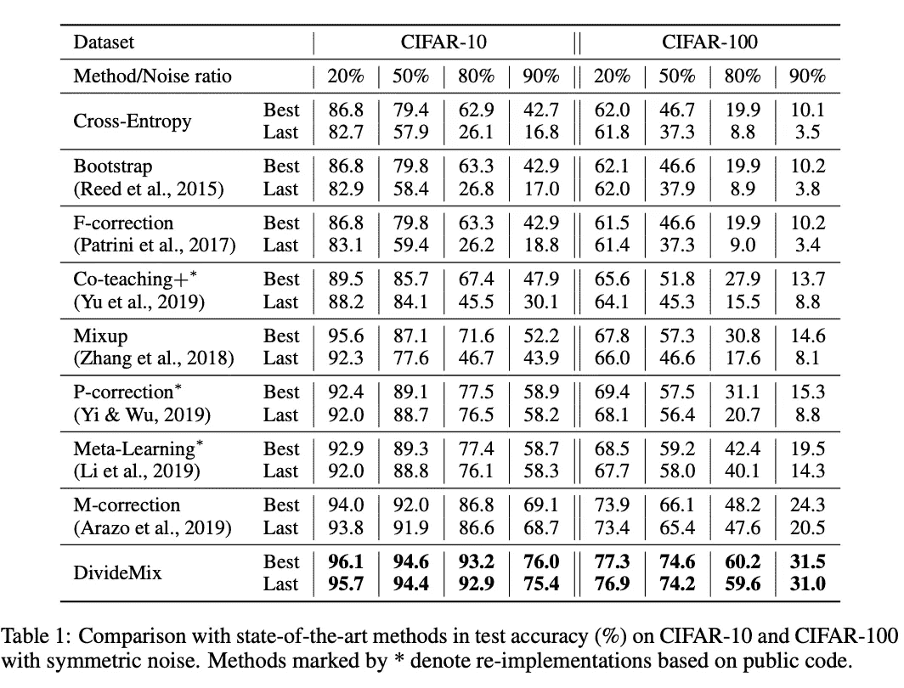

Li, J., Socher, R. and Hoi, S.C., 2020\. Dividemix: Learning with noisy labels as semi-supervised learning. *arXiv preprint arXiv:2002.07394*.

本文附录中的图像结果:

Li, J., Socher, R. and Hoi, S.C., 2020\. Dividemix: Learning with noisy labels as semi-supervised learning. *arXiv preprint arXiv:2002.07394*.

> 作者在[https://github.com/LiJunnan1992/DivideMix](https://github.com/LiJunnan1992/DivideMix)提供工作代码

要深入了解 DivideMix，请跟随论文:

 [## Mlearning.ai 提交建议

### 如何成为 Mlearning.ai 上的作家

medium.com](/mlearning-ai/mlearning-ai-submission-suggestions-b51e2b130bfb)