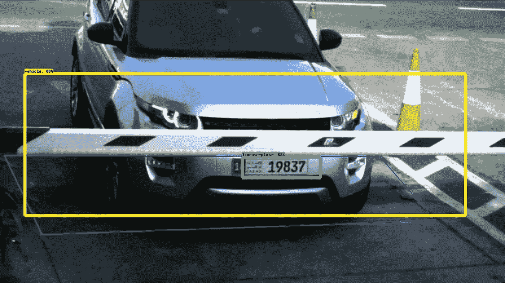

# 在 TensorFlow 1.5 中训练自定义对象检测模型

> 原文：<https://medium.com/mlearning-ai/training-a-custom-object-detection-model-in-tensorflow-1-5-9ee8179da70b?source=collection_archive---------1----------------------->

## 对不起 TensorFlow 2

我们在前几篇文章中探讨了几种物体检测模型的区别，分别是:**更快的 R-CNN** 、 **YOLO** 和 **SSD** 。现在我们已经了解了它们之间的区别，让我们试着用一些代码来实践一下。今天，让我们来看看如何构建一个自定义的对象检测模型…