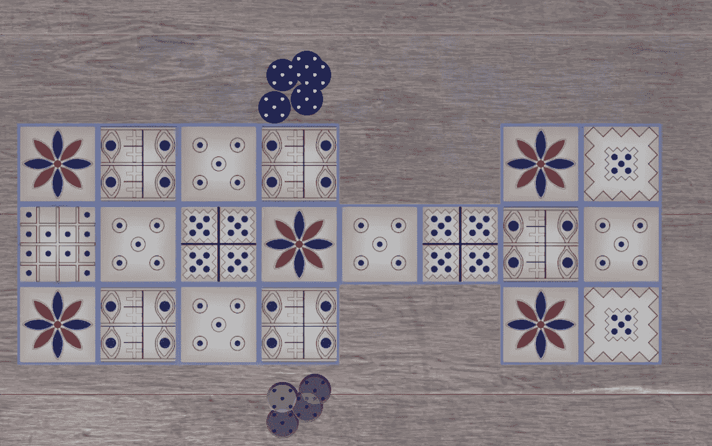
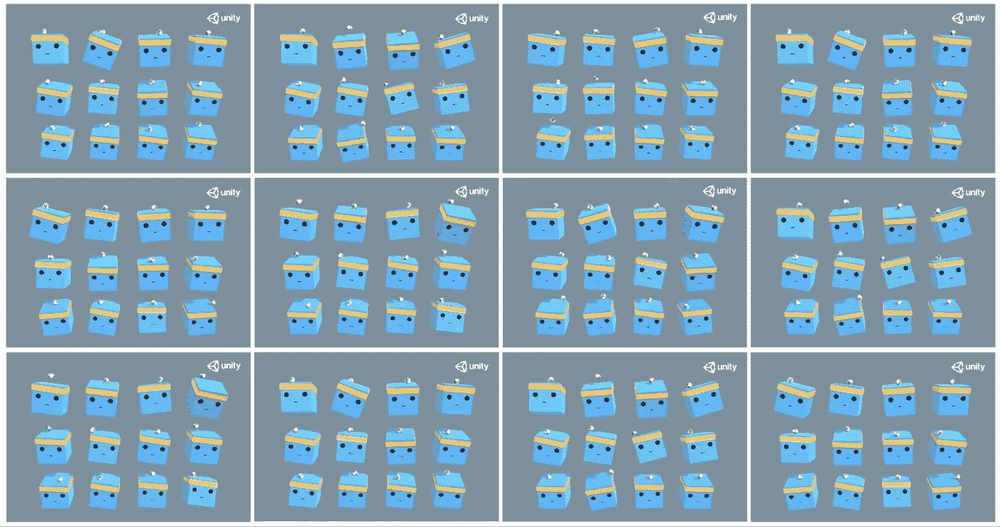
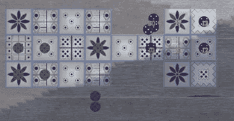
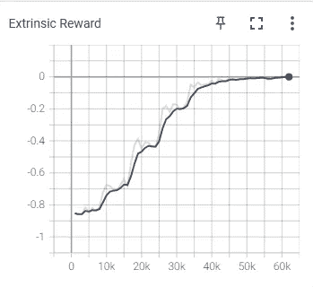
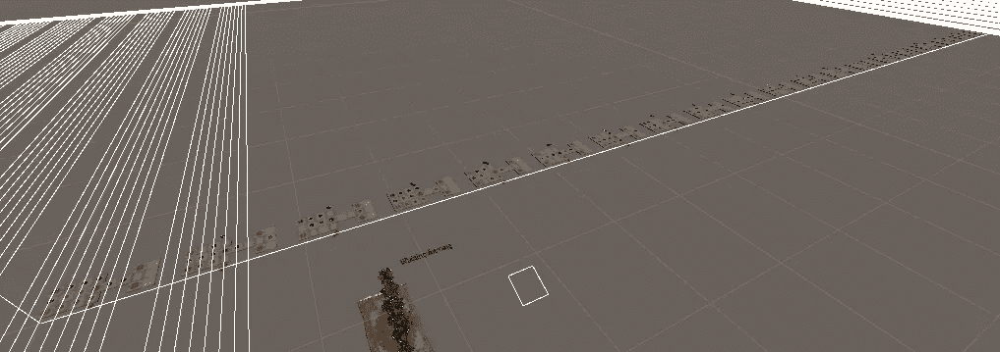
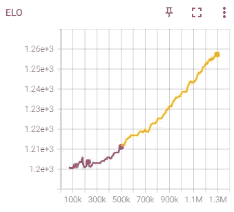

# 训练神经网络赢得世界上最古老的棋盘游戏

> 原文：<https://medium.com/mlearning-ai/training-a-neural-network-to-win-the-worlds-oldest-board-game-2a02882ff9ac?source=collection_archive---------1----------------------->

The Game Board of The Royal Game Of Ur

神经网络多年来一直在摧毁棋盘游戏的竞争。2016 年，谷歌的人工智能在与最好的围棋选手之一李·塞多尔的比赛中赢得了许多比赛。2018 年，谷歌将其人工智能释放到国际象棋世界。经过 9 个小时的训练，[谷歌的国际象棋人工智能能够与甚至是大师级的](https://www.technologynetworks.com/informatics/news/deepminds-new-ai-teaches-itself-chess-beats-grandmaster-312959)站在一起。[这些天来，它厌倦了殴打我们人类，并开始摧毁它的机器人同伴。](https://www.chess.com/news/view/updated-alphazero-crushes-stockfish-in-new-1-000-game-match)

当我们教人工智能如何玩我们的游戏时，人工智能给我们上了谦卑的一课。是的，大师是卑微的——但是我们作为程序员也是卑微的。我们当中有多少人能够理解如何创建这样一个人工智能，将我们这个时代最受尊敬的一些棋盘游戏连根拔起？事实是，创造一个能够在像国际象棋和围棋这样的游戏中看到数百万种分支可能性的人工智能需要很好的专业知识和很好的基础设施。

然而，大师们继续发展他们的策略，并在彼此之间比赛，即使他们永远无法击败这些人工智能。让我们以和大师们同样的精神发展我们的人工智能。我们的算法可能不会统治我们这个时代最受尊敬的棋盘游戏，但也许我们可以统治一个简单时代最受尊敬的棋盘游戏…

# 开始之前

在我们开始之前，让我们来谈谈这个古老游戏的规则和我们将在其上开发这个游戏的平台。

## 吾珥的皇家游戏

Ur 的皇家游戏是第一个被发明的桌游。考古学家发现它的木板可以追溯到公元前 2500 年左右。这个游戏看似简单。掷出 4 个骰子来计算你可以向前移动多少张牌。为了赢，你必须把你所有的棋子都穿过棋盘，并到达终点。然而，这些不是现代的六面骰子，而是四面体骰子——有点像金字塔。每个骰子的一个点上有 2 个银色标记和 2 个暗标记。如果骰子落地时银色标记朝上，那就是 1 步。所以你可以在 0-4 之间任意选择。

至于棋盘，有些瓷砖是安全的，而有些则不安全。花牌总是安全的(并且为你提供额外的移动)。所有不在中间的牌都是安全的。当一个棋子不安全时，如果敌人落在你的棋子上，你可以被送回家——一次只能有一个棋子占据一个棋子。

这不是运气的游戏，更多的是概率的游戏。游戏的很多策略来自于最小化你的风险和最大化你的优势。例如，由于骰子的工作方式，有 37.5%的机会掷出 2，但只有 6.25%的机会掷出 4。这可能使落地时离敌人棋子 2 格远是一个冒险的举动，而离敌人棋子 4 格远是一个更安全的赌注。

如果你想看看这些规则的实施，下面有一个很棒的视频链接，展示了汤姆·斯科特对 Ur 皇家游戏的介绍。

## 简单的开发平台

用 Python 制作一个基于主机的视频游戏相当简单。然而，我想创造一些更像电子游戏而不是科学实验的东西。从头开始创建一个 3D 甚至 2D 游戏可能需要一年或更长时间。然而，感谢像 Unity 这样的预制游戏引擎，所有的引擎开发时间都可以被砍掉，我可以专注于创作游戏。我花了大约一个月的时间在 Unity 中开发了 Ur 的皇家游戏，并且能够在没有遇到问题的情况下与自己进行比赛。

# 人工智能基础设施

人工智能最难的部分通常不是训练它，而是将它恰当地集成到应用程序中。来说说是怎么做的吧。

## [ML-Agents](https://github.com/Unity-Technologies/ml-agents)

说到策略游戏，人工智能选择的方法是[蒙特卡洛模拟](http://beej.us/blog/data/monte-carlo-method-game-ai/)。不过，在这种情况下，我们将与 ML 代理。开发 ML-Agents 的目的是完成涉及更多身体动作的任务，比如在你的头上平衡一个球。

From the ML-Agents team. An example of balancing said ball on head

那么，为什么选择机器学习来完成更适合蒙特卡洛的任务呢？嗯，比较容易。ML-Agents 是 Unity 的现成库，而蒙特卡罗模拟则需要完全手工创建和训练。

## 计算机视觉

神经网络必须接受一系列数字作为输入。这些数字应该是什么？如果我们使用真正的计算机视觉，我们会把棋盘的图像转换成一长串数字。这不仅需要很长时间的训练，而且非常复杂。相反，让我们只输入计算机需要知道的信息。

玩桌游的时候，你需要知道两件事。碎片在哪里，最后一卷是什么。知道你能去哪里以及是否有任何牌有特殊能力也是很好的。所以这个列表最终看起来像下面这样。

> [最后一卷，FlowerTileA，FlowerTileB，…，FlowerTileN，[PieceVisonAA，PieceVisionAB，…，piecevisinan]，[PieceVisionBA，PieceVisionBB，…，PieceVisionBN]，…，[PieceVisionNA，PieceVisionNB，…，PieceVisionNN]，[ValidStartA，ValidEndA]，[ValidStartB，ValidEndB]，…，[ValidStartN，ValidEndN]]

棋盘上的每个牌都有一个与之关联的 ID。由于 FlowerTile 比较特殊，因此它们的 id 直接提供给“flower tile”中的代理。这有必要吗？也许吧。让我们把它放进去，因为它将有助于训练神经网络对 Ur 游戏的不同安排。如果我们在棋盘上添加另一个或三个花牌，那么如果神经网络将额外的移动与花牌列表中的 ID 相关联，那么它可能会更容易适应新的棋盘。

PieceVision 很简单。从棋盘的起点到终点，选择所有可能的路径。(在 Ur 的经典游戏中，那是一个)。然后将每一个友军的棋子记为该牌价值的+1，将每一个对手的棋子记为该牌价值的-1。

[ValidStart，ValidEnd]是一个向量列表(两项列表)。列表中的每个向量代表一个有效的移动。ValidStart 是移动的开始位置，ValidEnd 是棋子从那里移动时的落点。

## 算法方法

Each tile has a value associated with it based on how dangerous/important it currently is. The algorithm seeks to maximize the current tile value.

在构建神经网络之前，先写一个幼稚的算法总是好的[。为什么？它将首先作为一个健全的检查。可以用我指定的输入来建造人工智能吗？如果我能成功地编写出一个可以与玩家竞争的 AI，那么答案是肯定的。其次，这将有助于解决计算机视觉的问题。通过让两个算法机器人在 Ur 中相互战斗一个小时，我肯定会知道计算机视觉脚本是否有任何潜在的错误。好像这还不是足够的理由，最后，它将是萌芽中的神经网络在准备好与自己战斗之前要对抗的东西。](/@j_kirchner/using-an-algorithmic-approach-to-project-design-592643b4834e)

# 训练网络

在学会打架之前，它必须学会走路而不把自己打晕。我首先为 Ur 的皇家游戏的一个简单版本训练一个神经网络。这个简单的版本有 5 个棋子和 3 个骰子。在成功训练之后，我开始玩真正的游戏。

## 婴儿学步

那么，网络的输入前面已经讲过了，但是它的输出应该是什么呢？在输入列表的最后是一个向量列表，它是属于 AI 的每一个片段的有效开始和结束位置。为了不混淆，我们用这个向量列表。它将从 1-7(7 是最大可能的移动次数)中选择任意数字，选择有效的移动向量。

但如果人工智能选择了选项 4，但只有 2 个有效选项，该怎么办？好吧，我们不得不严厉一点。马上就会输。否则，人工智能将开始猜测随机数，这对它的训练是有害的。

因此，我们全新的神经网络将与我们之前制作的旧算法(称为 HorribleAI)的一个非常淡化的版本进行竞争。HorribleAI 只会在 20%的时候选择最优的选择。让我们称我们崭露头角的英雄为现实吧。

前 1000 场左右的比赛很快就输了，因为它选择了一个无效的走法。

## 你知道规则，RealAI 也知道

The higher the value, the better the neural network is at accomplishing its goals.

大约 60k 移动后(~20k 匹配？)RealAI 不再是马上输。它现在有了一个概念，哪些动作是有效的，哪些动作是无效的。然而，它也陷入了停滞。它迎接了我们向它提出的挑战。从现在开始就是 RealAI vs RealAI。

## RealAI vs RealAI

Ur Boards as far as the eye can see

上图显示了 40 个代理在 20 个棋盘上战斗，然而，我很快发现这是低效的。虽然我的电脑可以处理那么多电路板，但最大的瓶颈是等待人工智能的决定，而这一次只能做一个。

然后我发现两块木板是最有效的，因为人工智能总是要做出决定(消除移动棋子之间的间隙)。

However, there was no problem running 4 instances side-by-side. That makes 16 agents and 8 games.

ML 代理有一个很好的特性，可以让你同时运行多个游戏实例。我可怜的 CPU 最多只能处理 4 个，允许 16 个代理同时玩。

从这里开始是价值调整。这是一个复杂的过程，你可以从 youtube 视频中了解更多。偶尔停止程序来调整旋钮。之后，就是运行它，直到我们对结果满意为止。如果结果不理想，可能会重做一些。

1.3 Million Moves Later…

在电脑上停留几个晚上，早上进行调整，最终产生了这样的 ELO 图。ELO 是对人工智能当前技能的一种衡量。它与自己过去的迭代进行斗争，看看是否有所改进。

## 轶事:你的 AI 可以比你聪明

在第一个晚上的训练之后，我很兴奋地在早上和我的 AI 比赛。我对着它开了一场比赛，开始打。我在开始时输了，但当我突然看到“比赛以平局结束”——什么？我查看了代码，发现有一个 bug 在特定条件下人工智能选择了特定选项的情况下进行匹配，这是一个非常具体的 bug。在修复了错误并重新训练了 20 分钟左右后，AI 技能的所有指标都崩溃了。**意为** **人工智能没有学会如何玩好游戏，而是学会了当它知道自己最有可能输掉**时，何时利用一个 bug 来迫使平局。

# 结束了

经过几周的工作，人工智能已经被训练好了。这是一个折磨人的过程，ML-Agents 不是很友好。库的最新版本(好东西)属于“预览包”的类别，这意味着它们可能有许多 bug。我经历了很多。然而最终的结果是值得的。2 人工智能是在一个比另一个更好的地方产生的。第一个 AI 是为 Ur 皇家游戏的简化规则集制作的，其中只有 5 个棋子和 3 个骰子。第二个是经典规则集，有 7 个棋子和 5 个骰子。复杂性对人工智能来说有些挑战，但它仍然是一个不错的机器人。

## 释放；排放；发布

Let’s play The Lost Game Of Ur

在这一点上，我所做的是一个有着奇怪焦点的视频游戏。而不是专注于图形或许多功能(你能给一个有 4000 年历史的棋盘游戏添加什么功能呢？)，它是一款专注于拥有一个难对付的对手的电子游戏。如果你对与人工智能对战感兴趣，你可以在 Steam 上花大约 3 美元购买一款名为 Ur 的迷失游戏。

我从 Steam 收到了一些免费赠送的钥匙。作为对阅读整篇文章的感谢——如果你对这个游戏感兴趣，我会给你 5 份免费拷贝。为了获得密钥，请留下您的电子邮件地址或您的 Steam 名称/Steam 个人资料链接。