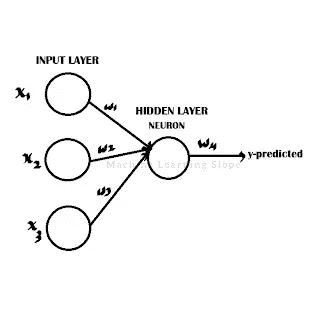
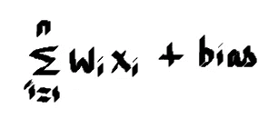
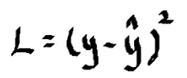
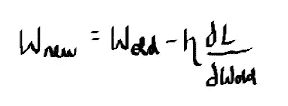

# 神经网络的训练——反向传播

> 原文：<https://medium.com/mlearning-ai/training-of-neural-networks-back-propagation-7047d6ffbdc4?source=collection_archive---------6----------------------->

**在这个博客中我们将看到:**

*   **什么是神经网络？**
*   **单层神经网络的工作**
*   **神经网络训练**
*   **优化器简介**
*   **反向传播**

**神经网络用于深度学习算法。神经网络由不同的层组成。第一层是输入层，第二层是各种隐藏层，最后是输出层。最初，输入层包含所有需要传递给神经网络进行学习的特征。**

# 单层神经网络的工作原理

**在该表示中，它具有三个特征 x1、x2 和 x3，它们分别具有权重 w1、w2 和 w3。它只有一个隐含层，因此是一个单层神经网络。这些特征及其权重被传递给神经网络。**

**首先在神经网络内部，它以如下方式计算 y:**

**对所有特征及其权重的乘积，加上一个偏差值。计算 y 值后，计算 y 的激活函数。**

**z=Act(y)**

**部分激活函数为 Sigmoid 和 relu 激活函数。然后，在计算 z 之后，z 将以相同的方式乘以 w4，并且将找到它的激活函数，因此将预测输出。这是一个基本神经网络的工作方式。**

# 神经网络训练

**在神经网络中，在前传播方法中传递特征和权重并预测输出。训练的下一步是找到损失函数。这里我们用均方差来求损失函数。**

**例如，如果 y 的实际值是 1，但预测值(y-hat)是零，那么损失函数将是 1，这是非常高的。所以损失函数应该最小化。**

# 优化器和反向传播

为了最小化损失函数，使用了优化器。优化器反向传播并减少损失函数。反向传播是从损失函数反向传播的方法，它传播到每个神经网络，直到输入层并更新它们的权重。

**如上图所示。首先，它反向传播并更新权重 w 4 的值，该值可以表示为，**

从学习率和损失函数相对于旧权重的导数的乘积中减去旧权重。学习率应该总是在 0.001 左右很小。以这种方式，权重被更新。在更新所有权重直到 w1 之后，它再次前向传播和预测该值。如果损失函数仍然没有被最小化并且再次发生反向传播，则再次计算损失函数。

**优化器的主要目的是减少损失函数，权重被更新直到损失函数最小化。**

# 结论

**这就是单层神经网络的训练方式。**

 [## Mlearning.ai 提交建议

### 如何成为 Mlearning.ai 上的作家

medium.com](/mlearning-ai/mlearning-ai-submission-suggestions-b51e2b130bfb)