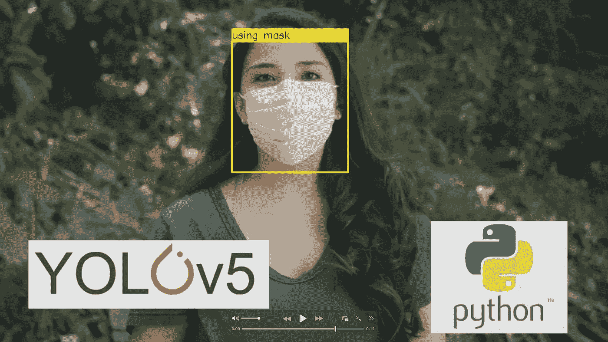
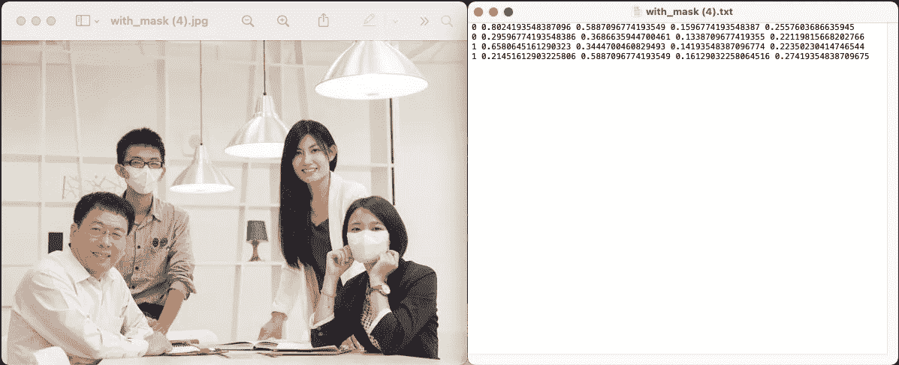
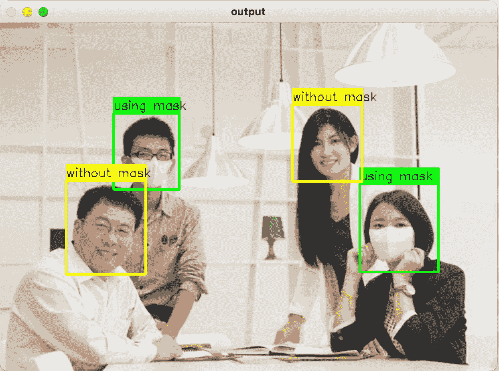
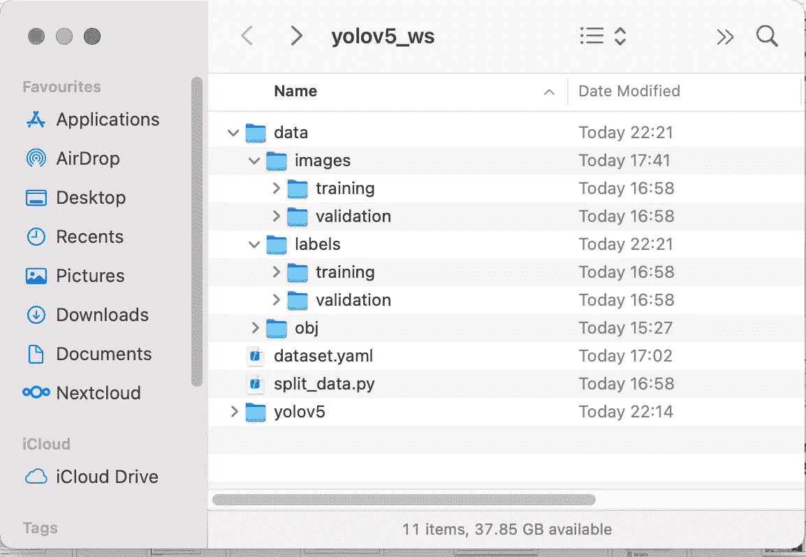
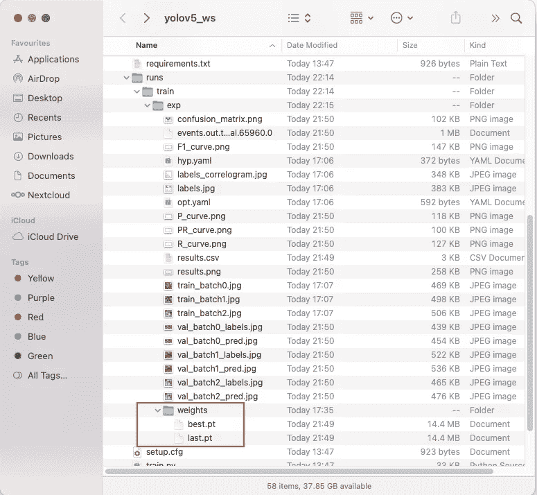
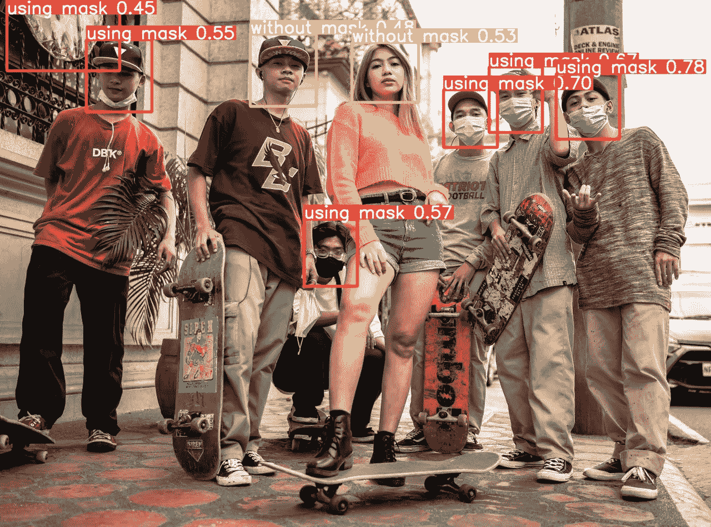
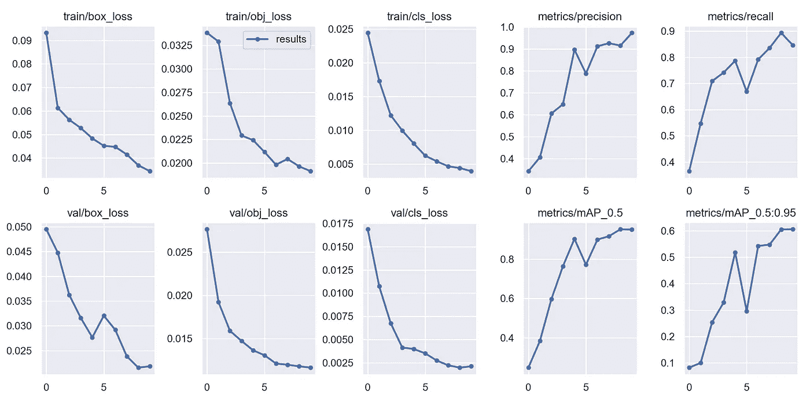

# 轻松训练 YOLOv5 自定义数据集

> 原文：<https://medium.com/mlearning-ai/training-yolov5-custom-dataset-with-ease-e4f6272148ad?source=collection_archive---------0----------------------->



[source](https://www.pexels.com/video/a-woman-wearing-face-mask-4373912/)

YOLOv5 是性能最高的物体探测器之一。它速度快，精确度高，而且非常容易训练。

在这个故事中，我们通过一个使用带标签的掩膜数据集的案例研究来讨论使用自定义数据集的 YOLOv5 模型训练。

注意，本文是[用 YOLOv5、OpenCV、Python 和 C++](/mlearning-ai/detecting-objects-with-yolov5-opencv-python-and-c-c7cf13d1483c) 检测物体的续篇。如果你是机器学习的新手，[值得在这里阅读建模概念的温和介绍](/mlearning-ai/machine-learning-frontiers-modelling-basics-7269ae6f0729)。

# YOLOv5 预建模型

YOLOv5 出厂时有一套型号: *YOLOv5n* 、 *YOLOv5s* 、 *YOLOv5m* 等。他们使用 MS COCO 数据集进行预训练:


[source](https://www.researchgate.net/profile/Li-Liu-76/publication/327550187/figure/fig5/AS:830132193353729@1574930346294/Recognition-problems-related-to-generic-object-detection-a-image-level-object.png)

这些 YOLOv5 模型能够使用仅 80 个类别中的一个来对对象进行分类(“人”、“汽车”、“自行车”、“船”、“鸟”等)。

如果这些类不符合您的应用程序需求，那么您可能需要用一组不同的类和图像来训练 YOLOv5。幸运的是，用自定义数据集训练 YOLOv5 非常容易。

# 但是什么是数据集呢？

在对象检测的**环境中，数据集是一组图像及其各自的注释。考虑下面的例子:**



上图及其右边的注释文件是 tech zizou 的 [**标注为 Mask**](https://www.kaggle.com/techzizou/labeled-mask-dataset-yolo-darknet) 数据集的一部分。这个注释文件有 4 行，每一行指的是图像中的一个特定的面。让我们检查第一行:

```
0 0.8024193548387096 0.5887096774193549 0.1596774193548387 0.2557603686635945
```

第一个整数(0)是对象类 id。对于这个数据集，类 id 0 指的是“使用掩码”的类，而类 id 1 指的是“不使用掩码”的类。以下浮点数是`xywh`边界框坐标。可以看到，这些坐标被归一化为`[0, 1[`。

我们可以按如下方式组合图像及其注释:



因此，在这种情况下，数据集基本上是用于训练和验证对象检测模型的若干对(图像、注释文件)的集合。

# 训练模型

我们可以按照 4 个步骤来训练我们的模型。

# 步骤 1 —克隆并安装 YOLOv5 及其依赖项

创建一个工作区文件夹并将 YOLOv5 克隆到其中:

```
$ mkdir yolov5_ws 
$ cd yolov5_ws 
$ git clone https://github.com/ultralytics/yolov5 
$ cd yolov5 
$ pip install -r requirements.txt
```

个人电脑。:注意，可能需要在最后一个命令之前升级 pip。可以使用以下命令升级 pip:*pip 安装—升级 pip*

之后，`pip`将安装所有需要的依赖项。如果您收到类似以下的错误:

```
Could not find a version that satisfies the requirement torch (from versions: none)
```

很可能您有一个旧的 python 版本或者更早的版本。在我的例子中，为了让 Pytorch 在我的机器上运行，我需要将 Python 3.10 降级到 3.9。

# 步骤 2 —获取和准备数据

访问[https://www . ka ggle . com/techzizou/labelled-Mask-dataset-yolo-darknet](https://www.kaggle.com/techzizou/labeled-mask-dataset-yolo-darknet)下载带标签的掩膜数据集。将`archive.zip`文件解压缩到`yolov5_ws`内的`data`文件夹中。检查`obj`文件夹，我们可以确认数据集确实是一堆图像和各自的注释文件:


我们需要将这些数据分成两组:训练和验证。大约 90%的图像必须复制到`yolov5_ws/data/images/training/`文件夹中。剩余的图像(全部数据的 10%)必须保存在文件夹`yolov5_ws/data/images/validation/`中。

值得注意的是，我们必须小心地将成对的注释文件复制到各自的文件夹`yolov5_ws/data/labels/training/`和`yolov5_ws/data/labels/validation/`中。为了避免在执行这些复制时出现任何故障，我建议使用以下 python 脚本:

用您喜欢的名称保存该脚本，并在`yolov5_ws`文件夹中运行它:

```
$ cd yolov5_ws 
$ python split_data.py
```

YOLOv5 训练过程将使用**训练子集**来实际学习如何检测物体。**验证数据集**用于在训练期间检查模型性能。

# 步骤 3 —准备培训配置文件

我们快到了！下一步是在文件夹`yolov5_ws`中创建一个名为`dataset.yaml`的文本文件，内容如下:

```
train: ../data/images/training/
val: ../data/images/validation/

# number of classes
nc: 2

# class names
names: ['with mask', 'without mask']
```

这是列车的最终文件夹结构和文件:



# 步骤 4 —运行列车

现在我们都准备好了，是时候实际运行火车了:

```
$ python train.py --img 640 --batch 16 --epochs 5 --data dataset.yaml --weights yolov5s.pt
```

根据您的硬件，此培训可能需要更长时间，也可能只需要几分钟。在培训过程中，该流程输出如下内容:

```
0/9        0G    0.1184    0.0347   0.03127        47       640:   4%|▎         | 3/85 [01:08<30:00, 21.95s/it]
```

最后，我们得到以下输出:

```
10 epochs completed in 1.719 hours.
Optimizer stripped from runs/train/exp/weights/last.pt, 14.4MB
Optimizer stripped from runs/train/exp/weights/best.pt, 14.4MB

Validating runs/train/exp/weights/best.pt...
Fusing layers... 
Model Summary: 213 layers, 7015519 parameters, 0 gradients, 15.8 GFLOPs
               Class     Images     Labels          P          R     mAP@.5 mAP@.5:.95: 100%|██████████| 5/5 [00:54<00:00, 10.90s/it]                                                                     
                 all        151        283      0.973      0.847       0.95      0.606
          using mask        151        218      0.982      0.862      0.968      0.599
        without mask        151         65      0.964      0.831      0.932      0.613
Results saved to runs/train/exp
```

现在，确认您有一个`yolov5_ws/yolov5/runs/train/exp/weights/best.pt`文件:



你做到了！`best.pt`是训练过程的模型结果。现在，模型可以进行预测了！

# 使用训练好的模型

现在我们已经用带标签的掩膜数据集训练了我们的模型，是时候进行一些预测了。这可以使用专门为此设计的现成 YOLOv5 脚本轻松完成:

```
python detect.py --weights runs/train/exp/weights/best.pt --img 640 --conf 0.4 --source ../../downloads/mask-teens.jpg
```



[source](https://www.pexels.com/photo/a-group-of-skaters-with-their-skateboards-on-the-sidewalk-6337382/)

在生产中使用`best.pt`之前，有必要对其性能进行评估。模型评估和选择是机器学习模型设计中最重要的课题之一。然而，用适当的细节来描述这个主题超出了本文的范围。

同时，我们可以检查`runs/train/exp/results.png`的输出，它在训练期间演示模型性能指标:



特别是，我们应该注意在验证集上展示模型性能的`val/`指标。这允许我们识别建模问题，例如*过拟合*和*欠拟合*。

# 额外收获:将模型转换成不同的格式

该命令将`best.pt`转换为 torchscript 和 onnx 格式，生成两个新文件:`best.torchscript`和`best.onnx`

```
$ python3 export.py --weights yolov5n.pt --img 640 --include torchscript onnx
```

详情可以查看 [github 回购描述](https://github.com/doleron/yolov5-opencv-cpp-python#exporting-yolo-v5-models-to-onnx-format)。

现在，您可以将转换后的文件用于不能识别 pytorch 模型的库。

# 结论

几年前，训练计算机视觉模型是一项极其艰巨的任务，只有那些能够深入挖掘体重更新的复杂动态的天才才能完成。如今，像 YOLOv5 这样的引擎打破了这一障碍，提供了一套高性能但易于使用的工具。

# 谷歌 colab 笔记本

检查[这里的](https://colab.research.google.com/drive/1Plz91PHWwf04bYt21mnWp7qBcDIvJ6J6)

[](/mlearning-ai/mlearning-ai-submission-suggestions-b51e2b130bfb) [## Mlearning.ai 提交建议

### 如何成为 Mlearning.ai 上的作家

medium.com](/mlearning-ai/mlearning-ai-submission-suggestions-b51e2b130bfb)