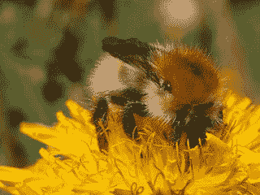

# 迁移学习和主动学习在未标记的数据集中寻找小类的图像。

> 原文：<https://medium.com/mlearning-ai/transfer-learning-and-active-learning-to-find-images-of-a-small-class-in-an-unlabeled-dataset-ad9b2a16c343?source=collection_archive---------7----------------------->


*All images are licensed CC-BY, creators are listed in the LICENSE.txt file* [*here*](https://storage.googleapis.com/download.tensorflow.org/example_images/flower_photos.tgz)*.*

实践中可能出现的一个常见的机器学习任务是**寻找特定类别的图像，对于这些图像，您没有带标签的数据集**。

当怀疑人工智能系统在特定类型或特征的对象上表现不佳时，可能会发生这种情况。或者当您想要收集特定类型的影像数据集，但标注该数据集非常耗时且耗费资源时。

示例:

*   在历史数据中找到带有交通锥的场景，以评估自主车辆视觉识别系统在这些特定情况下的性能
*   收集戴着外科口罩的人的照片数据集，以更新面部识别模型

主要的障碍是完全缺乏带标签的数据集。你知道你有所需类型的图像(有交通锥的场景，戴面具的人的照片，等等。)但是它们很少并且没有被标记。

# 我们想要实现什么？

最终目标是开发一个**系统，该系统可以过滤图像数据库，并找到包含所需类别**的许多对象的子集。生成的子集可以稍后发送进行手动标记，因此它不必 100%准确。然而，在许多情况下，所需类的大小非常小，这意味着随机采样数据库对于标注来说效率极低。例如，如果所需的类别很少，比如说 100 个图像中有 1 个，那么要手动标记 10.000 个图像才能找到所需类型的 100 个图像。

# 演示任务描述

> 完整的解决方案请查看我在 Github 上的 [Colab 笔记本。](https://github.com/NataliaTarasovaNatoshir/NataliaTarasovaNatoshir/blob/main/find_insects_on_flowers.ipynb)

让我们看看这种类型的任务的例子，以及它在一个小型公共数据集上的可能解决方案。我们将使用花的照片作为数据库来过滤，并试图找到也包含昆虫的图像——蜜蜂、苍蝇、蜘蛛等。

下面是我们正在处理的数据集中的一个典型图像示例:


*All images are licensed CC-BY, creators are listed in the LICENSE.txt file* [*here*](https://storage.googleapis.com/download.tensorflow.org/example_images/flower_photos.tgz)*.*

这是我们试图寻找的图像的一个例子:



*All images are licensed CC-BY, creators are listed in the LICENSE.txt file* [*here*](https://storage.googleapis.com/download.tensorflow.org/example_images/flower_photos.tgz)*.*

下面是主要步骤的一般描述。

# 数据标记

为了训练一个图像分类模型，我们仍然需要*一些*标记的图像。手动标记少量是可能的。在我们的示例中，我们可以直接从 Colab 笔记本中完成:

```
**def** label_images(images_dir, max_images_num**=None**):
  file_names **=** os**.**listdir(images_dir)
  i **=** 0
  **if** max_images_num **==** **None**:
    max_num **=** len(file_names)
  **else**:
    max_num **=** max_images_num
  labels **=** []

  print('Starting labeling from {}th image\n'**.**format(i))
  **while** i **<** max_num:
    image_id **=** file_names[i]
    im **=** PIL**.**Image**.**open(os**.**path**.**join(images_dir, image_id))
    print("Image {} out of {}\n"**.**format(i**+**1, max_num))
    print("Label the image:")
    print("0 - No insects in the picture\n1 - Insects in the picture (bees, flies, spiders, ants, etc.)")
    grid **=** widgets**.**Grid(2, 2, header_row**=True**, header_column**=True**)
    **with** grid**.**output_to(1, 1):
      display(im)
    **with** grid**.**output_to(0, 0):
      userinput **=** input()
    clear_output(wait**=True**)

    i **+=** 1
    **if** userinput **not** **in** ('0', '1'):
      print('Incorrect input. Please try again')
      time**.**sleep(3)
      clear_output()
      i **-=** 1
    **else**:
      **if** userinput **==** '1': labels**.**append(image_id)

  **return** list(set(labels)), i
```

# 设置工作管道

在开发任何模型之前，最好**建立一个测试的工作管道。深度学习解决方案通常很难调试，因此首先调试管道的其他元素至关重要。**

在这里，我们对模型的测试过程进行了形式化，该模型通过数据库进行过滤，并产生包含所需稀有类的许多图像的对象子集。

在这种情况下，测试过程如下:

1.  **将模型应用于测试数据集。**这是我们原始花卉数据集中的随机样本。它包含了 612 张有昆虫和没有昆虫的未标记图像。该文件夹中没有图像用于模型训练或超参数调整。
2.  **选择模型预测的“图像中的昆虫”类概率**最高的前 50 幅图像。这些是我们的模型认为可能有昆虫的图像。
3.  **检查 top-50 中有多少图片实际上含有昆虫**。为此，我们手动标记这些图像。这样，我们就可以了解我们的模型可以多有效地找到所需稀有类的对象。我们已经有了一个基准:当我们随机采样图像时，大约 10%的图像包含昆虫。

# 迁移学习

我们当然没有足够的数据来从头训练一个定制的 CNN。相反，我们可以使用迁移学习:

1.  以 CNN 为例，它已经在 ImageNet 或 COCO 等大型图像数据集上进行了训练
2.  去掉它的“头”，换上一个适合我们分类问题的图层
3.  在我们现有的小数据集上训练这个额外的层

*注*:有可能找到一个预先训练好的 CNN，它已经被训练好分辨昆虫了。我们在这里不使用这种方法，因为当最小的类不那么简单时，这个特定的任务被用作实际问题的例子。

```
**import** tensorflow_hub **as** hub

*# take a "headless" CNN from tensorflow_hub*
mobilenet_v2 **=** "https://tfhub.dev/google/tf2-preview/mobilenet_v2/feature_vector/4"

feature_extractor_model **=** mobilenet_v2*# convert this model into an untrainable layer*
feature_extractor_layer **=** hub**.**KerasLayer(
    feature_extractor_model,
    input_shape**=**IMAGE_SHAPE**+**(3,),
    trainable**=False**)*# add a layer suitable for binary classification and layers for image preprocessing - resizing and rescaling*model **=** tf**.**keras**.**Sequential([                          tf**.**keras**.**layers**.**Resizing(height**=**IMAGE_SHAPE[0], width**=**IMAGE_SHAPE[1]), 
tf**.**keras**.**layers**.**Rescaling(1.**/**255),
feature_extractor_layer,
tf**.**keras**.**layers**.**Dense(1)])*# define optimization, loss and quality metrics for the model*
model**.**compile(loss**=**tf**.**keras**.**losses**.**BinaryCrossentropy(from_logits**=True**), optimizer**=**'adam',metrics**=**tf**.**keras**.**metrics**.**BinaryAccuracy())*# train the model on our dataset*
NUM_EPOCHS **=** 30
history **=** model**.**fit(train_ds, epochs**=**NUM_EPOCHS)
```

这种模型在寻找所需小类的对象时比随机抽样效率高得多！

# 主动学习

如何提高模型性能？我们的主要问题是我们的训练数据集太小——最小类的大约 30 个对象。它的小尺寸也限制了我们使用单独的数据集进行验证来测量过度拟合和调整超参数(学习率、提前停止、辍学率等)的能力。)这意味着现在提高模型性能的最有效方法是收集更多的数据。

获取模式数据的唯一方法是手动标记附加图像。有没有一种有效的方法可以用最少的附加标签来提高模型质量？我们可以采用**主动学习**的方法。让我们标记来自未标记数据集的图像，其中我们的模型是*不确定的*。这是一种有效应用标记工作的方法。

建议的解决方案是对未标记的数据使用我们的模型:

1.  **将模型应用于未标记的数据集。**这是我们原始花卉数据集中的随机样本。它包含了 619 张带有和不带有昆虫的未标记图像。这些图像以前没有用于模型训练或测试。
2.  **选择不确定度最高的前 100 张图像**。如果 p 是第一类的预测概率，那么它的不确定性度量是“(p-1)*log(1-p)-p*log(p)”
3.  **手动标记前 100 个不确定性度量组**中的所有图像，并将这些图像添加到训练数据集中。
4.  在这个新的更大的训练数据集上训练相同的模型

这个更新的模型在查找稀有类的对象时比以前的模型更有效！

可以重复“将模型应用于未标记的数据集并手动标记具有最高不确定性的前 100 个图像”的过程。不幸的是，每次迭代将产生越来越少的具有高不确定性度量的对象。

# 结论

我们的目标是开发一种有效扫描数据库并找到稀有类对象的方法。

使用迁移学习、主动学习方法和适量的手动标记，我们成功开发了一个模型，其执行效率大约是随机采样的 4-7 倍。

# 警告和建议

对于此解决方案，有几个注意事项和建议:

## 数据偏差

用于手动标注的初始随机数据样本可能会对模型行为产生巨大影响。不幸的是，它可能是有偏见的，或者不包含具有某些特定特征的稀有类的图像。例如，假设在这个初始样本中没有蝴蝶的图像。很可能将在这种有偏差的数据上训练的模型应用于未标记的数据集也不会提供任何带有蝴蝶的图像(这种图像将具有低概率分数和低不确定性度量)。所以这种偏见会持续下去。它可以使模型对期望类别的图像类别“视而不见”。使用这种有偏见的方式来获得用于其他模型训练的数据也可能损害这些模型的可生成性。

我们必须意识到这个问题，并采取一些预防措施。例如，我们可以定期添加随机抽样和标记的步骤，以确保我们提供有代表性的数据。也可以“随机”发送图像进行标记，发送图像进行标记的机会与其不确定性度量成比例。这样，即使我们的模型感到有信心的图像也有机会被标记并用于偏差校正。

## 模型训练效率低下

如果我们的模型对他们的类别没有“信心”,我们会发送图像进行标记。不幸的是，随着每次迭代，我们得到的具有高不确定性度量的图像越来越少，因此手动标记过程和模型再训练也变得越来越低效。

[](/mlearning-ai/mlearning-ai-submission-suggestions-b51e2b130bfb) [## Mlearning.ai 提交建议

### 如何成为 Mlearning.ai 上的作家

medium.com](/mlearning-ai/mlearning-ai-submission-suggestions-b51e2b130bfb) 

[成为 ML 作家](/mlearning-ai/mlearning-ai-submission-suggestions-b51e2b130bfb)