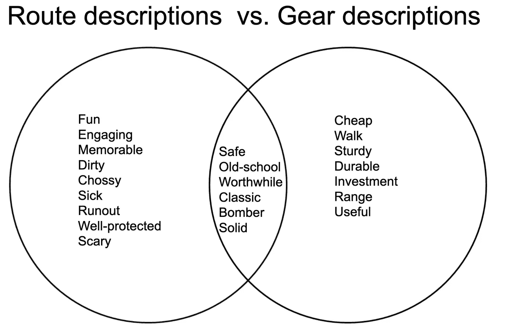
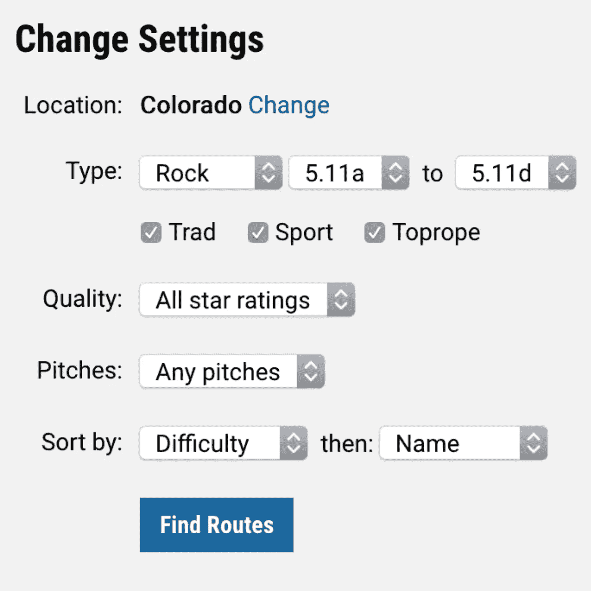
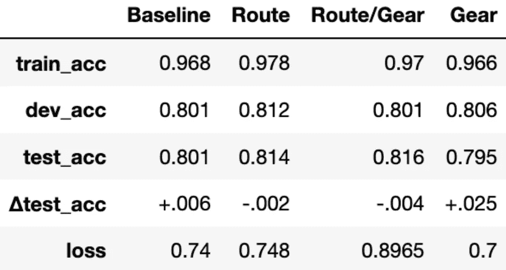
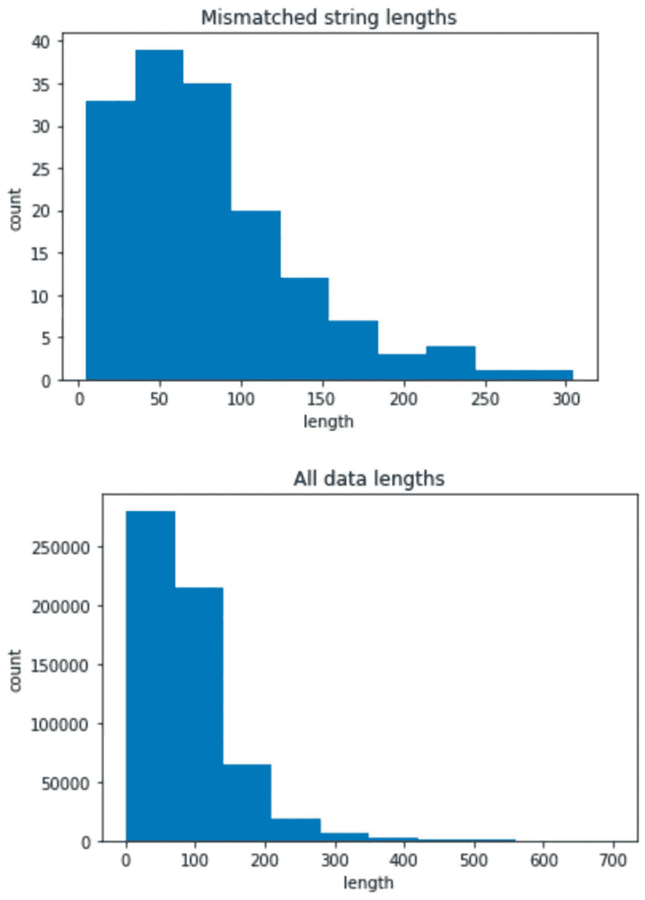
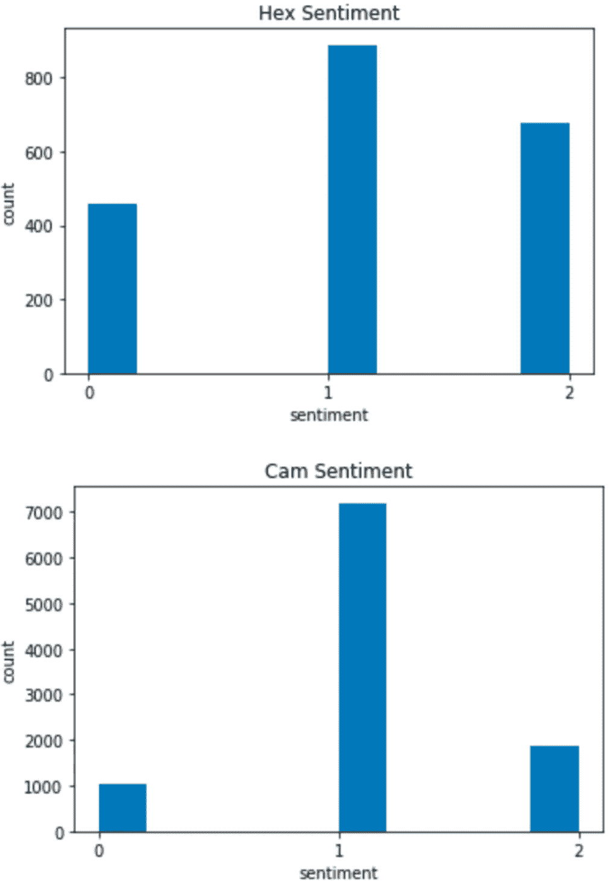
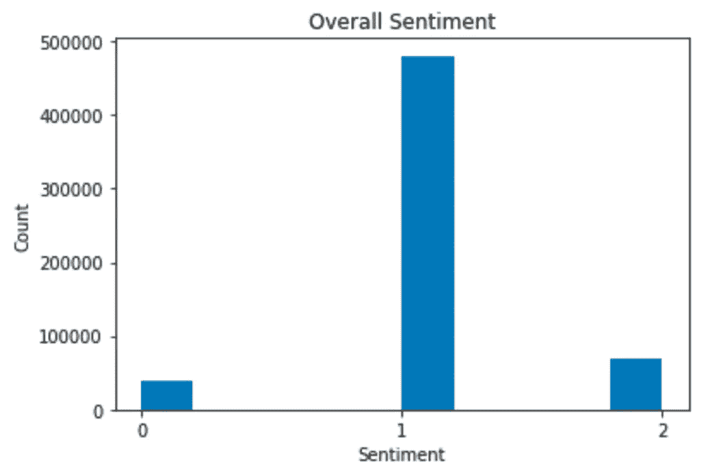
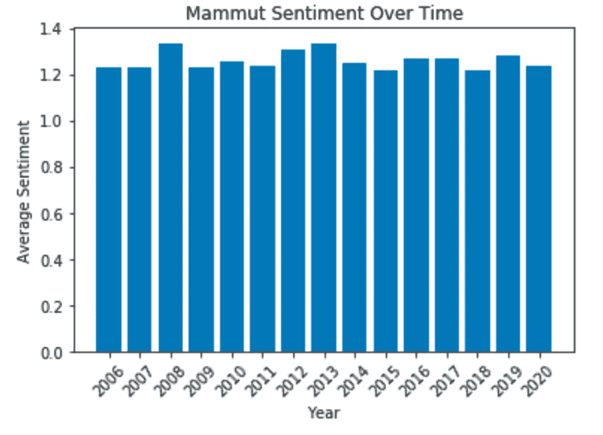
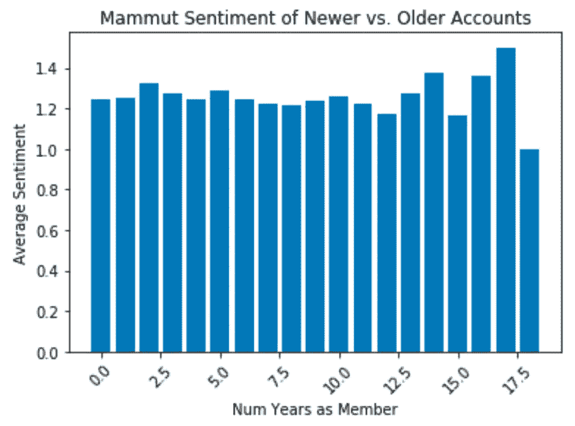

# 使用 Keras 和 DistilBERT 的迁移学习示例，带代码

> 原文：<https://medium.com/mlearning-ai/transfer-learning-example-using-keras-and-distilbert-with-code-e6e725f1fc2d?source=collection_archive---------2----------------------->

**简介**

本文介绍了一个使用 DistilBERT 和迁移学习进行情感分析的例子。本文首先设定一个目标，制定一个计划，并在进行模型训练之前收集数据，最后对结果进行一些分析。这个想法是从始至终跟踪这个项目，以便说明整个数据科学过程。正如许多数据科学家所知，机器学习大约 10%是实际的机器学习，90%是其他的。我希望对我的项目的深入描述能够说明这一点。我还想提供一个使用 Keras 和 DistilBERT 进行自然语言处理的迁移学习的深入示例，并附有代码，供希望开始这一领域的人使用。

**本项目的目标**

当我不清理数据、不分析数据、不学习数据、不做数据白日梦时，我喜欢把时间花在攀岩上。对我来说幸运的是，有一个很棒的网站叫做 MountainProject.com，这是一个登山者的在线资源。Mountain Project 的主要目的是作为一个在线指南，其中每条攀登路线都有描述，以及关于攀登质量、难度和类型的信息。还有一些论坛，攀岩者可以在那里提问，学习新技术，寻找伙伴，吹嘘最近的攀岩冒险，并复习攀岩装备。

当我试图决定下一步想买什么样的装备时，攀岩装备评论对我来说真的很有帮助。我想到，攀岩装备公司可能想知道攀岩者如何看待他们的品牌，或者他们制造的某件特定的装备。于是，这个项目诞生了。

这个项目的目标是给 gear 评论论坛的情绪贴上积极、消极或中立的标签。问题是:“攀岩者对不同种类的攀岩装备有什么感觉？”更广泛地说，这个项目的目标是创建一个模型，可以使用有限的训练数据来标记利基社区中在线论坛的情绪。虽然这个项目是集中在攀岩社区，这里描述的方法也可以很容易地用于其他领域。这对于给定社区中想要了解最佳技术和购买最佳装备的参与者来说可能是有用的。这对为该行业提供产品的公司也是有用的；对于这些公司来说，了解用户对其产品的感受，以及参与者在对产品做出正面或负面评论时使用的关键词将会非常有用。

**计划**

对我来说不幸的是，山地项目齿轮审查论坛没有标签。论坛是思想和观点的集合，但是没有与之相关的数值。我的意思是，我可以写下我对一件装备的看法，但我不会给它一个星级。这消除了直接监督学习的可能性。(是的，当然，我可以去手工标记 100k+的论坛，但是这有什么意思呢？哪儿也不去，听起来很糟糕。)

进入迁移学习。迁移学习是指在一项任务上训练的模型被用于类似的任务。在这种情况下，我有一个未标记的数据集，我想给它分配标签。因此，我需要创建一个模型，该模型被训练来预测已标记数据集上的标签，然后使用该模型为我的未标记论坛数据集创建标签。

因为这个模型将需要分析自然语言，所以我需要我的模型首先理解语言。这就是我使用蒸馏模型原因。关于 DistilBERT 如何工作的细节超出了本文的范围，但是可以在[对 BERT](https://arxiv.org/abs/1810.04805) 的描述和[对 DistilBERT](/huggingface/distilbert-8cf3380435b5) 的描述中找到。简而言之，DistilBERT 是一个预训练的 LSTM 模型，它懂英语。加载 DistilBERT 模型后，可以在更具体的数据集上对其进行微调。在这种情况下，我想调整 DistilBERT，以便它可以准确地标记攀登齿轮论坛。

因此，将有两个学习的转移；首先，DistilBERT 中包含的知识将被转移到我的标记数据集。然后，我会训练这个模型来标注数据的情绪。第二，我将这个模型转移到我的未标记论坛数据集。这将允许我的模型标记数据集。在论坛数据集被标上积极、消极或中性情绪后，我可以分析登山者对不同类型攀岩装备的看法。

**数据**

你的初始任务越接近最终任务，迁移学习就越有效。所以，我需要找到一个与攀岩和攀岩装备相关的标注数据集。我的搜索把我带到了两个地方。首先，去 Trailspace.com。Trailspace 是一个户外爱好者可以写关于他们装备的评论的网站，并且(最重要的是)留下星级。这看起来很完美，但遗憾的是只有大约 1000 条关于攀岩装备的评论。

数据的缺乏让我想到了第二个带标签的数据集:山区路线项目。每条路线都有描述和星级评定，网站上有大约 116，000 条路线。这是大量的数据，但这些数据并不是我所需要的，因为登山者谈论路线的方式不同于登山者谈论装备的方式。比如我不会用“好玩”来形容 gear，也不会用“有用”来形容一条路线。



尽管如此，我认为根据路线数据进行训练总比什么都没有好，因为登山者谈论任何事情的方式都有一些重叠，而且方言非常独特，有很多俚语。例如，如果我把一条路线描述为“带着轰炸机装备的恶心攀登”，那么这个攀登就是高质量的。希望我的模型将学习这种独特的攀爬词汇，并在需要给它们贴标签的时候应用到 gear 评论论坛上。

**第一步:抓取数据**

我的计划已经制定好了，现在是时候实际收集一些数据了。为此，我需要为 Mountain Project 和 Trailspace 创建一个 web scraper。在开始这个项目之前，我不知道如何做任何类型的网络抓取。所以，我看了[这个](https://www.youtube.com/watch?v=XQgXKtPSzUI&t=831s)非常有用的 YouTube 视频，它是关于使用 BeautifulSoup 在 Python 中进行网络抓取的。对我来说幸运的是，Trailspace 和山地项目论坛都很容易刮。例如，Trailspace 抓取的代码如下:

```
from urllib.request import urlopen as uReq
from bs4 import BeautifulSoup as soup
import os
import time%%capture
from tqdm import tqdm_notebook as tqdm
tqdm().pandas()# Manually gather list of main page URLs
all_urls = ["https://www.trailspace.com/gear/mountaineering-boots/",
           "https://www.trailspace.com/gear/mountaineering-boots/?page=2",
           "https://www.trailspace.com/gear/mountaineering-boots/?page=3",
           "https://www.trailspace.com/gear/approach-shoes/",
           "https://www.trailspace.com/gear/approach-shoes/?page=2",
           "https://www.trailspace.com/gear/climbing-shoes/",
           "https://www.trailspace.com/gear/climbing-shoes/?page=2",
           "https://www.trailspace.com/gear/climbing-protection/",
           "https://www.trailspace.com/gear/ropes/",
           "https://www.trailspace.com/gear/carabiners-and-quickdraws/",
           "https://www.trailspace.com/gear/belay-rappel/",
           "https://www.trailspace.com/gear/ice-and-snow-gear/",
           "https://www.trailspace.com/gear/big-wall-aid-gear/",
           "https://www.trailspace.com/gear/harnesses/",
           "https://www.trailspace.com/gear/climbing-helmets/",
           "https://www.trailspace.com/gear/climbing-accessories/"]def get_gear_subpages(main_url): '''Function to grab all sub-URLs from main URL''' # Get HTML info
    uClient = uReq(main_url) # request the URL
    page_html = uClient.read() # Read the html
    uClient.close() # close the connection
    gear_soup = soup(page_html, "html.parser")

    item_urls = []
    items = gear_soup.findAll("a", {"class":"plProductSummaryGrid"})
    for a_tag in items:
        href = a_tag.attrs.get("href")
        if href == "" or href is None:
            continue
        else:
            item_urls.append("https://www.trailspace.com"+href)

    return item_urls# Get a lit of all sub-URLs
all_sub_urls = []
for main_url in tqdm(all_urls):
    all_sub_urls += get_gear_subpages(main_url)def get_gear_comments(gear_url): '''Function to extract all comments from each sub-URL'''
    # Get HTML info
    uClient = uReq(gear_url) # request the URL
    page_html = uClient.read() # Read the html
    uClient.close() # close the connection
    review_soup = soup(page_html, "html.parser")

    all_reviews = review_soup.find("div", {"id":"reviews"})

    review_dict = dict()

    try:
        for this_review in all_reviews.findAll("div", {"class": "reviewOuterContainer"}):
            # Get review rating
            try:
                rating = float(str(this_review.find_next('img').find_next("img")).split("rated ")[1].split(" of")[0])
            except:
                rating = float(str(this_review.find("img").find_next("img").find_next("img")).split("rated ")[1].split(" of")[0])
            # Get review text
            review_summary = this_review.find("div",{"class":"review summary"}).findAll("p")
            review_text = ""
            for blurb in review_summary:
                review_text += "   " + blurb.text.replace("\n", "   ").replace("\r", "   ")

            review_dict[review_text] = rating
    except:
        pass

    return review_dict# Extract information from all URLs and save to file:t0 = time.time()

filename = "trailspace_gear_reviews.csv"
f = open(filename, "w")
headers = "brand, model, rating, rating_text\n"
f.write(headers)

for url in tqdm(all_sub_urls):
    brand = url.split("/")[4]
    model = url.split("/")[5]
    info = get_gear_comments(url)
    for review in info.keys():
        rating_text = review.replace(",", "~")
        rating = info[review]

        f.write(brand  +","+ 
                model  +","+ 
                str(rating) +","+ 
                rating_text  + "\n")

f.close()
t1 = time.time()  
t1-t0
```

事实证明，这些路线更具挑战性。在山地项目上，路线按“区域>子区域>路线”排序。但有时会有多个分区，所以看起来是“区域>大分区>中分区>小分区>路线”。我的主要问题是迭代所有的路线，以确保我收集了所有路线的数据，即使它们不是统一组织的。



幸运的是，山区项目有另一种方式解决这个问题。在 Mountain Project 中，您可以搜索路线并按难度排序，然后按名称排序。然后，它会输出一个可爱的 csv 文件，其中包括搜索结果中每条路线的 URL。不幸的是，搜索最多只能搜索 1000 条路线，所以你不可能一次搜索到所有路线。我没有被这样一个小小的不便所吓倒，我煞费苦心地穿过每个区域和分区，一次抓取 1000 条路线，并将文件保存到我的计算机上，直到我在我的计算机上以单独的 csv 文件保存了所有 116，000 条路线。一旦我有了所有的 csv 文件，我就用下面的代码将它们组合起来:

```
import os
import glob
import pandas as pd
from progress.bar import Bar
import time
import tqdm# Combine CSVs that I got directly from Mountain Project
extension = 'csv'
all_filenames = [i for i in glob.glob('*.{}'.format(extension))]

#combine all files in the list
combined_csv = pd.concat([pd.read_csv(f) for f in all_filenames ])

#export to csv
combined_csv.to_csv( "all_routes.csv", index=False, encoding='utf-8-sig')
routes = pd.read_csv("all_routes.csv")
routes.drop_duplicates(subset = "URL", inplace = True)

# remove routes with no rating
routes = routes[routes["Avg Stars"]!= -1]
```

此时，我有一个很大的 csv 文件，其中包含 Mountain Project 上所有路线的 URL。现在，我需要迭代每个 URL 并抓取我需要的信息，然后将其添加回这个 csv。删除了空描述、非英文描述或少于 10 票**的路线。这将我的路由示例数量减少到大约 31，000 个。

```
def description_scrape(url_to_scrape, write = True):
    """Get description from route URL"""

    # Get HTML info
    uClient = uReq(url_to_scrape) # request the URL
    page_html = uClient.read() # Read the html
    uClient.close() # close the connection
    route_soup = soup(page_html, "html.parser")

    # Get route description headers
    heading_container = route_soup.findAll("h2", {"class":"mt-2"})
    heading_container[0].text.strip()
    headers = ""
    for h in range(len(heading_container)):
        headers += "&&&" + heading_container[h].text.strip()
    headers = headers.split("&&&")[1:]

    # Get route description text
    route_soup = soup(page_html, "html.parser")
    desc_container = route_soup.findAll("div", {"class":"fr-view"})
    words = ""
    for l in range(len(desc_container)):
        words += "&&&" + desc_container[l].text
    words = words.split("&&&")[1:]

    # Combine into dictionary
    route_dict = dict(zip(headers, words))

    # Add URL to dictionary
    route_dict["URL"] = url_to_scrape

    # Get number of votes on star rating and add to dictionary
    star_container = route_soup.find("span", id="route-star-avg")
    num_votes = int(star_container.span.span.text.strip().split("from")[1].split("\n")[0].replace(",", ""))
    route_dict["star_votes"] = num_votes

    if write == True:
        # Write to file:
        f.write(route_dict["URL"] +","+ 
                route_dict.setdefault("Description", "none listed").replace(",", "~") +","+
                route_dict.setdefault("Protection", "none listed").replace(",", "~") +","+
                str(route_dict["star_votes"]) + "\n")
    else:
        return route_dict# Get URLs from large route.csv file
all_route_urls = list(routes["URL"])# Open a new file
filename = "route_desc.csv"
f = open(filename, "w")
headers = "URL, desc, protection, num_votes\n"
f.write(headers)# Scrape all the routes
for route_url in tqdm(all_route_urls):
    description_scrape(route_url)
    time.sleep(.05)

t1 = time.time()
t1-t0

f.close()# Merge these dataframes:
merged = routes.merge(route_desc, on='URL')
merged.to_csv("all_routes_and_desc.csv", index=False)
df = pd.read_csv("all_routes_and_desc.csv")##### CLEANING STEPS ###### Drop column that shows my personal vote
df.drop(["Your Stars"], axis = 1, inplace=True)# Removes whitespace around column names
df_whole = df.rename(columns=lambda x: x.strip()) # Combine text columns and select needed columns
df_whole["words"] = df_whole["desc"] + " " + df_whole["protection"]
df = df_whole[["words", "num_votes", "Avg Stars"]]# Remove rows with no description
bad_df = df[df.words.apply(lambda x: len(str(x))<=5)]
new_df = df[~df.words.isin(bad_df.words)]
print(len(df), len(bad_df), len(new_df), len(df)-len(bad_df)==len(new_df))
df = new_df# Remove non-english entries... takes a few minutes...
from langdetect import detect
def is_english(x):
    try:
        return detect(x)
    except:
        return None

df["english"] = df['words'].apply(lambda x: is_english(x) == 'en')
df = df[df.english]
df = df[["words", "num_votes", "Avg Stars"]]# Now remove rows with less than 10 votes
few_votes = np.where(df.num_votes <= 9)[0]
for vote in few_votes:
    try:
        df.drop(vote, inplace = True)
    except:
        pass
df_small = df.drop(few_votes)
df = df_small# Save it
df.to_csv('data/words_and_stars_no_ninevotes.csv', index=False, header=True)
```

现在，我有三个数据集要处理:Trailspace.com 装备评论、山地项目路线和山地项目装备评论论坛。

gear 评论论坛的一个问题是，在同一个论坛帖子中，经常有关于多个 gear 的多种观点。所以，在一次天真的尝试中，我把论坛帖子分成句子，每当有句号的时候，我就把每个帖子分开。有很多原因说明这不是将文本拆分成句子的最佳方式，但我认为这对于这个项目来说已经足够好了。这将样本数量增加到大约 200，000 个。

**第二步:建立模型**

如果你已经做到了这一步，那就高兴吧，因为是时候进行一些真正的机器学习了！嗯，差不多是时候了。在开始构建模型之前，我需要某种度量来衡量我的模型的质量。这意味着我不得不承担手动标记一些论坛的可怕任务。我手动将论坛的 4000 个样本标记为正面(2)、负面(0)或中性(1)，以便我可以评估我的模型。这花了大约四个小时。

当然，我想为我的任务建立尽可能好的模型。我有两个数据集来帮助我创建这个模型。Trailspace 的数据很少，但更相关。路线数据很大，但相关性较低。哪个对我的模型帮助更大？或者，我应该使用两者的组合吗？重要的是，额外的数据是否比简单的蒸馏模型提供了更好的性能？

我决定对四种模型进行比较:

1.  只有蒸馏瓶的模型
2.  具有蒸馏物和路线信息的模型
3.  具有蒸馏和轨迹空间信息的模型
4.  一个带蒸馏瓶和两个数据集的模型

在每个蒸馏瓶的顶部是一个小的、相同的神经网络。这个网络在 4000 个带标签的论坛实例上进行训练，随机种子设置为 42，以防止数据分割方式的变化。较低的 DistilBERT 层被锁定，这意味着 DistilBERT 没有被论坛数据重新训练。通过保持网络的一致性，模型之间的唯一差异是 DistilBERT 被调整的数据集(或缺少数据集)。这将允许我断定哪个数据集在调整 DistilBERT 以预测论坛帖子标签方面做得最好，而不会引入来自不同类型模型的噪声或数据分割的变化。因为有三个类别(阳性、阴性和中性)，分类交叉熵被用作损失函数。

经过大量的试验和调整参数后，我发现训练 DistilBERT only 模型的最佳方法是下面的方法:

```
from transformers import pipeline
from transformers import AutoTokenizer, TFAutoModelForSequenceClassification
from transformers import DistilBertTokenizer, DistilBertModel, DistilBertConfig, TFAutoModelWithLMHead, TFAutoModel, AutoModel

from sklearn.model_selection import train_test_split

import tensorflow as tf

import pandas as pd
import numpy as np

classifier = pipeline('sentiment-analysis')

import random
random.seed(42)##### SET UP THE MODEL #####save_directory = "distilbert-base-uncased"
config = DistilBertConfig(dropout=0.2, attention_dropout=0.2)
config.output_hidden_states = False
transformer_model = TFAutoModel.from_pretrained(save_directory, from_pt=True, config = config)

input_ids_in = tf.keras.layers.Input(shape=(128,), name='input_token', dtype='int32')
input_masks_in = tf.keras.layers.Input(shape=(128,), name='masked_token', dtype='int32') # Build model that will go on top of DistilBERT
embedding_layer = transformer_model(input_ids_in, attention_mask=input_masks_in)[0]
X = tf.keras.layers.Bidirectional(tf.keras.layers.LSTM(50, return_sequences=True, dropout=0.1, recurrent_dropout=0.1))(embedding_layer)
X = tf.keras.layers.GlobalMaxPool1D()(X)
X = tf.keras.layers.Dense(50, activation='relu')(X)
X = tf.keras.layers.Dropout(0.2)(X)
X = tf.keras.layers.Dense(3, activation='sigmoid')(X)
tf.keras.layers.Softmax(axis=-1)
model = tf.keras.Model(inputs=[input_ids_in, input_masks_in], outputs = X)

for layer in model.layers[:3]:
    layer.trainable = False

model.compile(optimizer="Adam", loss=tf.keras.losses.CategoricalCrossentropy(), metrics=["acc"]) ##### LOAD THE TEST DATA #####df = pd.read_csv('data/labeled_forum_test.csv')
X_train, X_test, y_train, y_test = train_test_split(df["text"], df["sentiment"], test_size=0.20, random_state=42)# Create X values
tokenizer = AutoTokenizer.from_pretrained(save_directory)
X_train = tokenizer(
     list(X_train),
     padding=True,
     truncation=True,
     return_tensors="tf",
     max_length = 128
 )

X_test = tokenizer(
     list(X_test),
     padding=True,
     truncation=True,
     return_tensors="tf",
     max_length = 128
 )# Create Y values
y_train = pd.get_dummies(y_train)
y_test = pd.get_dummies(y_test)#### TRAIN THE MODEL ####history = model.fit([X_train["input_ids"],   X_train["attention_mask"]], 
          y_train, 
          batch_size=128, 
          epochs=8, 
          verbose=1, 
          validation_split=0.2)#### SAVE WEIGHTS FOR LATER ####model.save_weights('models/final_models/bert_only2/bert_only2')
```

上面的代码创建了基线模型，只有 DistilBERT。现在，我将使用保存到“data/words _ and _ stars _ no _ nine votes . CSV”中的数据来调优 DistilBERT。

```
from transformers import pipeline
from transformers import AutoTokenizer, TFAutoModelForSequenceClassification

from transformers import DistilBertTokenizer, DistilBertModel, DistilBertConfig, TFAutoModelWithLMHead, TFAutoModel, AutoModel

import tensorflow as tf
import numpy as np

classifier = pipeline('sentiment-analysis')##### LOAD DATA THAT WILL TUNE DISTILBERT #####
df = pd.read_csv('data/words_and_stars_no_ninevotes.csv')
df.replace(4,3.9999999) # prevents errors#### TUNE DISTILBERT #####
# normalize star values
df["norm_star"] = df["Avg Stars"]/2
df.head()

# drop null entries
print(len(np.where(pd.isnull(df["words"]))[0])) # 288 null entries
df.dropna(inplace = True)

model_name = "distilbert-base-uncased"
tf_model = TFAutoModelForSequenceClassification.from_pretrained(model_name)
tokenizer = DistilBertTokenizer.from_pretrained('distilbert-base-uncased')
model = DistilBertModel.from_pretrained('distilbert-base-uncased')

tf_batch = tokenizer(
     list(df["words"]),
     padding=True,
     truncation=True,
     return_tensors="tf"
 )

tf_outputs = tf_model(tf_batch, labels = tf.constant(list(df["norm_star"]), dtype=tf.float64))

loss = [list(df["norm_star"])[i]-float(tf_outputs[0][i]) for i in range(len(df))]
star_diff = (sum(loss)/1000)*4
star_diff

# Save the tuned DistilBERT so you can use it later
save_directory = "models/route_model"
tokenizer.save_pretrained(save_directory)
model.save_pretrained(save_directory)
```

从这里开始，创建一个以经过调优的 DistilBERT 为基础的模型的代码与用于创建 DistilBERT only 模型的代码是相同的，除了:

```
save_directory = "distilbert-base-uncased"
```

使用:

```
save_directory = "models/route_model"
```

经过实验和参数调整，四个模型的结果如下所示:



Δtest_acc refers to the change in accuracy before and after parameter tweaking

具有路线和齿轮数据的 DistilBERT 模型为三向分类提供了 81.6%的最佳测试精度，并将用于标注山地项目论坛。

**第三步:模型分析**

路线和档位模型提供了 81.6%的测试准确度。这就引出了一个问题:在另外的 18.4%发生了什么？会不会是帖子的长度导致了不准确？



对字符串长度的初步观察并没有显示不匹配字符串的长度与整个数据集的长度有很大不同，所以这不太可能是罪魁祸首。

接下来，我将错误标注的单词数与正确标注的单词数进行了对比，包括有无停用词。在每一个例子中，除了两个词“cam”和“hex”之外，计数看起来都很相似。带有这些词的帖子往往会被贴错标签。这些都是指一种攀岩装备，我认为它们因为不同的原因被贴错了标签。



Sentiment about hexes is quite controversial. Sentiment about cams are more often listed as neutral. Notice the difference in the number of examples; cams are far more popular than hexes.

Hexes 是“老派”设备，可以工作，但已经过时了。因此，人们不再真的购买它们，在论坛上有很多关于它们是否仍然有用的复杂感觉。当主题是 hexes 时，这可能混淆了分类情绪的模型。

当 gear 有大减价时，人们通常会在论坛上发布相关信息。当我标记数据时，如果帖子只是“网站上的摄像头有 25%的折扣”，我会将其标记为中性。相机很贵，经常打折，登山者需要很多，所以相机上的销售经常贴出来；所有这些帖子都被标为中立。关于哪种 cam 是最好的，也有很多争论，这可能导致句子有多种情绪，导致标签出来是中性的。此外，当推荐用于特定攀登的齿轮时，人们以中性的方式谈论凸轮。我认为这些事情导致我的模型相信凸轮几乎总是中立的。

总之，我的模型在以下情况下混淆了情绪:

1.  当有一个销售提到:*“25%的黑钻相机，市场上最好的”*真:2，标签:1
2.  当帖子与爬山没有直接关系:*“共和党不支持我们使用公共土地”*真:0，标签:1(我怀疑这是因为我的模型不是为此训练的)
3.  提到平行裂纹时:*“凸轮对平行裂纹有好处”*真:2，标号:0(我怀疑这是因为凸轮是唯一一种在平行裂纹中工作良好的齿轮。大多数帖子都说“三头肌很好，除非它是平行裂缝。”)
4.  当提到 hexes 时:*“Hexes 对你的第一个机架来说很好。”*真:2，标签:0

通过这个项目，我希望确定在分析利基在线论坛上的情绪时，一个大的、不太相关的数据集是否比一个小的、更相关的数据集更好。我的模型有最多的训练样本，表现最好。然而，不清楚这是因为更多的例子更相关，还是仅仅因为更多的例子。

我有额外的路线数据(投票数为 9 或更少的路线)。虽然我怀疑这个数据可能不太可靠，但在后续实验中可能会有用。我可以只根据不同大小的路线数据来训练模型，直到我收集了 116，700 个样本，然后进行比较。这将告诉我额外的准确性是否仅仅是由于更多的数据，或者小齿轮数据集的特异性是否有所帮助。

虽然不能断定包含更小但更相关的标记数据会改进模型，但可以断定更多的数据确实比更少的数据好，即使更大的数据集不太相关。这一点可以从纯齿轮模型和纯路线模型的比较中得到证明。然而，齿轮数据集的相关性可能会也可能不会改善最终模型；要得出这个结论，还需要进一步的实验。

**第四步:分析结果**

最后，是时候给论坛贴上标签了，这样我就可以对它们进行一些分析，看看登山者对装备的真实感受。

```
rom transformers import pipeline
from transformers import AutoTokenizer, TFAutoModelForSequenceClassification
from transformers import DistilBertTokenizer, DistilBertModel, DistilBertConfig, TFAutoModelWithLMHead, TFAutoModel, AutoModel
from transformers import PreTrainedModel

from sklearn.model_selection import train_test_split

import tensorflow as tf
import pandas as pd
import numpy as np
import matplotlib.pyplot as plt

classifier = pipeline('sentiment-analysis')

import random
random.seed(42)

%matplotlib inline#### RERUN YOUR MODEL #####save_directory = "models/route_model"
config = DistilBertConfig(dropout=0.2, attention_dropout=0.2)
config.output_hidden_states = False
transformer_model = TFAutoModel.from_pretrained(save_directory, from_pt=True, config = config)

input_ids_in = tf.keras.layers.Input(shape=(128,), name='input_token', dtype='int32')
input_masks_in = tf.keras.layers.Input(shape=(128,), name='masked_token', dtype='int32')# Build model that will go on top of DistilBERT
embedding_layer = transformer_model(input_ids_in, attention_mask=input_masks_in)[0]
X = tf.keras.layers.Bidirectional(tf.keras.layers.LSTM(50, return_sequences=True, dropout=0.1, recurrent_dropout=0.1))(embedding_layer)
X = tf.keras.layers.GlobalMaxPool1D()(X)
X = tf.keras.layers.Dense(50, activation='relu')(X)
X = tf.keras.layers.Dropout(0.2)(X)
X = tf.keras.layers.Dense(3, activation='sigmoid')(X)
tf.keras.layers.Softmax(axis=-1)
model = tf.keras.Model(inputs=[input_ids_in, input_masks_in], outputs = X)

for layer in model.layers[:3]:
    layer.trainable = False

model.compile(optimizer="Adam", loss=tf.keras.losses.CategoricalCrossentropy(), metrics=["acc"]) #### LOAD THE WEIGHTS THAT YOU TRAINED BEFORE AND PREP DATA #####model.load_weights('models/final_models/route_only2/route_only2')# read in data
df = pd.read_csv('data/all_forums.csv')# Create X values
tokenizer = AutoTokenizer.from_pretrained(save_directory)
X = tokenizer(
     list(df["text"]),
     padding=True,
     truncation=True,
     return_tensors="tf",
     max_length = 128
    )preds = model.predict([X["input_ids"], X["attention_mask"]]) #### ADD PREDICTIONS TO THE DATAFRAME ##### Start with the first 5000, then replace the first n rows of the df
# For some reason, the merge works better this way.# Add predicted labels to df
pred_labels = [np.argmax(preds[i], axis = 0) for i in range(len(preds))]
df_small = df.copy()

df_small = df_small[:5000] # remove in full set
df_small["pred_label"] = pred_labels[:5000] # add predicted labels
df_small["text"] = df_small["text"].str.strip().str.lower() # lower and strip whitespace

# remove empty rows
df_small['text'].replace('', np.nan, inplace=True)
df_small.dropna(subset=['text'], inplace=True)

#clean index mess
df_small.reset_index(inplace = True) 
df_small.drop(["index"], axis = 1, inplace = True)

# Get labeled dataframe
labeled_df = pd.read_csv("data/labeled_forum_test.csv")
labeled_df["text"] = labeled_df["text"].str.strip().str.lower()

# Now merge
new_df = df_small.merge(labeled_df, how = 'left', on = "text")
print(len(new_df))
print(len(new_df)-len(df_small))# Now get big DF and replace the first n rows
# Add predicted labels to df
pred_labels = [np.argmax(preds[i], axis = 0) for i in range(len(preds))]
full_df = df.copy()

full_df["pred_label"] = pred_labels # add predicted labels
full_df["text"] = full_df["text"].str.strip().str.lower() # lower and strip whitespace

# remove empty rows
full_df['text'].replace('', np.nan, inplace=True)
full_df.dropna(subset=['text'], inplace=True)

#clean index mess
full_df.reset_index(inplace = True) 
full_df.drop(["index"], axis = 1, inplace = True) ##### COMBINE THE DATAFRAMES AND SAVE ###### Combine df_small and full_df[len(new_df):]
df_full = new_df.append(full_df[len(new_df):])
df_full = df_full.rename(columns={"sentiment": "true_label"})
df_full.reset_index(inplace = True) 
df_full.drop(["index"], axis = 1, inplace = True)df_full.to_csv('data/full_forum_labeled.csv', index = False)
```

从这里可以做进一步的分析，具体看你想知道什么。下面是一些你下一步可以做什么的例子。我对 Mammut 有点挑剔，因为我刚刚根据一个山地项目的建议买了一个 Mammut 背包。

*   攀岩者对装备的评价大多是正面的、负面的还是中性的？

```
df = pd.read_csv('data/full_forum_labeled.csv')
plt.title("Overall Sentiment")
plt.ylabel('Count')
plt.xlabel('Sentiment')
plt.xticks([0,1,2])
plt.hist(df.pred_label)
```



It appears that most posts are neutral. This makes sense because climbers are often talking about sales, or recommending gear for a specific climb, both of which I labeled as neutral.

*   随着时间的推移，对 Mammut 的看法有所改变吗？

```
# Generate dataframe
mammut_df = df[df.text.str.contains("mammut").fillna(False)]
mammut_df["post_year"] = [mammut_df.post_date[i][-4:] for i in mammut_df.index]
mammut_grouped = mammut_df.groupby(["post_year"]).mean()# Create plot
plt.title("Mammut Sentiment Over Time")
plt.ylabel('Average Sentiment')
plt.xlabel('Year')
plt.xticks(rotation=45)
plt.bar(mammut_grouped.index, mammut_grouped.pred_label)
```



It appears that sentiment about Mammut has not changed much over time.

*   最近加入 Mountain Project 的登山者对 Mammut 的感受和很久以前加入的登山者有所不同吗？(帐龄被用来代表作为攀登者的年数；更有经验的攀岩者会有不同的偏好吗？)

```
# Generate dataframe
mammut_df = df[df.text.str.contains("mammut").fillna(False)]
mammut_df["post_year"] = [int(mammut_df.post_date[i][-4:]) for i in mammut_df.index]# Get join dates if available
join_year_list = []
for i in mammut_df.index:
    try:
        join_year_list.append(int(mammut_df.join_date[i][-4:]))
    except:
        join_year_list.append(-1000)# Add join year and years as memeber before posting columns, remove missing info
mammut_df["join_year"] = join_year_list
mammut_df["years_as_mem_before_posting"] = mammut_df["post_year"] - mammut_df["join_year"]
mammut_df = mammut_df[mammut_df['years_as_mem_before_posting'] < 900]# groupby
mammut_grouped = mammut_df.groupby(["years_as_mem_before_posting"]).mean()# Create plot
plt.title("Mammut Sentiment of Newer vs. Older Accounts")
plt.ylabel('Average Sentiment')
plt.xlabel('Num Years as Member')
plt.xticks(rotation=45)
plt.bar(mammut_grouped.index, mammut_grouped.pred_label)
```



This graph compares the age of the account to the average sentiment towards Mammut. There does not appear to be a trend but there is more variance in older accounts, so it is hard to say for sure.

*   上图中的差异是由于老客户的样本量较小造成的吗？

```
# Groupby
mammut_grouby_count = mammut_df.groupby(["years_as_mem_before_posting"]).count()# Create plot
plt.title("Count of Account Age that Mentions Mammut")
plt.ylabel('Count')
plt.xlabel('Num Years as Member')
plt.bar(mammut_grouby_count.index, mammut_grouby_count.join_year)
```


There are much fewer older accounts, which is why there is more variance in the graph above at the right end of the graph.

**结论**

在这篇文章中，我走过了一个完整的机器学习项目的步骤，包括设定目标，制定计划，收集数据，模型训练和分析，以及结果分析。具体来说，我以 MountainProject.com 为例，用代码演示了如何使用 DistilBERT 和迁移学习对未标记数据进行情感分析。虽然我无法断定一个更小、更相关的数据集比一个更大、更不相关的数据集更好(反之亦然)，但我仍然能够给攀岩装备论坛的情绪贴上标签，并从我在那里找到的结果中得出一些结论。

这个项目，所有的代码，还有一份报告，都可以在我的 [GitHub 账号](https://github.com/pdegner/DL_final_project)上找到。

所有这些数据集都被[发布在 Kaggle](https://www.kaggle.com/pdegner/mountain-project-rotues-and-forums?select=review_forum.csv) 上。

请随时在这里留下问题和评论，或者[在 LinkedIn](https://www.linkedin.com/in/patricia-degner/) 上给我发消息。

**感谢您的阅读！**

* *我用的是 DistilBERT 而不是 BERT，因为它更小，更容易在我的小型本地计算机上运行。虽然精确度不如 BERT，但我认为对于这个项目来说已经足够好了。将基本模型从 DistilBERT 更改为 BERT 是微不足道的，如果需要的话，会导致更高的精度，但也需要更大的计算能力。*

** *为什么评级较少的路由可能会提供不可靠的数据？*

*首先，评级越少的路由越容易出现离群值。路线星级完全是主观的，路线的享受程度可能取决于一些因素，如攀登者的力量或高度，人们尝试时的天气如何，以前攀登的路线与这条路线相比如何，等等。在任何路线上，一个人可能认为它很糟糕，而另一个人却喜欢它。因此，随着越来越多的人投票，平均星级变得更加可靠。*

*其次，第一次登高聚会通常会抬高路线的等级，因为建造路线在时间和金钱上都很昂贵。攀岩运动中每个螺栓的成本为 5-10 美元，所以一个有 10-12 个螺栓的标准运动攀岩项目的成本大约为 100 美元，由攀岩者个人支付。每个螺栓可能需要十五分钟到一个小时来放置，每条路线总共需要三至十个小时。没有螺栓传统攀登仍然是一笔大投资；传统攀岩者将承担更大的风险，因为他们不知道安全完成攀岩需要什么装备。寻找潜在的新路线，然后清除路线上的松散岩石、泥土和其他碎片也需要时间。获得在私人或公共土地上攀岩的许可可能会有法律问题。所有这些问题使得路由建立成为非常耗时的过程。对第一个登山队的奖励是他们在指南和登山计划中的名字，他们可以命名路线。然而，许多第一次攀登的人希望其他人也能爬上他们花了这么多心血的路线。因此，第一次登山聚会有时会夸大登山项目的星级，以吸引更多的登山者来尝试。*

另一方面，有时候当地小社区的攀岩者不希望他们的小岩壁上挤满了被众多高星级攀岩吸引的人群。在这种情况下，登山者可能会将好的路线标记为非常差的路线，以吓跑大量的登山者。

*最后，还有许多“关闭的项目”列在山地项目上。这意味着攀登已经被发现，获得了攀登的许可，并且已经被清洁和栓住(如果有栓住的话)，但是攀登在技术上是非常困难的，并且投入工作来建立它的人还不能攀登它而不跌倒。允许创建者先攀登并命名路线是一种常见的礼貌，因此这些攀登不会有任何攀登，并将有不可靠的星级评定。*