# 迁移学习

> 原文：<https://medium.com/mlearning-ai/transfer-learning-fad115392f3a?source=collection_archive---------2----------------------->

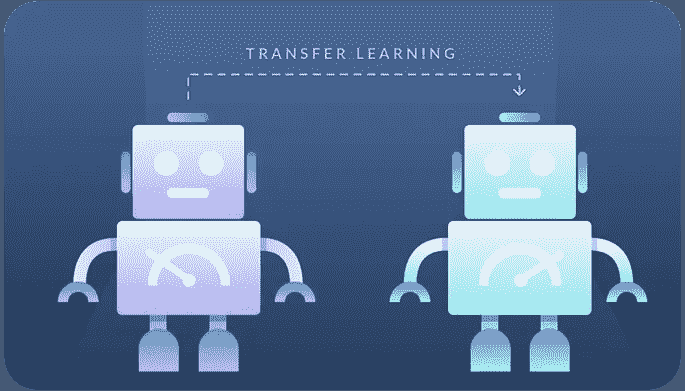

**1。摘要**

人类在应用任务之间的知识转移方面是完美的。这意味着，每当我们面对一个新的问题或任务时，我们理解它，并应用我们以前学习经验中的相关知识，并相应地解决它。遵循同样的方法，在机器学习领域引入了一个术语，**迁移学习**。迁移学习是指将已经训练好的机器学习模型的知识应用于不同但相关的问题。迁移学习已经成为图像分类和自然语言处理领域的研究热点。

文章定义了迁移学习，为什么迁移学习的使用突然兴起，以及它与传统学习有何不同。本文将探讨迁移学习是如何实施的，何时使用迁移学习，可用的不同类型的迁移学习，以及专家对迁移学习方法的看法。本文讨论了不同的迁移学习应用和一些流行的预训练模型，如 Inception-v3、ResNet、VGG 等。

**2。简介**

迁移学习是一种学习类型，它侧重于存储在解决一个问题时获得的知识，并将其应用于另一个不同但相关的问题[1]。总体思路是使用从大量可用的带标签训练数据中学习到的模型，并将其放入一个没有太多数据的新任务中。我们不是从零开始学习处理，而是从解决一个相关的差事中学到设计。迁移学习并不是真正的机器学习技术，但可以被视为该领域内的一种“设计方法”。它也不是机器学习的专有部分或研究领域。[2]从各方面考虑，它与需要大量数据和计算能力的神经系统结合起来，最终变得非常普遍。

**3。** **传统机器学习 V/S 迁移学习**

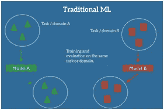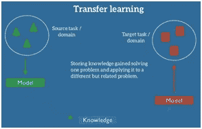

Traditional ML Approach vs Transfer Learning Approach

**4。为什么使用迁移学习**

**4.1 迁移学习的好处**

1.**更好的初始模型** :-机器学习需要你在没有先验知识的情况下创建模型。转移培训提供了最好的起点；即使不训练，也能完成一定级别的任务。

2.**更高的学习率**:迁移学习在训练时提供了更高的学习率，因为问题已经被训练过类似的任务。

3.**培训后更高的准确性**:迁移学习起点更高，学习速度更快，提供了一种可用于过渡到更高水平的熟练程度并产生更准确结果的模式。

4.**更快的训练**:训练可以比传统的训练方法更快的达到预期的表现，因为它使用了之前训练过的模型。

5.**需要更少的数据** :-一个已经在一个任务上被训练过的模型，该任务的标记训练数据是丰富的，将能够用少得多的数据处理一个新的但相似的任务

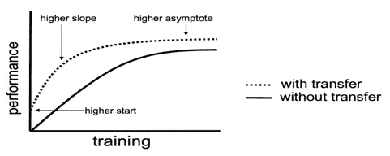

Performance with/without Transfer Learning

**4.2 迁移学习的局限性**

1.  负迁移风险
2.  有时会导致模型过度拟合
3.  确保初始模型的问题与目标模型的问题相对相似，否则，它可能无法工作

**5。迁移学习是如何实现的**

迁移学习有多种方式和应用。利用这一策略的最重要的理论步骤是

1.**识别预训练模型**

该步骤有助于识别已经预训练的模型，该模型尽可能接近目标模型。预训练的卷积神经网络是计算机视觉应用中迁移学习的理想模型。

2.**找到传递知识的方法**

以下步骤识别如何使用预训练模型来共享关于目标数据集的知识。这主要包括找到一种方法来解释由目标模型可以学习的预训练模型编码的“知识”。在计算机视觉应用中，通常可以通过最后一个卷积层的输出来表示关于数据集的知识。

3.**训练目标模型**

最终步骤包括利用预训练模型提供的“知识”来有效地训练目标模型。这是最简单的部分，因为它只涉及使目标模型适应新数据集。

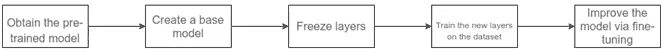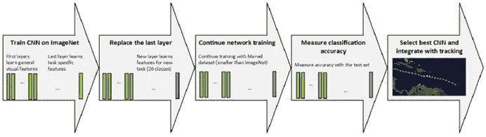

**6。** **何时使用迁移学习**

1.  **没有足够的数据**

在某些情况下，数据科学家可能没有足够的数据来训练他们的机器学习模型。数据处理不足会导致性能不佳，使用预先训练的模型可以帮助数据科学家创建更好的模型。

2.没有足够的资源

假设我们有一个庞大的数据集，我们可能没有资源在这么大的数据集上训练你的模型。所以，当我们没有计算资源用大数据集训练一个模型的时候，迁移学习就有意义了。

3.**没有足够的时间训练**

即使你有计算资源，你也必须等待数天或数周来训练这样的模型。通过使用预先训练的模型，您可以节省宝贵的时间。

7。转移学习类型

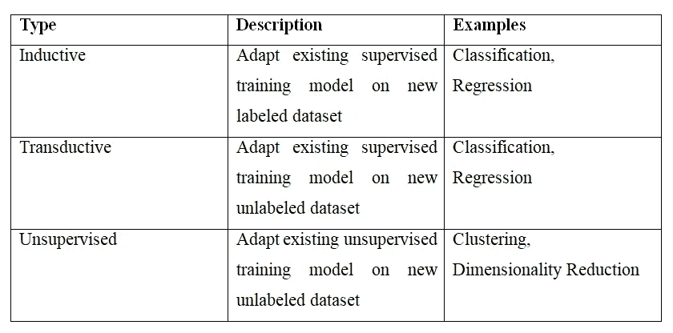

Different Types of Transfer Learning with description

8。 **专家对迁移学习方法论的看法**

**i)** **吴恩达(**deep learning . ai 创始人，百度首席科学家，斯坦福大学教授)

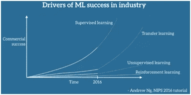

Drivers of ML industrial success according to Andrew Ng

根据吴恩达(NIPS 2016)，“迁移学习将是机器学习成功的下一个驱动力”[3]

**ii)** **戴密斯·哈萨比斯** (CEO DeepMind)

根据 DeepMind 首席执行官戴密斯·哈萨比斯的说法，迁移学习也是最有前途的方法之一，有一天可能会导致通用人工智能(AGI)的发展。

他说，“我认为迁移学习是一般智力的关键。我认为进行迁移学习的关键是获得概念性知识，这些知识是从你从哪里学到的感性细节中抽象出来的。[4]

**9。** **迁移学习的应用**

1.  **图像识别:-** 迁移学习可用于各种图像识别任务。例如，可以使用狗识别模型来识别猫。
2.  **自然语言处理(NLP):** - NLP 是最流行的迁移学习应用之一。例如，先前训练的可以理解语言结构的 AI 模型的知识可以转移到另一个模型，该模型旨在根据先前的句子预测序列中的下一个单词。
3.  **语音识别** :-为英语语音识别开发的人工智能模型可以作为德语语音识别模型的基础。
4.  **自动驾驶:-** 经过自动驾驶训练的车型可以用于自动驾驶卡车。迁移训练也可以用来识别不同类型的物体。例如，可以识别道路上其他车辆的模型可以用于识别自动驾驶中的摩托车或公交车。
5.  **博弈:-** 在围棋过程中制定策略的模型可以应用于国际象棋。比如 AlphaGo 知识可以转移到其他游戏中，而不是浪费时间从零开始创建新的模型。

10。迁移学习的流行预训练模型[5]

**VGG-19**

卷积神经网络。

接受过 ImageNet 数据库培训(> 100 万张图像)

分类多达 1000 个对象。

图像尺寸为 224x224 像素

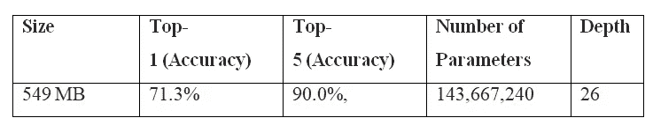

Details of VGG model

**b . InceptionV3(Google lenet)**

卷积神经网络。(由谷歌打造)

接受过 ImageNet 数据库培训(> 100 万张图像)

分类多达 1000 个对象。

图像尺寸为 299x299 像素

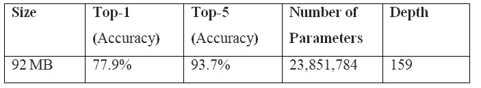

Details of InceptionV3 model

**c. ResNet50(残余网络)**

卷积神经网络(由微软构建)

接受过 ImageNet 数据库培训(> 100 万张图像)

分类多达 1000 个对象。

图像尺寸为 224x224 像素

ResNet 通过更新的版本进行了自我改进

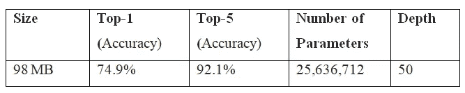

Details of ResNet50 model

**d. EfficientNet**

卷积神经网络。(由谷歌打造)

接受过 ImageNet 数据库培训(> 100 万张图像)

分类多达 1000 个对象。

图像尺寸为 224x224 像素

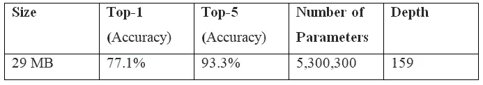

Details of EfficientNet model

**11。结论**

迁移学习是指将已经训练好的机器学习模型的知识应用于不同但相关的问题。迁移学习的使用突然出现，因为它有助于创建更好的初始模型，为模型提供更高的学习率，与传统的 ML 相比，模型在训练后具有更高的准确性，模型训练更快并且需要更少的数据。关于迁移学习的实现，首先确定一个预先训练好的模型，然后将知识从一个模型迁移到另一个模型，并训练目标模型。使用迁移学习的最佳时机是在没有足够的数据可用、缺乏资源、没有足够的时间来训练模型的时候。不同类型的迁移学习是可用的，如归纳，转导和无监督。有许多迁移学习应用，例如计算机视觉应用、NLP 应用、语音识别、自动驾驶、游戏等。一些最受欢迎的预训练模型是 VGG-19，Inceptionv3，ResNet50，EfficientNet。迁移学习在未来大有可为。甚至有人认为迁移学习将是发现通用人工智能或类人人工智能的关键。但能够积累学习并总结其所有领域知识的人工智能，即能够像人类一样学习的人工智能，可能是迈向存在于我们科幻小说和梦想中的 AI 的第一步。

**12。参考文献**

**①Radhakrishnan，Pranoy。“什么是迁移学习？，"*中*，2019-10-26。01-Aug-2021<https://towards data science . com/what-is-transfer-learning-8 B1 A0 fa 42 b 4>**

**[2]东格斯，尼克拉斯。“什么是迁移学习？探索流行的深度学习方法，*内置*。2021 年 8 月 1 日<https://builtin.com/data-science/transfer-learning>**

**[3]塞巴斯蒂安·鲁德，“迁移学习——机器学习的下一个前沿”，*塞巴斯蒂安·鲁德*，2020 年 6 月 15 日。https://ruder.io/transfer-learning/>**

**[4]吉米，哈菲兹。“迁移学习的工作原理”， *Medium* ，2020 年 10 月 26 日。01-Aug-2021<https://towards data science . com/how-transfer-learning-works-a 90 BC 4d 93 b 5 e>**

**[5]Yal on，Orhan G .，“4 种预训练的 CNN 模型，用于具有迁移学习的计算机视觉”， *Medium* ，2021 年 2 月 2 日。01-Aug-2021<https://towards data science . com/4-pre-trained-CNN-models-to-use-for-computer-vision-with-transfer-learning-885 cb1 B2 DFC>**