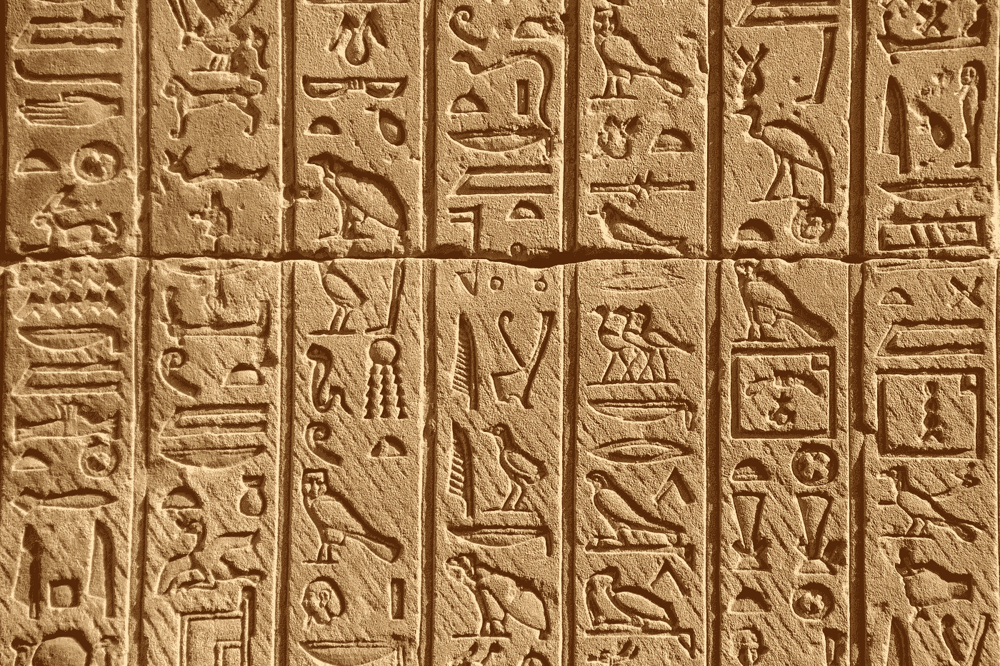
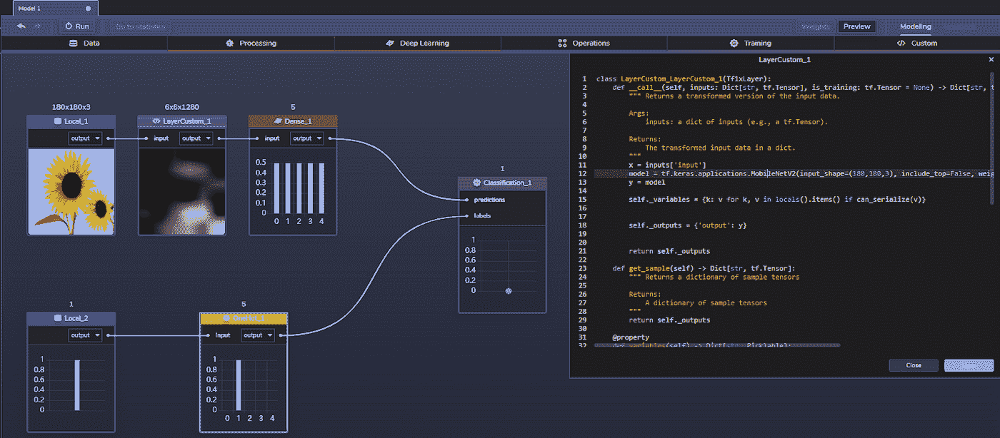

# 迁移学习第二部分:何时在图像处理中使用它们

> 原文：<https://medium.com/mlearning-ai/transfer-learning-part-ii-when-to-use-them-in-image-processing-6d36a788110?source=collection_archive---------5----------------------->

Hieroglyphics , Temple of Hathor, Dendera ([image source](https://unsplash.com/photos/wpxr-qSDQJM)).

目前使用迁移学习最流行的两个领域包括[计算机视觉](https://en.wikipedia.org/wiki/Computer_vision)和[自然语言处理](https://en.wikipedia.org/wiki/Natural_language_processing) ( [NLP](https://towardsdatascience.com/a-comprehensive-hands-on-guide-to-transfer-learning-with-real-world-applications-in-deep-learning-212bf3b2f27a) )，最近因 [GPT2](https://openai.com/blog/tags/gpt-2/) 和 [GPT3](https://arxiv.org/abs/2005.14165) 而出名。如果你需要复习迁移学习——一种在新数据上使用和重新训练现有机器学习(ML)模型而不是从头创建新模型的方法——请查看上个月的这篇博客，[不要从头开始你的模型——使用迁移学习](https://blog.perceptilabs.com/dont-start-your-model-from-scratch-use-transfer-learning/)。

在考虑迁移学习时，有三个重要问题需要回答:[**什么时候迁移，迁移什么，如何迁移**](https://towardsdatascience.com/a-comprehensive-hands-on-guide-to-transfer-learning-with-real-world-applications-in-deep-learning-212bf3b2f27a) 。到目前为止，我们已经讨论了转移什么以及如何转移，但是您应该何时转移呢？

在这篇博客中，我们将进一步探讨在计算机视觉中何时使用迁移学习是有意义的，并且我们将回顾一些成功使用迁移学习的用例。

# 何时使用迁移学习

在四种一般情况下，利用现有模型而不是创建新模型是有意义的。

## 修改和/或重新训练源和目标具有相似域的现有模型

第一个也是最明显的场景是，修改和/或重新训练一个现有的模型会比从头创建和训练它更快。或者当您不能或不想知道源模型如何做出预测的所有细节时，尤其是当源和目标域相同时。

考虑一个用例，重新训练一个现有的图像分类模型(*源*)，其*任务*是将不同类型汽车的图像分类为一个分类卡车的图像。您可以利用这个事实，即模型已经被训练来识别所有车辆共有的特征，例如车轮、轮胎、门等。(*域*)，通过选择保持(*冻结*)模型的一些或所有层不变，然后替换并重新训练分类器，以从一组新的训练数据中对卡车图像进行分类(*目标*)。

既然大部分工作涉及到对不同级别的车辆特征进行分类，为什么要重新发明轮子呢？在这个例子中，两个模型最终都对车辆图像进行分类，因此模型的大部分可能会被冻结。虽然源数据和目标数据(分别是汽车和卡车)属于同一个域(车辆)，但是这种方法当然也可以应用于不同的源和目标域。

## 将现有模型重新用于不同的领域

类似地，迁移学习对于重新利用现有模型(可能来自另一个领域)是有用的。当不存在模型来完成手头的任务，或者做得不够好，和/或不想从头开始时，您可能想要这样做。例如，假设您想要对特定异常(如肿瘤)的医学图像进行图像分割，但没有时间或资源从头开始创建和训练模型。您可以找到、修改和重新训练现有的医学图像分割模型(例如，针对不同异常(如骨折)进行训练的模型)来满足您的目的。

## 小型数据集

另一种情况是当目标数据集相对较小时。例如，如果描述罕见医疗状况的医学图像的标记数据样本很难获得，并且您只有一个小数据集，那么利用甚至构建已经在更大数据集上训练过的现有模型可能是有意义的，例如由另一位医学研究人员创建的模型。这是一个很好的例子，说明了 ML 社区如何利用迁移学习来共同解决问题，推进他们的研究，并分享他们的工作。事实上，在您更新模型之后，最初的创建者可能会利用您的工作，使用迁移学习来进一步增强模型！

## 相似的建筑

最后，当创建一个新模型会导致与现有模型相同或相似的架构时，您可能还会研究迁移学习。例如，图像分类、分割和对象检测模型可能非常复杂，但通常是使用常见的模型设计模式构建的，如 [U-Nets](https://docs.perceptilabs.com/perceptilabs/use-cases/using-a-u-net-to-enhance-dark-photos) 、 [ResNets](https://docs.perceptilabs.com/perceptilabs/use-cases/using-a-resnet-to-detect-anomalies-in-textiles) 、[CNN](https://docs.perceptilabs.com/perceptilabs/tutorials/convolution-tutorial)等。因此，如果您最终要重新创建相同的拓扑，为什么不从现有的、经过验证的模型开始呢？即使架构需要改变并且源域完全不同，大多数层也可能被重用，即使其中的大部分需要解冻(例如，处理新的域)。

Ravishankar 等人在他们的论文[理解医学图像的深度转移学习机制](https://arxiv.org/abs/1704.06040)中，展示了转移一个经过训练的模型来执行超声图像中描述的肾脏问题的图像分类如何能够优于最先进的特征工程管道。另一个有趣的案例研究在[VGG-19 和转移学习](https://towardsdatascience.com/tensorflow-and-vgg19-can-help-you-convert-your-photos-into-beautiful-pop-art-pieces-c1abe87e7e01)的 10 分钟神经风格转移中有所描述，其中 VGG-19 CNN 和[神经风格转移](https://www.tensorflow.org/tutorials/generative/style_transfer)被用作生成看起来像被画了的人的新图像的基础。

当我们谈到用例的话题时，请务必查看我们的 [ODSC 东部 2021](https://blog.perceptilabs.com/comparing-perceptilabs-to-pure-code-in-transfer-learning/) 博客，在那里我们将讨论即将到来的 ODSC 演示。在演示中，我们将使用迁移学习重新训练一个模型来分类一组显微镜图像(例如，用于医疗保健)。在这里，我们将采用用 ImageNet 权重训练的更一般化的 MobileNetV2(即，用更大的数据集训练的模型)，并将其重新用于更小、更专业的显微镜图像集。这也将绕过从头创建图像分类模型的需要。

# 实践中的迁移学习

由于大多数 ML 模型(例如，dnn)本质上是高度可配置的(例如，通过超参数),今天迁移学习的使用正在突飞猛进地增长。此外，现在有许多开源框架、模型和数据集可供免费利用。

查看 ImageNet，这是一个图像数据库，目前包含超过 1400 万张图像的 20，000 多种类别，并带有手写注释描述。自 2006 年以来的发展中，ImageNet 的建立是为了促进计算机视觉的研究和发展，许多 ML 从业者在训练他们的模型时使用这些数据来提供权重基线。

我们之前关于迁移学习的博客——见 YouTube 上的演示[这里](https://www.youtube.com/watch?v=bga46KBrJ_s)——展示了如何通过在 PerceptiLabs 中创建一个[定制](https://docs.perceptilabs.com/perceptilabs/references/components/custom)组件来利用现有的迁移学习模型，从而轻松利用这些资源。在这个例子中，我们使用了 Keras Applications 的 [MobileNetV2](https://www.tensorflow.org/api_docs/python/tf/keras/applications/MobileNetV2) 模型，预先加载了 ImageNet 的权重，但是还有无数其他模型可供选择。我们还展示了如何在 PerceptiLabs 中冻结模型以获得更好的可解释性，以及它的可视化特性如何提供对传输的模型如何转换数据以及最终如何在训练期间执行的洞察。

Screenshot of a model in PerceptiLabs being retrained (image source, [PerceptiLabs](http://www.perceptilabs.com)).

很快，我们将添加更多功能来支持迁移学习，包括我们即将推出的*模型中心*功能，在这里您可以创建模型并与 ML 社区共享，以用作新模型的基础。因此，请务必继续关注我们宣布的这一点，以及许多其他很酷的新功能。

# **结论**

迁移学习可以通过利用现有模型节省您的时间，特别是对于图像处理和计算机视觉用例。当开始一个 ML 项目时，在开始从头创建一个之前，一定要使用上面四个场景中的一个来分析是否有可能建立一个现有的模型。不要忘记利用所有这些可用的伟大的开源模型，以及像 ImageNet 和我们最近写的其他五大数据集。