# 使用 DenseNet201 进行迁移学习

> 原文：<https://medium.com/mlearning-ai/transfer-learning-using-densenet201-525749762ca9?source=collection_archive---------1----------------------->

## 使用 DenseNet-201 进行迁移学习

# 卷积神经网络(CNN)

*在深度学习中，一个* ***卷积神经网络*** *(CNN，或 ConvNet)是一类人工神经网络，最常用于分析视觉意象。* *它们在图像和视频识别、推荐系统、图像分类、图像分割、医学图像分析、自然语言处理、脑机接口和金融时间序列等方面都有应用。*

# 迁移学习

***迁移学习*** *是机器学习中的一个研究问题，专注于存储在解决一个问题时获得的知识，并将其应用于不同但相关的问题。*

例如，对一个会骑自行车的人来说，学习使用踏板车可能比不会骑自行车的人更容易、更快。在这些彼此相似的事件中，人在骑踏板车时使用保持平衡的能力，并且**在没有意识到的情况下转移学习**。

迁移学习是对解决问题时获得的信息进行存储，并在面对另一个问题时使用这些信息。使用迁移学习，通过使用先前的知识，可以获得在较少的训练数据下表现出更高成功和学习更快的模型。

迁移学习最好的一点是，我们可以使用部分训练好的模型，而不必训练整个模型。这样，我们就用迁移学习节省了时间。

# 密集卷积网络

**密集卷积网络** (DenseNet)以前馈方式将每一层与每一层连接起来。它们缓解了消失梯度问题，加强了特征传播，鼓励特征重用，并大大减少了参数的数量。

DenseNet 的工作理念是，如果卷积网络在靠近输入的层和靠近输出的层之间有更短的连接，那么它们可以更深入、更准确、更有效地进行训练。下图来自原始论文，给出了一个很好的比例可视化。

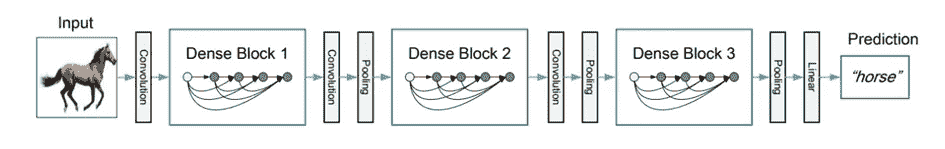

**Source:** [https://arxiv.org/pdf/1608.06993.pdf](https://arxiv.org/pdf/1608.06993.pdf)

***注:*** *DenseNet 进来了很多变种。我用的是 DenseNet-201，因为它是个小型号。如果你愿意，你可以尝试 DenseNet 的其他变种。*

我们开始吧！

# 使用迁移学习的模型训练

在本教程中，您将学习如何通过使用来自预训练网络的迁移学习来对 alien 和 predator 的图像进行分类。

预先训练的模型先前已经在数据集上训练过，并且包含表示它在其上训练的任何数据集的特征的权重和偏差。您可以直接使用预先训练的模型，也可以使用迁移学习来针对给定的任务定制该模型。我们将使用第二种方法。

让我们从目录开始。

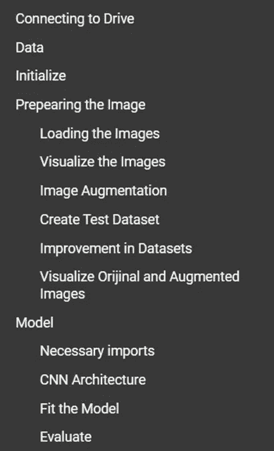

数据-下载数据集

初始化—导入库、指定文件路径、定义常量变量

预先准备图像-用各种方法为模型零件准备数据集

模型—建立模型并评估结果

## **连接到驱动器**

我们需要连接到驱动器，并转到代码文件所在的目录。

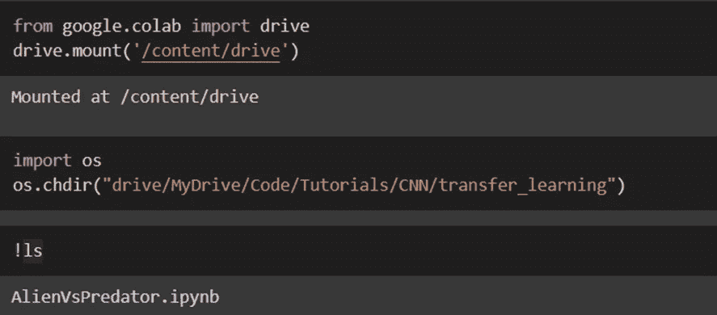

## **数据**

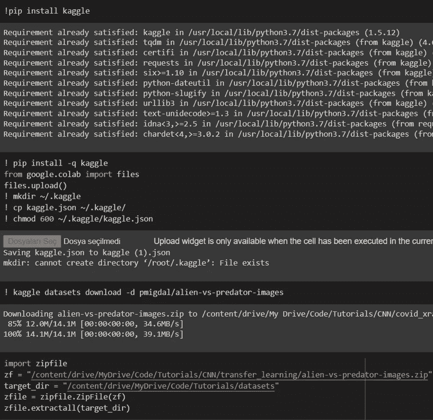

为了下载数据集，我们从 kaggle 帐户下载一个. json 文件，并指定下载文件的路径。

我们下载了数据集。

我们从。zip 文件。

**初始化**

让我们首先导入库。

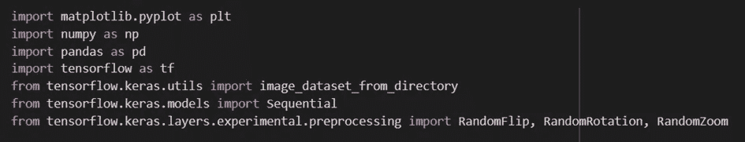

然后让我们定义训练和验证数据的路径。

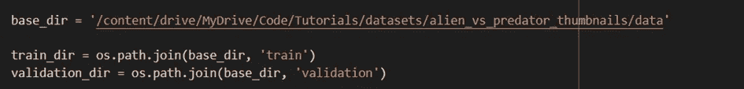

我们已经确定了批量大小和历元数。

DenseNet-201 模型架构要求图像大小为(224，224)。所以，让我们调整我们的图像。

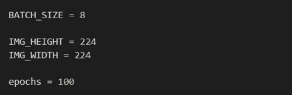

**准备图像**

**加载图像**

我们已经加载了训练和验证数据。因为我们的数据集中有 2 个类，所以我们将 label_mode 设为二进制。

我们在 train 文件夹中的两个单独的文件(外星人，掠夺者)中打印了图像的数量。

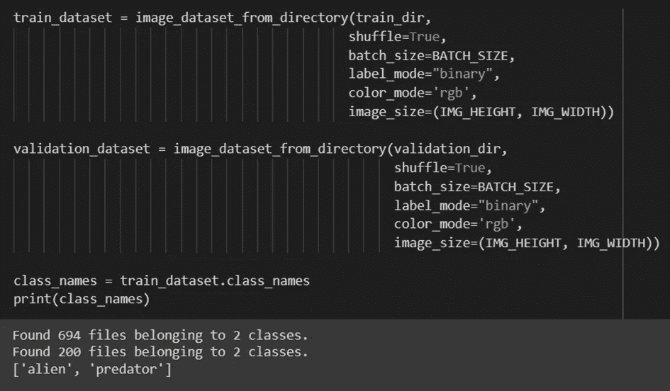

**可视化图像**

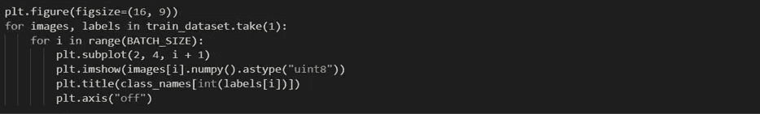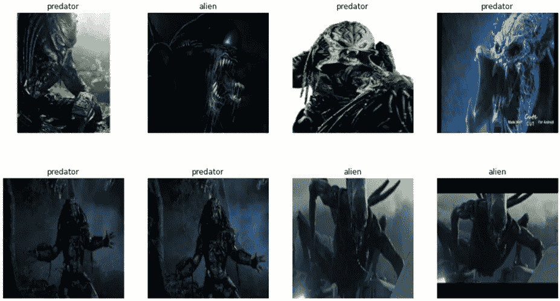

**图像增强**

通过数据扩充，我们增加了数据集中的图像数量。

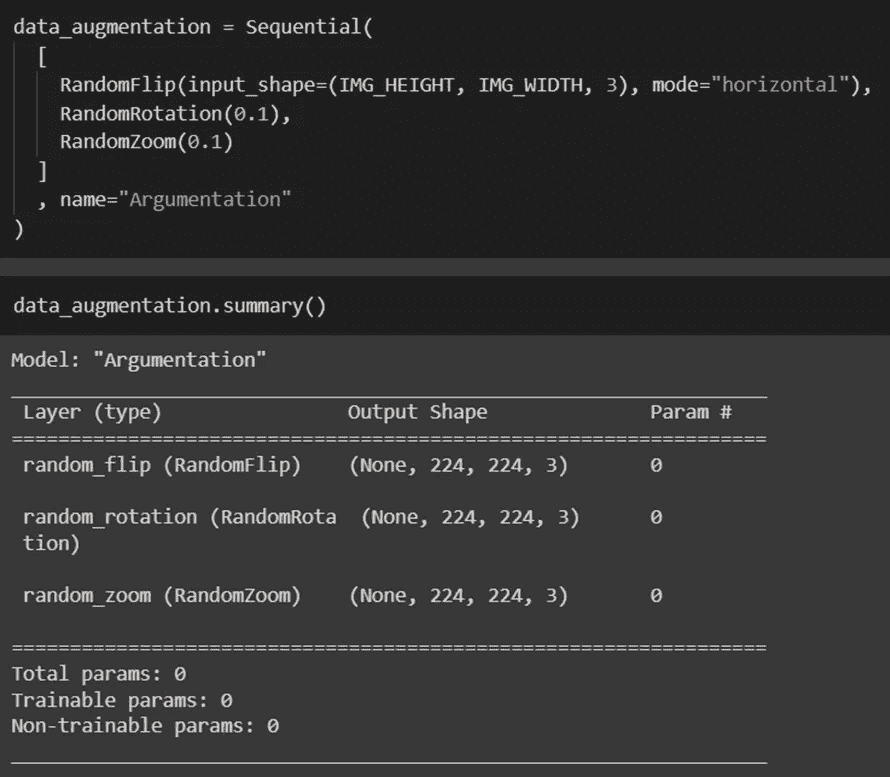

**创建测试数据集**

为了创建一个测试数据集，我们将 20%的验证数据移动到 test_dataset 变量中。

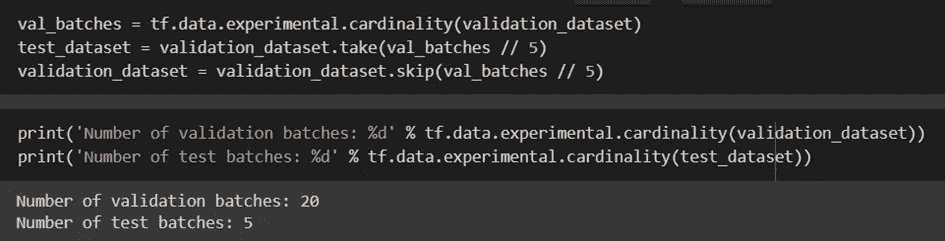

**数据集的改进**

我们缓存数据集以提高速度，并打乱图像以减少测试误差。通过这种方式，我们确保了通过同步读取列车时间来获得最大效率。

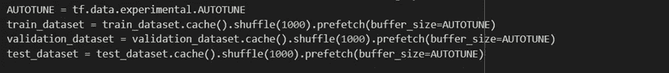

**可视化原始和增强图像**

让我们将它可视化，以便更好地理解增强图像是什么样子。

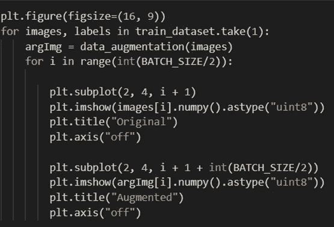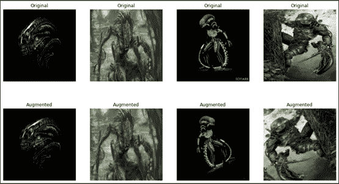

**型号**

**必要进口**

我们需要导入来创建模型的库。

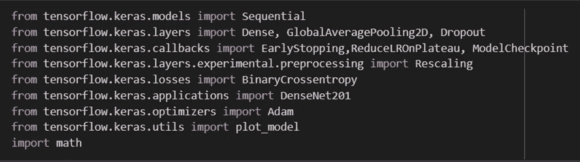

**CNN 架构**

Keras 中提供了 DenseNet 类来帮助轻松地进行迁移学习。我使用了带有 ImageNet 权重的 DenseNet-201 类。我们根据我们将在特征提取中使用的 DenseNet 模型重新调整了我们的数据集，并且通过添加我们人工创建的数据来创建我们的基础模型。

通过将我们创建的这个模型的可训练属性设置为 False，我们防止了不可训练层中的权重被更新。否则模型学的东西就毁了。

因为我使用这个模型只是为了提取特征，所以我没有在网络的顶部包括完全连接的层，而是指定了输入形状和池。我还添加了自己的池和密集层。

下面是使用预训练的 DenseNet-201 模型的代码。

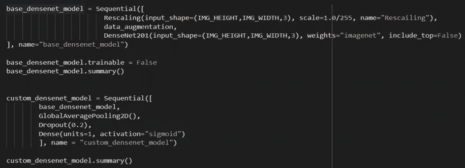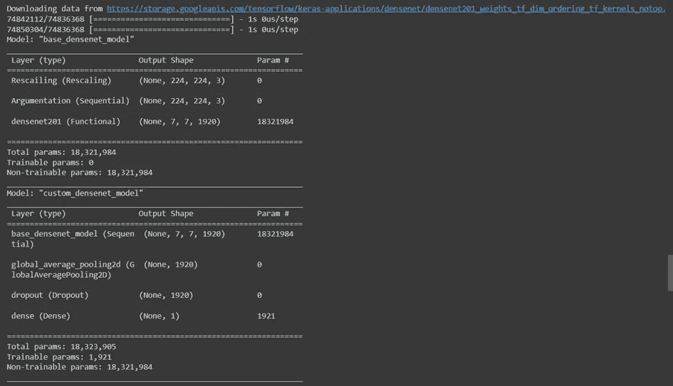

我的基本模型没有可训练参数，因为它的可训练属性为 False。在我们添加了密集部件的第二模型中有 1921 个可训练参数。

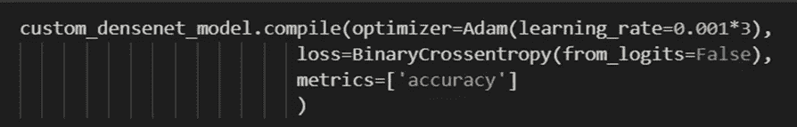

**拟合模型**

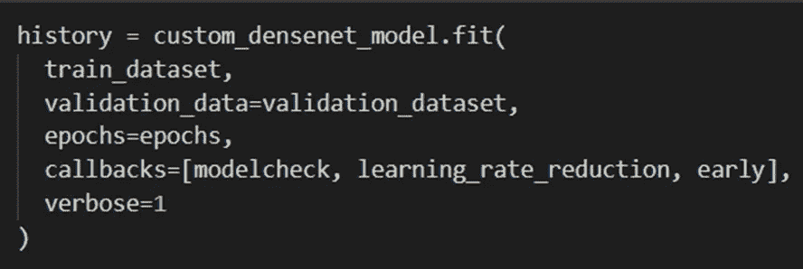

以下是训练的片段。

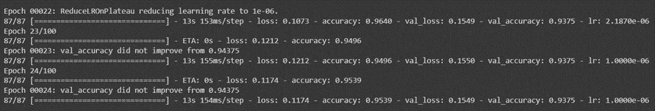

我们可以看到，该模型在第 24 个时期调整了学习率，我们在验证集上获得了 93.75%的最终验证准确度，这是非常好的。但是等等，我们也需要看看测试的准确性。

**评价**

让我们将损失和准确性与历元数进行对比。

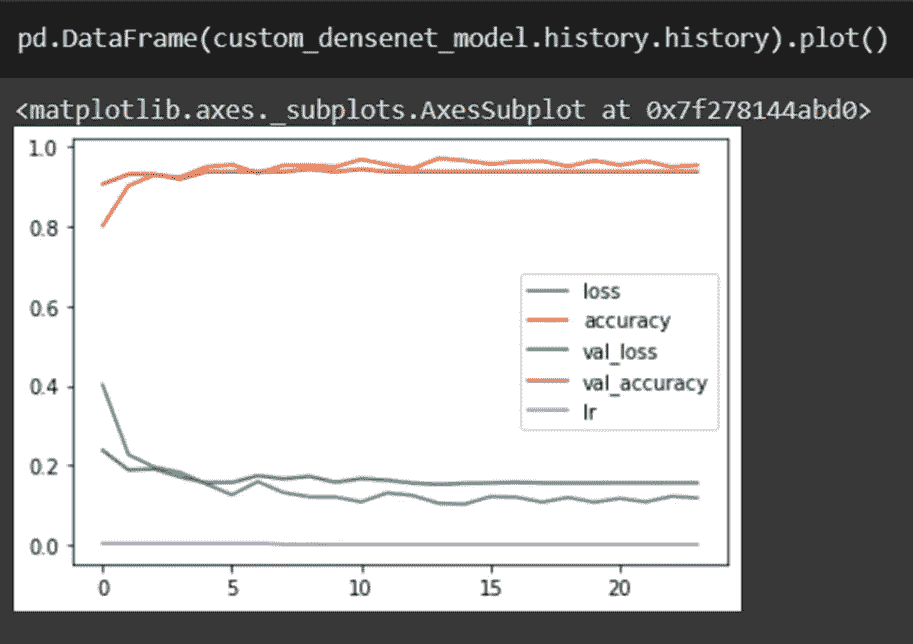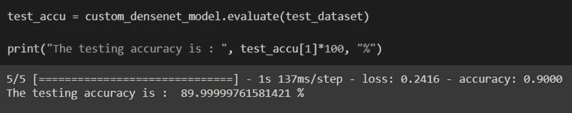

我们在测试数据集上获得了 89.99%的准确率。💃

**结果**

学习迁移是一种技术，用于使现有算法在更短的时间内用更少的数据实现更高的性能。虽然这种方法的积极方面很强，但在学习迁移方面也有需要考虑的情况。迁移学习只有在初始问题和目标问题足够相似以至于第一轮培训相关时才有效。在这种情况下，认为源数据和目标数据彼此非常不同，并且出现负迁移的问题。如果第一轮训练离题太远，模型实际上可能会比从未训练过的模型表现得更差。现在，对于什么类型的培训足够相关，或者如何衡量，仍然没有明确的标准。

深度学习就是实验。通过使用不同版本的 DenseNet-201 或使用完全不同的模型进行迁移学习，可以提高模型的性能。您还可以通过篡改超参数调整来对您的模型进行重大更改。

我希望这个博客能帮助你理解如何在 CNN 上进行迁移学习。请随意尝试更多以获得更好的性能。你可以在[这个链接](https://github.com/zeynep-aslan/DenseNet201_TransferLearning)找到源代码。

**参考:**

[这个](https://www.kaggle.com/cafelatte1/alien-and-predator-classification-beginner/notebook) Kaggle 笔记本让我有了用 DenseNet 做迁移学习的想法。

Quora 上的这篇文章引导我探索迁移学习的缺点。

[CNN](https://en.wikipedia.org/wiki/Convolutional_neural_network) 和[转自维基百科的学习](https://en.wikipedia.org/wiki/Transfer_learning)定义。

感谢大家阅读这篇文章。我希望它值得你花时间。请随时分享您的宝贵反馈或建议。

[领英](https://www.linkedin.com/in/zeynep-aslan/)

 [## Mlearning.ai 提交建议

### 如何成为 Mlearning.ai 上的作家

medium.com](/mlearning-ai/mlearning-ai-submission-suggestions-b51e2b130bfb) 

[成为作家](/mlearning-ai/mlearning-ai-submission-suggestions-b51e2b130bfb)