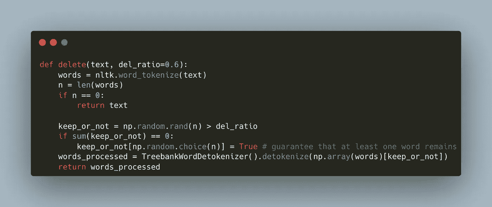
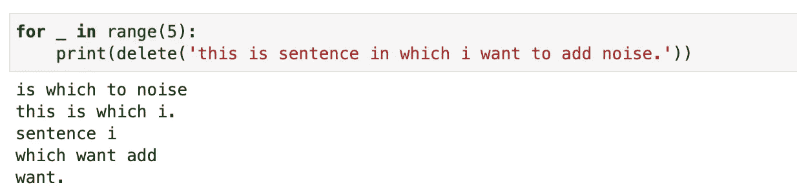
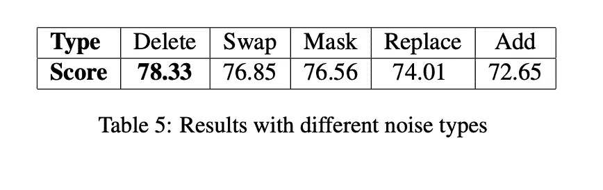
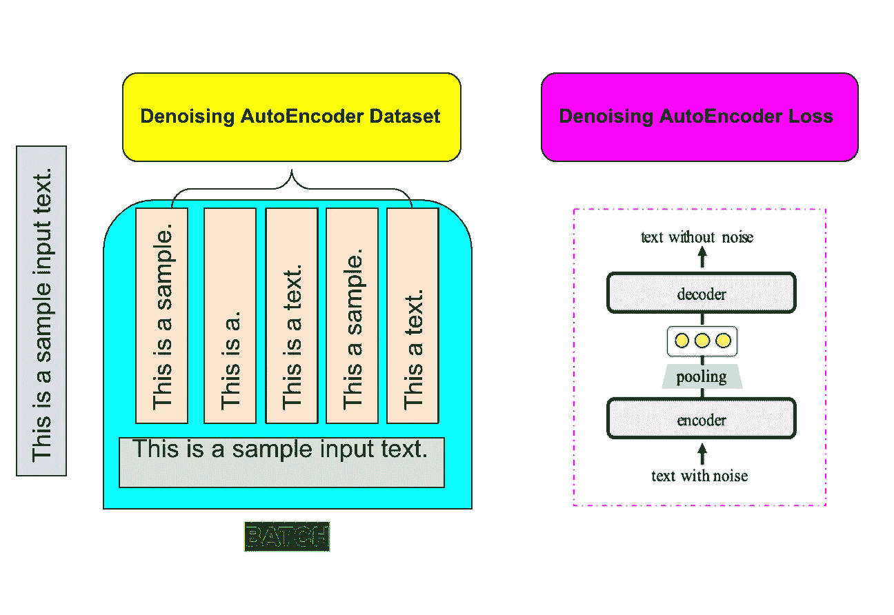
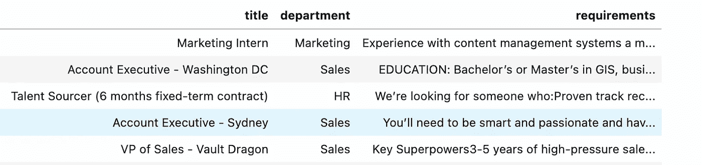
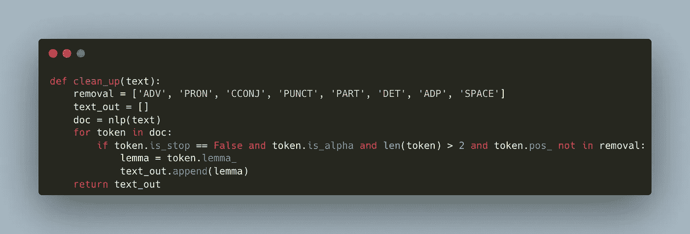
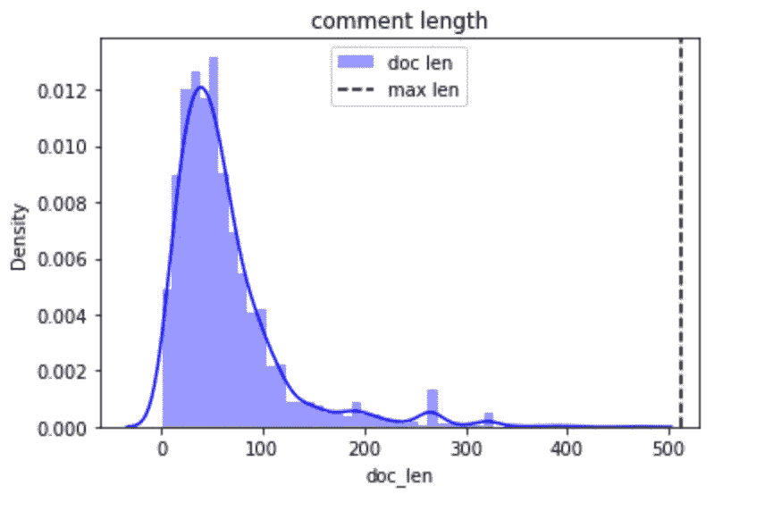
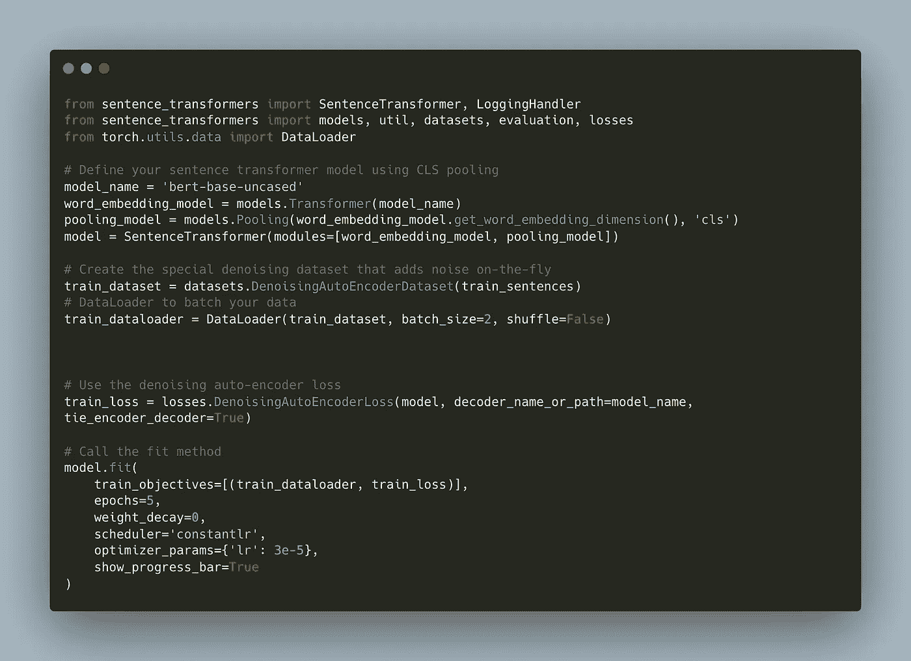
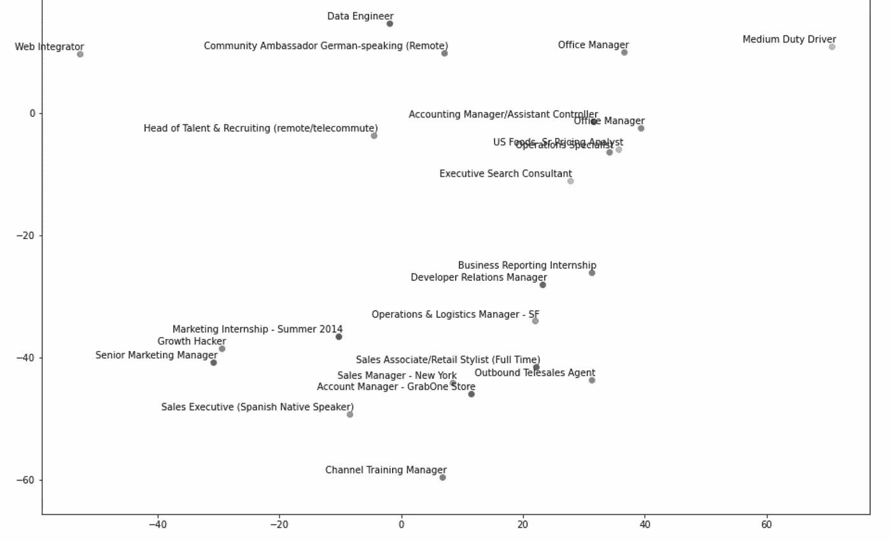
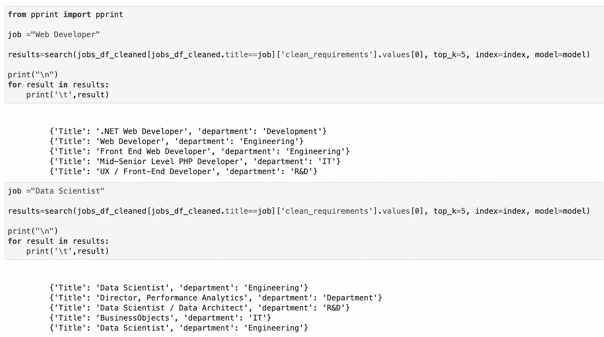

# 基于变压器的顺序去噪自动编码器:Job2Vec

> 原文：<https://medium.com/mlearning-ai/transformer-based-sequential-denoising-auto-encoder-job2vec-37093e713090?source=collection_archive---------0----------------------->

使用 TSDAE 将职位描述转换为求职向量

TSDAE 是一种用于句子嵌入的强领域适应和预训练方法，明显优于其他方法，如掩蔽语言模型。

TSDAE 通过在输入句子中添加某种类型的噪声(例如删除或交换单词)，将损坏的句子编码为固定大小的向量，然后将向量重建为原始输入，来训练句子嵌入。

*与 Vaswani 等人(2017)提出的原始 transformer 编码器-解码器设置的一个重要区别是解码器可用的信息:该解码器仅从编码器产生的固定大小的句子表示中解码。它不能从编码器访问所有上下文化的单词嵌入。这种修改引入了一个瓶颈，这将迫使编码器产生一个有意义的句子表示。*

# TSDAE 的 S-BERT 实现

它们在输入的文本中添加噪声，并删除文本中大约 60%的单词。编码器将该输入映射到固定大小的句子嵌入。然后，解码器试图重新创建没有噪声的原始文本。后来，编码器被用作句子嵌入方法。

在训练过程中，TSDAE 将受损句子编码成固定大小的向量，并要求解码器从这些句子嵌入中重建原始句子。为了良好的重建质量，语义必须在来自编码器的句子嵌入中被很好地捕获。稍后，在推理时，我们只使用编码器来创建句子嵌入。

# 他们是如何添加噪音的？

下面是处理噪音(删除)部分的神奇函数。

***tree bank detokenizer 使用与**tree bank tokenizer 的正则表达式相对应的反向正则表达式操作。***

Sample Output of Delete Function

## 但是为什么只删除呢？

From Research Paper

# 损失函数:DenoisingAutoEncoderLoss

这种损失期望作为输入的一批包括损坏的句子和相应的原始句子。

使用**denoisguatoencoderdataset**以如下格式构建批量数据: **texts=[noise_fn(sentence)，sentence]**

**: param 句子:**句子列表
**: param noise_fn:** 一个噪音函数:给定一个字符串，返回一个有噪音的字符串，例如删除的单词

下图会给你一个更好的直觉。我们现在不是屏蔽，而是去噪。

# 我们开始吧:Job2vec

*注意:这不是将作业转换为矢量的最佳方式。因为职务说明可以有多个实体，这些实体可以与不同的职务要求相关。理想情况下，应该有 NER 层来完成解决方案。但是这种解决方案对于很多用例来说都非常有效。*

我有以下工作要求的数据集，以及它们各自的头衔和部门。

我对需求文本做了基本的清理。下面是功能。

清理之后，文档长度分布如下所示

我们现在可以直接利用这个句子列表作为模型的输入。

经过 5 个时期的训练后，这是一些数据样本的嵌入结果。

不开心？

我尝试使用 faiss 索引嵌入，并通过寻找需求相似性来寻找工作。结果一开始看起来不错。

在此处启动代码库:

 [## NLP-house/TSDAE-Job2vec.ipynb 位于主 99sbr/NLP-house

### 在 GitHub 上创建一个帐户，为 99sbr/NLP-house 的发展做出贡献。

github.com](https://github.com/99sbr/NLP-house/blob/main/Unsupervised/TSDAE-Job2vec.ipynb) 

快乐学习！！

关注我，获取更多精彩内容。

结账本->[https://youtu.be/Yo4NqGPISXQ](https://youtu.be/Yo4NqGPISXQ)

 [## 苏比尔维尔马-中等

### 阅读苏比尔·维尔马在媒介上的作品。对人工智能驱动的研究和建筑产品感兴趣

medium.com](/@subirverma)  [## Mlearning.ai 提交建议

### 如何成为 Mlearning.ai 上的作家

medium.com](/mlearning-ai/mlearning-ai-submission-suggestions-b51e2b130bfb)