# 用于时间序列预测的变压器

> 原文：<https://medium.com/mlearning-ai/transformer-implementation-for-time-series-forecasting-a9db2db5c820?source=collection_archive---------0----------------------->

代码:[https://github . com/nklingen/Transformer-Time-Series-Forecasting](https://github.com/nklingen/Transformer-Time-Series-Forecasting)

本文将介绍一种变压器-解码器架构，用于预测由 [Woodsense](https://www.woodsense.dk) 提供的湿度时间序列数据集。这个项目是以前项目的后续项目，涉及在相同的数据集上训练一个简单的 LSTM。LSTM 人被认为对长序列有“短期记忆”问题。因此，在这个项目中将使用一个转换器，它在相同的数据集上优于以前的 LSTM 实现。

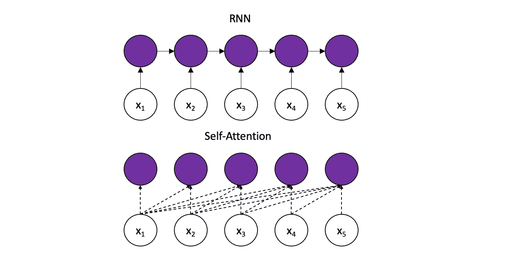

Inspired by the graphic in D2L¹

LSTMs 按顺序处理令牌，如上所示。这种体系结构维护一个隐藏状态，该状态随着每个新的输入标记而更新，表示它看到的整个序列。理论上，非常重要的信息可以通过无限长的序列传播。然而，在实践中，情况并非如此。由于消失梯度问题，LSTM 最终会忘记更早的令牌。

相比之下，转换器保留了与所有先前时间戳的直接连接，允许信息在更长的序列上传播。然而，这带来了一个新的挑战:该模型将直接连接到爆炸数量的输入。为了把重要的从不重要的中过滤出来，变形金刚使用一种叫做自我关注的算法。

# 自我关注

在心理学中，注意力是在排除其他刺激的同时对一种刺激的意识集中。类似地，注意力机制被设计成只关注任意长序列中与完成给定任务相关的最重要的子集。

具体地说，模型必须决定先前 tokes 的哪些细节与编码当前 tokes 相关。自关注块相对于所有其他先前输入对每个新的输入进行编码，基于相对于当前标记的相关性计算来放置焦点。

自我关注在 Jay Alammars 的[插图 GP2](http://jalammar.github.io/illustrated-gpt2/) 和[插图 Transformer](http://jalammar.github.io/illustrated-transformer/) 文章中有详细解释。另外，[原稿](https://arxiv.org/abs/1706.03762)可以在这里找到。以下是简要概述。

1.  **创建查询、键和值向量:**
    每个令牌生成一个关联的查询、键和值。将当前令牌的**查询**与所有其他令牌的**键**进行比较，以决定它们相对于当前令牌的相关性。**值**向量是给定令牌的真实表示，用于创建新的编码。在训练期间，模型逐渐学习这三个权重矩阵，每个令牌乘以这三个权重矩阵以生成其对应的键、查询和值。
2.  **计算自我关注分数:**
    自我关注分数是当前记号与序列中先前已经看到的任何其他记号之间的相关性的度量。它是通过计算当前令牌的查询向量与被评分令牌的密钥向量之间的点积来计算的。高分表示高相关性，低分表示相反。分数然后通过 softmax 函数传递，这样它们都是正的，加 1。在这一步，在对当前标记进行编码时，自我关注分数可以被视为给予序列中的标记的总关注的百分比。
3.  **对当前令牌进行相应编码:**
    在上一步中具有高 softmax 值的单词应该对当前令牌的编码贡献更大，而分数低的单词应该贡献很小。为此，每个值向量乘以其 softmax 分数。这将保持原始值不变，但会根据当前令牌的相对重要性来缩放整个向量。最后，将所有缩放值加在一起，产生当前令牌的编码。

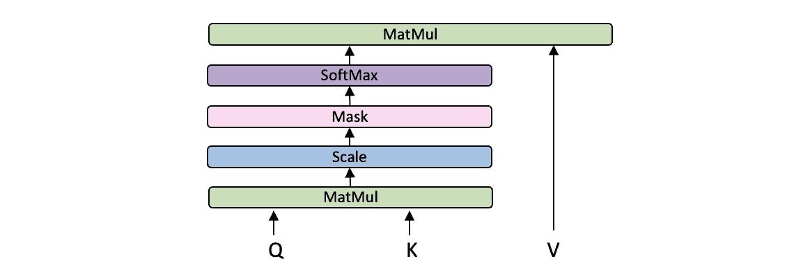

Graphic of self-attention calculations, inspired by [Attention is All You Need](https://arxiv.org/pdf/1706.03762.pdf)

由于这三个步骤由矩阵运算组成，因此可以优化如下:

The term in the denominator is used to stabilise the gradient. Other values are also possible.

# 位置编码

还有第二个挑战需要解决。时间序列不是按顺序处理的；因此，转换器不会固有地学习时间依赖性。为了解决这个问题，必须将每个标记的位置信息添加到输入中。这样，自我注意块将具有给定时间戳和当前时间戳之间的相对距离的上下文，作为自我注意相关性的重要指标。

对于这个项目，位置编码是这样实现的:时间戳表示为三个元素——小时、日和月。为了真实地表示每个数据类型，每个元素都被分解成正弦和余弦分量。这样，十二月和一月在空间上是接近的，就像这两个月在时间上是接近的一样。同样的概念也适用于小时和天，因此所有元素都是循环表示的。

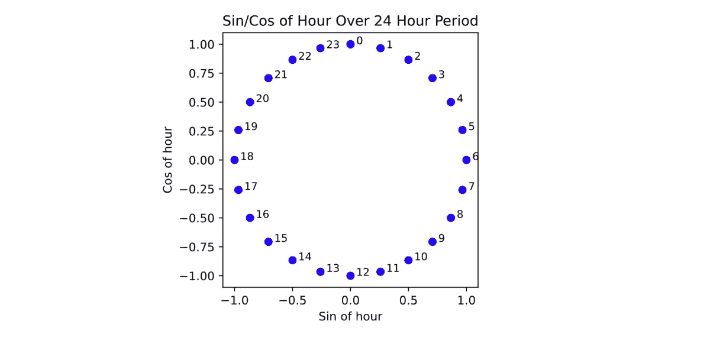

# 实现变压器-解码器

在普通变压器中，解码器由以下三个模块组成:首先是屏蔽自关注模块，然后是编码器-解码器模块，最后是前馈模块。本文中的实现从 [GPT2 的仅解码器转换器的实现](https://cdn.openai.com/better-language-models/language_models_are_unsupervised_multitask_learners.pdf)中获得灵感，如下图所示。这些经修改的解码器模块中的三个相互堆叠，将来自前一模块的编码作为输入传递给后一模块。

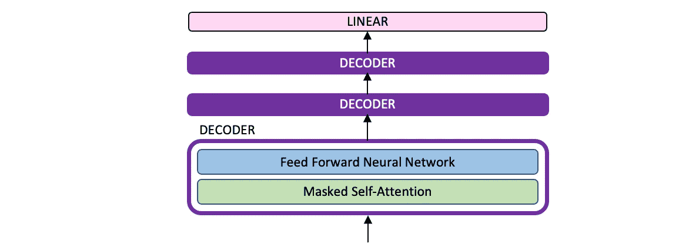

Transformer-decoder Architecture

转换器的输入是给定的时间序列(单变量或多变量)，如下图绿色所示。然后，目标将序列向右移动一次，如下图蓝色所示。也就是说，对于每个新的输入，模型输出一个新的下一个时间戳的预测。

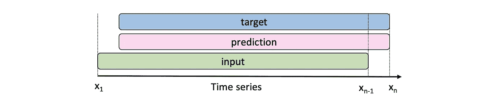

为了在长度为 5 的序列上表示这一点，对于第一个输入 x1，模型将输出其对即将到来的标记 x2’的预测。接下来，给出真实的 x1 和 x2，并预测 x3 '，等等。在每一个新的步骤中，它接收序列中之前的所有真实输入，以预测下一步。因此，模型的输出向量将是预测的标记 x2’、x3’、x4’、X5’、X6’。然后将其与真实值 x2、x3、x4、x5、x6 进行比较，以训练模型，其中每个输出令牌对损耗的贡献相等。

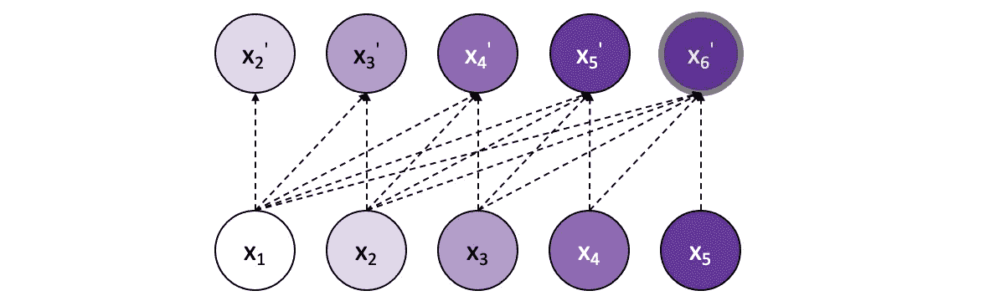

Graphic of how the inputs are attended to in calculating each output element.

# 伪装的自我关注

为了实现上面演示的模型，必须使用一个掩码来确保模型只能访问序列中每一步前面的令牌。具体地，在应用 softmax 函数之前，在当前正被关注的令牌之后的所有令牌都被屏蔽，以防止模型通过前瞻来欺骗。当应用软最大值时，这些未来值将获得 0%的重要性，从而防止任何信息泄漏。

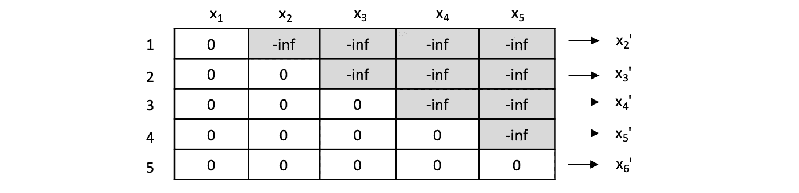

Graphic of the mask applied for an input of size 5\. In Step 1, the model only has access to x1 when predicting x2'. Hereby, x1 will have 100% importance. In Step 2, it has access to x1 and x2 when predicting x′3\. These inputs could now be allocated 40% and 60% respectively, as an example. At each of the following stages, the mask likewise ensures it is not possible for any token ahead of the current token to have any importance in the current calculation.

最后要注意的是，为了简单起见，上面的描述已经指出了计算中的顺序步骤。实际上，这些计算是在矩阵计算的同时进行的。

# 预定抽样

向模型输入每一个新步骤的真实值，而不是最后的预测输出，这种概念被称为教师强迫。就像一个学生在老师的监视下准备考试一样，该模型学习速度很快，因为它的错误会立即得到纠正。换句话说，在被纠正之前，它永远不会“偏离轨道太远”。

教师强制的缺点是，在每个新的预测中，模型可能会犯一些小错误，但在任何情况下，它都会在下一步中获得真实值，这意味着这些错误不会对损失产生重大影响。该模型只需学习如何提前预测一个时间步长。

然而，在推理过程中，该模型现在必须预测更长的序列，并且不能再依赖于频繁的修正。在每一步中，最后一个预测被附加为下一步的新输入。因此，在训练中不严重的小错误在推理过程中很快就会在较长的序列中被放大。在前面的类比中，这可以被比喻为学生去考试，没有老师在旁边的帮助下从未参加过模拟考试。

教师强迫的一个基本问题出现了:训练变成了一个与推理大不相同的任务。为了弥补训练和推理之间的差距，模型需要慢慢地学习纠正错误。因此，在训练和推理之间转换模型的任务变成了逐渐向模型提供更多的预测输出，而不是真实值。

在早期阶段过快地进行推断——从模型的预测输出中采样过多——将导致随机令牌，因为模型还没有机会训练，从而导致收敛缓慢。另一方面，如果在最后一个时期没有足够快地进行推理(采样太少)，将会使训练和推理之间的差距过大，这意味着在训练期间表现良好的模型将在推理期间性能急剧下降。

为了缓和这种差距，使用了一种采样方法，该方法受 Bengio 的[“使用递归神经网络进行序列预测的预定采样”](https://arxiv.org/pdf/1506.03099.pdf)的启发。采样率随着时间的推移而变化，从最初选择真实值的高概率开始，如在经典的教师强制中，逐渐收敛到纯粹从模型输出中采样，以模拟推理任务。本文提出了不同的时间表，本项目选择了其中的逆 sigmoid 衰变。在这些最后的时期中，当模型连续地对它自己的许多预测值进行采样时，模型理想地学会防止它的小错误累积，因为它现在受到更高的惩罚。

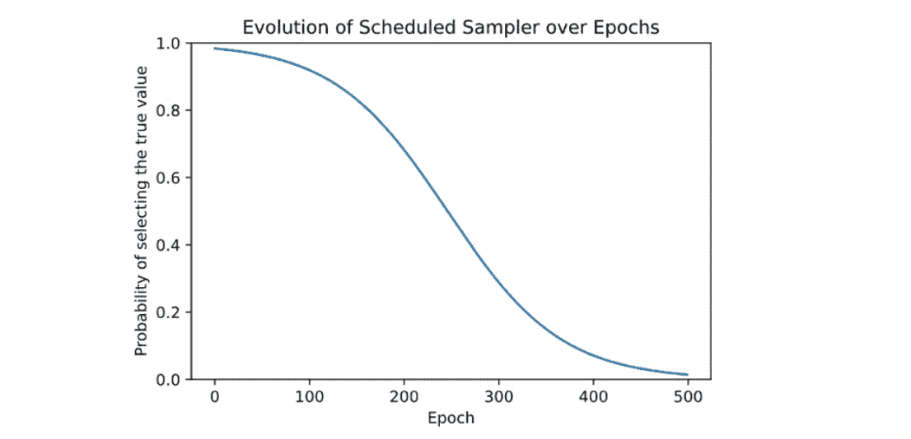

A constant k is used to fine-tune the rate of decay in the inverse sigmoid decay graph.

在 500 的时期 310 的训练期间，将该技术应用于模型产生如下所示的结果。蓝点显示真实的输入。红点表示选择作为下一步输入的值，无论是真实输入还是上一步的预测。绿点是模型的预测值，仅将之前的红点作为输入。在时期 310，模型仅从真实输入中采样其值的 20%，其他 80%是其自己的预测，如上面的反 sigmoid 衰减图所示。可以看出，每次采样器再次选择真实输入时，模型都被“校正”。

例如，在时间戳 20，模型明显偏离了轨道，预测湿度为 65%。采样器选择真实输出作为下一个输入，并且模型在随后的时间戳 21 中成功地几乎完美地校正了自身。

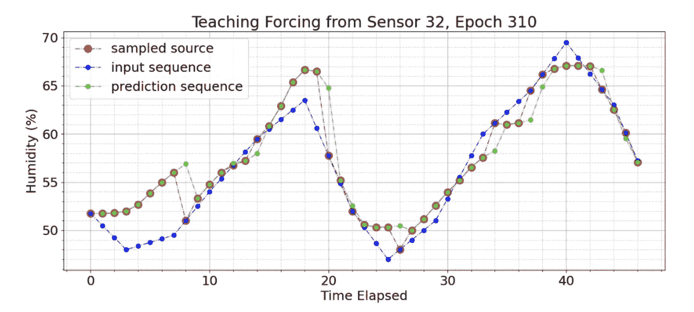

Scheduled sampler without theshold

我们看到该模型在序列开始时表现不佳。考虑到模型是在对特定序列知之甚少的情况下进行预测的，这是很直观的。使用在序列早期启动的预定采样器进行训练被证明会混淆模型，因为在没有足够的输入来理解数据中的模式的情况下，它会因预测不佳而受到惩罚。为了纠正这一点，在预定采样器上设置了阈值，以确保在预定采样器以反 sigmoid 图中所示的正常速率开始工作之前，仅将真值用于前 24 个时间戳，代表一整天的数据，与历元相关。

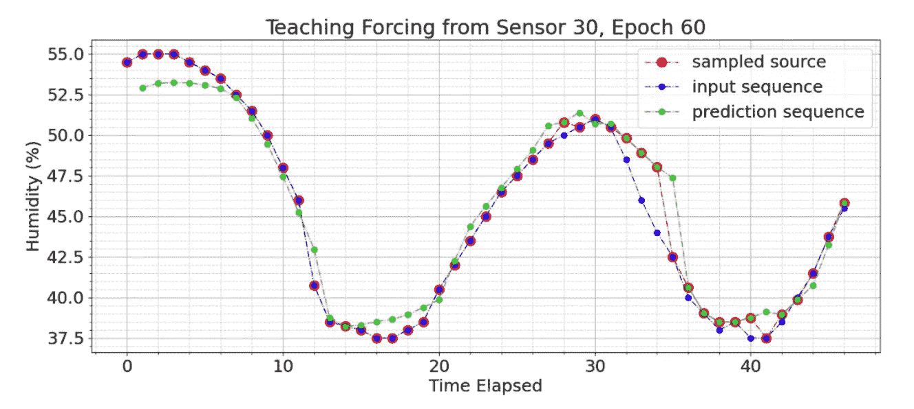

Scheduled Sampler with threshold. The first 24 time stamps come only from the true input, regardless of the probability set by the scheduled sampler.

# 结果

如下所示，该模型成功地对 50 个时间戳的预测窗口进行了合理预测。

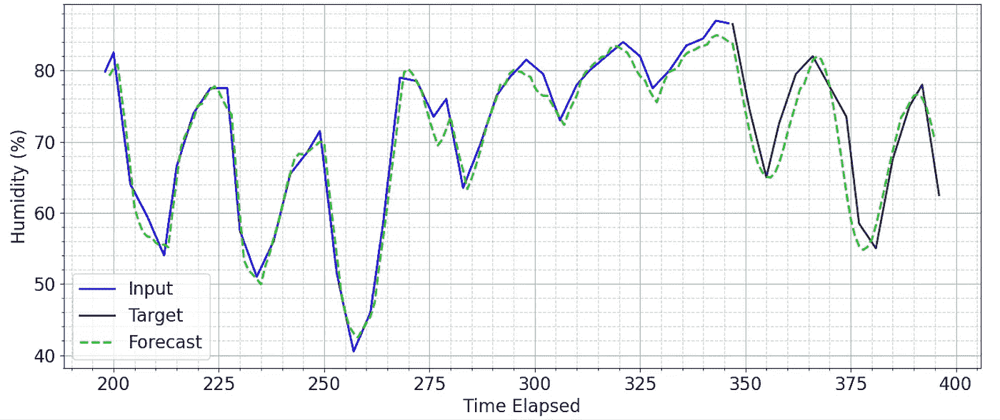

Prediction on an unseen sequence with a forecast window of 50, using a model trained for 500 epochs

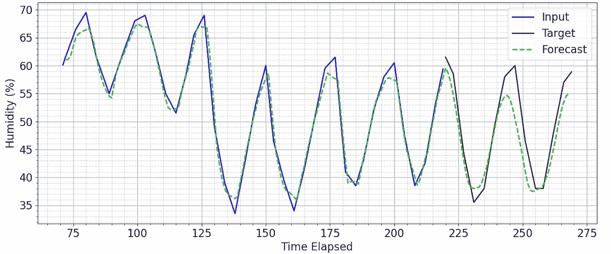

Prediction on an unseen sequence with a forecast window of 50, using a model trained for 500 epochs

如果它确实随着时间的推移偏离了轨道，它会产生令人信服的预测，显示出对数据的更深入理解。

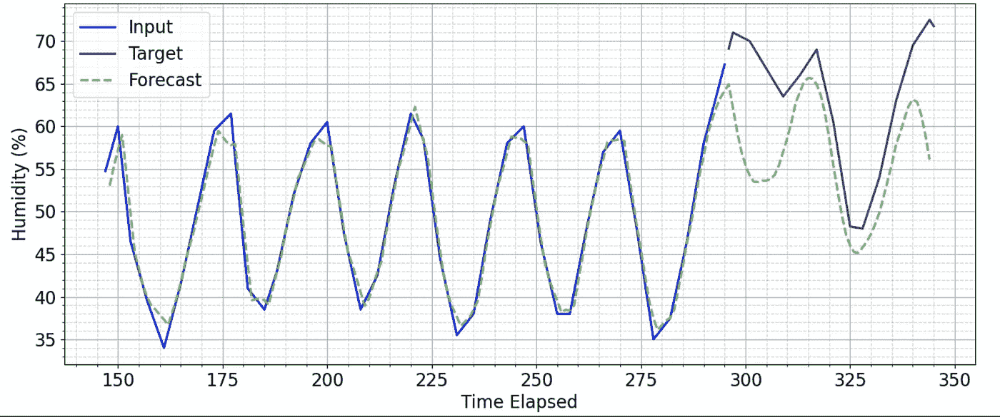

Prediction on an unseen sequence with a forecast window of 50, using a model trained for 500 epochs

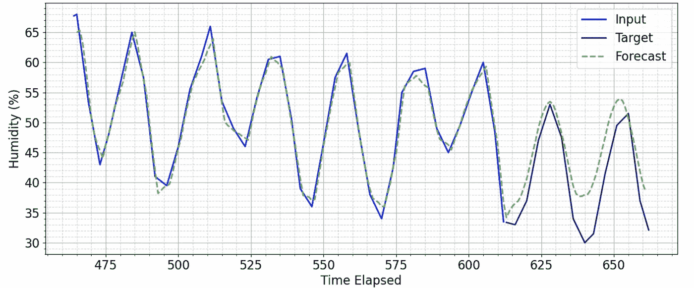

Prediction on an unseen sequence with a forecast window of 50, using a model trained for 500 epochs

本文讨论了一个简单的转换器-解码器架构，用于对行业数据集进行预测。关于时序变压器的当前 SoTA 研究的资源，请参见[时序变压器:调查](https://github.com/qingsongedu/time-series-transformers-review)。

 [## Mlearning.ai 提交建议

### 如何成为 Mlearning.ai 上的作家

medium.com](/mlearning-ai/mlearning-ai-submission-suggestions-b51e2b130bfb) 

🔵 [**成为 ML 作家**](/mlearning-ai/mlearning-ai-submission-suggestions-b51e2b130bfb)

Aston Zhang，Zachary C. Lipton，，和 Alexander J. Smola，深入学习，2019 年[https://d2l.ai/chapter_attention-mechanisms/index.html](https://d2l.ai/chapter_attention-mechanisms/index.html)

Jason Brownlee，“什么是教师对递归神经网络的强迫？，"[https://machine learning mastery . com/teacher-forcing-for-recurrent-neural-networks/](https://machinelearningmastery.com/teacher-forcing-for-recurrent-neural-networks/)，2017 年 12 月

Samy Bengio、Oriol Vinyals、Navdeep Jaitly 和 Noam Shazeer，“使用递归神经网络进行序列预测的预定采样”，CoRR，第 abs/1506.03099 卷，2015 年。[https://arxiv.org/pdf/1506.03099.pdf](https://arxiv.org/pdf/1506.03099.pdf)