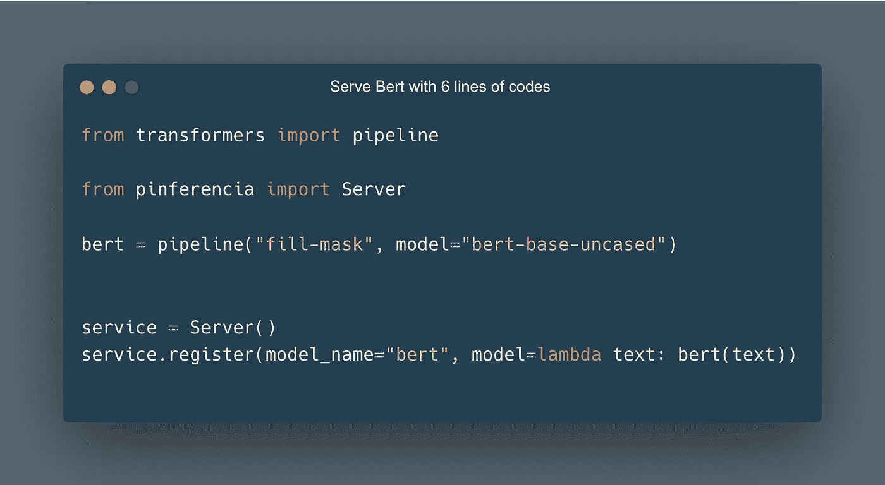
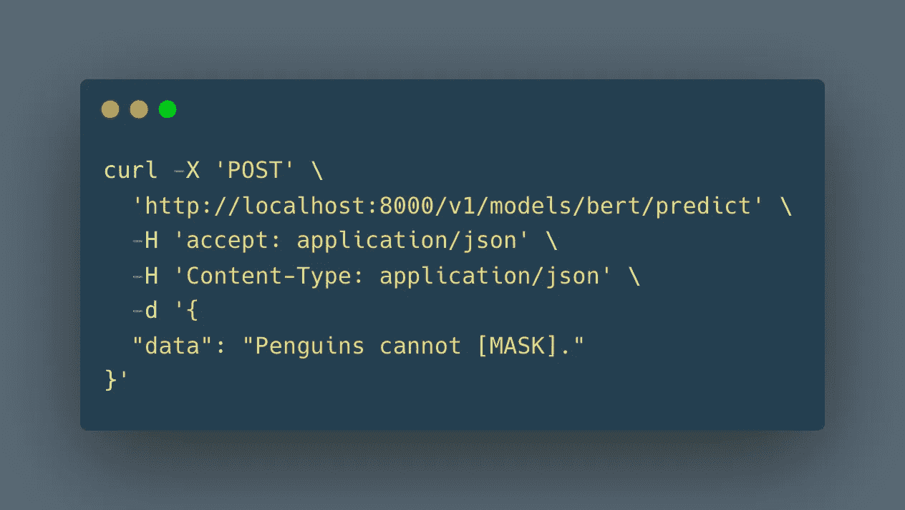
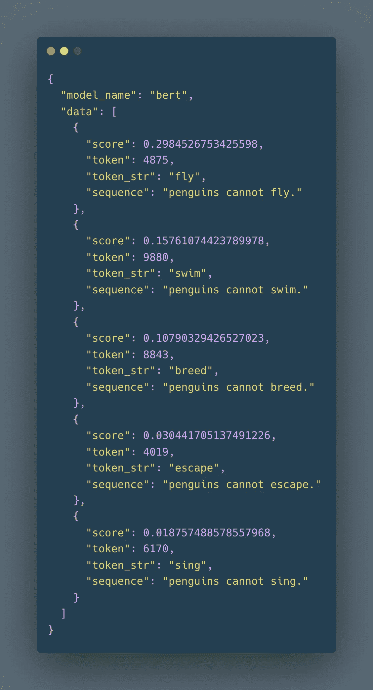
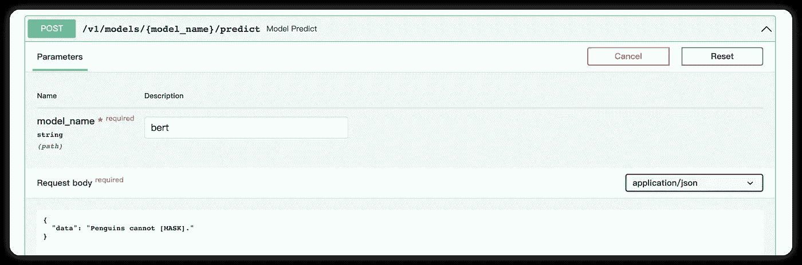
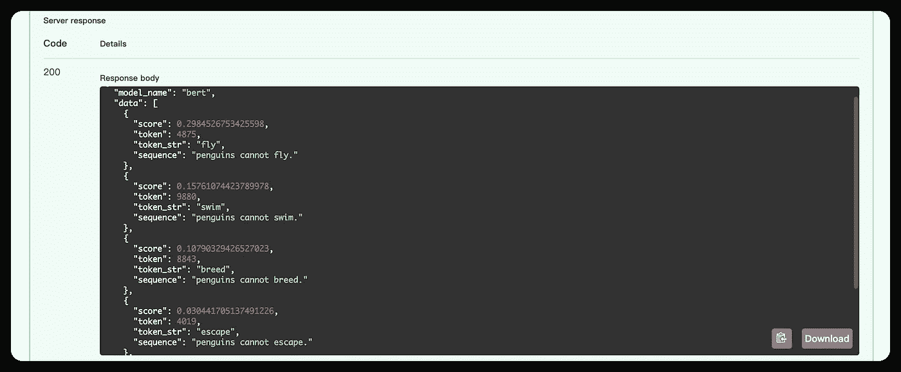

# 变形金刚伯特——揭开神秘面纱:在 10 行代码内完成游戏和部署

> 原文：<https://medium.com/mlearning-ai/transformers-bert-unmask-the-myth-play-and-deploy-within-10-lines-of-codes-5724538a97ef?source=collection_archive---------6----------------------->

伯特是一个很好的搭档。它可以推断出你在句子中漏掉的单词。

在本文中，我们将部署 Google T5 模型作为 REST API 服务。难？那我告诉你:你只需要写 **6 行代码怎么样？**



[**Pinferencia**](https://github.com/underneathall/pinferencia) 只需三根额外的线，即可轻松服务任何模特。
[**hugging face**](https://huggingface.co/)只需几行就能轻松使用预应变模型。


# 安装依赖项

## 拥抱脸

`pip install "transformers[pytorch]"`

如果不起作用，请访问[安装(huggingface.co)](https://huggingface.co/docs/transformers/installation)并检查他们的官方文件。

## 平费伦西亚

`pip install "pinferencia[uvicorn]"`

如果不行，请访问[Install—Pinferencia(under neat hall . app)](https://pinferencia.underneathall.app/install/)查看他们的官方文档。

# 定义服务

首先让我们创建`app.py`来定义服务:

# 启动服务

```
uvicorn app:service --reload
```

等待模型被下载。完成后，您会看到:


# 呼叫服务

你可以使用比利时的`curl`或`interactive api page`。

# 卷曲



结果:



得分最高的一句话是:企鹅不会飞。有道理，对吧？

除了卷发，还可以用 [Pinferencia 的](https://github.com/underneathall/pinferencia):

# 交互式 API 页面

[](/mlearning-ai/mlearning-ai-submission-suggestions-b51e2b130bfb) [## Mlearning.ai 提交建议

### 如何成为 Mlearning.ai 上的作家

medium.com](/mlearning-ai/mlearning-ai-submission-suggestions-b51e2b130bfb)