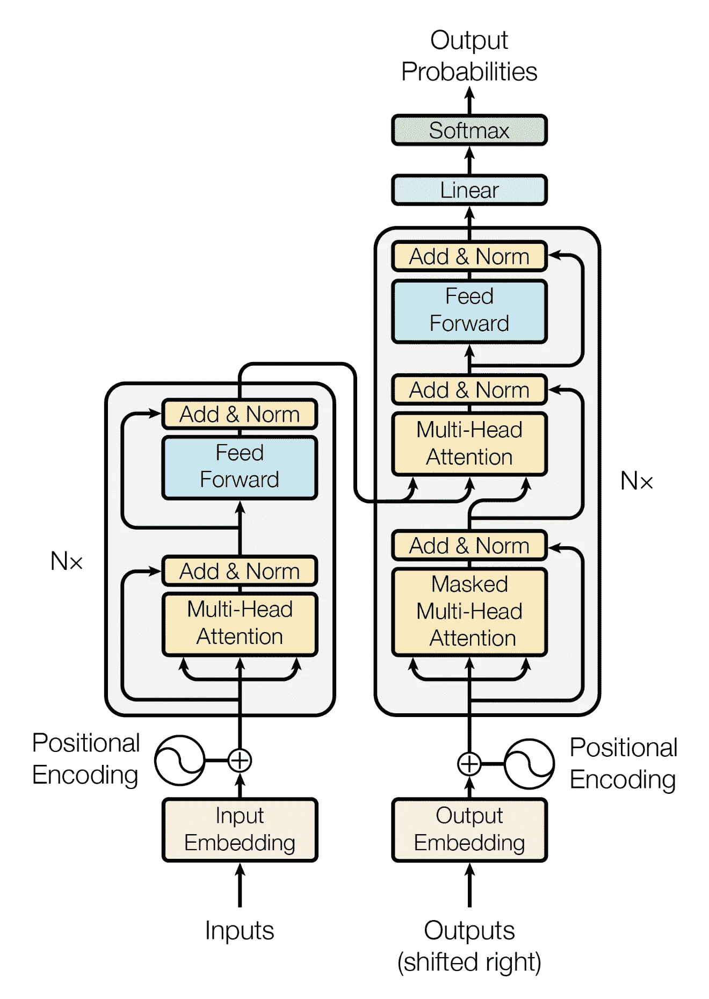
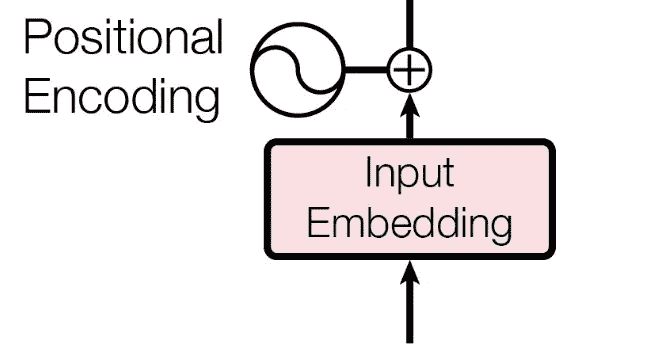
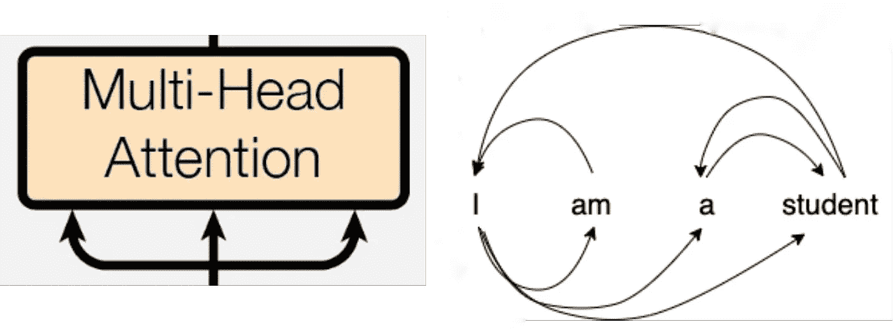
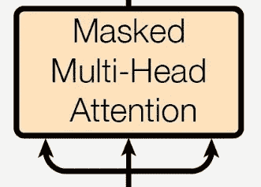
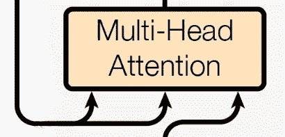
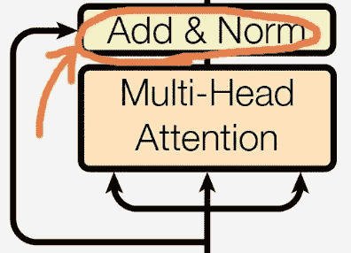
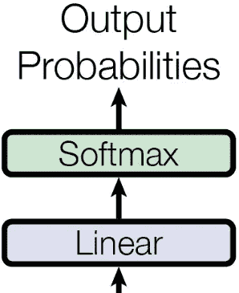
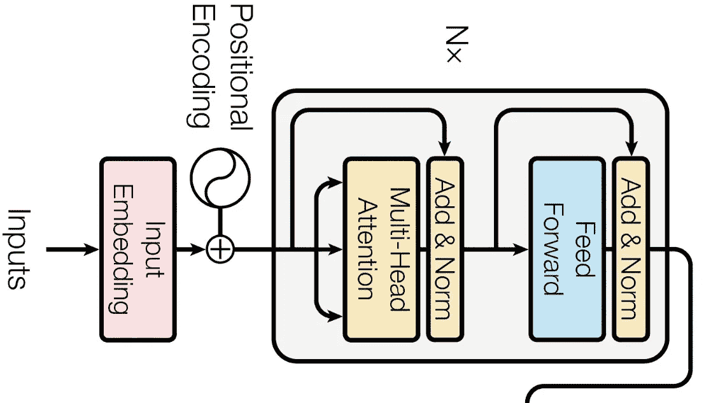
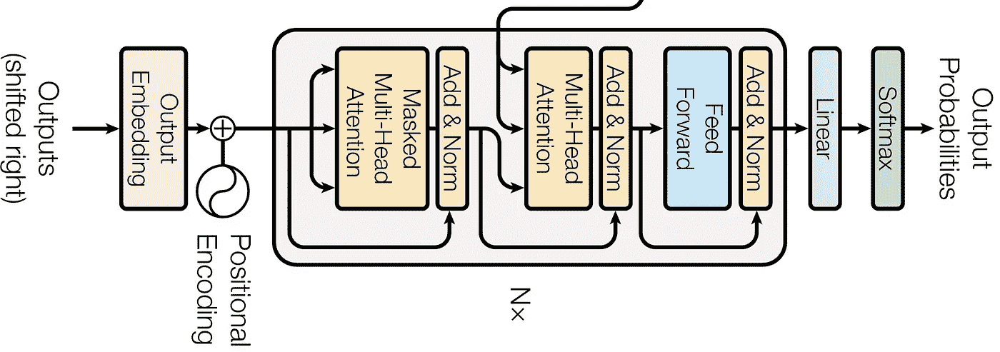

# 变压器过于简单

> 原文：<https://medium.com/mlearning-ai/transformers-oversimplified-3410407ad4aa?source=collection_archive---------2----------------------->

## 理解狂怒的变形金刚网络架构

这些年来，eep 学习一直在发展。这是它享有盛名的一个重要原因。深度学习实践高度强调使用**大桶参数**来提取关于我们正在处理的数据集的有用信息。有了一大组参数，分类/检测某样东西就变得**容易了，因为我们有更多的数据可以清楚地识别。**

到目前为止，在深度学习的旅程中，特别是在自然语言处理中，一个值得注意的里程碑是**语言模型**的引入，它极大地提高了完成各种 NLP 任务的准确性和效率。

**序列-序列模型**是基于**编码器-解码器**机制的模型，它接受一系列输入并返回一系列输出作为结果。考虑图像标题，对于给定的图像，我们创建一个标题。在这种情况下，seq-seq 模型将**图像像素向量(序列)**作为输入，并将**字幕逐字(序列)**作为输出返回。

一些促进此类模型训练的重要 DL 算法包括**递归神经网络、长短期记忆和门控递归单元**。但随着时间的推移，这些算法的使用逐渐减少，因为随着数据集大小的增加，这些算法的复杂性和一些缺点会严重影响性能。一些重要的缺点包括**更长的训练时间，消失梯度**问题，当我们为大数据集进一步训练模型时，丢失了关于旧数据的信息，算法的复杂性等等。

# 你需要的只是关注

在语言模型训练方面取代所有上述算法的一个突破性概念是**基于多头注意力的转换器架构**。谷歌在 2017 年的论文**“注意力是你所需要的一切”中首次介绍了 transformer 架构。它变得如此受欢迎的主要原因是因为它的架构引入了并行化。变形金刚利用高度**强大的 TPUs** 和**并行训练**导致**减少训练时间**。**

transformer 架构看起来更接近于此。

开个玩笑，但是如果能看到这样一个变形金刚组合在一起的视觉效果，那就太棒了。但事实上，它有很酷的架构。

有趣的是，即使如此抽象，整个架构也不适合你的屏幕。但是，在每一层的罩盖下仍然隐藏着太多的东西。但是在这篇文章中，我们并没有深入到本质。我们只想知道每一层以及它在概述中的作用。

转换器有一个用于 seq-seq 模型的编码器-解码器模型，输入在左边，输出在右边。它内部使用了**注意力机制**，已经成为语言模型的*最高算法。*

[注:如果你不想看完整个细节，我建议你跳到 [**【整体画面】**](/@logeshvarl/transformers-oversimplified-3410407ad4aa#:~:text=the%20decoder%20layer.-,The%20overall%20picture,-Now%20let%E2%80%99s%20take) 部分，它简单地给出了所有的信息。]

现在，当我解释每一层时，我们将使用语言翻译任务示例，该示例包含简单句“我是学生”及其法语翻译形式“Je suis étudiant”。

## 嵌入层

输入嵌入是变压器编码器和解码器端的第一步。这些**机器** **无法理解任何语言的文字**。它只吃数字。因此，我们得到了输入/输出中每个单词的**嵌入，这在像[***GloVe***](https://nlp.stanford.edu/projects/glove/)***这样的地方很容易得到。*** 对于该嵌入值，我们添加该单词在句子**中的**位置信息**(基于奇数或偶数位置出现的不同值)以给出上下文**语义信息。**

# 多头注意力

多头关注层由嵌入在一起的多个自我关注层组成。注意力层的主要目的是收集关于句子中每个单词与其他单词的**相关性的信息，并帮助轻松理解意思**。上面的插图描述了我们句子中的每个单词是如何依赖其他单词来表达意思的。但是让机器理解这种依赖性和相关性并不容易。

这就是注意力进入画面的地方。在我们的注意力层中，我们取三个输入向量，即,**查询(Q)、键(K)和值(V)。**把查询想象成你在浏览器上搜索的东西，浏览器有一组页面要匹配，这些页面就是键，我们得到的结果就是值。同样，对于句子 **(Q)** 中的给定单词，对于其中的其他单词 **(K)** ，我们得到它 **(V)** 对其他单词的相关性和依赖性。对于 Q、K 和 v，使用**不同的权重矩阵**进行多次这种自我关注过程，从而形成多头关注层。

这是注意力层的一百英尺抽象。作为多头注意力层的结果，我们得到多个注意力矩阵。

在该架构中，我们可以看到解码器中还有另外两个关注层。

## 掩蔽的多头注意力

这是我们解码器端的第一层关注点。但为什么是* **掩蔽注意力*** ？

因为，在输出的情况下，如果当前单词可以访问它后面的所有单词，那么**它不会学到**任何东西。它会直接建议输出这个单词。但是通过屏蔽，我们隐藏了当前单词后面的单词。因此，它将有空间**预测到目前为止哪个单词对给定的单词和句子有意义**。它已经有了当前单词的嵌入和位置信息，所以**我们让它使用之前已经看到的所有单词有意义**使用 **Q，K 和 V** 向量，并找出最可能的下一个单词。

## 编码器-解码器注意

解码器端的下一个多头关注层从编码器端获取**两个输入(K，V ),从解码器**的前一个关注层获取**另一个输入(Q)。现在，它可以访问来自输入和输出**的**注意值。基于来自输入和输出的当前注意力信息，它现在将进行两种语言之间的**交互**并且**学习输入句子中的每个单词与输出句子**之间的关系。**

## 残留层

这些关注层将返回一组关注矩阵，该矩阵将与实际输入相加，并将执行**层/批次标准化**。这种标准化有助于**平滑损失表面，因此在使用较大的学习率时很容易优化**。

## 前馈层

在编码器块中，前馈网络是一个简单的神经网络，它获取平均的注意力值，然后**将它们转换成更容易被下一层**消化的形式。它可以是顶部的另一个编码器层，也可以传递到解码器端的编码器-解码器关注层。

现在，在解码器模块中，我们有另一个前馈网络来完成相同的工作，并将转换后的注意力值传递给顶部的下一个解码器层或线性层。

**神奇的时刻**就发生在这一层。由于**每个单词都可以通过**神经网络**独立传递**其关注值，我们在此引入**甜蜜并行化**。

正因为如此，我们可以同时传递输入句子中的所有单词，编码器可以并行处理所有单词并给出编码器输出。

## 输出线性图层和 softmax 概率

在所有的解码器端处理完成后，我们有了带有线性层和 softmax 层的后处理层。线性层用于**将来自神经网络的注意力值**展平为输出语言中所有单词的**大小。在这之后，我们应用 softmax，找到所有单词的概率，从中我们得到最可能的单词。这只是预测下一个可能的字**作为解码器层输出的**概率。**

# **整体画面**

现在让我们快速看一下整个过程。

## 编码器

我们从输入的句子中取出每个单词，并行地传递给它们**。**我们把这个词的**嵌入**和我们加上**的位置**信息给**上下文**。然后我们有多头注意力层，它学习**与其他单词的相关性**，从而产生**多个注意力向量**。这些然后被平均，并且一个**标准化**层被应用来减轻优化。这些又被传递到**前馈网络，该网络将这些值转换为**顶部的下一个编码器或编码器-解码器关注层可读的维度。

## 解码器

我们有一个类似的单词嵌入和添加上下文的预处理步骤。然后，我们有一个**掩蔽注意力**层，它在输出句子的**当前单词和它已经看到的所有先前单词**中学习注意力，并且不允许接下来的单词。然后一层**归一化**完成。现在，我们将编码器层对于**键的输出，值**向量与解码器关注值一起作为**查询**到下一个关注层。现在，输入和输出语言之间的实际交互**发生了，这导致算法的**更好地理解语言翻译的**。**

然后，我们有另一个前馈网络，它将转换后的输出传递给一个线性层，使注意力值变平。然后使用 **softmax 层来获得输出语言中所有单词的下一次出现的概率**。从这里开始，概率最高的**单词将是输出的**。

# 编码器和解码器的堆叠

将编码器和解码器堆叠起来也是有效的，因为它导致**更好地学习任务的**并且**增强算法的预测能力**。在实际的论文中，谷歌已经堆叠了 **6 个**编码器和解码器。但也要确保，它不会过度，使培训过程昂贵。

# 结论

自从谷歌推出《变形金刚》的那一天起，它就一直是自然语言处理领域的革命性产品。它被用于各种语言模型的开发，包括受到高度赞扬的 **BERT、GPT2 和 GPT3** ，它们在所有语言任务中都优于以前的模型。了解基础架构肯定会让你在游戏中保持领先。

感谢你阅读这篇文章！我希望这篇文章能让你对变形金刚的整体架构有所了解。

请随意分享你的想法/评论。让我们一起让编码变得有趣！

加入牧神: [**网站**](https://faun.to/i9Pt9) 💻**|**|[**播客**](https://faun.dev/podcast)**🎙️**|**[**推特**](https://twitter.com/joinfaun) 🐦 **|** [**脸书**](https://www.facebook.com/faun.dev/) 👥**|**[**insta gram**](https://instagram.com/fauncommunity/)**📷| [**Facebook 群**](https://www.facebook.com/groups/364904580892967/)**🗣️**|**[**LinkedIn 群**](https://www.linkedin.com/company/faundev) 💬 **|** [**松弛**](https://faun.dev/chat) 📱 **|** [**云原生** **新闻**](https://thechief.io) 📰 **|** [**更有**](https://linktr.ee/faun.dev/) **。********

****如果这篇文章有帮助，请点击拍手👏按钮几下，以示你对作者的支持👇****

**** [## Mlearning.ai 提交建议

### 如何成为 Mlearning.ai 上的作家

medium.com](/mlearning-ai/mlearning-ai-submission-suggestions-b51e2b130bfb)****