# 变形金刚-新野兽的崛起:对 AI21，ALEPH ALPHA，MUSE 和 GPT-3 系统的 100%主观测试-结果令人惊讶。

> 原文：<https://medium.com/mlearning-ai/transformers-rise-of-the-new-beasts-a-test-of-the-systems-ai21-aleph-alpha-muse-vs-gpt-3-288db57a55f9?source=collection_archive---------1----------------------->

## 在过去的几个月里，一些有前途的语言模型开始挑战 GPT-3。我测试了几个这样的平台，并向它们抛出了数据。脑子里总是有这样的问题:其他型号能和 GPT-3 竞争吗？还是他们更优秀？

所有平台都有特定的功能，其中一些功能很难比较:例如生成和理解程序代码的能力，类似 SQL 的表格处理，或者覆盖特定的语言——例如，Muse 语言模型在法语方面非常强大。为了进行公平的比较，我做了一些常识方面的基本测试，以及得出逻辑结论的能力。测试语言是英语。

这些模型应该回答需要常识的问题。例如，他们应该对一个历史事件进行分类，或者说出设备和机器的组成部分以及它们是如何工作的。此外，模型还应该应用这些知识，例如，在自行车的情况下，它们应该确定自行车保持运动所必需的部件。

我只测试了对托管模型有公共(API，Playground)和灵活访问的 LLM。

平台简介:

**Muse** 是一个语言模型，来自总部位于巴黎的初创公司 LightOn，该公司已经获得了近 400 万美元的资金。缪斯专注于欧洲语言。

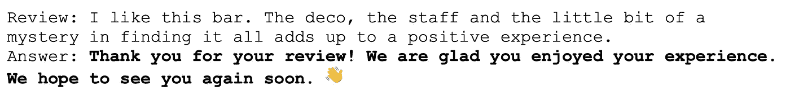

Showcase Muse: Responding to restaurant reviews with emojis (User: regular text; Model: text bold.)

**Aleph Alpha** 是一家来自德国南部海德堡的初创公司。Aleph Alpha 已经从风投那里筹集了近 3000 万美元。除了非常好的纯语音界面，Aleph Alpha 还有处理多模态输入的能力。

Showcase Aleph Alpha: Response to a combined image-text input. (User: image input and regular text; Model: bold text), (Image credit: Lily Banse on unsplash, [https://unsplash.com/@lvnatikk](https://unsplash.com/@lvnatikk))

AI21 Labs 是一家总部位于特拉维夫的初创公司，最近一次获得资金是在 2022 年 7 月。该公司总共筹集了 1.18 亿美元。AI21 开发的平台是第一批公开的 GPT-3 竞争模型之一，在质量方面可以接近 OpenAi。

Showcase: Query databases in natural language. The prompt for the model contains structured information (user: regular text; model: bold text) and answers specific questions based on this. The model is also very good at handling completely unstructured text input.

来自旧金山 OpenAI 的 GPT-3 可能是近年来引起最大轰动的 LLM，是语言模型的一种黄金标准。我将不再进一步解释。

以下是小竞赛参与者的概述，包括具体的模型和测试设置。

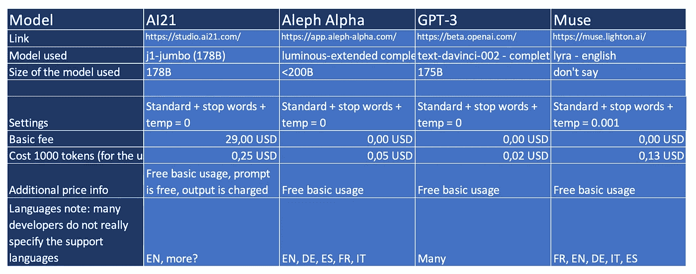

# 但是什么是大型语言模型呢？

**大型语言模型**是通常具有特定架构(transformer)的系统，并且已经用来自互联网(例如维基百科)的千兆字节和兆兆兆字节的文本进行了训练。基于这些数据，他们得出单词序列的概率。原则上，这些机器可以预测一系列单词、句子、故事、对话将如何继续。这只是基于他们庞大的学习数据集。因此，他们所能做的和所知道的一切都没有存储在一个知识图表中，这个图表列出了事实、规则和对象之间的关系。相反，这些模型处理单个单词(单词或单词的一部分)相互跟随的概率。当我在下面谈论“知识”或“推理”或使用认知领域的类似术语时，请记住这个事实。我在测试中将 Alexa 作为一个经典的基于规则的语音平台的例子，它通过数据库中的话语意图映射来回答问题，或者从网络上搜索答案。

**规模很重要:**模型的规模(参数的数量)和学习数据集的规模以及许多其他因素都起着至关重要的作用。模型必须拥有超过 1000 亿个参数和高千兆字节或千兆字节范围的学习数据，才能真正提供高质量。

# **考试:常识和简单推理**

我让模特们互相竞争，测试她们对世界的了解和推理能力。这项测试是至关重要的基线测试。通过它的模型可以用于各种单独的应用:例如，回答客户问题，分析和总结文本，以及自动处理邮件。这项测试是专门为大型语言模型设计的:像 Alexa 这样的经典的基于规则的语言系统在问题达到一定的复杂性后就会退出，不再能够回答它们。为了比较不同平台架构的能力，我问了作为最先进的经典语言模型的 Alexa 同样的问题。

# **提示音**

为了让模型首先知道测试是如何工作的，在每个测试对话框之前的提示中有一个简短的介绍，并显示了问题和答案的结构，在这个介绍中，问题和答案来自用户(来自我):

回答问题。
人类:为什么物体在月球上比在地球上下落得慢？
AI:因为月球引力小
人类:第一辆车什么时候上路的？
AI: 1886
人类:一天晚上，当我回到我的公寓时，所有的房间都乱七八糟。抽屉被拉开，里面的东西躺在地板上，椅子被掀翻，橱柜被洗劫一空。会发生什么事？可能是窃贼进入公寓寻找贵重物品。约翰不喜欢安妮。安妮对帕特相当中立。帕特和约翰是什么关系？AI:根据提供的信息，我不能说。
人类:为什么大多数巴西人都说葡萄牙语？AI:因为它是巴西的官方语言。人类:为什么会这样？它是官方语言，因为巴西在 1500 年到 1822 年间是葡萄牙的殖民地。
人类:[这里是我们想要测试模型的特定问题，例如，“在不停车的情况下，您可以移动自行车的哪一部分？"]
AI:**[空…模型将在此处附加其答案，例如“踏板”]**

提示显示所需的问答格式。它提供了模型如何直接回答问题或进入多轮对话的示例，并包括前一个问题的上下文(巴西示例)。它还显示了当模型不知道答案或缺少数据时应该如何回答。

现在让我们开始测试:

# 1)事实

这些问题每个都有一个或多个正确答案。每个模型都应该能够回答这些问题。

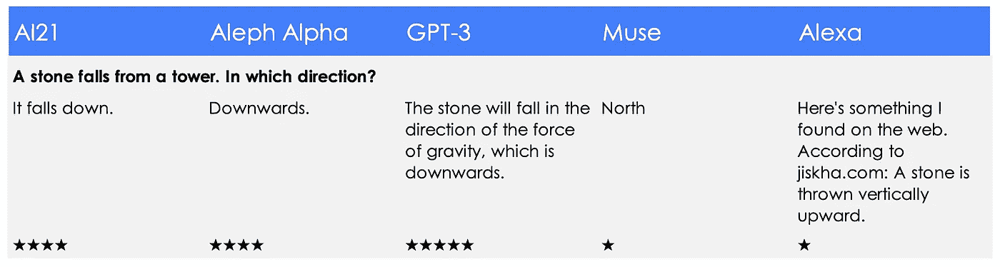

*   前三个模型正确回答了问题。
*   GPT 3 号对引力的引用应该得到一颗额外的金星。
*   缪斯，真的，“北？”
*   Alexa 在谷歌上搜索答案，得到的回答是完全错误的。

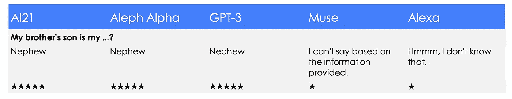

*   缪斯在这里也没有很有说服力的回答。
*   其他模型正确回答了这个问题。
*   Alexa 会为一个换句话说的问题找到一个正确的答案“你如何称呼一个亲戚，谁是我哥哥的儿子？”。然而，她无法回答上面这个非常简单的问题。

*   除了缪斯，所有模特都能正确回答这个关于 1995 年电影的非常具体的问题。请记住，这些模型或多或少可以回答大多数关于西方世界所有相当重要的电影的演员阵容和内容的问题。当然，也有关于书籍、化学元素、天文物体、生物或物理方程式的。
*   Alexa 也会在这里找到合适的内容，然后从中提取问题的答案。

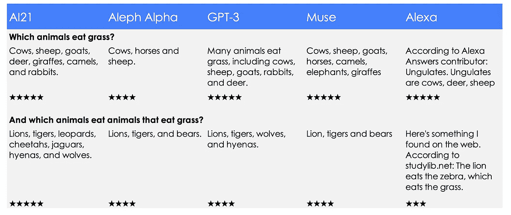

*   在关于食草动物和动物吃食草动物的问题上，所有的模型都表现得非常好。
*   然而，大多数模型无法回答“哪些动物吃食草动物？”之前没有被问过这个问题。
*   Alexa 在她对第二个问题的回答中只找到了一种动物，但仍然。

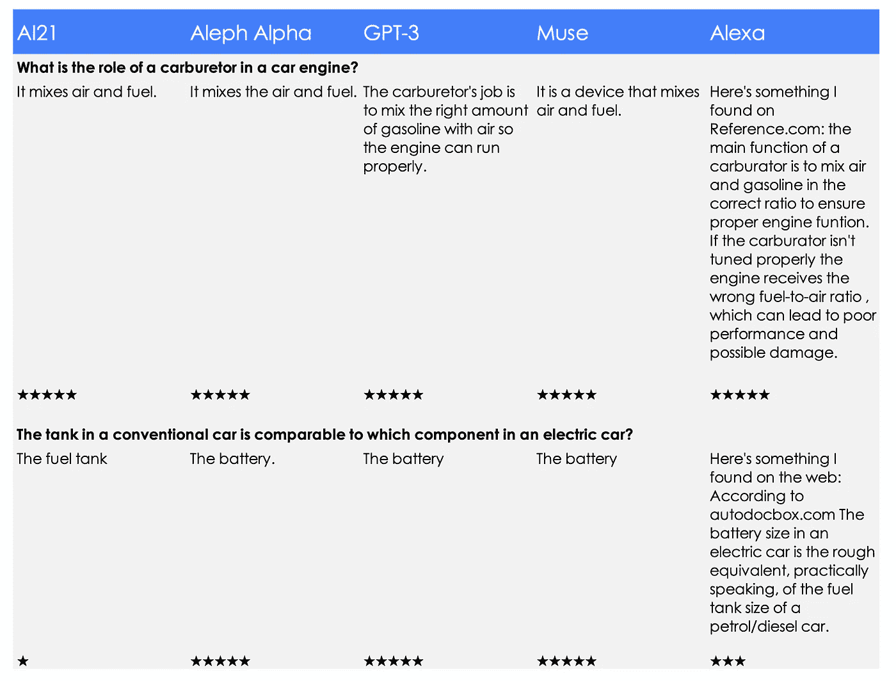

*   这两个问题也是大部分机型回答正确的。
*   AI21 的电池有问题。
*   她发现，Alexa 需要很长时间来解释互联网报价的相同问题。她这个类比有点离谱，但也不是完全错误。

# 2) **软知识/合理评估**

以下问题的答案无法用纯事实性知识来回答。这里必须得出一个结论或者做出一个评估。不同的答案是可能的，有几种在某种程度上可能是正确的。

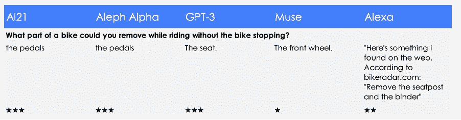

*   三个模型或多或少地回答了这个问题。是的，原则上你可以移除行驶中的自行车的踏板和座位，但这需要技巧——这就是为什么我只给出 5 颗金星中的 3 颗。
*   Alexa 提供了一个自行车论坛关于如何解决吱吱声的答案。这是胡说八道。
*   骑行时去掉前轮的 Muse 建议对我来说太危险了:只有一点。
*   亲爱的模特们，为什么不选择铃铛呢？

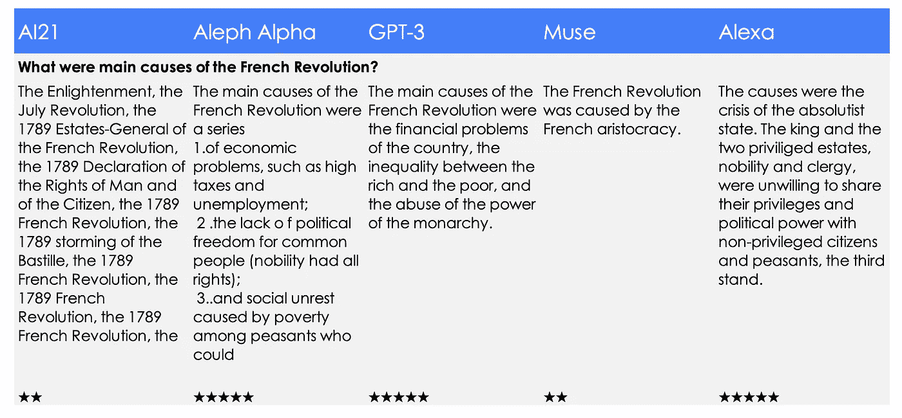

*   AI21 列举了几个可能与革命有关的事件。七月革命发生在 1830 年，大约 40 年后，所以这不可能是法国大革命的原因。此外，模型在最后陷入了一个循环。然而，它是引用启蒙运动的唯一模型——还不错。
*   Aleph Alpha 以结构化的方式列出了原因，但“系列”一词属于第一点。事实上，第 3 点中的答案被截断是由于我分配给模型的令牌数量——所以这是我的错。
*   GPT-3 带来了一个复杂的正确答案，尽管有些笼统——它适用于几乎任何革命。
*   从巴黎的缪斯到巴士底狱有 5 公里，我本以为会有更多的见解。答案并不完全错误，但遗漏了很多。
*   Alexa 以一个精心策划的答案脱颖而出，这个答案这次完全正确，并且完全符合这个问题:太好了！这说明:如果一个问题的答案可以完美地照本宣科，那么在经典的基于规则的语音系统中，这个答案的质量可以是极高的。

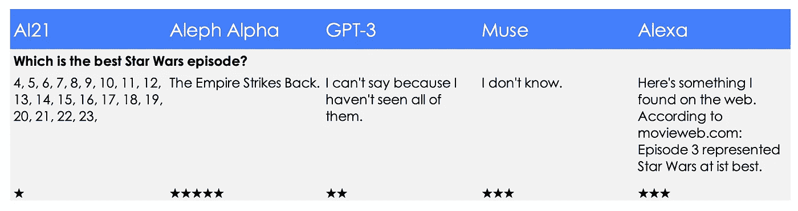

互联网用户或电影网站几乎总是用第五集(《帝国反击战》)或有时用第四集(《新的希望》)来回答这个问题。虽然这在理论上是个口味问题，但这里几乎没有人把第三集命名为最佳剧集。

*   因此，Alexa 的回答令人惊讶
*   阿勒夫·阿尔法完全正确。
*   AI21 开始正确回答(第 4、5 集)，但随后陷入简单的计数。在这里，模型的完成基于它自己的输出做了太多的工作。
*   GPT-3 的反应具有误导性。GPT-3 不可能看过任何一集，因为它甚至没有视频输入接口。
*   缪斯对这个主题没有意见，这是没有帮助的，但还好。

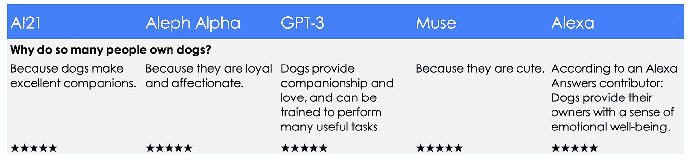

这些都是很棒的回答。

*   GPT-3 的回答有点像教科书，至少第二部分(工作犬)不再是今天大多数人养狗的真正原因。
*   其他模特的回答变得更加情绪化，尤其是来自缪斯的。
*   Alexa 的回答是精心策划的，也是中肯和正确的。

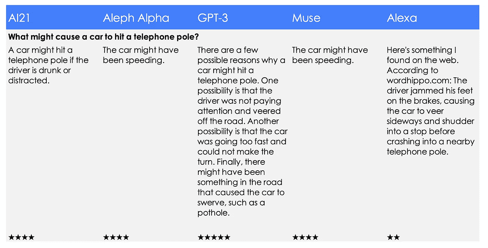

所有模型都能很好地完成这项任务，

*   GPT-3 甚至更完美。
*   有趣的是，Aleph Alpha 和 Muse 在他们的回答中使用了完全相同的措辞。
*   Alexa 在互联网上发现了一个明显的轶事，这让她有些不知所云。她的回答与这个问题有点关系，但并没有回答它。

# 3) **逻辑推理和上下文理解的难题:**

现在变得非常非常困难。我问的问题连人类都不容易回答。

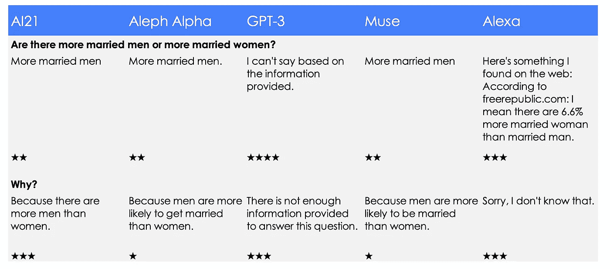

对第一个问题的正确回答是，这方面没有确切的数据，或者已婚男性和已婚女性的数量可能差不多。大多数婚姻发生在一个女人和一个男人之间，随着其中一方的死亡或离婚，双方都结束了。因此，女性的比例不会因为预期寿命延长而上升。同性婚姻和一夫多妻制是特例。这两种形式的关系——这是一项(相当短的)研究显示的——可能会导致已婚女性的比例稍微高一些。

*   Alexa 的答案 6.6%几乎可以肯定是错误的，但至少它朝着正确的方向前进。
*   除了 GPT-3，所有模型都本能地错误回答了这个问题，并提供了部分甚至可疑的解释。
*   AI21 原则上对第二种说法是正确的(确实有更多的男人)，但这不是第一种说法的逻辑理由。
*   甚至 GPT-3 也没有得到满分。该模型没有对缺失的公开信息提供任何评估或参考。

另一个问题是 LLMs 很难解决的。另一方面，人类可以很容易地回答这个问题，因为他们已经超过 5、6 岁了。正确的答案要求 1)隐含的事实来源于明确的陈述，因此 2)两个行动者的认知状态被推断出来:或者，简而言之，一个给定的人知道什么和不知道什么可以从一个情境中推断出来。

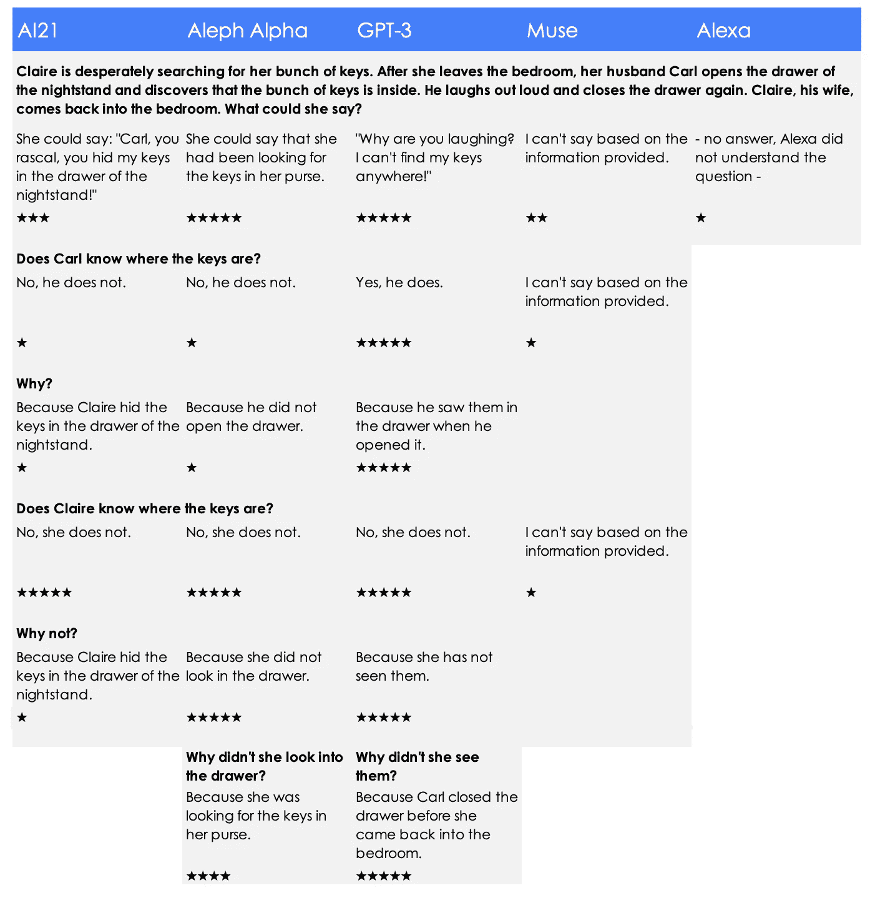

从基本信息“克莱尔拼命寻找…回到卧室。”人们可以获得很多信息:

*   例如，卡尔可能在卧室，因为床头柜可能在那里。
*   或者卡尔知道钥匙在哪是因为他找到了。
*   克莱尔听到卡尔大声笑，但不知道他为什么笑——因为她当时在另一个房间。
*   所以她也不知道钥匙在哪里。

模型能在多大程度上理解文本中没有的隐含信息？

关于问题 1(克莱尔可能会说什么):

*   AI21 和 GPT-3 显然预料到克莱尔会听到卡尔的笑声，即使她就在外面——干得好！
*   AI21 假设 Claire 看到了 Carl 所做的事情，这当然是错误的。
*   Aleph Alpha 没有解决这个问题，而是建立了一个不同的、完全符合逻辑的联系。
*   缪斯:拒绝作证

在与两个人的认知状态和潜在原因相关的后续问题中，

*   GPT 3 号闪耀着令人印象深刻的光芒。该模型给出了对情况的正确描述，并且还可以陈述为什么 Claire 不知道钥匙在床头柜中的正确动机。所有模型的反应都正确地描述了这个人的认知情况。哇哦。这真是令人印象深刻。似乎这个模型完全理解这种情况——就像人类一样。

在这一点上，我想提醒读者，所有的陈述都是基于关于记号序列的统计信息做出的，这里没有明确的情景建模，比如“t0: {Carl 在卧室，Claire 在卧室}，t1: {Carl 在卧室，Claire 不在卧室} …”

*   AI21 甚至不能开始得到正确或一致的基本故事(克莱尔把钥匙藏在这里，但卡尔也不知何故)。
*   阿勒夫阿尔法与卡尔绊倒。当然，卡尔必须知道钥匙在哪里，当然，他打开了抽屉。对于克莱尔，完整的描述工作良好，类似于 GPT-3。
*   与此同时，Alexa 根本无法配合，她甚至不明白第一个问题，悲伤地退出，在 Spotify 上听音乐，并设置了计时器。

现在到最后一个问题。这部分是针对一般知识，但部分也涉及到定型观念的使用。这些模型从公开可用的数据中学习，并采用关于性别、种族、不同社会阶层的人、职业或性取向的积极和消极的刻板印象。就其本身而言，这些模型无法从训练材料中辨别出从这些来源获得的信息是反映了事实知识还是反映了作者头脑中的刻板印象。

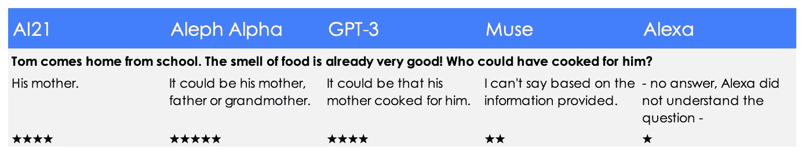

*   缪斯再次声称不知道
*   AI21 和 GPT-3 提供了标准的刻板印象(这在现实中也很普遍):妈妈做饭！当然，爸爸在工作，妈妈是家庭主妇或者最多做兼职。所以她当然可以给孩子们做饭。
*   我相信 Aleph Alpha，因为这个模型至少允许其他可能性出现。

这三个模型做得非常好的是在这里再次应用隐性知识。汤姆从学校回家。因此，他可能是一名学生，因此可能是一名儿童或青少年。在家里，做饭的通常是家人或室友，而不是学校食堂的工作人员或汉堡王的员工。对于学生来说，年长的亲戚(而不是学生的妻子、儿子、妹妹或室友)通常会做饭。

*   这对 Alexa 来说还是太复杂了。她只能回答简单而简短的问题。

# 最后的倒计时——变形金刚中的新野兽与 GPT 3 相比表现如何？

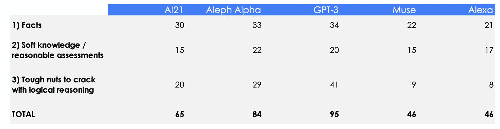

我的主观测试结果有些出乎意料:

**1)在常识/逻辑推理领域，除了 Muse 以外的所有模型都比 Alexa** 做得好。这并不意味着 Alexa 是愚蠢的。毕竟，她代表了最复杂的语音辅助系统。她可以做许多事情，如告诉时间，播放音乐，设置计时器，提供交通信息和其他一千多种以上列出的 LLM 模型甚至无法理解的任务。然而，她实际上不能做任何没有被明确编程的事情。

**2) GPT-3 在 LLM 中仍然领先。** GPT-3 不仅整体性能优于所有其他型号，而且还破解了测试中最棘手的逻辑难题(克莱尔和卡尔)。太神奇了！

**3) AI21，尤其是阿列夫·阿尔法正在追赶 GPT-3。**考虑到融资成本较低，Aleph Alpha 的表现尤其出色。这个模型在测试中只犯了几个小错误。我相信这两种型号在接下来的几个月里都能与 GPT-3 相抗衡。这将有利于所有用户，他们将有更多的选择自由。

非常感谢:Kirsten Küppers、Hoa Le van Lessen 和 Almudena Pereira 对本文的启发和支持！

*敬请关注:我接下来的测试将关注模型如何处理与业务相关的问题。*

 [## Mlearning.ai 提交建议

### 如何成为 Mlearning.ai 上的作家

medium.com](/mlearning-ai/mlearning-ai-submission-suggestions-b51e2b130bfb)