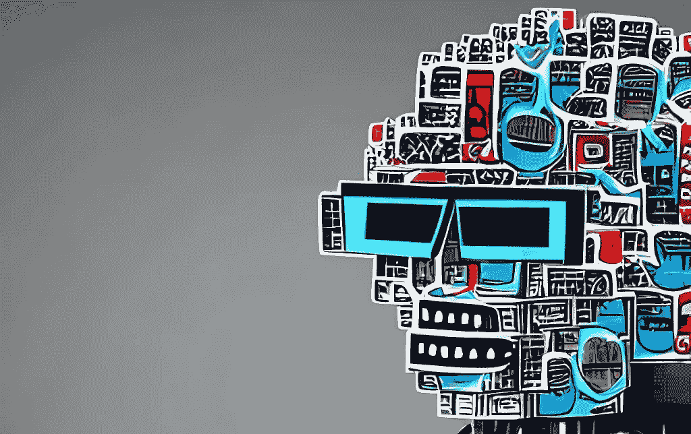

# 变形金刚 NLP 革命

> 原文：<https://medium.com/mlearning-ai/transformers-the-nlp-revolution-5c3b6123cfb4?source=collection_archive---------1----------------------->

在这篇博文中，我们将探讨****【NLP】**领域的**变形金刚**的概念。我将简要介绍变形金刚的历史，解释它们是如何工作的，并讨论它们对 NLP 领域的影响。在这篇博文结束时，你将会对变压器在 NLP 中的应用以及这项技术的潜在影响有更好的理解。**

****

**A Stable Diffusion Generated Image from [this prompt](https://lexica.art/prompt/eeb72195-5786-4e45-9c94-34bae2ddb296)**