# 将数据转换为可视化，并将其部署到云中

> 原文：<https://medium.com/mlearning-ai/transforming-raw-data-into-animated-and-interactive-visualization-and-deploying-it-on-the-cloud-f0f401c6e45f?source=collection_archive---------2----------------------->


Blobs by [Cristi Goia](https://unsplash.com/@cg) on [Unsplash](https://unsplash.com/)

在这篇文章中，我将与你分享一个简单的方法来创建互动和动画可视化，并使他们对观众来说是可及的。我将一步一步地描述如何创建、部署到云并共享一个交互式可视化 web 应用程序，该应用程序由[](https://plotly.com)**、由 [**Streamlit**](https://streamlit.io) 提供支持并部署在 [**Heroku**](https://www.heroku.com) 上。**

****这个互动动画展示了从 1952 年到 2007 年世界人均预期寿命与人均国内生产总值的对比**灵感来自[汉斯·罗斯林](https://en.wikipedia.org/wiki/Hans_Rosling) [可视化演示](https://youtu.be/jbkSRLYSojo)和贾尔斯·麦克马伦-克莱因的 [youtube 视频](https://youtu.be/oYVLxaxn3Dg)。**

**我的方法的目的一方面是通过在 Heroku 上部署它来与尽可能多的人分享这种可视化，另一方面是展示从原始数据中以人们既喜欢又理解的方式构建相关的可视化是多么容易。**

**想了解更多允许部署应用的代码和文件的可以参考我的 GitHub 资源库 [**这里**](https://github.com/rmerzouki/Data-Visualization) **。****

## **1-让我们首先看看我们想要转换的原始数据:**

**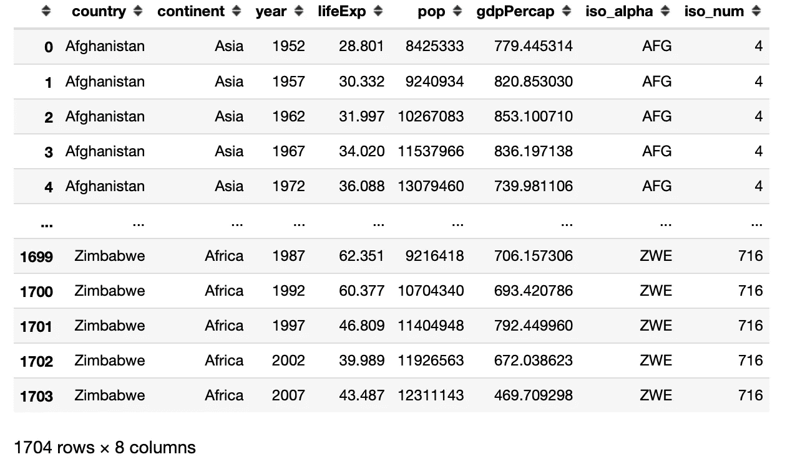****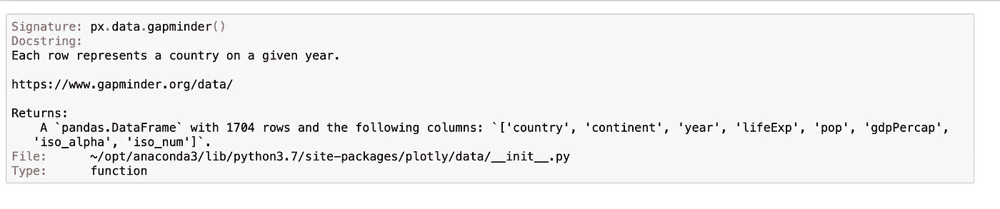**

**乍一看，分析上述来自 [**gapminder**](https://www.gapminder.org/data/) 的数据，了解各国人均寿命和财富的逐年演变，并不是立竿见影的事情。一个有趣的想法是每年为这些数据创建一个动画和交互式的可视化。**

**这正是我们要做的，使用 [**Plotly**](https://plotly.com) 进行可视化，使用 [**Streamlit**](https://streamlit.io) 这是一个非常棒的开源框架，可以轻松地创建和共享漂亮的、定制的机器学习和数据科学 web 应用程序。**

## **2 -让我们编写可视化 web 应用程序的代码:**

**您首先需要在您的环境中安装 streamlit 和 plotly。**

```
pip install streamlit plotly
```

**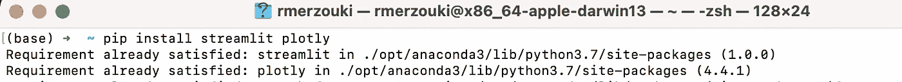**

**现在，我们能够从包含文件“life_gdp_animation_webapp.py”的目录本地运行可视化 web 应用程序，只需在终端中键入以下命令行:**

```
streamlit run life_gdp_animation_webapp.py
```

**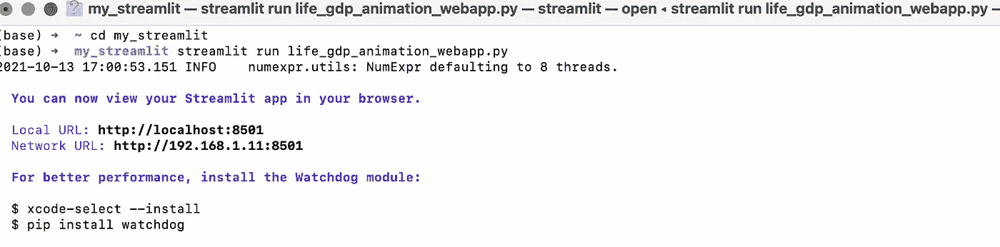****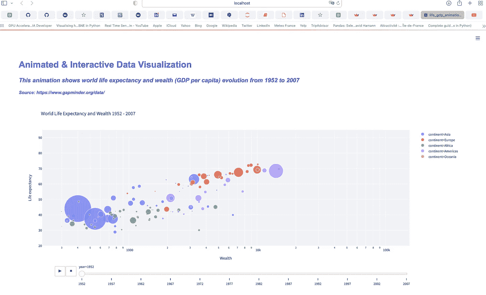**

**Image by author**

**我们现在能够与这个动画可视化互动。但这只能在本地进行。所以问题来了:怎么才能和尽可能多的人分享，或者至少和相关的人分享？**

**这就是 [**Heroku**](https://www.heroku.com/home) 发挥作用的地方。**

## **3-在 Heroku 上部署 web 应用程序:**

**[**Heroku**](https://www.heroku.com) 是一个平台即服务(PaaS)，可以用来在云中运行应用，它涵盖了应用的部署、管理和扩展。**

**在 Heroku 上启动我们的 streamlit 应用程序需要四个基本组件。因此，我们需要确保我们的应用程序文件夹中有以下文件:**

1.  **Procfile**
2.  **requirements.txt**
3.  **setup.sh**
4.  **我们的应用程序. py**

**请注意，通过 Heroku CLI 使用 Heroku 是可能的，但在本文中，我们将通过这个 [**Github 存储库**](https://github.com/rmerzouki/Data-Visualization) 来完成，其中存储了应用程序部署所需的所有文件。**

**简而言之，在这个阶段，我们已经编写了应用程序代码，创建了部署应用程序所需的文件，并将所有内容存储在上面提到的 Github 存储库中。**

**接下来的步骤将通过我们网络浏览器上的 **Heroku 仪表盘**来执行。**

## **步骤 1:通过仪表板选择创建新应用程序**

**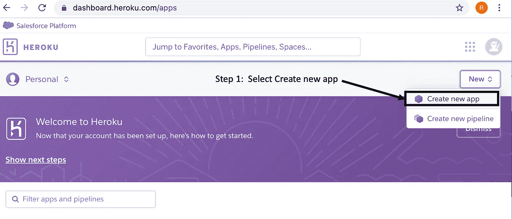**

**Image by author**

## **第二步:输入你的应用名称，点击创建应用**

****

**Image by author**

**请注意，上面是一个应用程序名称的示例，我创建的实际应用程序名称是“life-expectation-gdppca-viz”。**

## **第三步:一旦你点击“创建应用程序”按钮，以下标签打开**

**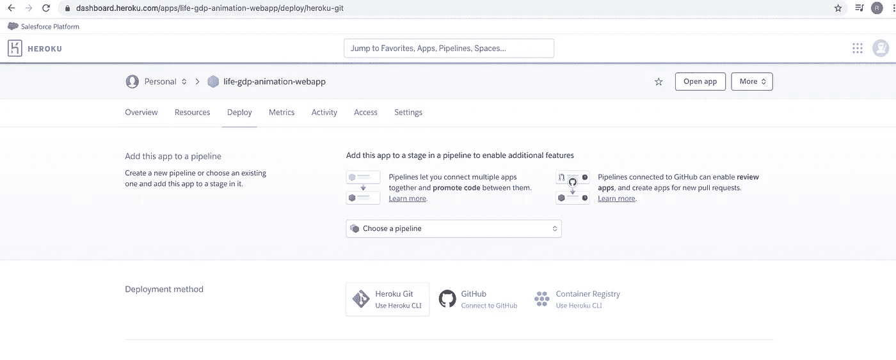**

**Image by author**

## **步骤 4:注意“Deploy”选项卡被选中，并选择 Github 部署方法**

**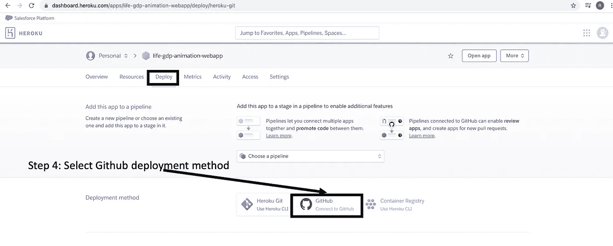**

**Image by author**

## **第五步:点击“搜索”，然后“连接”存储 app 文件的 GitHub 库。**

**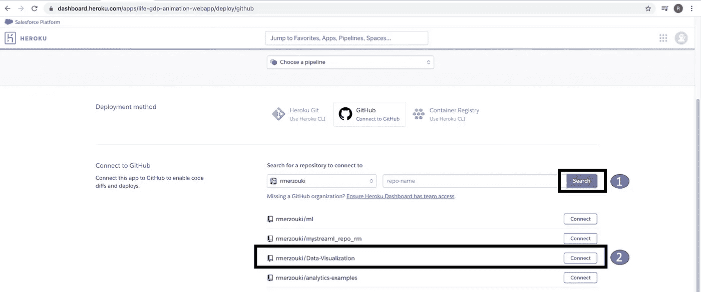**

**Image by author**

**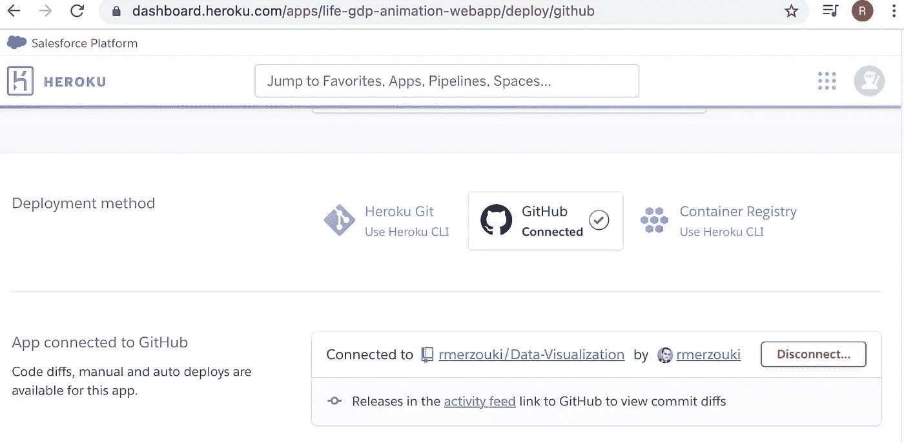**

**Image by author**

## **步骤 6:点击手动部署部分中的“部署分支”**

**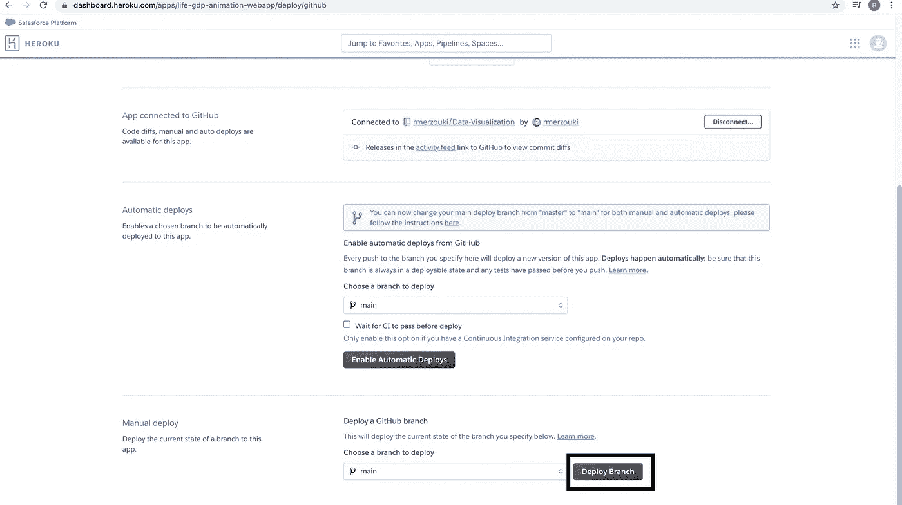**

**Image by author**

**请注意，启用“自动部署”部分下的自动部署将自动从您的 GitHub 推送最新的主分支，只要它被更新为新版本。**

**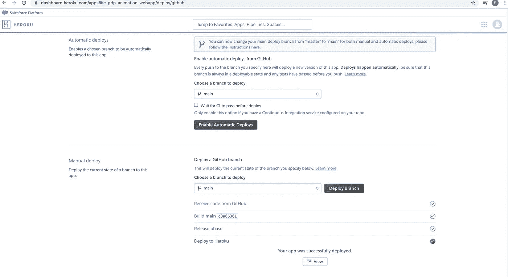**

**Image by author**

**现在你只需要点击“查看”就可以看到你的可视化应用并与之互动。您还可以与合适的人分享您的应用程序的 URL。这里是我的:[](https://life-expectation-gdppca-viz.herokuapp.com/)****。******

****那些想看一眼观想的人可以看看下面这个很短的视频:****

******结论:******

****我希望您喜欢阅读这篇文章，在这篇文章中，我描述了一种在云上部署可视化 web 应用程序的简单方法，当然这可以推广到其他 web 应用程序，尤其是可以使用 Streamlit 高效构建的机器学习应用程序。****

*******注意:不要犹豫使用*** [***我的代码和 Github***](https://github.com/rmerzouki/Data-Visualization) ***中的文件。*******

*****如果你有任何问题或者想保持联系，请随时在 LinkedIn 上联系我:*[*Reda Merzouki*](https://www.linkedin.com/in/reda-merzouki-02843b/)****

# ****感谢您的阅读！****