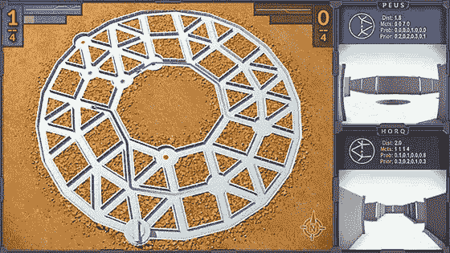
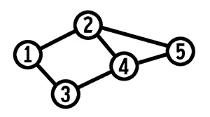
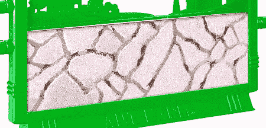
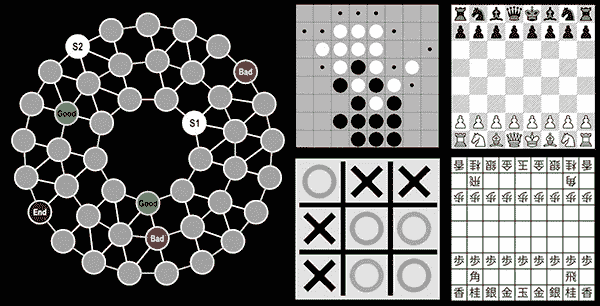
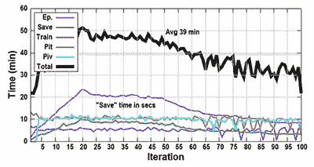
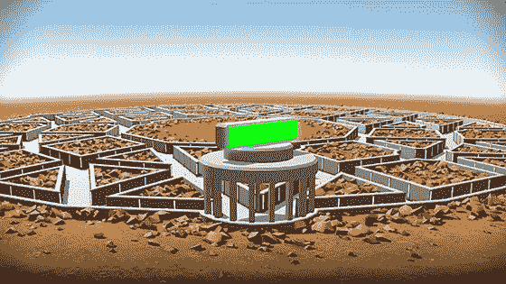
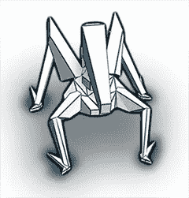

# 被困在沙漠迷宫中:AlphaZero 学会处理图形

> 原文：<https://medium.com/mlearning-ai/trapped-in-a-desert-maze-alphazero-learns-to-deal-with-graphs-4319d98569d0?source=collection_archive---------2----------------------->

许多年前，我想知道生活在图表上的有机体会是什么样子:一种通过图表来传达其经验和对世界的理解的生物。我说的“图”是指由边连接的节点组成的抽象数学实体。对图的研究，或者说 g [**图论**](https://en.wikipedia.org/wiki/Graph_theory) **，可以追溯到 1736 年当** [**欧拉**](https://en.wikipedia.org/wiki/Leonhard_Euler) **发表他的论文《柯尼斯堡的七座桥》******。****

****

**这个想法产生了许多关于这些抽象的“图形生物”如何移动、感知、交流等的想法。我给这套想法起了一个工作代号“corgon”，是“网络上的竞争有机体”的缩写。人工智能的最新进展使这一概念的真正研究成为可能，并带来了可视化的结果。所以我开始做这项研究。**

****上面提到的人工智能进展是棋盘游戏策略算法和图形神经网络。**[**alpha zero**](https://deepmind.com/research/open-source/alphazero-resources)**，由**[**deep mind**](https://deepmind.com/)**开发，大概是最知名的游戏策略算法。它源自于 2016 年在围棋中击败人类世界冠军 Lee Sedol 的**[**alpha Go**](https://en.wikipedia.org/wiki/AlphaGo)**。在分子物理学、药理学、网络科学等研究的推动下，图形神经网络(GNNs)最近也引起了人们的兴趣。****

**“图形生物”的概念在自然界中有相似之处吗？脑海中浮现的第一幅图像是蜘蛛网上的一只蜘蛛。但这不是一个好例子。虽然蜘蛛网形成了一个图形，但蜘蛛比图形的大多数边都要大。蜘蛛很少被限制在这张图上:它们在整个网上自由移动，就好像它是一个巨大的、连续的表面。一个更好的比喻是一个“[蚂蚁农场](https://en.wikipedia.org/wiki/Formicarium)”，尤其是那种狭窄、平坦的蚂蚁农场，有走廊而不是房间。**

****

**“Vintage large photo” (with permission from Uncle Milton Toys)**

**与一名人工智能程序员一起，我们开始创建一个研究这种“图形生物”的环境，使用两个库: [Spektral](https://graphneural.network/) GNN 和 **AlphaZero General** 。为了测试，我们设计了一个简单的类似游戏的场景，简称为“Ringo”。**

****

**图形的圆形、甜甜圈形状是专门选择来与典型的方形网格形成对比的，因为迄今为止 AlphaZero 解决的几乎所有游戏都是在方形网格板上进行的。因此，我们开始让 AlphaZero 处理图形。**

****在“Ringo”场景中，两个代理或机器人出现在测试图上。**他们继续探索图形，试图通过访问“好”节点(绿色)和避免“坏”节点(红色)来得分。进入结束节点结束游戏(更精确的规则见下面的视频)。**

****

**“Ringo” training chart**

**在成功的开发和训练之后，下一步是在 3D 中可视化“游戏”。并不是所有的游戏都一样有趣，所以让人工智能玩几十个游戏，然后由人类进行评估和选择。“有趣的”被传递给 3D 引擎。**

**虽然这个项目不是一个 3D 游戏，但目标是保持所有图形实时可玩(除了 2D 后期效果，如发光或扭曲)。这种可视化通常是用游戏 IDE [Unity](https://unity3d.com/get-unity/download) 完成的。相反，我们选择了 [Side FX 的 Houdini](https://www.sidefx.com/products/houdini/) ，因为它的程序工作流和 Python 集成。这使得**能够快速开发和处理**人工智能数据。使用 Houdini 的实时视口作为可编程的 3D“健身房”进行 AI 研究对 Houdini 来说是一种非常不寻常的用途，因为这种软件通常用于为电影和高端游戏渲染视觉效果。**

**被选来代表图形的 3D 设置是一个遥远沙漠中监狱般的混凝土迷宫，两个相互竞争的机器人“出生”在其中，并被告知要遵循“Ringo”的规则。**

****

**要了解结果，请观看下面的**视频。后半部分展示了来自两个最成功模型的两个示例“游戏”。同样:原始 3d 图形是从实时视窗中捕捉的。****

**Trapped in a Desert Maze: Battle of A.I. Wits**

****结论？****

****我在这些实验中发现，多年前所设想的抽象“图形生物”确实存在，在它们自己的私人图形世界中四处游荡并体验戏剧。****

**不清楚他们是否知道自己生活在模拟世界中。**

****

**参考资料:**

1.  ****D. Silver 等**[**一种掌握国际象棋、五子棋，并经过自玩**](https://science.sciencemag.org/content/362/6419/1140.full) **《科学》杂志 2018 年****
2.  **GNN 图书馆**
3.  **[AlphaZero 通用](https://github.com/suragnair/alpha-zero-general)库**