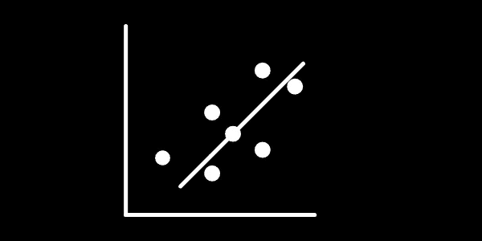

# 使用 Sklearn 的趋势线

> 原文：<https://medium.com/mlearning-ai/trendlines-with-sklearn-32791fa76d30?source=collection_archive---------4----------------------->

## 我第一次用这个工具编码感觉如何？



继续我解决一本关于商业统计的书的传奇，今天我们将谈论我使用机器学习工具的第一种方法以及书籍练习。这真的不是一个复杂的解决问题的练习，它相当简单，但是，有一些关键的东西我真的想在这里与你分享。

所以如果你没有读过我以前的文章，我强烈推荐你，你可以在这里找到它们。我选大卫·r·安德森、丹尼斯·j·斯威尼和托马斯·a·威廉姆斯的《商业和经济统计》这本书，第 11 版，练习 30，第 2 章。

## 有什么计划？


这个想法很简单，这个练习给你一个数据集，它要求你建立一个散点图和一个趋势线。

老实说，这是你能做的最简单的事情，说真的，如果你想使用 Pandas，Numpy 或任何其他库，趋势线就是一行代码，但是，我决定用 sci-kit learn，为什么？好吧，在互联网上查找，如果你想得到任何类型的指标，如果你的模型足够好，你至少需要使用 r2_score，一个 sklearn 工具，所以如果我无论如何都要走这条路，为什么我不一直走下去呢？

## 好吧，但是为什么这么明显的选择？

好吧，我的朋友，我要给你快速的版本，但真的，迫切地阅读它，因为你需要帮助，真的。但是，趋势线是由某种线性回归建立的，这是一种找到包含所有数据条目的最佳拟合方程的技术。

那么，为什么这对数据科学家如此重要呢？基本上，因为你可以从方程中预测出一些值，这很有价值。有很多种方法可以做到这一点，在这里我使用了最小二乘法，没有深入到这种技术的数学中，但是这个模型建立了一条线的方程，它与你所拥有的点的距离尽可能的近，即使你的值是负的。

Sklearn 也提供了其他进行线性回归的方法，非常复杂和错综复杂，让您找出哪种方法最适合您，但现在，我将以一种非常简单的方式进行，这里的要点是了解如何使用它，而不是使用支持向量机来处理极其简单的数据集。

## 那么结果是什么？

下面是这次尝试的结果代码:

```
# 30.import pandas as pd
from sklearn import linear_model
from sklearn.metrics import mean_squared_error, r2_score
import matplotlib.pyplot as plt
scatter = pd.read_excel('~/Documentos/projetos_ds/livro_1/excel_files/ch_02/Scatter.xlsx', 'Data')
print(scatter)# A)scatter_x_train = scatter.iloc[0:19, 1:2]
scatter_x_test = scatter.iloc[0:19, 1:2]scatter_y_train = scatter.iloc[0:19, 2]
scatter_y_test = scatter.iloc[0:19, 2]trend = linear_model.LinearRegression()model = trend.fit(scatter_x_train, scatter_y_train)scatter_y_pred = trend.predict(scatter_x_test)print('The coeffitient is: {0}'.format(trend.coef_))print('The intercept is: {0}'.format(trend.intercept_))print('The correlation of the values is: {0}'.format(r2_score(scatter_y_test, scatter_y_pred)))plt.scatter(scatter_x_test, scatter_y_test,  color='black')
plt.plot(scatter_x_test, scatter_y_pred, color='blue', linewidth=1)plt.xticks(())
plt.yticks(())plt.show()
```

如果你已经读过 sklearn 文档中的简单线性回归示例，实际上你会看到结构上非常相似，是的，我把它从那里拿了出来，你可以在这里[检查一下](https://scikit-learn.org/stable/auto_examples/linear_model/plot_ols.html)。

现在，让我告诉你我在这里的选择，从数据条目开始，如果你读了我的上一篇文章，你就会知道我对互联网上免费教育内容的看法，以及你如何通过浏览文档文件了解更多。事情是这样的，在我的国家，我们没有一个词来定义数组，我们把一切都称为矩阵，所以 1D 矩阵是一个数组，2D 矩阵是一个矩阵，在巴西，所有矩阵。我非常确定大约一年前我在 youtube 上的一个免费编码内容中学到了这一点，当它应用到一个更实际的问题时变得非常混乱。

好的，由于这种等价性，事情在开始时变得很奇怪，因为 sklearn 有不同的看法，如果你有一个熊猫系列，它是一个 2D 数组，你需要在你的模型中输入任何 x。因此，这显然是 sklearn 在线性回归上发挥作用的一个非常重要的特征，原因是它计算数据集上的行数(n_samples)和 x 的特征(n_features)，这在多变量分析中可能不止一个，但这里只有一个，结果证明该定义并不完全错误，但在实际问题中却是不必要的时间浪费。

第二，我到处计算每一行，为什么？我不想预测任何事情，只是为了拟合一条趋势线，我知道这听起来像是滥用这样一个强大的工具，但是，将它拟合到这个目的是探索这个工具的一些属性，当预测任何事情的时候，我会知道如何预测一些事情，我仍然不能 100%确定这种方式是否正确，但肯定是有效的。

我努力工作，结果是 y = 4.66–0.95 x，R = 0.73，这是一个非常强的相关性。

我在 sklearn(预测方法)中了解到的关于此功能的最后一点是，当我们的模型绘制在图表中时，它会给我们的模型一个外观，因此，我认为有两个东西可以满足此目的，即要绘制的*模型*变量和 *scatter_y_pred* ，第一个给出 x 值的预测，第二个给出 y 值。

我使用 Matplotlib 绘制图形，因为它在示例中，但是可以很容易地将其转换为 Plotly，但是对于练习新工具，这是我的学习方式。其他细节，我解决了我在 Jupyter 笔记本和 Matplotlib 之间的问题，事情是这是一个非常新手的错误，再次，如果你看到当导入 Matplotlib 时，我没有使用。pyplot，给人那种只有大三编码时才有的喘息。

## 现在怎么办？

所以我决定从两个方面来发表我的帖子，一个是非常技术性的，另一个是更多地谈论统计数据本身。这样，我可以在每个前端放更多的香蕉，而不会觉得“这太长了”。

你怎么想呢?我很想听听你对学习这些工具的最佳方法的看法，这似乎是一种练习和建立统计基础的好方法，如果我使用所有的线来拟合数据集的趋势线是正确的。

总而言之，安全保重，不断学习。