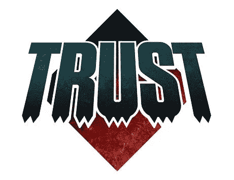

# 值得信赖的人工智能

> 原文：<https://medium.com/mlearning-ai/trustworthy-ai-d8f8e441ebcd?source=collection_archive---------3----------------------->

在数据科学和人工智能领域发展了几年后，聚光灯现在转向了值得信赖的人工智能。这篇文章想知道为什么这个新的焦点，并给出了一些个人的解释和建议。

# 信任人工智能

## 为什么对人工智能的信任是一个问题？

人工智能应用于许多不同的过程。当您启动最近的洗碗机时，会显示估计的总洗涤时间。这是基于人工智能应用于来自污垢和水硬度传感器的数据。没有人(我认为)考虑过这个估计是否绝对准确，它的计算是否真正透明和公平。没有人声称他不信任他的洗碗机。当决定你的贷款是否被批准，或者雇佣谁来获得工作机会时，信任变得更加重要。

## 关于信任有哪些顾虑？

毫不奇怪，如果软件供应商现在谈论值得信赖的人工智能，那是因为人工智能最近不被认为是值得信赖的。为什么？这到底是什么意思？根据可信人工智能的定义，似乎问题一直围绕着可解释性、公平性、健壮性、透明性、隐私性、准确性、可靠性、弹性、客观性、安全性和问责制。换句话说，人工智能的结果似乎没有被视为公平、稳健、透明、有解释、可靠、负责等。

## 为什么这些担忧比以前更加明显？

在最近人工智能的回归中，它被描述为能够代替人类进行预测和处方的机器。已经展示了许多强大的用例，并宣传了一些非常成功的应用领域。在过去的国际象棋和 Jeopardy 之后，新的人工智能可以识别收音机上的歌曲，找到到达目的地的最佳路径，将垃圾邮件移动到单独的文件夹，甚至可以驾驶你的汽车！但基于这些成功，人工智能已经被认为能够解决许多其他挑战:进行对话，组织生产，做出财务或人力资源决策，管理电力生产和运输等。

这是信任问题出现的时候:当人工智能已经开始失败。虽然人工智能成功地提供了很好的预测和处方，但人们的担忧是有限的。有许多已知的人工智能失败的例子，一些是关于性别或种族的公平或偏见(例如，一个著名的例子是基于[人工智能的招聘工具倾向于男性，因为它已经使用更古老的人类决策训练过男性](https://reut.rs/2Od9fPr))，其他人带来了一些伦理问题(例如[聊天机器人建议自杀！](https://www.theregister.com/2020/10/28/gpt3_medical_chatbot_experiment/))但也有一些是纯粹的结果会计，事实上人类比机器做得好得多(例如[沃尔玛和机器人](https://www.wsj.com/articles/walmart-shelves-plan-to-have-robots-scan-shelves-11604345341))。

一旦这些失败被公布，整个社区都在研究他们自己的数据、过程和模型的更多细节。一个看起来不错的人工智能应用程序，在其中机器很好地、容易地、有效地取代了一些基于人类的动作或代码，开始变得可疑。

## 关注哪个 AI？

当我们谈论可信的人工智能时，我们也应该澄清我们指的是什么人工智能。聚光灯下的概念在过去几年里从认知科学转向数据科学，然后转向人工智能。

虽然人工智能的定义很广，包括各种各样的技术，但事实上，聚光灯下的人工智能最具排他性的是**机器学习** (ML)。去年围绕人工智能产生的期望是在 ML 附近，而上面评论的失败是在 ML 附近。

但是 [AI 不等于 ML](/swlh/ai-is-not-equal-to-ml-2312e0a815e2) ！

## 结论

作为第一部分的结论，我的论点是，对人工智能中信任的关注出现在:

1.  ML 被过度营销为“人工智能可以解决任何问题”，
2.  曼梯·里的一些失败已经在新闻中传播开来，
3.  ML 用户现在更加了解和关注。

# 信任 ML

## ML 模型被训练

使用历史数据训练 ML 模型。好的模型允许复制过去的好的东西，排除不好的东西。这是一种基于数据的技术，而不是基于知识的技术，因此 ML 模型不能声称其价值来自对问题的完美理解的证明。证明价值的唯一方法是结果。ML 模型是相对于一些历史数据来测量的，这些历史数据通常与训练数据分开保存。但这只能衡量这种模式在过去会有多好，并不能说明它在未来会有多好。更重要的是，如果现实发生变化，我们不应该期望模式会发生变化。

## **监控、偏见和公平**

因此，在监控已部署的 ML 模型方面已经投入了相当多的工作。如上面给出的例子所示，这表明在某些情况下，一些模型有偏差，不公平，没有提供预期的价值。

这导致了信任问题的出现。

作为一个解决方案，我们建议围绕数据管理和模型管理提供更多的功能。但仍然只针对机器学习模型。这肯定会提高 ML 应用领域的 ML 模型的质量，但可能不会改变 ML 不应用领域的 ML 模型的质量。

## 正确的技术

因此，可信人工智能的问题是关于 ML 的，而为可信人工智能提出的解决方案是关于 ML 的。

这才是更让我惊讶的。当提到人类智能时，我们开始理解需要不同的思维方式(参见[我的提到思维的帖子，快与慢畅销书](/@AlainChabrier/why-intelligences-fail-80585f1d38a4))，但在数据科学社区，大多数人似乎仍然认为 ML 可以解决任何问题。

我敢打赌，所有这些工作都不会增加对人工智能的信任。另一方面，它应该最终有助于更好地说明 ML 如何不能有效地解决所有的人工智能问题，并有希望为其他技术打开大门。

## 结论

作为这一部分的结论，我的论点是 ML 不能解决所有问题，并且:

1.  围绕可信人工智能所做的工作是好的，但不会总是建立信任，
2.  然而，它将有助于更好地描绘出 ML 工作与否的情况，以及可能需要其他技术的情况，
3.  为此，我们需要清楚地理解我们在谈论值得信赖的人工智能和不值得信赖的人工智能。

# 信任 DO

## 几十年的成功

虽然在几年内，人工智能已经从对它应该能够解决的问题的巨大兴奋转变为对信任问题的关注，但其他一些人工智能技术一直在成功地做出明智的决定。运筹学(OR)真正诞生于第二次世界大战期间，作为一种优化部队后勤的方法。从那以后，数学规划被加入到其他技术中，如约束规划或局部搜索，现在被称为决策优化(DO)的技术已经被应用到大量的商业领域。每天，影响你生活的更重要的决定是通过决策优化而不是机器学习做出的。

基于这一成功，对 DO 信任的关注就不那么切题了。负责电力生产或供应链的利益相关者没有对 DO 的信任度表示担忧。当然，他们可能会要求解释、责任、健壮性或公平性，但这并没有被表达为一个问题，因为 DO 已经提供了一些工具来回答这些问题。

## 值得信赖的功能

DO 基于不同类型的算法。当一个业务用户请求对某个提议的结果进行某种解释时，可以使用 DO，并提供一些约束列表，证明为什么不同的结果会更差或无效。你可以在这篇文章中读到更多关于[解释决策优化处方](/@AlainChabrier/explaining-decision-optimization-prescriptions-7103abbc44e5)的内容。即使是简单的算法，如最短路径，也能提供比 ML 更好的解释支持。例如，谷歌地图会向你显示到达目的地的最佳路径，但也有一些备选路径，并显示它们有多长。这是值得信赖的人工智能的一个很好的例子。商业规则是另一套人工智能技术，可以很容易地解释它的处方。

当业务用户担心某些结果的**责任**时，DO 可以提供假设分析，甚至包括与未使用优化的基线场景的比较，并显示不同业务维度上的 KPI 值。在许多情况下，DO 甚至可以承诺建议的决策集相对于给定的约束是最优的。

当业务用户希望决策是**客观**和**公平**，而不是基于“过去做了什么”时，他可以请求他的数据科学家在 DO 模型中包含一些公平目标。则根据精确制定的限制，将返回所有可行解决方案中最公平的解决方案。

## 结论

我对 DO 部分的结论是:

1.  当使用 DO 时，最初提到的关于信任的许多问题已经有了一些很好的理论支持，
2.  其中一些已经被 DO 平台所支持。

# 结论

我对形势的看法总结如下:

*   在现实表明模型并不像营销信息最初承诺的那样强大后，市场开始担心对人工智能的信任。
*   正在做的工作和关注的问题，事实上主要围绕着人工智能，而不是一般的人工智能，
*   人们使用 ML 解决问题，他们被建议使用 ML，即使 ML 不是最好的技术，
*   人工智能的其他领域已经存在了几十年，它们的用户对信任没有同样的担忧。

那么我的建议是:

1.  加强围绕 ML 的工具，以更好地监控、控制和管理 ML 模型(正如所建议的，但这还不够)，
2.  扩大人工智能的视野，并接受人工智能只有在考虑更大的一套技术并启用它们的组合时才会成功，
3.  致力于工具和特性，以支持不同可用人工智能技术的组合，如 ML + DO。

想了解更多关于 AI 和 DO 的故事，或者在 Cloud Pak 了解 DO 的数据，请在 [Medium](/@AlainChabrier) 、 [Twitter](https://twitter.com/AlainChabrier) 或 [LinkedIn](https://www.linkedin.com/in/alain-chabrier-5430656/) 上关注我。

 [## Alain Chabrier-IBM 决策优化高级技术人员(STSM)

### 我的专长是管理软件开发以做出更好的决策。我一直在推动……的重新设计

www.linkedin.com](https://www.linkedin.com/in/alain-chabrier-5430656/)  [## Mlearning.ai 提交建议

### 如何成为 Mlearning.ai 上的作家

medium.com](/mlearning-ai/mlearning-ai-submission-suggestions-b51e2b130bfb) 

[成为 ML 写手](/mlearning-ai/mlearning-ai-submission-suggestions-b51e2b130bfb)