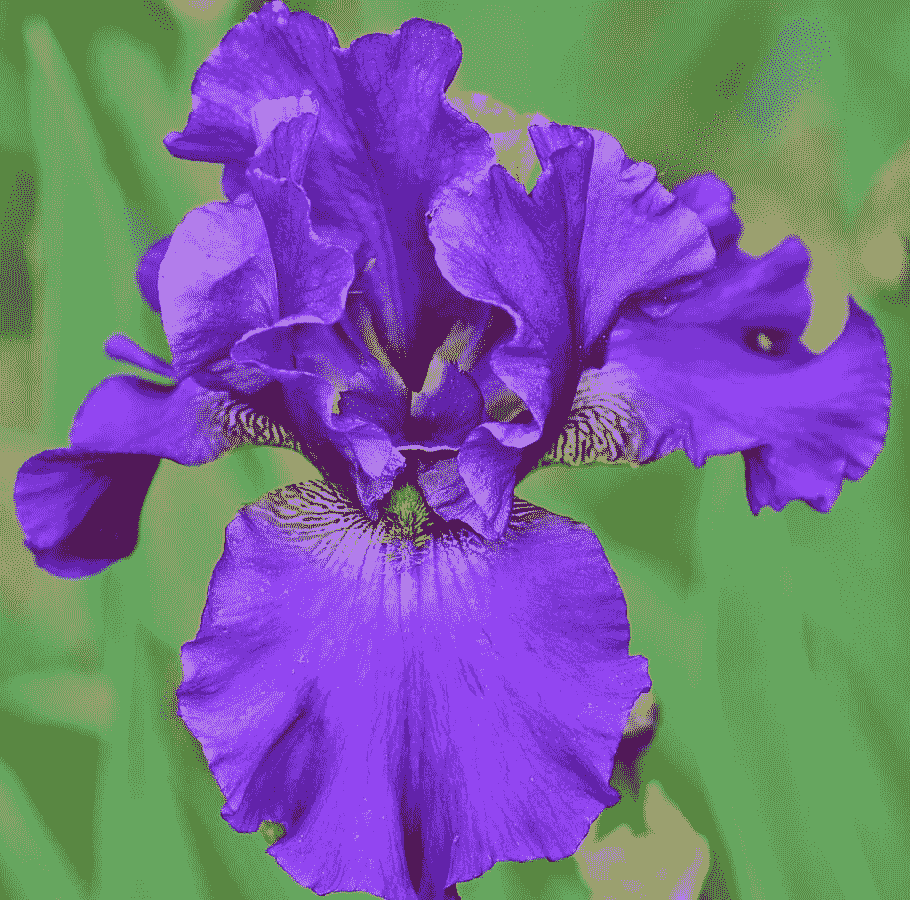

# 在 Iris 数据集上尝试 k-means 聚类

> 原文：<https://medium.com/mlearning-ai/try-k-means-clustering-out-on-the-iris-dataset-acdc65bd81f4?source=collection_archive---------3----------------------->

我不得不说，在我的机器学习研究中，我没有使用很多聚类，因为我花了很多时间在数据科学网站 Kaggle 上，它没有很多聚类比赛。事实上，最近的月度列表竞赛是该网站有史以来的第一次集群竞赛。

我正在观看一个关于数据科学的 10 小时视频和一个(小)…