# 试图在鱼类研究中把点联系起来

> 原文：<https://medium.com/mlearning-ai/trying-to-connect-dots-in-a-fish-study-c9813e187c28?source=collection_archive---------4----------------------->

## 为什么真实数据从来没有你看到的技术例子那么干净

在这篇文章中，我想向你介绍我是如何分析鱼类领域的一个特定数据集的。这来自一家商业公司的 R&D 工厂，所以我不能与你分享数据，但至少你可以看到我是如何处理的。

每当我写博客的时候，我再次清楚地意识到，我分析的数据集与图书馆文档中使用的数据集有着本质的不同。它们不太清晰、不太直观，而且通常你只能从这些数据集中得到一小部分。好了，这就是你的数据分析。它不干净。这并不简单，分析一个数据集意味着在想法、启示和碰壁之间来回穿梭，并意识到你想看到或相信你能看到的东西并不在那个特定的数据集中。也许它不会出现在随后的任何数据集中，但是由于研究很少被重复，所以你只能使用那个特定的数据集。

所以，我们又来了，向你们展示我如何分析一个商业数据集。很肯定，无论是谁读了这篇文章，都会发现更多可能已经走过的路，可能已经接近的技术，但可惜我不能与你分享这些数据。然后，它可以帮助你获得一些创造性的果汁去振兴你自己的项目。如果是这样的话，这篇博文就成功了。

我们开始吧！

```
remove(list = ls())#### LIBRARIES #####
library(dplyr)
library(skimr)
library(DataExplorer)
library(ggpubr)
library(lsmeans)
library(multcomp)
library(car)
library(emmeans)
library(afex)
library(lme4)
library(lmerTest)
library(caret)
library(mltools)
library(data.table)
library(corrplot)
library(tidyverse)
library(drc)
library(rsm)
library(mice)
library(VIM)#### DATA WRANGLING ####
## the combine file is saved as /pores_2ndRUN
MCT_all <- read.delim("PORE_run2")
MCT_all#convert to factors
mydata_all <- as.data.frame(MCT_all)
str (mydata_all)
attach(mydata_all)## Sumarize the info
group_by(mydata_all, GROUP) %>%
  summarise (
    mean = mean (TV, na.rm = TRUE),
    sd = sd(TV, na.rm=TRUE),
    median = median (TV, na.rm = TRUE),
    IQR = IQR (TV,na.rm = TRUE)
  )glimpse (mydata_all)
glimpse (MCT_all)
skim(MCT_all)
```

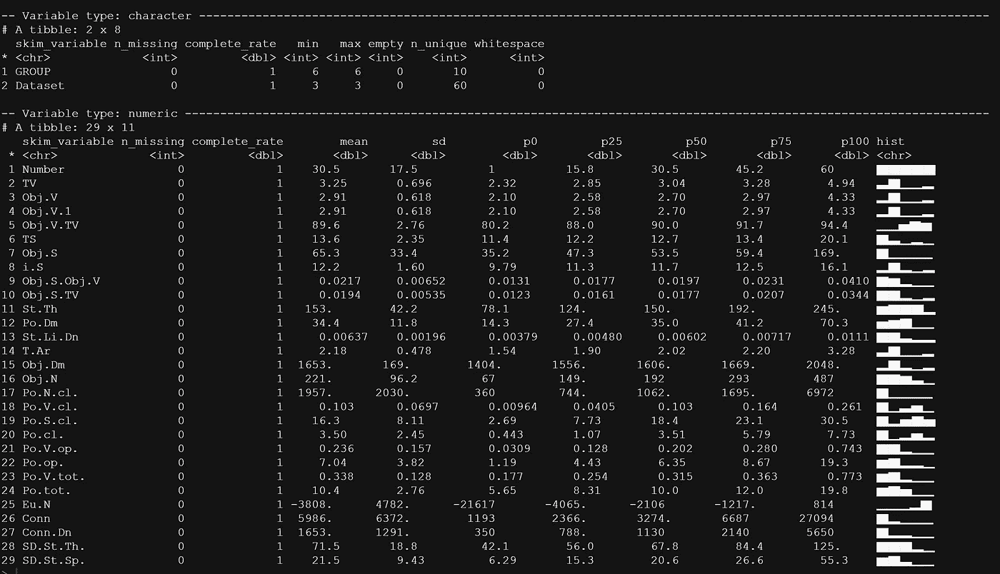

A glimpse of the data.

```
mydata_all_B<-mydata_all%>%
  dplyr::select(-c("Number", "Dataset"))%>%
group_by(GROUP) %>% 
  summarise_at(vars(TV:SD.St.Sp.), mean, na.rm = TRUE)
mydata_all$ID <- seq.int(nrow(mydata_all))
mydata_all_B$ID <- seq.int(nrow(mydata_all_B))
```

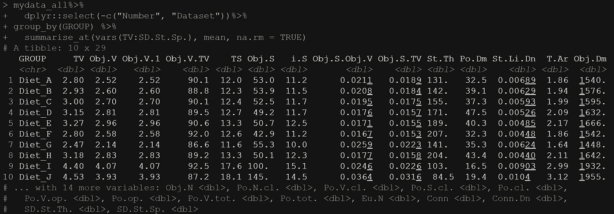

And the data much cleaner. There should be enough information included.

```
plot_intro(mydata_all_B)
plot_missing(mydata_all_B)
plot_boxplot(mydata_all_B, by="GROUP")
plot_correlation(mydata_all_B)
plot_density(mydata_all_B, geom_density_args = list("fill" = "black", "alpha" = 0.6))
plot_histogram(mydata_all_B)
plot_qq(mydata_all_B)
plot_qq(mydata_all_B,by="GROUP")
plot_scatterplot(mydata_all_B,by="GROUP")
plot_scatterplot(mydata_all_B,by="TV")
```

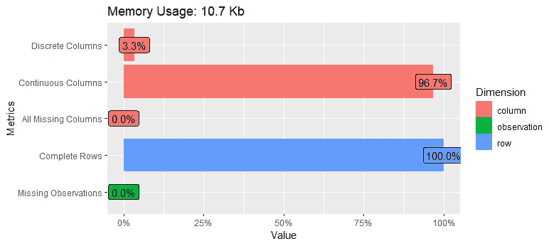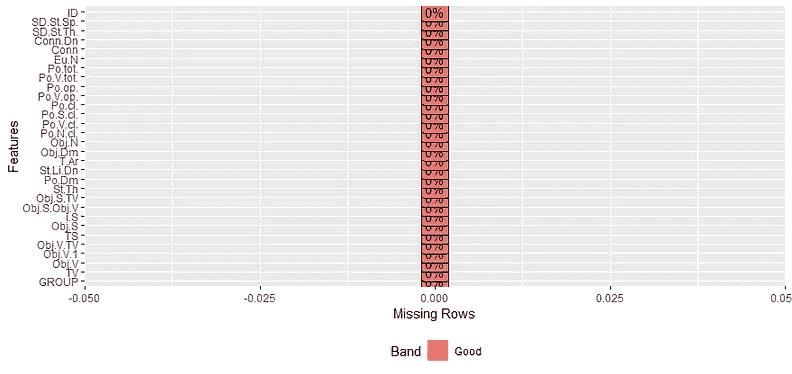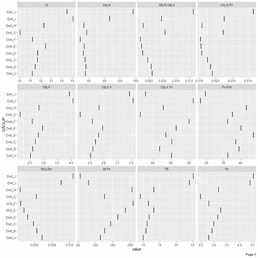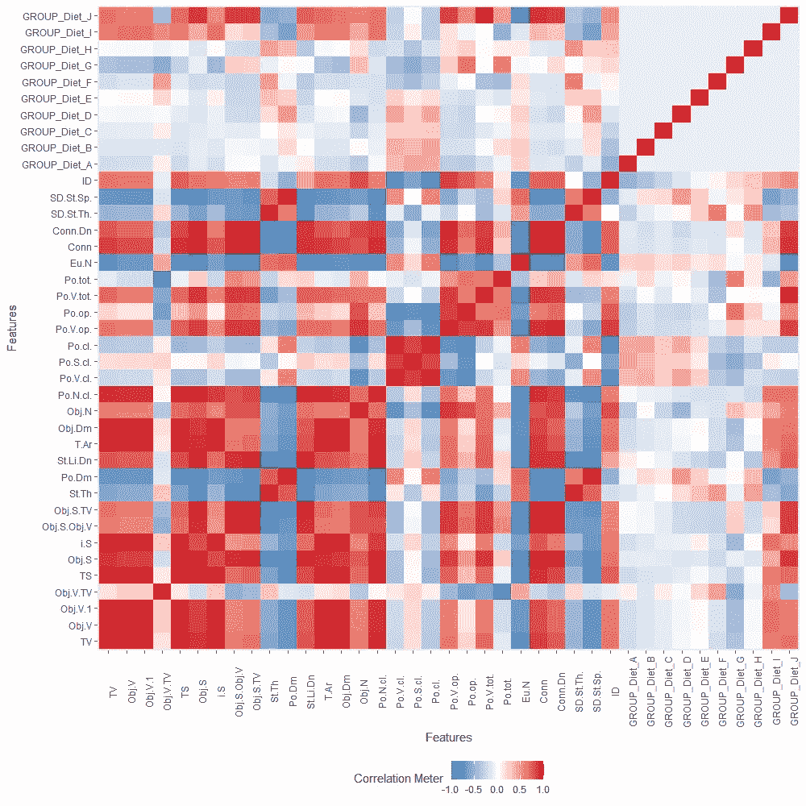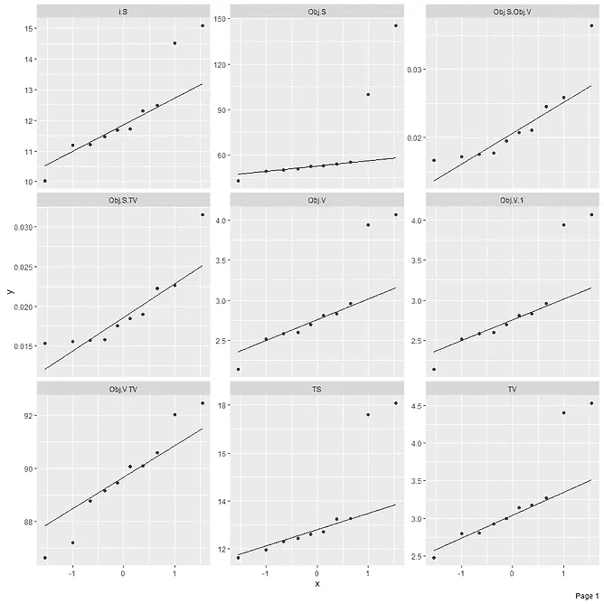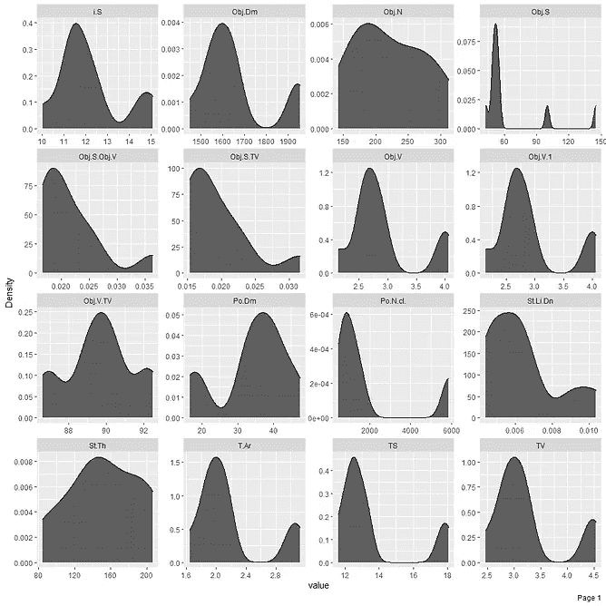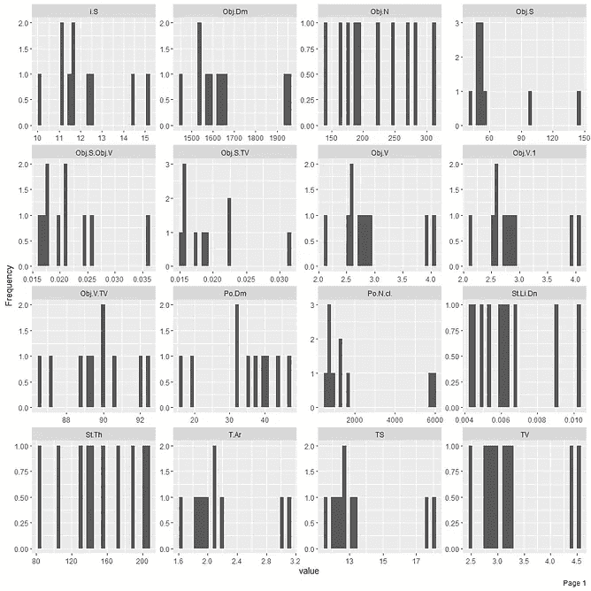

The [**DataExplorer**](https://cran.r-project.org/web/packages/DataExplorer/vignettes/dataexplorer-intro.html) library is a gem when it comes to exploring data.

```
bc <- preProcess(as.data.frame(mydata_all_B), method="BoxCox")
BoxCoxData <- predict(bc, as.data.frame(mydata_all_B))
skim(mydata_all_B)
skim(BoxCoxData)
plot_density(BoxCoxData, 
             geom_density_args = list("fill" = "black", "alpha" = 0.6))
```

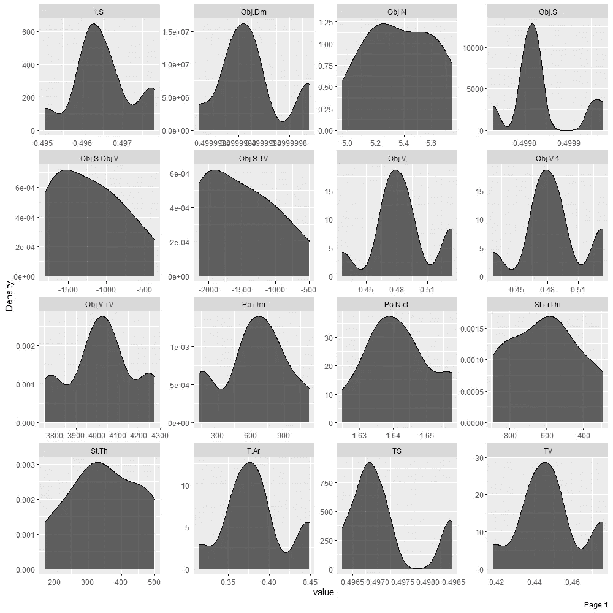

From the original glimpse made of the dataset you could already see that the variables are not normally distributed. They do not have to be! However, applying [Box-Cox transformations](https://www.statology.org/box-cox-transformation-in-r/) does make life easier when trying to converge models. However, I would always prefer to run a GLM model, since the transformations are done inside the model, via the link function, and so the back-transformation is much more straightforward.

让我们运行第一个模型，这是一个线性回归，但可以作为方差分析。它们是同一枚硬币的两面。在这里，我正在寻找作为治疗函数的感兴趣的结果之间的差异。

```
model1 <- lm(TV~GROUP, 
             data = mydata_all)
summary(model1)
par(mfrow = c(2, 2))
plot(model1)
anova(model1)
aov.model1<-aov(TV ~GROUP, data = mydata_all)
aov.model1
coef(aov.model1)
fit_emmeans <- emmeans(model1, "GROUP")
cld(fit_emmeans, Letter="abcdefg")
plot(cld(fit_emmeans, Letter="abcdefg"))
```

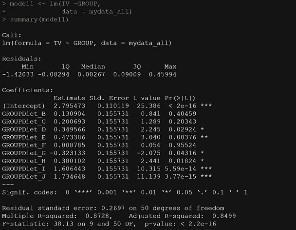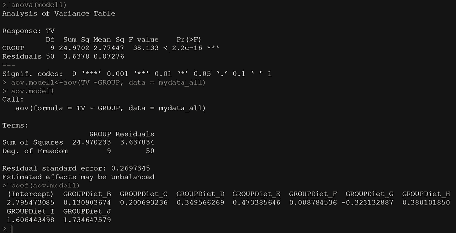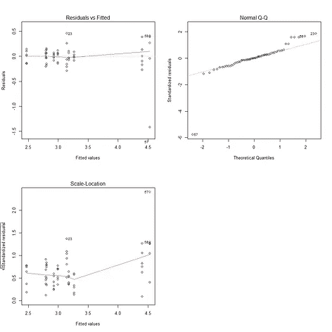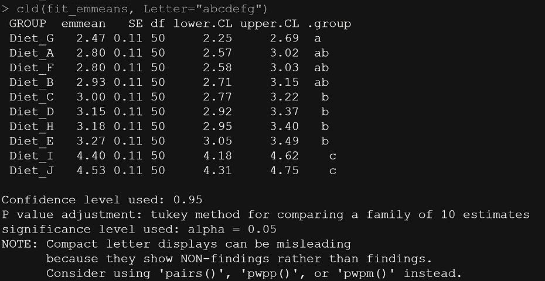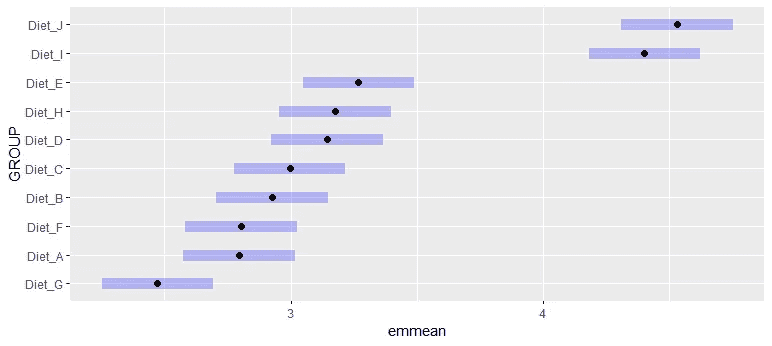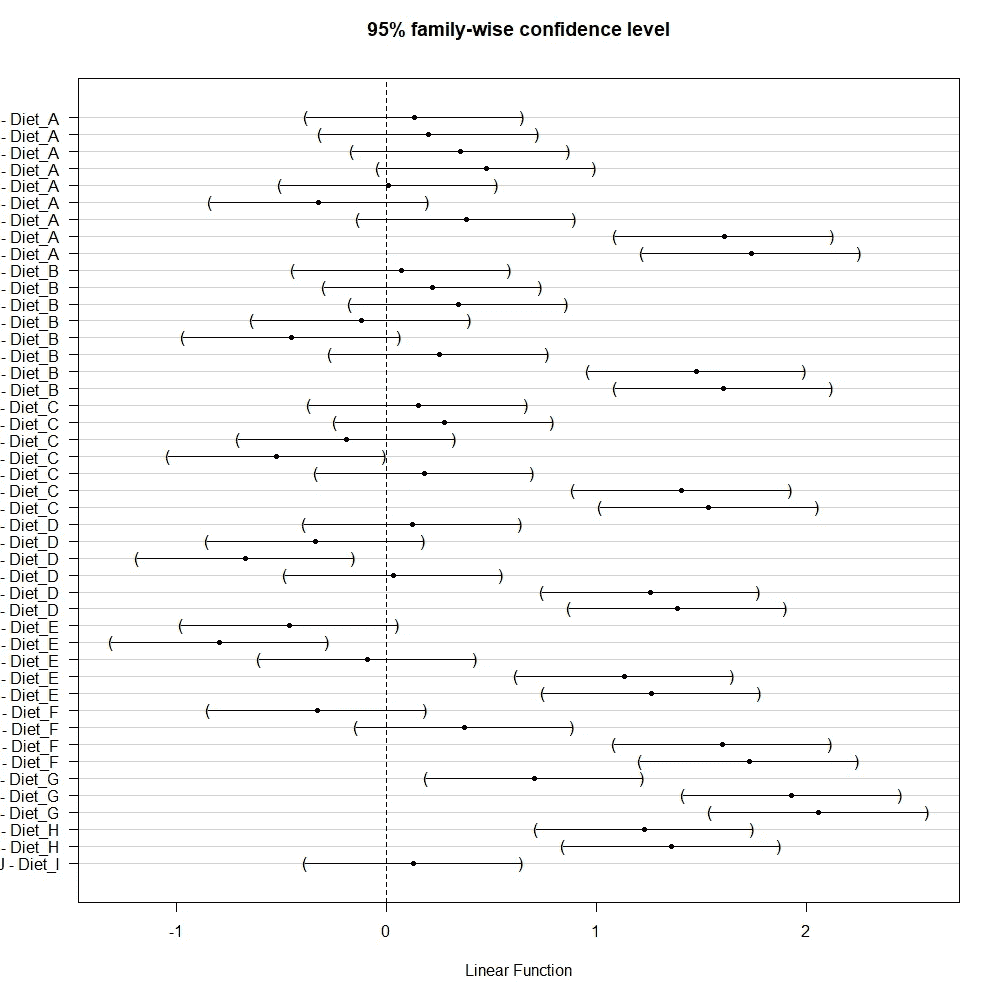

The most important plot. Differences of which the confidence interval does not include zero are significant differences. The great number of comparisons made warrant the application of a multiple-testing safeguard. Otherwise, the family type-2 error rate will no longer be 0.05 ([and that is saying that we actually like to approach data in such a way, since it is riddles with issues](/mlearning-ai/inference-estimates-p-values-and-confidence-limits-a-frequentist-approach-acdd45d94bd5)).

我们还可以在测试和训练数据集中拆分数据，添加虚拟变量，并进行交叉验证，以赋予模型更多的外部有效性(通过使用内部有效性)。

```
inTraining <- createDataPartition(mydata_all$GROUP, p = .75, list = FALSE)
training <- mydata_all_B[ inTraining,]
testing  <- mydata_all_B[-inTraining,]
skim(training)
## One Hot Encoding
training <- one_hot(as.data.table(training))
testing <- one_hot(as.data.table(testing))
# Control Resampling Methods 
tr <- trainControl(method = "repeatedcv",
                   number = 20,
                   repeats = 10)
tr1 <- trainControl(method = "boot632",
                    number =1000)# Regression Model with all predictors included - high multcollinearity
set.seed(1123)
lm1 <- train(TV~. -ID -Obj.N - Obj.V -Obj.V.1 -Obj.V.TV -Obj.S.TV -Obj.S.Obj.V -Obj.Dm -GROUP -Po.V.tot., 
             data=training,
             preProcess=c("center", "scale"),
             method = "BstLm",
             trControl=tr1, 
             na.action = na.omit)
lm1
summary(lm1)
plot(lm1)
lm1$finalModel 
model1 <- lm(TV ~GROUP + i.S + T.Ar + Po.V.cl.,SD.St.Sp., data = mydata_all)
summary(model1)
fit_emmeans <- emmeans(model1, "GROUP")
cld(fit_emmeans, Letter="abcdefg") # including confounders changes the ANOVA
comp1<-glht(model1, mcp(GROUP="Tukey")) # Comparison of diets
summary(comp1)
plot(comp1)
```

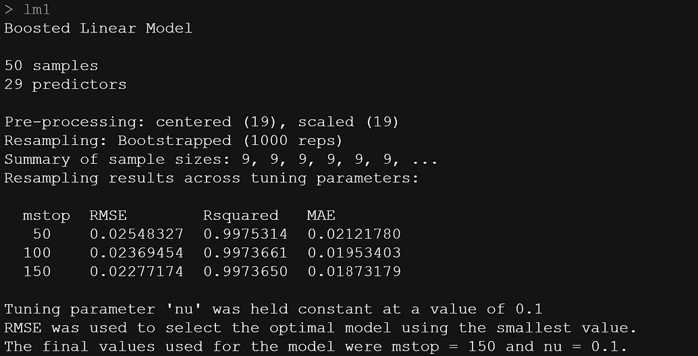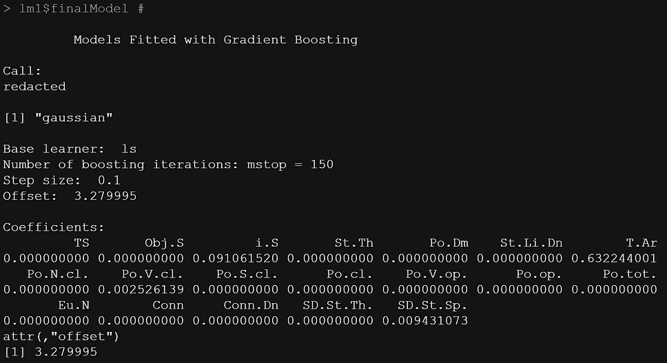

The type of model used here (**BstLm** which stands for Boosted Linear Model)will set the coefficient of non-important variables to zero.

我可以使用上面的选择来运行一个新模型，然后寻找*组*的差异，包括一些协变量。

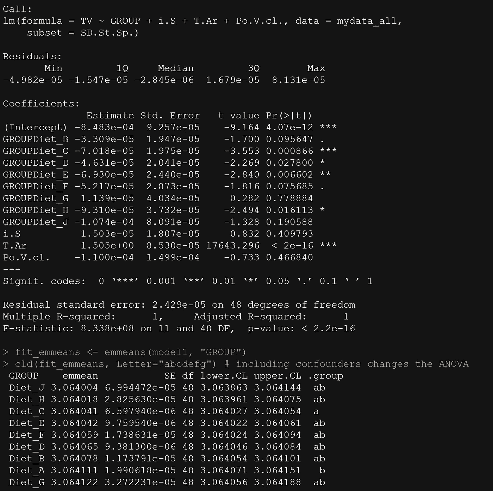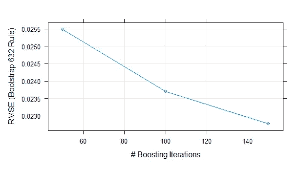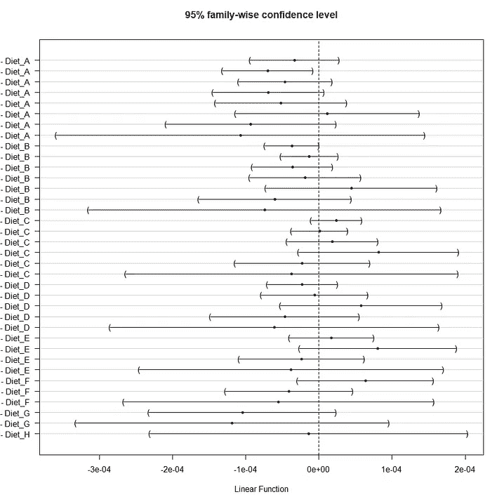

Model information to the left. To the right, we have the differences between treatments. None of the differences are now significant. I guess that including some covariances made it a bit more difficult. This is good, since you do not want to make false inferences. The side of the confidence intervals is saying something as well. They are huge! That gives you something to ponder about the model itself and its usability.

我们可以尝试和做的是将我们的分析集中在特定的饮食上，从而针对特定的人群。对于任何统计分析，您不需要这样做。事实上，分析数据的最好方法是尽可能全面地分析数据。但是，让我们来看看。

```
## Extruded vs pelleting
My_list2 <- split(mydata_all, f = list(mydata_all$GROUP))  
analysis1 <- rbind(My_list2$Diet_F, My_list2$Diet_J)
model1 <- lm(TV ~GROUP, data = analysis1)
summary(model1)
par(mfrow = c(2, 2))
plot(model1)
fit_emmeans <- emmeans(model1, "GROUP")
cld(fit_emmeans, Letter="ab") # not different in univariate analysis 
comp1<-glht(model1, mcp(GROUP="Tukey")) # Comparison of diets
summary(comp1)
plot(comp1)
```

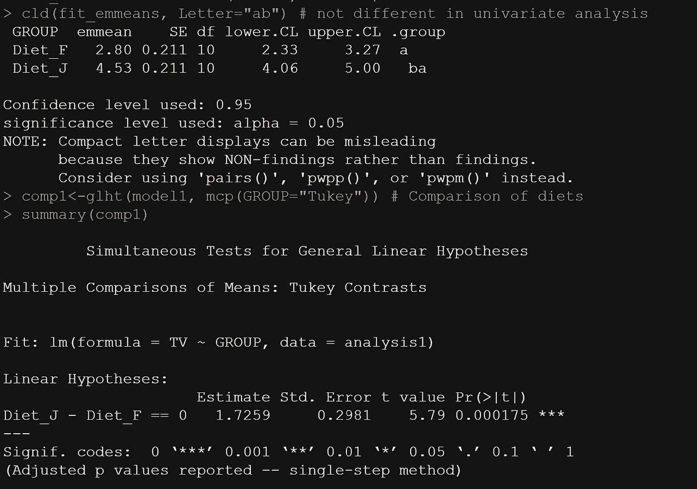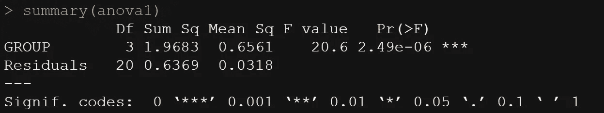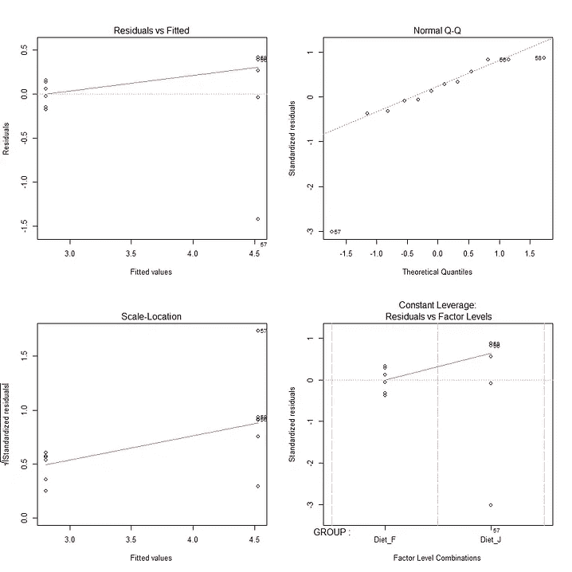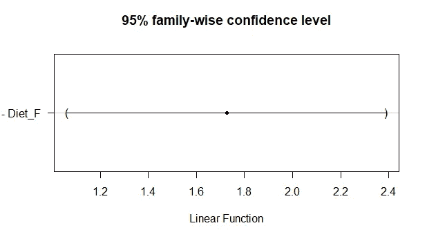

Model does really have a lot of datapoints, and although the difference is significant, I would not attach to much meaning to it. Who knows what a new dataset could bring to the table?

```
model1 <- lm(Obj.V/TV ~GROUP, data = analysis1)
summary(model1)
par(mfrow = c(2, 2))
plot(model1)
fit_emmeans <- emmeans(model1, "GROUP")
cld(fit_emmeans, Letter="ab") # not different in univariate analysis 
comp1<-glht(model1, mcp(GROUP="Tukey")) # Comparison of diets
summary(comp1)
plot(comp1)
```

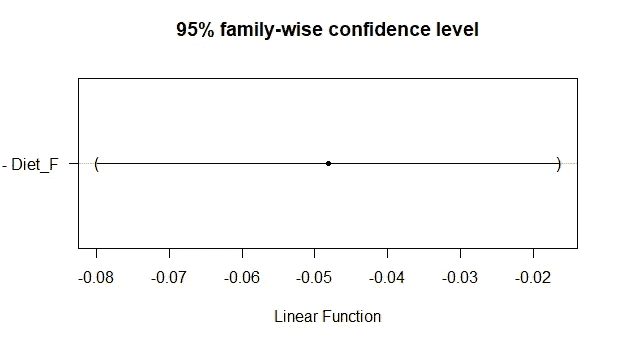

As a ratio, the difference between groups is still significant, but the differences is starting to approach zero. Whenever you find a significant difference, you always need to ask yourself how clinically relevant that difference is. It may be significant according to frequentist theory, but economically, or clinically, it does not add anything to the table. Thats why power calculations, and pre-experiment simulations are so important.

```
analysis5 <- rbind(My_list2$Diet_F, My_list2$Diet_G,My_list2$Diet_H, My_list2$Diet_D )
anova1 <- aov(TV ~ GROUP, data = analysis5)
summary(anova1)
par(mfrow=c(2,2))
plot (anova1)
model1 <- lm(TV ~GROUP, data = analysis5)
summary(model1)
fit_emmeans <- emmeans(model1, "GROUP")
cld(fit_emmeans, Letter="abcd") 
comp1<-glht(model1, mcp(GROUP="Tukey")) # Comparison of diets
summary(comp1)
dev.off()
plot(comp1)
```

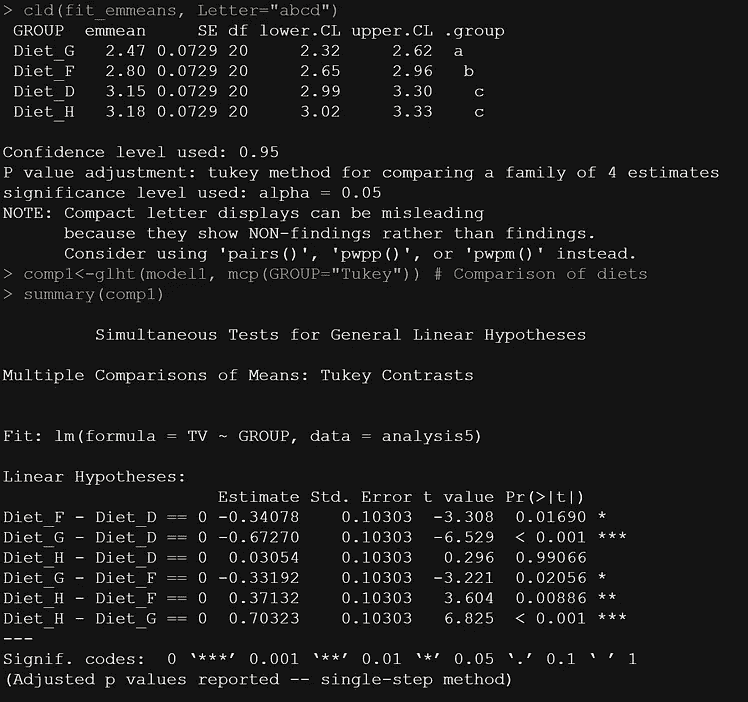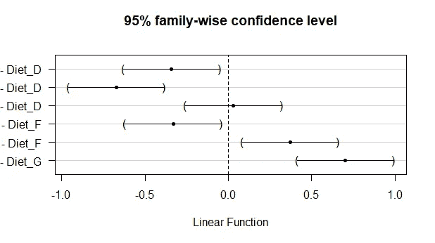

And the same again, as above, but now more data included. For some reason, the plot function does not show the treatment comparisons as a whole, which is annoying, but the plot to the right is the graphical depiction of the stats to the left.

```
c1 <- TukeyHSD(anova1)
c1a <- as.data.frame(TukeyHSD(anova1)$GROUP)
c1a$pair = rownames (c1a)c1b <- ggplot (c1a, aes(colour=cut (`p adj`, c(0,0.001, 0.01, 1),
                                   label= c("p<0.001", "p<0.01", "non-Sig"))))+
  geom_hline(yintercept=0, lty="11", colour= "grey30") +
  geom_errorbar(aes(pair, ymin=lwr, ymax=upr), width=0.2) +
  geom_point(aes(pair, diff)) +
  labs (x= " ", y= " ")+
  labs(colour="")+
  ggtitle("TV")+
  theme_bw()c1b
```

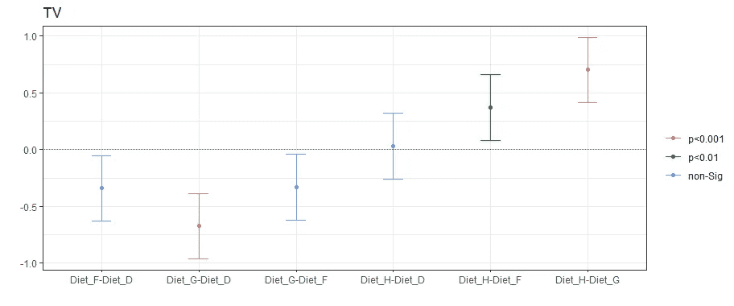

A much more beatiful way of showing the differences between the treatments for the outcome TV (NOT television ;-) ).

```
par(mfrow=c(1,3))
pelExt_control <- rbind (My_list2$Diet_F, My_list2$Diet_J)p1 <- ggplot(pelExt_control, aes(x = GROUP, y = Po.Dm, fill = GROUP))+
  geom_boxplot(outlier.shape = NA, colour = "black") + 
  scale_fill_manual(values = c("#F8766D","#00BFC4"))+
  geom_signif(comparisons = list(c("Diet_F", "Diet_J")), step_increase = 0.1)+
  theme(legend.position = "")+
  labs (x= " ", y= "Pore diammeter (nm3)")+
  scale_x_discrete(labels = c("Extruded", "Pelleted"))+
  ylim(10,50)+
  theme(axis.title.y = element_text(size = 12, face = "bold"))+theme_bw()p2 <- ggplot(pelExt_control, aes(x = GROUP, y = Po.tot., fill = GROUP))+
  geom_boxplot(outlier.shape = NA, colour = "black") + 
  scale_fill_manual(values = c("#F8766D","#00BFC4"))+
  geom_signif(comparisons = list(c("Diet_F", "Diet_J")), step_increase = 0.1)+
  theme(legend.position = "none")+
  labs (x= " ", y= "Total porosity (%)")+
  scale_x_discrete(labels = c("Extruded", "Pelleted"))+
  ylim(3,20)+
  theme(axis.title.y = element_text(size = 12, face = "bold"))+theme_bw()p3 <- ggplot(pelExt_control, aes(x = GROUP, y = Po.op., fill = GROUP))+
  geom_boxplot(outlier.shape = NA, colour = "black") + 
  scale_fill_manual(values = c("#F8766D","#00BFC4"))+
  geom_signif(comparisons = list(c("Diet_F", "Diet_J")), step_increase = 0.5)+
  theme(legend.position = "none")+
  labs (x= " ", y= "Open porosity (%)")+
  scale_x_discrete(labels = c("Extruded", "Pelleted"))+
  ylim(0,20)+
  theme(axis.title.y = element_text(size = 12, face = "bold"))+theme_bw()p4 <- ggplot(pelExt_control, aes(x = GROUP, y = Po.cl., fill = GROUP))+
  geom_boxplot(outlier.shape = NA, colour = "black") + 
  scale_fill_manual(values = c("#F8766D","#00BFC4"))+
  geom_signif(comparisons = list(c("Diet_F", "Diet_J")), step_increase = 0.1)+
  theme(legend.position = "none")+
  labs (x= " ", y= "Close porosity (%)")+
  scale_x_discrete(labels = c("Extruded", "Pelleted"))+
  ylim(0,8)+
  theme(axis.title.y = element_text(size = 12, face = "bold"))+theme_bw()tt1 <- ggarrange(p1,p2,p3,p4, ncol=2, nrow=2)
tt1
```

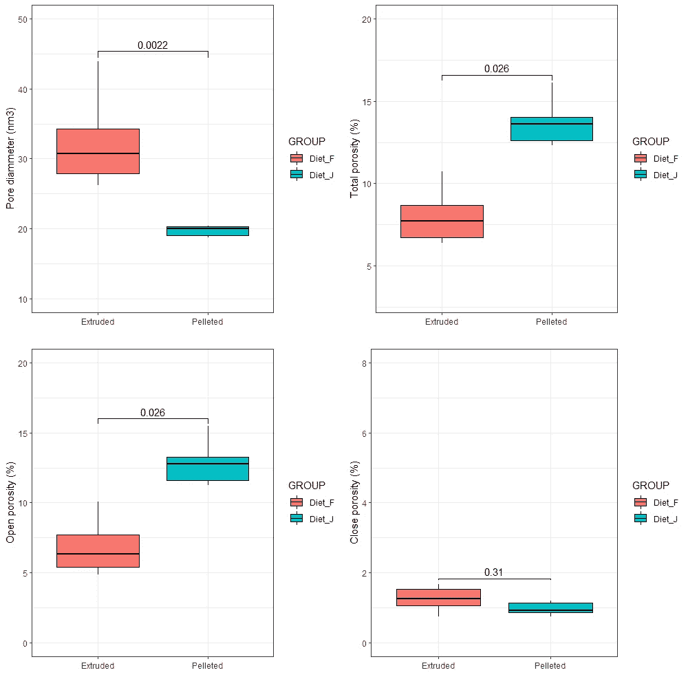

And another beautiful way of plotting differences. I take no credit for these codes btw. They were included in the dataset that I analized and augmented. It is always great to learn from somebody else, and of course so do I.

顺便说一句，你在下面看到的是使用线性模型进行多元分析的一种巧妙方式。通过使用 *cbind* 选项，您可以让 R 对多个结果进行分组比较。这叫做马诺娃。

```
model1<-lm(cbind(Po.Dm,Po.tot.,Po.op.,Po.cl.)~GROUP,data=pelExt_control)
summary(model1)
vcov(model1)
Anova(model1) #MANOVA TEST STATISTIC
fit_emmeans <- emmeans(model1, "GROUP")
plot(cld(fit_emmeans, Letter="abcd")) +theme_bw()
```

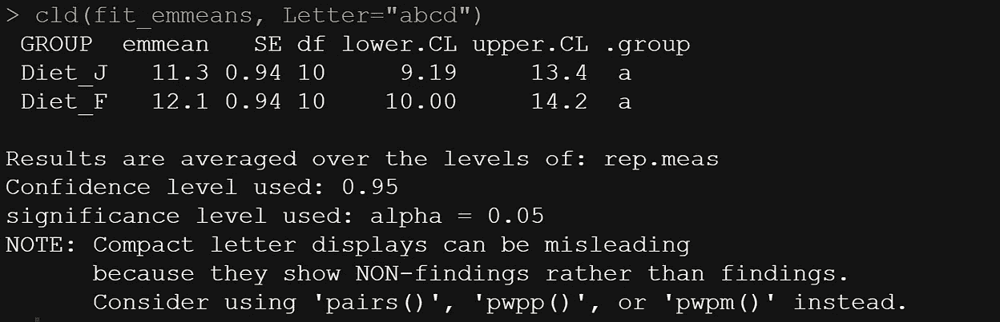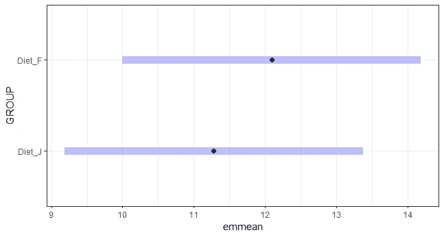

```
MCT_all
My_list2zeolite <- rbind (My_list2$Diet_A, My_list2$Diet_B, My_list2$Diet_C, My_list2$Diet_D,My_list2$Diet_E,My_list2$Diet_F )
valid.names <- names(zeolite)[names(zeolite) != "GROUP" & names(zeolite)!="Dataset" & names(zeolite)!="Number"]
zeolite$GROUP<-as.character(zeolite$GROUP)mapping <- c("Diet_A" = 10, 
             "Diet_B" = 8, 
             "Diet_C" = 6, 
             "Diet_D" = 4,
             "Diet_E" = 2,
             "Diet_F" = 0)
zeolite$concentration <- mapping[zeolite$GROUP]ggplot(zeolite,aes(x=Conn,y=TV,colour=GROUP)) + 
  geom_point() +
  geom_smooth(method = lm, formula = y ~ splines::bs(x, 3), se = FALSE) +
  theme_bw()ggplot(zeolite,aes(x=concentration,y=TV,colour=GROUP)) + 
  geom_point() +
  geom_smooth(method = lm, formula = y ~ splines::bs(x, 3), se = FALSE) +
  theme_bw()
```

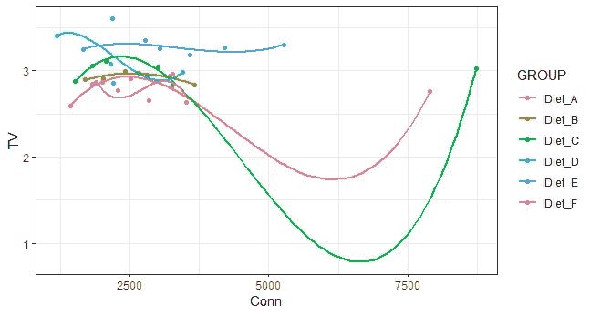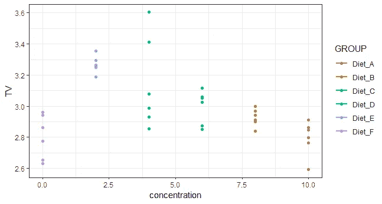

I cannot say the graph to the left is helping. Splines have a tendency to connect points, no matter what, building trajectories that make no sense whatsoever.

下面是一个聪明简单的方法，根据你的数据运行一个剂量反应模型。

```
model<- drm(TV~concentration, data=zeolite,
            fct=LL.4(names = c("Slope", "Lower Limit", "Upper Limit", "ED50")))
plot(model, type="all")
summary(model)
```

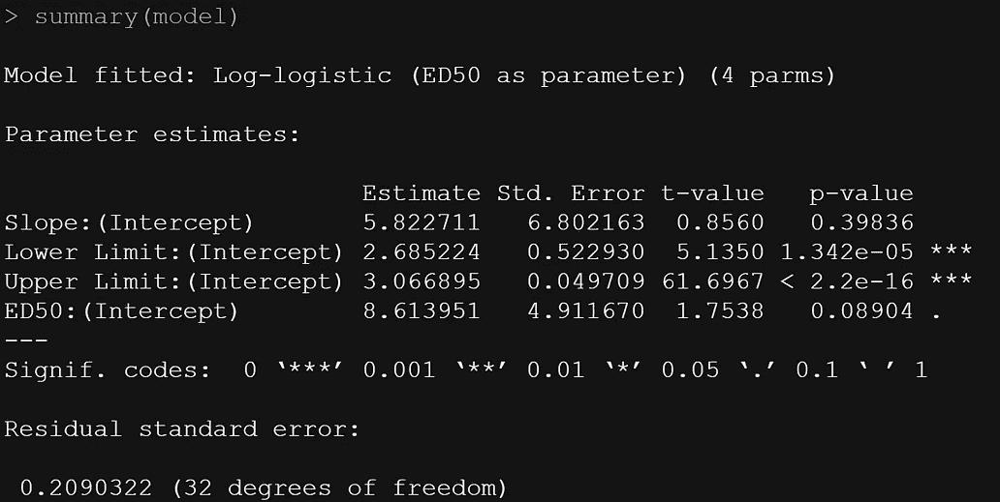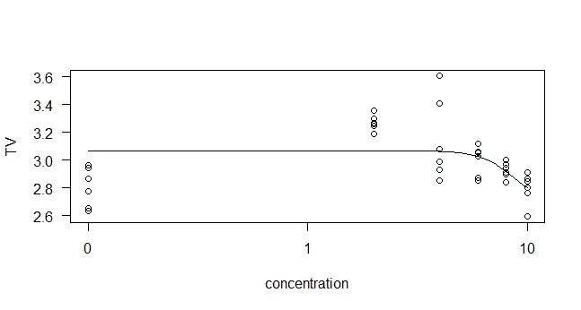

Looks like this, which looks good to me.

和一个[响应面模型](/mlearning-ai/surface-analysis-of-feed-data-in-fish-5e426464d2f4)，运行单阶连接。

```
model1<-rsm(TV~SO(concentration), data=zeolite)
plot(model)
summary(model1)
```

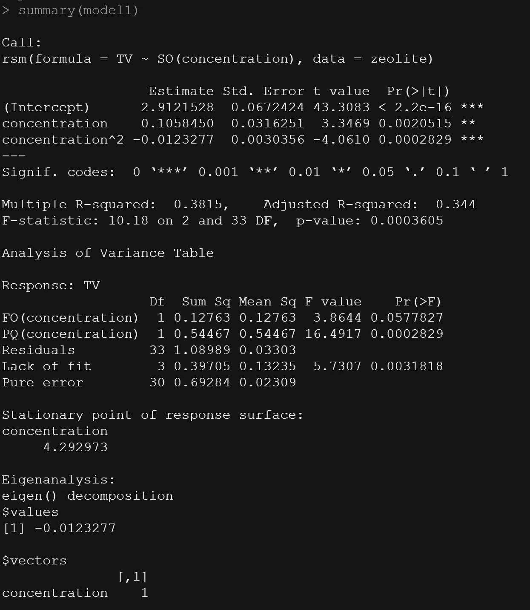

```
model2<-rsm(TV~SO(concentration, TS, Po.Dm), data=zeolite)
summary(model2)
par(mfrow = c(1, 3))
contour(model2, ~concentration+TS+Po.Dm, image=TRUE)model3<-rsm(TV~SO(concentration, TS, Po.Dm, T.Ar), data=zeolite)
summary(model3)
par(mfrow = c(3, 1))
contour(model3, ~concentration+TS+Po.Dm, image=TRUE)
```

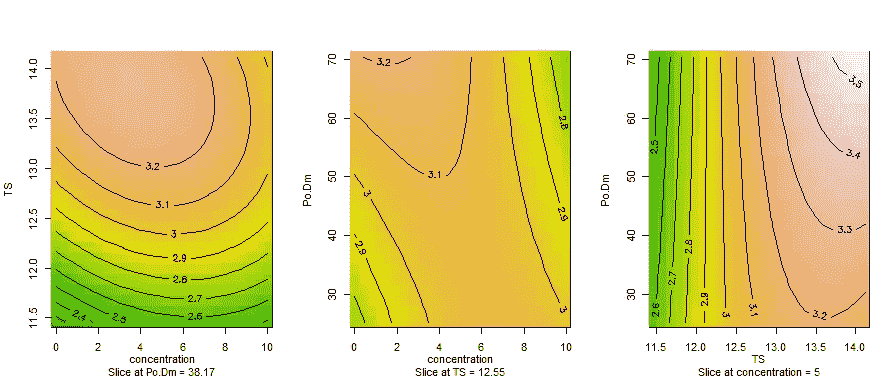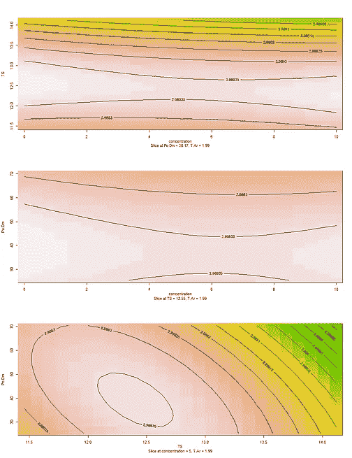

Actually looks very interesting. Not sure if the design of the study was intended to fit a response surface, but I really like what I see. A clear maximum to the left. But, also a clear sadle, and a funny looking connection which I wonder if it is not an artefact.

下面是一个不同的数据集，仍然来自 fish，展示了一个输入数据的尝试。现在，数据插补本身就是一项完整的建模工作，插补本身有很大的影响。这不是你能做的事！你做的方式会影响后续的分析。因此，尽管意在减少不确定性，你还是通过测试和整合新的假设来尝试。

```
library(readxl)
trial<- read_excel("50194 - Statistical analysis_FFA.xlsx", sheet = "Data2")
trial<-as.data.frame(trial)
trial <- trial %>% mutate(imp = if_else(is.na(tank) == TRUE, 'yes', 'no'))  
trial$imp<-as.factor(trial$imp)
## DATA EXPLORATION
plot_intro(trial)
plot_missing(trial)
plot_boxplot(trial, by="DIET")
plot_correlation(trial)
plot_density(trial, geom_density_args = list("fill" = "black", "alpha" = 0.6))
plot_histogram(trial)
plot_qq(trial)
plot_scatterplot(trial,by="DIET")
plot_scatterplot(trial,by="tank")
```

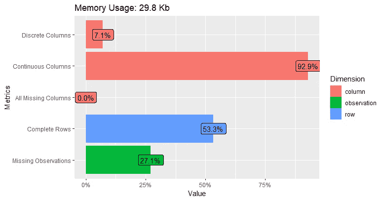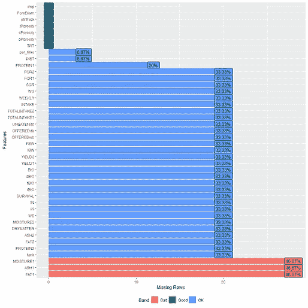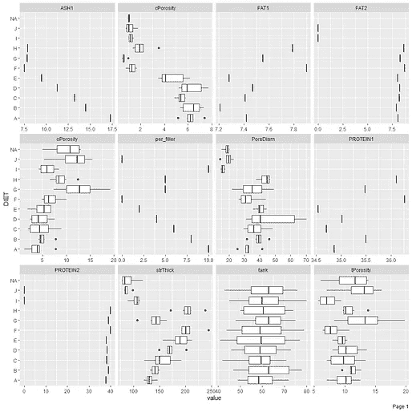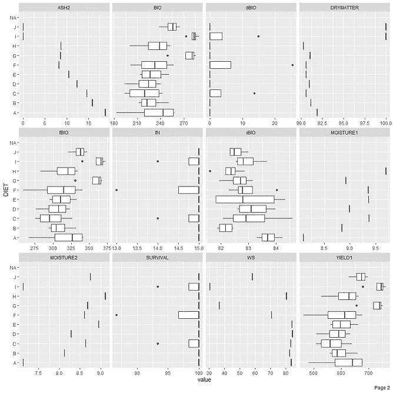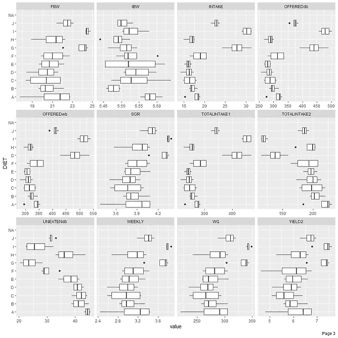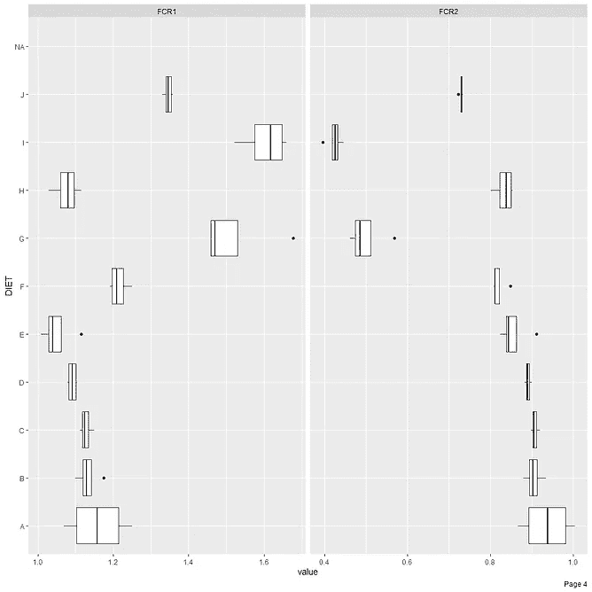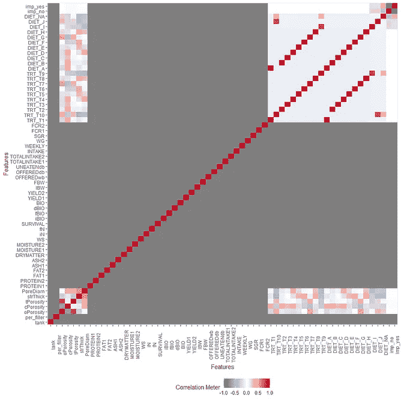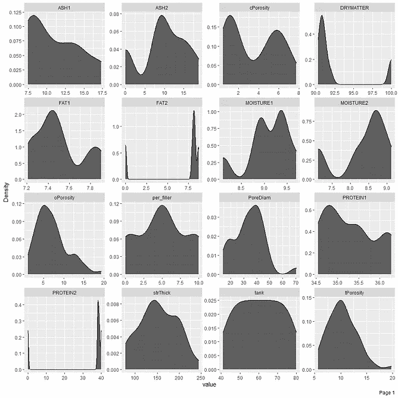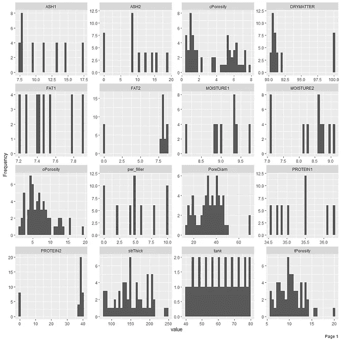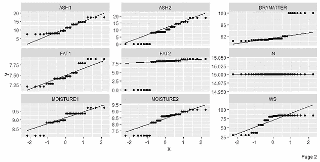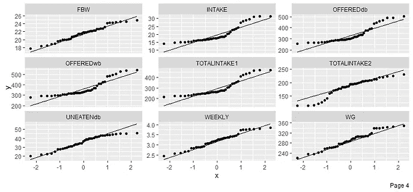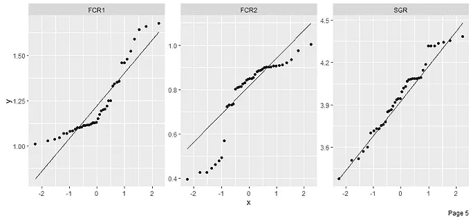

Again, explore your data!

```
fit<-lmer(FCR1~oPorosity + (1|TRT), data=trial) # I estimate different variances per Treatment 
summary(fit)
anova(fit)
coef(fit)
plot(fit) # here is where you check assumptions of normality and homogenity of variance 
require("sjPlot");plot_model(fit, type="diag")
```

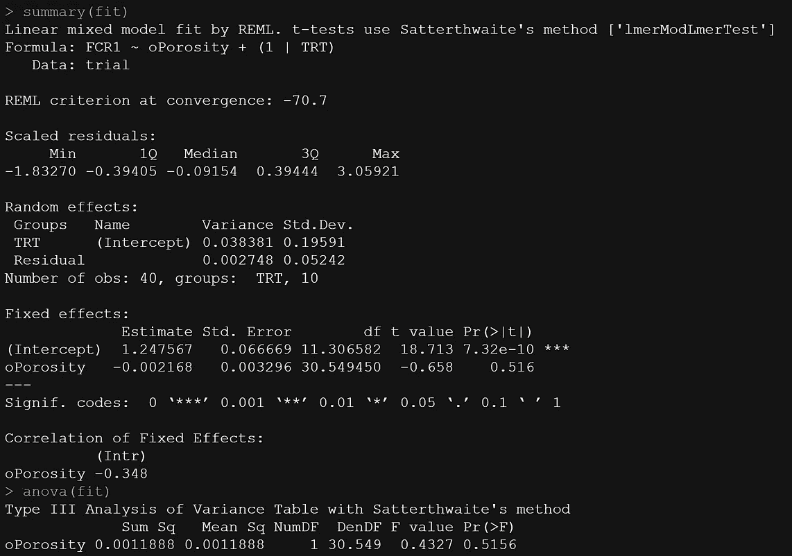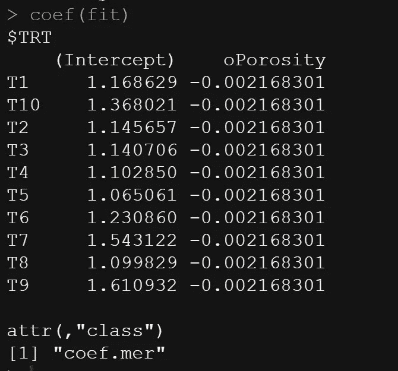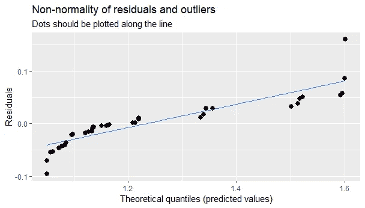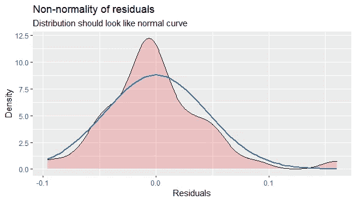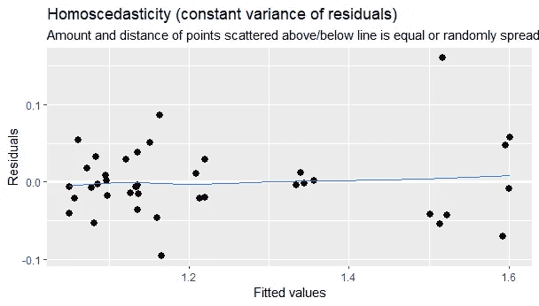

Mixed Models looks good given the sparse data included.

有两个主要的包装，可以用来填补空白。一个是 [**脱字符**](https://topepo.github.io/caret/) **包**这是一个构建预测模型的标准。下面你可以看到一个我的例子，包括一个 K-最近邻插补算法，然后检查它是否有意义。似乎是这样的，但是，使之有意义并不是插补模型的最大目标。这实际上是危险的，因为你试图去填充那些你永远无法证实它是否真实发生过的东西。

```
fit2<-lm(FCR1~oPorosity, data=trial) 
summary(fit2)
require("jtools");plot_summs(fit, fit2, scale = TRUE, plot.distributions = TRUE)
## Quick way to do imputation
knn_imp <- preProcess(trial, method="knnImpute", k=2)
trial_imp <- predict(knn_imp, trial)
skim(trial)
skim(trial_imp)
plot_boxplot(trial_imp,by="imp") # check imputation
ggplot(trial_imp, aes(x=FCR1, y=FCR2, colour=imp))+
  geom_point()+
  facet_grid(cols = vars(TRT))+
  theme_bw()
```

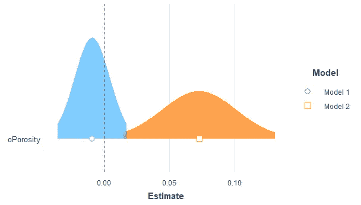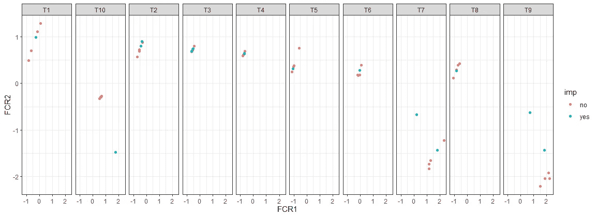

To the left, you can see the difference of a mixed model and a standard linear model. The mixed model is much less uncertain, probably because including a variance component reduced the residual component. To the right, you see the imputations per group for the outcomes of interest. Looks good! BUT, as a said, looking good does not automatically mean it is good.

现在，就多重插补而言，我所知道的最大的软件包是[鼠标软件包](https://cran.r-project.org/web/packages/mice/mice.pdf)。它已经存在很多年了，但是它很坚固。这里的例子是一个非常小的例子，我可以花至少 10 篇博客文章在鼠标上。

```
md.pattern(trial)
aggr_plot <- aggr(trial, col=c('navyblue','red'), 
                  numbers=TRUE, sortVars=TRUE, labels=names(data), cex.axis=.7, 
                  gap=3, ylab=c("Histogram of missing data","Pattern"))
marginplot(trial[c(40,41)]) # Not informative because they have missing at the same place 
histogram(~ oPorosity | is.na(FCR2), data=trial) # oPorosity for missing and non-missing FCR2
histogram(~ cPorosity | is.na(FCR2), data=trial) 
histogram(~ tPorosity | is.na(FCR2), data=trial)# impute the data - once again, all missing on the same place 
trialMICE <- mice(trial,
                 m=5,
                 maxit=50,
                 meth='pmm',
                 seed=500) #pmm is a fast good approximation for sparse data
summary(trialMICE)
plot(trialMICE)
trialMICE$meth 
xyplot(trialMICE,
       oPorosity ~ FCR1+FBW+SGR+WG,
       pch=18,cex=1,
       na.group = imp)
densityplot(trialMICE, ~FAT1 |.imp)
stripplot(trialMICE, FAT1 + ASH1 + MOISTURE1 ~ .imp, layout = c(3, 1))
completedData <- complete(trialMICE,1)
ggplot(completedData , aes(x=FCR1, y=FCR2, colour=imp))+ # makes the same mistakes as knnIMpute
  geom_point()+
  facet_grid(cols = vars(TRT))+
  theme_bw()
```

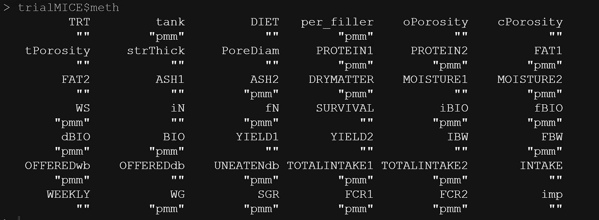

What I ask MICE to do is to fill in the missing data by looking, just like KNN, at datapoints nearest to the missing data. Since MICE uses all the viable information available, it will look at the specific column of interest and neighbour columns. That is also why it uses chains, like Bayesian Analysis, to find a solution. It needs to constantly shift between a past, present, and future state.

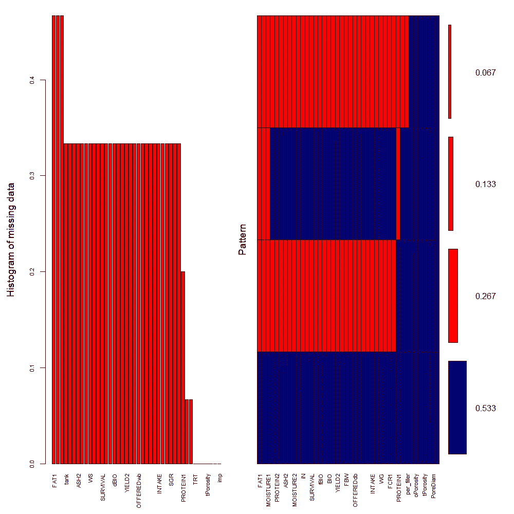

Missing data pattern.

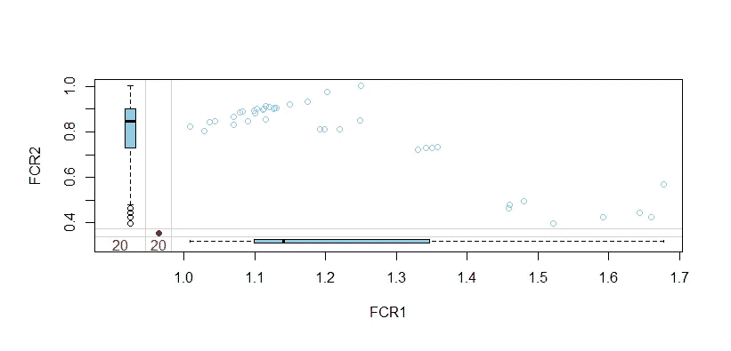

Looking at points missing for one of the outcomes of interest. Often, when trying to connect dots between two or more variables, you see a difference in one variable if the other one is missing and vice versa. If that IS the case, that variable becomes important information to imputing the missing data at the other variable.

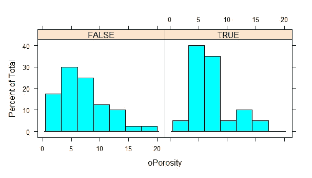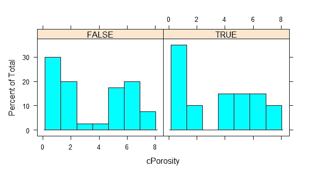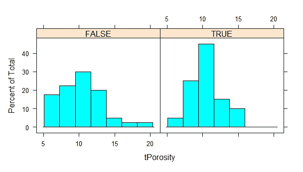

The same as above.

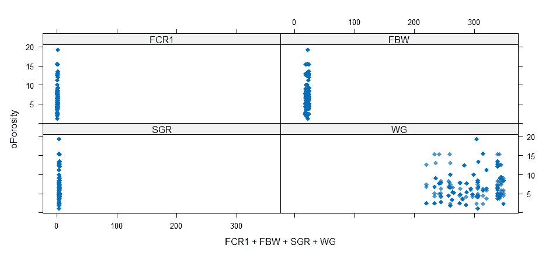

Observed and imputed data. Only really visible for WG, since they have a slightly lower color.

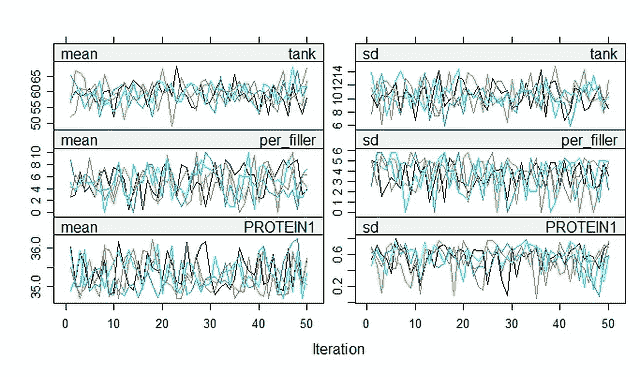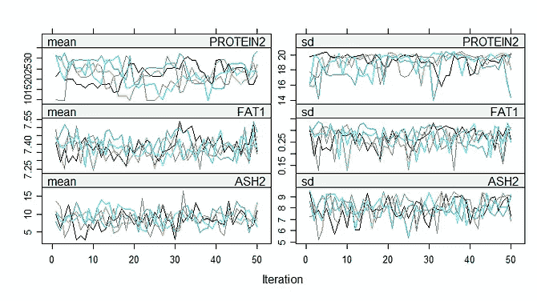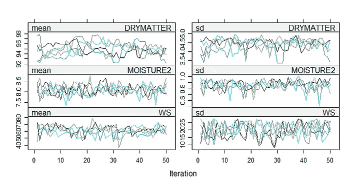

Convergence of the chains. Like always with chains you want to see NO pattern.

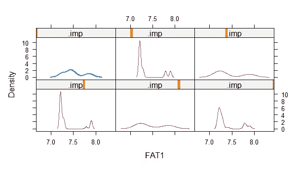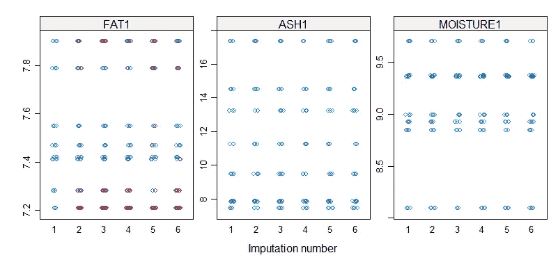

Distribution of observed and imputed datapoints. When using PMM (Predictive Mean Matching), you will always end up with datapoints that are close in proximity to other datapoints. This is what makes it a swift algorithm to use, with components that seem to make sense, but which is not always the best approach. It could very well be that your missing points come from a completely different procedure, which you actively need to model.

所以，这就是我这篇博文的结尾。就像我说的，没有确定的答案，更多的是尝试处理数据集的不同方法的集合。可以做的，或者应该做的要多得多，但这意味着要写得更多。我相信，作为一名数据分析师，你理解有时放手的痛苦。改天再来。

再说一次，如果有什么不对劲，请让我知道！

[](/mlearning-ai/mlearning-ai-submission-suggestions-b51e2b130bfb) [## Mlearning.ai 提交建议

### 如何成为 Mlearning.ai 上的作家

medium.com](/mlearning-ai/mlearning-ai-submission-suggestions-b51e2b130bfb)