# 调整神经网络第一部分

> 原文：<https://medium.com/mlearning-ai/tuning-neural-networks-part-i-normalize-your-data-6821a28b2cd8?source=collection_archive---------0----------------------->

## 标准化数据的重要性

*本系列旨在通过研究调整参数如何影响学习内容和学习方式，提供对神经网络的深入理解。内容假设了一些神经网络的先验知识，可以通过阅读* [*本系列*](/@gallettilance/neural-networks-a-very-simple-derivation-from-logistic-regression-b2b972f29138) *获得。*

[第二部分:初始化注意事项](/@gallettilance/tuning-neural-networks-part-ii-considerations-for-initialization-4f82e525da69)

[第三部分:哪些激活功能让你学会了](/@gallettilance/tuning-neural-networks-part-iii-43dfd0c8600f)

在实践中，**神经网络很少对非标准化数据起作用**。除了功能扩展之外，**规范化您的数据将防止您的网络在初始化时冻结**(从而使得以后极不可能甚至不可能了解任何东西)。

在本系列的第一部分中，我们将看到数据标准化对网络学习能力的影响有多大。

我们从涉及两个同心圆的分类任务开始

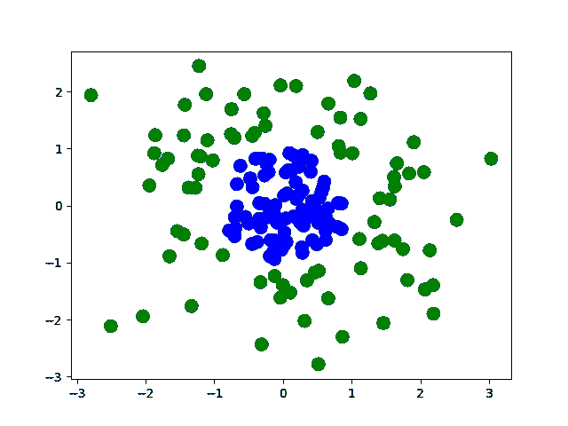

我们根据以下规则生成数据:如果 x[0] + x[1] ≥ 1，则 Y = 1(绿色)，否则 Y = 0(蓝色)。我们的目标是从我们生成的样本中找到这个规则的一个很好的近似。为了完成这项任务，我们建立了一个简单的神经网络，它有一个包含两个神经元的隐藏层:

```
model = keras.models.Sequential()
model.add(layers.Dense(2, input_dim=2, activation=SOME_ACTIVATION))
model.add(layers.Dense(1, activation='sigmoid'))
model.compile(loss="binary_crossentropy")
```

我们可以把网络想象成这样:

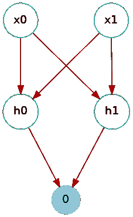

**注意:**我们使用最后一层的 sigmoid 激活和`binary_crossentropy`损失，以便利用来自逻辑回归的直觉，其中我们两个类之间的决策边界将是 h0 和 h1 的线性函数。回想一下，如果我们不激活隐藏层，那么 h0 和 h1 是 x0 和 x1 的线性函数，这意味着我们回到了传统的逻辑回归。

我们将使用 **ReLU** 激活我们的隐藏层(我们将在[第三部分](/@gallettilance/tuning-neural-networks-part-iii-43dfd0c8600f)中深入查看激活函数)，因为如果 **ReLU** 的输入大于 0，神经元将被激活，否则将被禁用。这将使关于激活的推理更加容易。

在训练上述模型时，我们可以在学习过程中定期绘制决策边界，以获得以下动画:

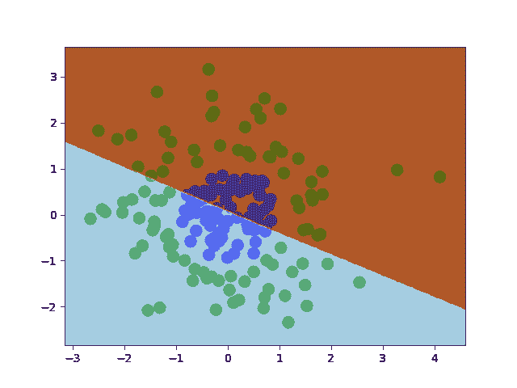

ReLU 似乎给了我们接近决策边界的线性片段。回想一下，我们的网络正在对学习到的特征 h0 和 h1 执行逻辑回归，因此我们可以在学习到的特征空间中绘制决策边界:

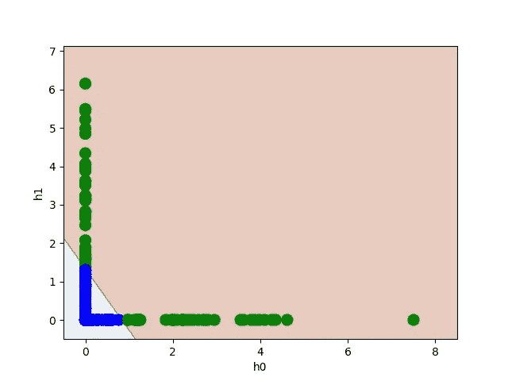

在很大程度上，似乎当 h0 被激活时，h1 没有被激活，反之亦然。当 h0 或 h1 被激活时，它输出激活它的 x0 和 x1 的线性组合——我们的数据的变换，然后网络线性分离它，如上所示。

回想一下，在给定层中负责轻推权重的梯度与前一层中神经元的激活成比例。如果用于估计损失的一批数据的神经元激活为 0，则在反向传播期间不更新权重。

激活的神经元数量会对我们的网络能够学习的东西产生很大的影响。**例如，有可能我们的数据在初始化时没有激活任何神经元。**这很糟糕，因为我们的网络将无法学习。

这种情况发生的可能性有多大？

阅读 [Keras 文档](https://keras.rstudio.com/reference/initializer_glorot_uniform.html)我们看到默认的初始化方法是在区间[-L，L]上均匀随机生成权重，其中 L 取决于层。

我们继续用上面的网络，假设所有权重都来自 U(-1，1)。如果 x[0]和 x[1]各自也来自 U(-1，1)，那么激活神经元的数量分布是怎样的？暂时忽略偏差，网络中两个隐藏神经元的 WX 大于 0 的频率是多少？

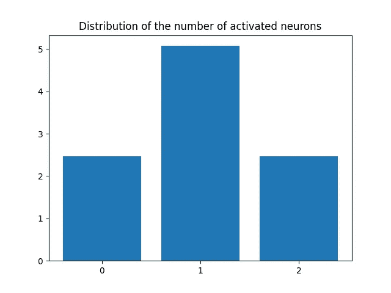

平均来看，我们似乎可以预期有一半的神经元被激活。但是数据的比例是多少呢？

我们在上面看到，我们的网络将 h0 和 h1 线性分离，这是使它们各自激活的数据部分的线性组合。**如果*所有*数据激活 h0 和 h1，那么学习到的特征只是输入的线性函数，这意味着我们回到逻辑回归。这种情况发生的可能性有多大？**

使给定神经元在初始化时激活的数据比例的分布很难计算，因此让我们运行一个模拟(现在再次忽略偏差项):

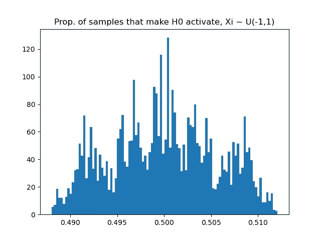

因此，对于这个特定的网络，我们很有可能有大约一半的数据会在初始化后激活给定的神经元——每个神经元随机获得我们数据的 50%。这似乎是由于我们的数据在 0 附近的对称性。

**如果我们的数据不以 0 为中心会怎么样？**这是当我们的数据从 U(-1，1)移动到 U(8，10)而权重保持 U(-1，1)时，负责激活给定神经元的数据比例分布的动画。

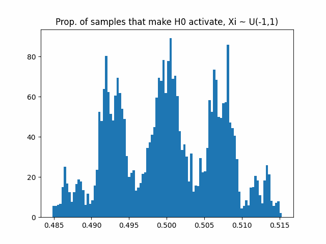

随着我们的数据远离 0，神经元在初始化时要么基于所有数据激活，要么不基于任何数据。这正是我们想要避免的情况。

在 **ReLU** 的情况下，如果一个神经元从不激活(或者只对一小部分数据激活)，那么它的关联权重将永远不会(或者很少)得到更新。如果神经元在我们所有的数据上激活，那么神经元正在学习数据的全局线性转换——将我们带回逻辑回归。

**这是所有神经元的情况，所以增加更多的层和神经元对我们没有帮助。**

以 0 为中心是否影响激活神经元数量的分布？同样，将权重分布固定为 U(-1，1)，但改变数据的分布:

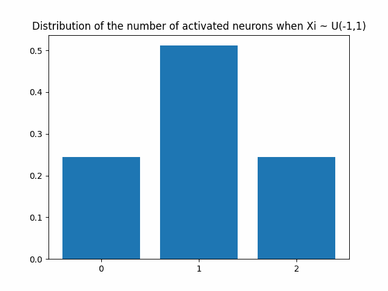

因此，我们仍然可以预计大约一半的神经元会被激活——但随着数据远离 0，这些神经元将被接近所有数据或没有数据激活。

这有直观的意义:如果 X 的所有值都是正的，那么 WX > 0 的几率是 W > 0 的几率——如果 W 以零为中心，这个几率是一半。

让我们在一个实际的神经网络上想象这种现象。

对于我们提供给网络的每个数据点，我们可以可视化每个神经元的激活。左边是初始化后的激活(如上面的隐藏层——绿色——使用 **ReLU** 激活，最后一层使用 sigmoid ),右边是训练后的激活:

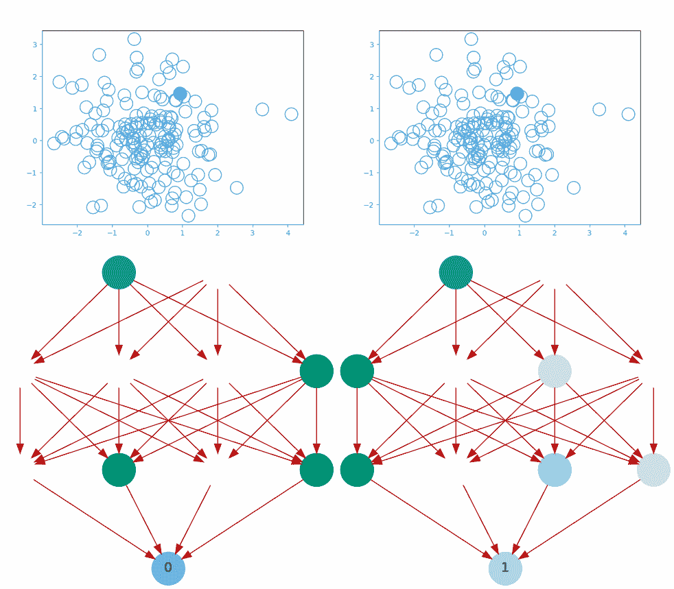

Left = at initialization, Right = after training | Green/Blue = activated, White= not activated

**我们看到了许多运动和可变性，因为每个神经元都可以访问我们数据的随机部分(我们预计约为 50%**。任何两个神经元的这些部分之间有多少重叠是随机的(事实上 U(0，1/2))。

下面是学习过程的动画:

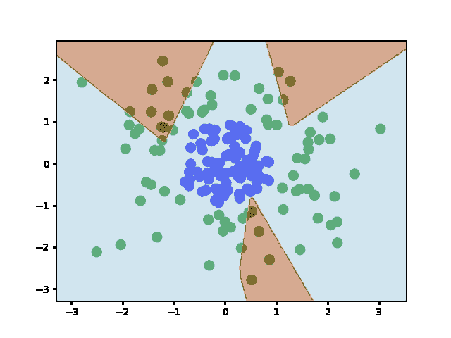

**现在来看看数据非规格化会发生什么！**对于以[10，10]为中心的数据，您将在左侧看到初始化后的网络，在右侧看到训练后的网络:

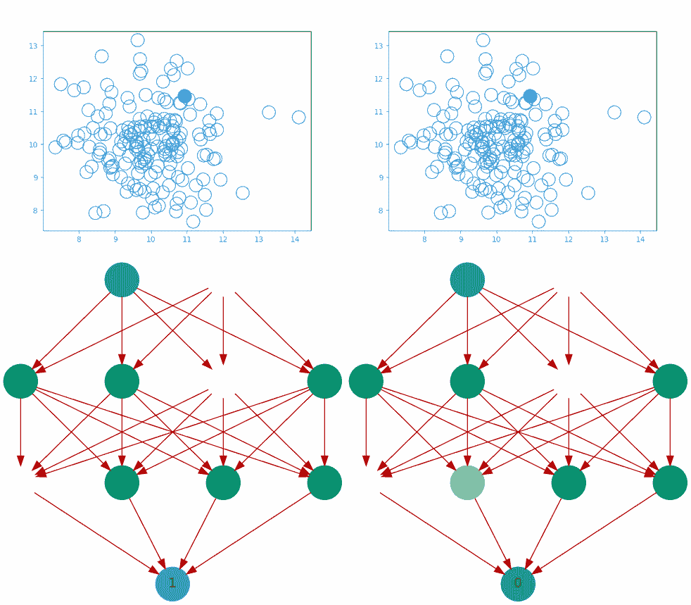

Left = at initialization, Right = after training | Green/Blue = activated, White= not activated

**网络似乎冻结了**。这些特征或者是数据的全局线性变换，或者是恒定的 0。经过一段时间的训练后(右图),这种情况并没有改善，因为它需要找到只激活部分数据的权重，而我们已经确定这种情况发生的概率非常低。我们没有学到任何新东西…下面是学习过程的动画:

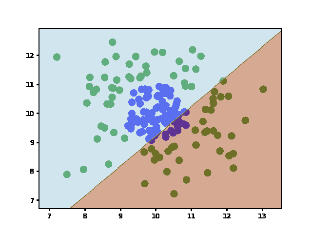

那么这仅仅是一个 **ReLU** 的问题吗？或者我们可以使用不同的激活函数来绕过我们的非标准化数据所创建的学习死胡同吗？

这取决于数据偏离零有多远。考虑 sigmoid 函数:


如果数据如上所述在[10，10]附近，那么由于 WX 可以采取非常大的幅度，我们可以预期 **𝞂(WX)** 在大多数时间有效地为 0 或有效地为 1。在这两种情况下，神经元都学习了一个对学习过程没有帮助的恒定特征。

所以**我们可以预期其他激活函数也会有同样的行为。**

以下是初始化后的激活(左侧)和训练后的激活(右侧),用于与上述相同的网络，但对所有隐藏层使用 sigmoid 激活:

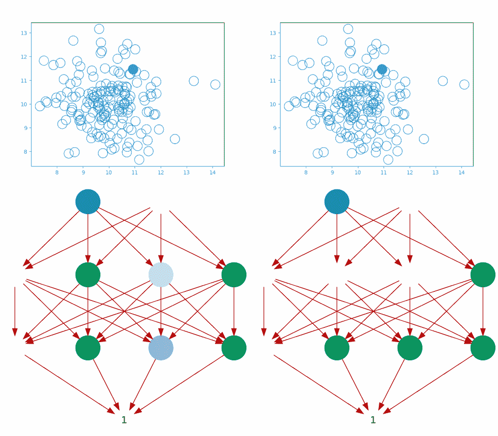

Left = at initialization, Right = after training | Green/Blue = activated, White= not activated

初始化时的激活和学习后的激活之间似乎没有太大的区别。我们可以在学习过程中绘制决策边界，看看学到了什么:

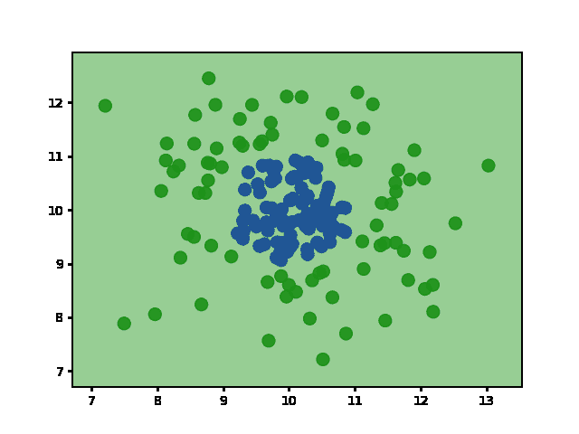

看起来我们的模型仍然只是在做逻辑回归。

为了让模型有效学习，需要分而治之。**每个神经元应该学习对一部分数据的转换。然后可以聚集来自每个神经元的局部变换来完成全局学习任务。**

**所以在尝试各种激活功能、初始化方法、架构等之前，先看看数据**。**标准化数据不仅仅是利用神经网络力量的良好实践**—**这基本上是一项要求。**

[第二部分:初始化注意事项](/@gallettilance/tuning-neural-networks-part-ii-considerations-for-initialization-4f82e525da69)

[第三部分:哪些激活功能让你学会了](/@gallettilance/tuning-neural-networks-part-iii-43dfd0c8600f)

# 感谢

感谢 James Kunstle、Yijin Yang、Cameron Garrison、Maria Shevchuk、Lin、Christina Xu 和的贡献。