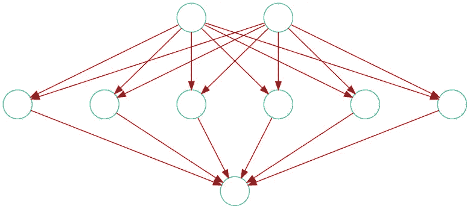
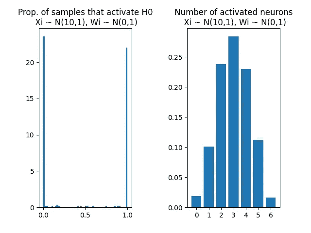
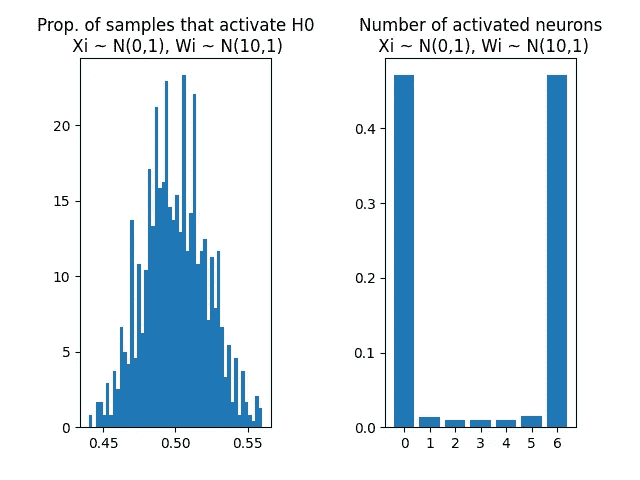
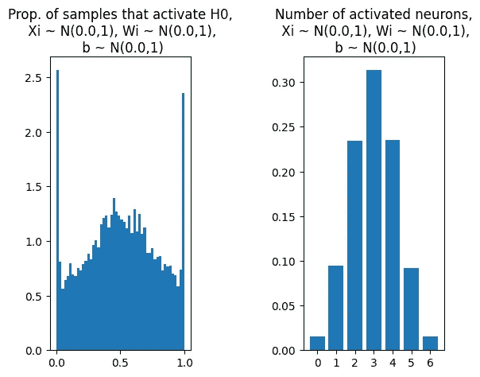
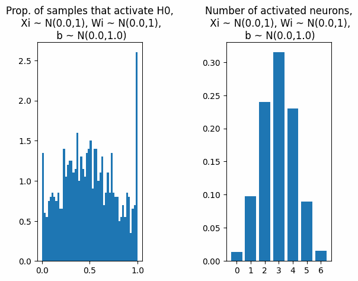
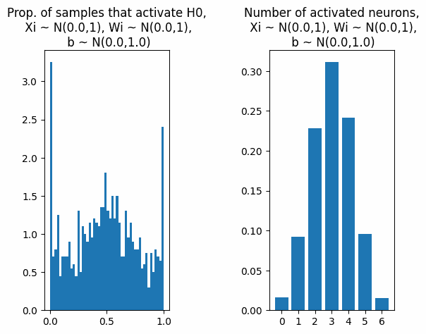
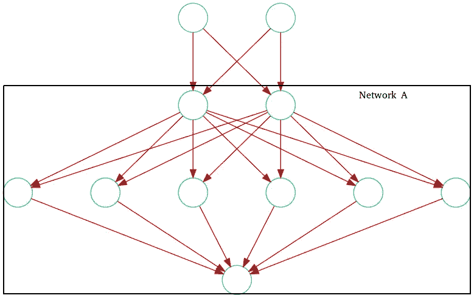
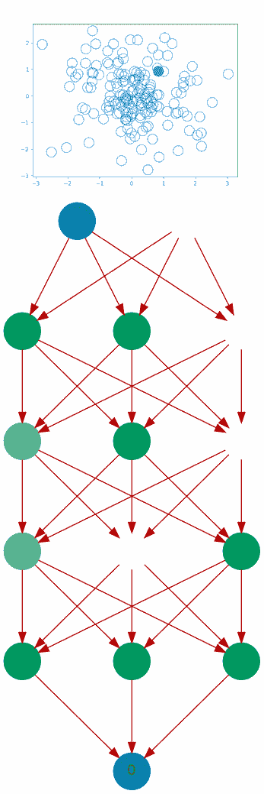

# 调整神经网络第二部分

> 原文：<https://medium.com/mlearning-ai/tuning-neural-networks-part-ii-considerations-for-initialization-4f82e525da69?source=collection_archive---------2----------------------->

## 初始化的注意事项

本系列旨在通过研究调整参数如何影响神经网络的学习内容和学习方式，提供对神经网络的深入理解。内容假设了一些神经网络的先验知识，可以通过阅读 [*本系列*](/@gallettilance/neural-networks-a-very-simple-derivation-from-logistic-regression-b2b972f29138) *获得。*

[第一部分:规范化数据的重要性](/mlearning-ai/tuning-neural-networks-part-i-normalize-your-data-6821a28b2cd8)

[第三部分:哪些激活功能让你学会了](/@gallettilance/tuning-neural-networks-part-iii-43dfd0c8600f)

让我们从下面的网络开始，其中一个隐藏层包含六个神经元，所有神经元都用 **ReLU** 激活。让我们称这个**网络为**:

为了简单起见，在整篇文章中，我们将使用 **ReLU** 激活函数激活隐藏的神经元(上面绿色部分),因为如果激活的输入大于 0，神经元将被激活，否则将被禁用。

# 非中心数据与非中心权重

当所有数据为正，权重以 0 为中心时，一个神经元是否激活(即 WX 是否> 0)完全取决于权重。由于所有的数据都是正的，我们可以预计一个神经元大约有 50%的时间被激活。第一部分中的模拟显示了神经元是如何被全部数据或没有数据激活的，很少被介于两者之间的任何数据激活。

如果神经元激活，正权重的梯度将总是正的(因为数据也总是正的)，负权重的梯度将总是负的。这严重限制了网络的学习能力，因为权重在训练期间的移动方向是由其初始值决定的。

当数据以 0 为中心但权重都为正时，神经元是否激活(即 WX 是否> 0)完全取决于数据。由于所有权重都是正的，我们可以预期神经元会基于固定的 50%数据块激活。这意味着要么所有神经元都被激活，要么都不被激活。很少能找到只让少数神经元激活的权重组合。

这也限制了网络的学习能力，因为梯度的方向仅由数据决定。

只要数据和权重都包含 0，神经元是否激活就取决于权重和数据。这意味着梯度能够在不同方向上更自由地更新权重，因为它们可以是正的或负的，而与初始化无关。

# 为什么要包含偏见术语

即使当权重和数据都集中在一起时，让神经元在随机的 50%的数据上激活仍然显得僵硬。一个网络包含的神经元越多，我们可能会在学习的特征中看到越多的重叠和重复。

进一步分而治之，我们或许能更有效地学习。如果每个神经元获得随机比例的数据会怎么样？

但是怎么做呢？

让我们包括一个偏见条款！

突然之间，使给定神经元激活的数据比例变得更加灵活，介于 0 到 100%的数据之间。

将偏置从 0 移开导致网络中神经元的系统激活或去激活:

这是需要注意的事情，因为如果平均偏差过大或过小，神经元将被冻结。

# 方差呢？

到目前为止，我们已经讨论了在训练前集中数据、权重和偏差。让我们看看当它们的分布变化时会发生什么。

改变偏差分布的方差(从而改变其可能取值的范围)允许我们调整分布的尾端:

即使以 0 为中心，我们也需要注意数据、权重和偏差的可能值范围。

如果初始化时数据和权重的方差(范围)太大，则梯度可能太大，并且网络可能超过最小成本。这类似于在梯度下降期间选择过大的步长。

相反，如果范围太小，梯度可能会非常小，从而阻碍网络的学习能力，或者权重初始化将非常接近常数(或在这种情况下为零初始化)，这将冻结模型，因为所有梯度都是相同的。

如果偏差的方差(范围)太高，我们将看到神经元完全打开或关闭。基于初始化时数据的 50%来激活一个神经元将是罕见的。随着方差的减小，偏置的初始化变得更接近常数，这对于学习来说不像常数初始化对于权重那样有害。

# 许多隐藏层

现在，考虑以下网络:

这个网络就是上一个例子中的网络 A，但是前面增加了一层。我们在上面获得的关于网络 A 的直觉仍然适用，但是现在**网络 A 部分的“数据”是第一层**的激活输出。

第二隐藏层(具有六个神经元)的“数据”是第一隐藏层(具有两个神经元)的输出。如果那个“数据”不是以零为中心的，我们会遇到我们在[第一部分](/@gallettilance/tuning-neural-networks-part-i-normalize-your-data-6821a28b2cd8)中学到的同样的问题。

**例如，sigmoid 和 ReLU 输出不是以零为中心的**，并且总是正的。因此，不推荐在隐藏层中使用 **sigmoid** 或 **ReLU** 激活，因为它可能在初始化时冻结网络更深层中的神经元，因为所学习的特征实际上是恒定的。 **Sigmoid** 在更深的层中也有消失梯度的问题。

以下是训练后的网络激活。数据、权重和偏差都在初始化时居中，所有隐藏层都被 **ReLU** 激活。

第一层似乎是随机激活的。然后，随着我们在网络中前进，神经元变得越来越冻结。在这种情况下，使用较少的层会对 **ReLU** 更好。

# 结论

即使使用以零为中心的数据，网络在初始化时仍可能冻结，如果:

1.  权重和偏差不是以零为中心的。
2.  数据、权重或偏差的方差(范围)太大。
3.  非零中心激活函数用于网络的深层隐藏层。

因此，请考虑:

1.  包括使网络中的重复工作随机化并尽可能最小化的偏置项。
2.  在隐藏层中使用以零为中心的激活来帮助抵消先前层的非正常化或保持整个层的正常化。
3.  数据、权重和偏差都是相互关联的，必须在初始化时一起仔细检查。
4.  使用多个隐藏层时使用批量规范化。

[第三部分:哪些激活功能让你学会了](/@gallettilance/tuning-neural-networks-part-iii-43dfd0c8600f)

# 感谢

感谢杨易进、卡梅隆·加里森、玛利亚·舍甫琴科、詹姆斯·昆斯特勒、林、克里斯蒂娜·徐、的贡献。