# 调谐神经网络第三部分

> 原文：<https://medium.com/mlearning-ai/tuning-neural-networks-part-iii-43dfd0c8600f?source=collection_archive---------2----------------------->

## 哪些激活功能可以让您了解

*本系列旨在通过考察整定参数如何影响神经网络的学习内容和方式，加深对神经网络的理解。内容假设您通过阅读本系列**[*可以获得一些神经网络的先验知识。*](/@gallettilance/neural-networks-a-very-simple-derivation-from-logistic-regression-b2b972f29138)*

[第一部分:数据标准化的重要性](/mlearning-ai/tuning-neural-networks-part-i-normalize-your-data-6821a28b2cd8)

[第二部分:初始化注意事项](/@gallettilance/tuning-neural-networks-part-ii-considerations-for-initialization-4f82e525da69)

# 学习了哪些类型的特征？


LEFT: decision boundary in the learned feature space (using tanh) | RIGHT: decision boundary in the input space

神经网络的第一个隐藏层中的特征是通过激活输入的仿射函数来创建的，如上所述。下一个隐藏层中的要素是通过进一步拉伸、移动和变换在前一层提取的要素来创建的，以创建更复杂的要素。这可以在到达最后一层之前做任何次数，最后一层是根据所学的特征来建立 Y 模型。

**注**:不一定总是这样。例如，可以创建一个网络，通过变换上一层要素的加权乘积来创建要素。在卷积神经网络中，通过取上一层特征的最大值、最小值或平均值来创建一些特征。

激活功能的选择以及隐藏层的数量和组成都对网络能够学习的功能有很大影响。在这里，我们将重点关注激活功能，并在第四部分检查网络架构。

没有激活功能(或有身份激活功能)，网络只会学习线性特征，详见[第一部分](/mlearning-ai/tuning-neural-networks-part-i-normalize-your-data-6821a28b2cd8)。激活函数允许创建输入的非线性函数特征。

在我们深入探讨激活函数允许您学习的内容之前，我们可能会问，我们希望从激活函数中获得哪些属性。

# 激活函数应该具有哪些属性？

技术上，激活功能唯一的要求是**可微性**。否则，基于梯度的学习方法是不可能的。

激活函数有很多好的特性:

1.  **激活阈值**:在给定的输入范围外或超过一定值时，应明确该功能是否被激活。
2.  **以零为中心**:我们可以使用偏置项控制和更新激活阈值，因此激活函数可以以零为中心。
3.  **单调性**:激活输入的正变化应使功能激活更多。
4.  **零中心输出**:激活功能的输出应该是零中心的，如果它是用于隐藏层的话，这样以后的层可以得到一个中心输入。
5.  **有界:**如果激活是有界的，那么神经元可以取的值就只能有这么大。这有助于特征缩放。
6.  **有界导数:**如果导数是无界的，则可能存在计算复杂性以及可能超过局部最小值的非常突然的大更新(称为爆炸梯度问题)。如果导数是有界的，但是边界太小，那么网络可能会遇到消失梯度问题(下面解释)。

调整激活函数类似于试图寻找线性回归中独立变量的变换。在某种程度上，在神经网络中使用非标准激活函数几乎是一种反模式。

**但是我们需要选择一个激活函数**——无论是使用我们关于 X 和 Y 如何相关的直觉还是使用标准激活函数集。我强烈地感觉到，如果可能的话，人们应该根据他们对问题的直觉来使用激活函数。我将在这篇文章中尝试传达这一点。

让我们先来看看“标准”激活功能的学习是什么样子的。

# 标准激活功能

## 热卢

我们将考察的第一个标准激活函数是整流线性单位(ReLU)函数，其中 **ReLU(x) = max(0，x)** 如下所示:

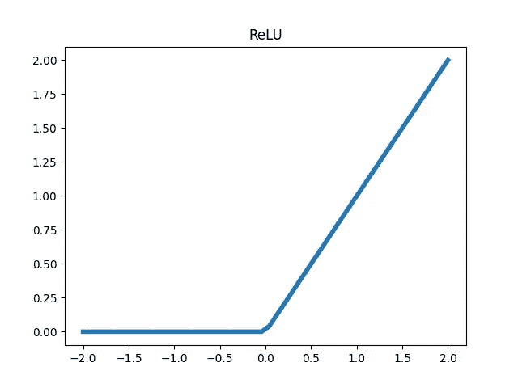

在单隐层神经网络中， **ReLU 允许我们学习输入**的分段线性函数，如果我们有足够多的段，它可能很好地逼近 Y。在多隐藏层 NN 中， **ReLU** 学习前一层的分段函数。

让我们回顾一下第一部分[中的分类任务，目标是将蓝色和绿色分开。](/mlearning-ai/tuning-neural-networks-part-i-normalize-your-data-6821a28b2cd8)

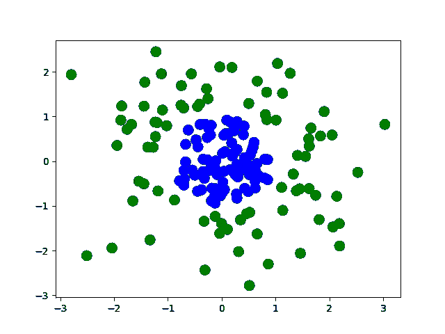

和以前一样，最后一层用**s 形管**激活，以便利用逻辑回归的直觉。如果我们只使用 2 个隐藏神经元和一个用 **ReLU** 激活的隐藏层:

```
model = keras.models.Sequential()
model.add(layers.Dense(2, input_dim=2, activation='relu'))
model.add(layers.Dense(1, activation='sigmoid'))
model.compile(loss="binary_crossentropy")
```

我们得到以下特征和决策边界:

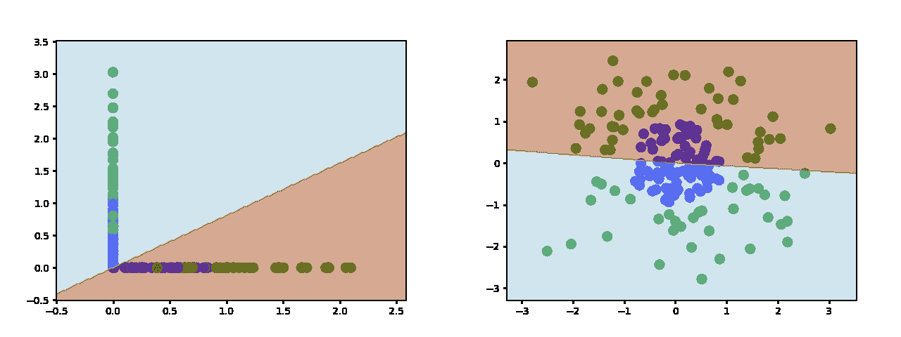

观察学习到的特征(在左边)，看起来，大多数时候，当一个隐藏的神经元被激活时，另一个为 0，反之亦然。如果两者都经常被激活，我们将在左侧图的中间看到更多的点。

查看数据(在右边)，似乎我们至少需要 5 或 6 个片段来估计这个决策边界。使用 3 个隐藏的神经元应该给我们足够的线性片段来完成任务。

以下是学习到的特征空间和决策边界的样子:

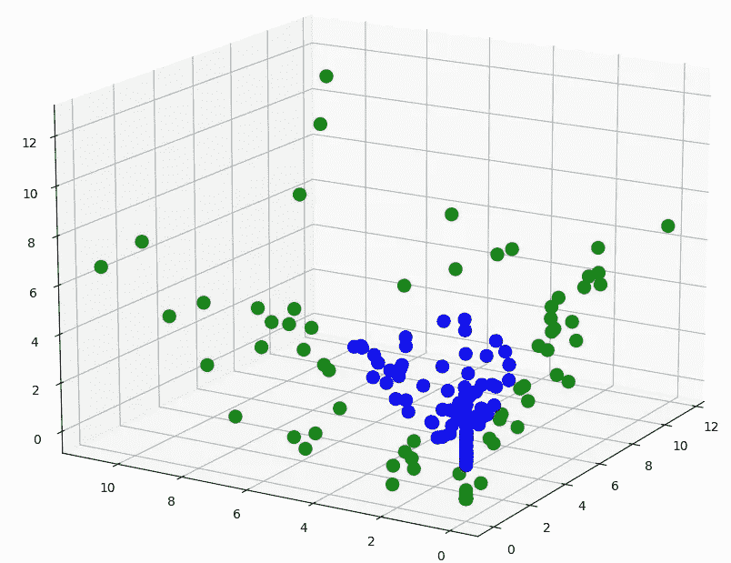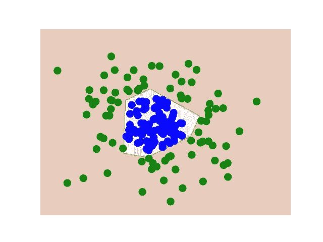

LEFT: learned features | RIGHT: decision boundary using 3 hidden neurons

如果你以正确的方式观察特征空间，你可能能够看到超平面如何在该空间中分离数据。

如果我们增加隐藏神经元的数量，我们可以得到更精确的决策边界的近似值。

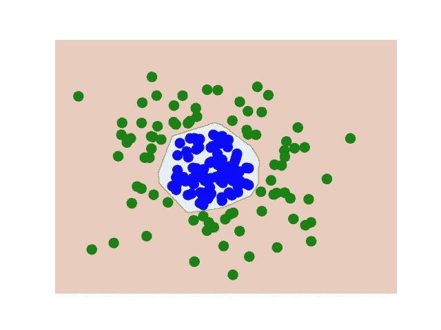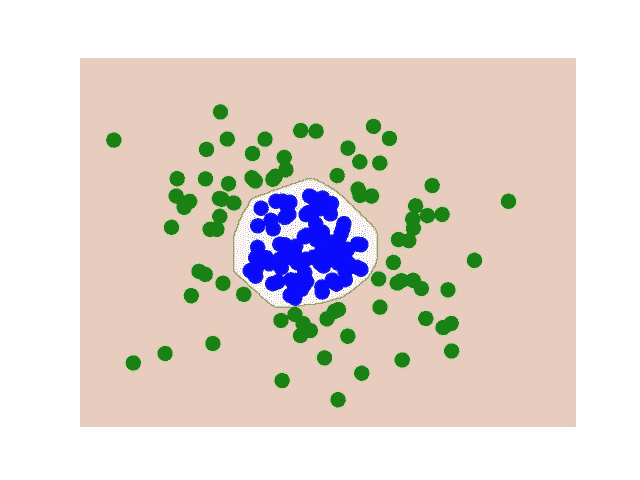

using 10 neurons (left) and 100 neurons (right)

我们可能凭直觉认为，随着隐藏神经元数量的增加，我们越来越接近真正的决策边界。但这受限于我们数据的稀疏性。如果我们使用 100 个神经元，我们学到的东西与我们用 10 个神经元学到的东西非常相似，因为没有接近决策边界的数据点迫使网络学习更多的东西。

因此，尽管在技术上我们可以很好地近似 x[0] + x[1] — 1 = 0 的决策边界(根据[通用近似定理](https://cognitivemedium.com/magic_paper/assets/Hornik.pdf))，但前提是我们有正确数量的神经元，**我们受到数据稀疏性的限制**。

随着我们增加隐藏神经元的数量，我们也面临着过度拟合的风险——我们的网络学习了一个过于特定于训练集的函数，当暴露于一般数据时表现不佳。

然而，为了使用像 ReLU 这样的简单函数来估计复杂的决策边界，我们需要许多隐藏神经元。**因此，在激活足够简单以使学习有效( **ReLU** 及其导数易于计算)和激活函数不需要太多神经元以进行学习(这将冒过拟合的风险)之间存在权衡**。

## 乙状结肠的

另一个标准激活函数是 **sigmoid:**

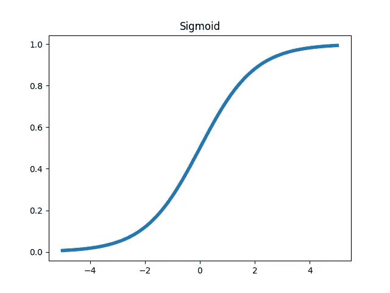

从图形上，我们可以看到 **sigmoid** 变换它接收的仿射函数，使得任何超过 6 左右的都有效地为 1，而低于-6 左右的都有效地为 0。应用 **sigmoid** 激活而不是 **ReLU** 我们得到具有 2 个神经元的单个隐藏层的以下特征和决策边界:

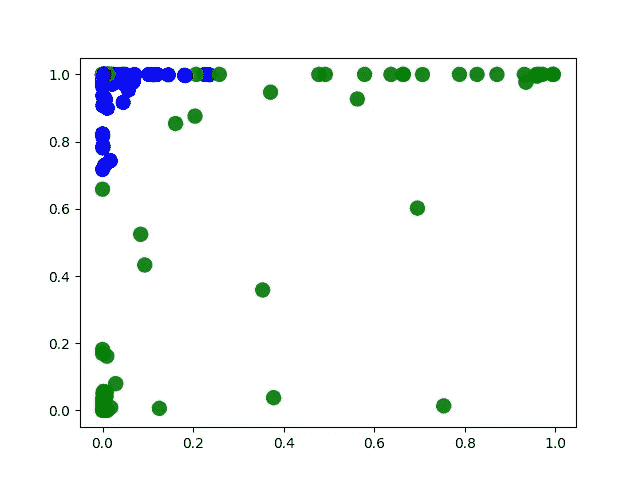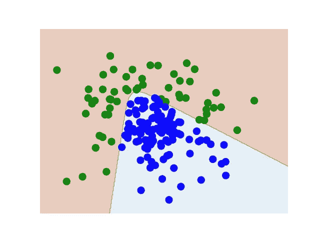

LEFT: learned features | RIGHT: decision boundary using 2 hidden neurons

这与 **ReLU** 所了解到的情况非常相似，神经元要么非常活跃，要么根本不活跃(上图中间没有很多点)。由于 **sigmoid** 的值是平滑变换的，我们可以期望了解到一个不完全分段线性的决策边界。部件之间的连接/过渡将是弯曲的。

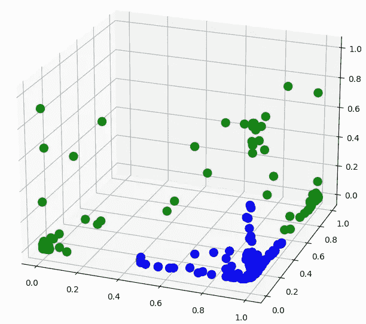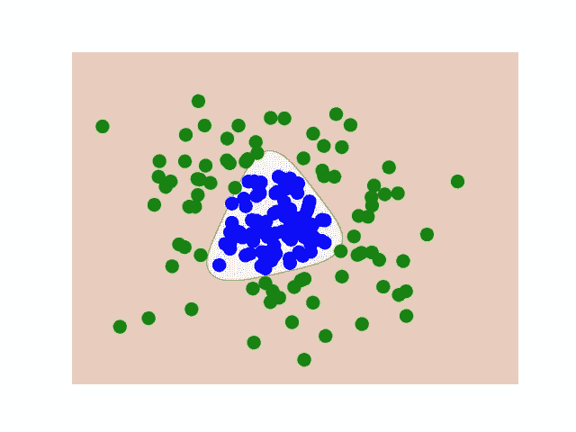

LEFT: learned features | RIGHT: decision boundary using 3 hidden neurons

在[第二部分](/mlearning-ai/tuning-neural-networks-part-ii-considerations-for-initialization-4f82e525da69)中，我们看到对深度神经网络使用 **sigmoid** 和 **ReLU** 导致了网络中数据分布的变化。这意味着更深层的数据被越来越多的数据激活，我们看到这些数据倾向于冻结神经元。在 **sigmoid** 的情况下，发生冻结是因为学习到的特征对于整个数据来说将是常数~1。这意味着梯度的方向和大小在初始化时是固定的。方向是固定的，因为它完全取决于权重(因为激活是恒定的~1)。幅度是固定的，因为当 **sigmoid** 的值接近 1 时，导数将非常接近 0。

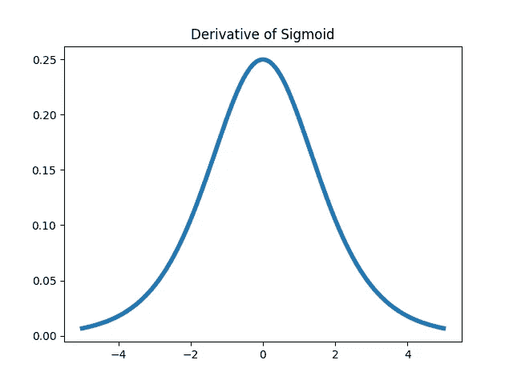

在具有**乙状窦**激活的深层 NNs 中出现的另一个问题是消失梯度问题。由于梯度在反向传播时会在各层中相乘，所以只取 0 到 1 之间的值的梯度只会随着相乘而变小。在 **sigmoid** 的情况下，它的导数只能取 0 到. 25 之间的值。

您可能会想，给定重量的梯度也取决于激活值，因此高激活可能会抵消这一点。你说得对！然而，在**s 形**的情况下，数值被压缩在 0 和 1 之间，这只会进一步降低梯度。

**ReLU** 没有这个问题，因为神经元被激活时导数一直是 1。但是如果一个神经元学习到对于整个数据总是不活动的(即 0)，那么它的相关权重将不会被更新。这些死亡的神经元是需要注意的。

所以 sigmoid 在做二元分类的时候更频繁的用在输出层(如上)。

## 双曲正切

另一个标准激活函数是双曲正切函数:

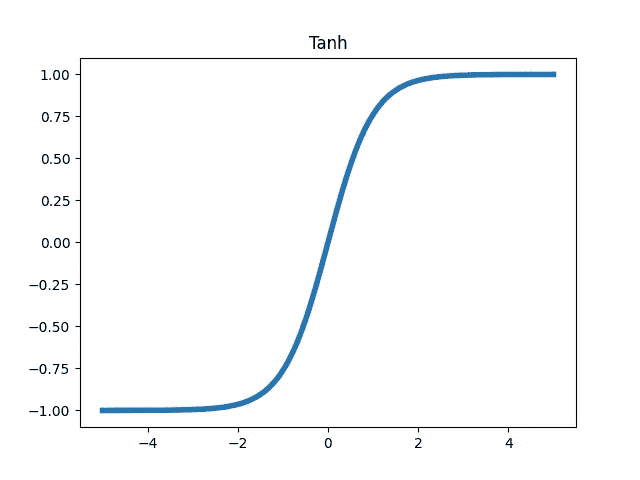

从图形上，我们可以看到 **tanh** 以这样一种方式转换它接收的仿射函数，即任何超过 4 的都是有效的 1，而低于-4 的都是有效的-1。应用 **tanh** 激活而不是 **ReLU** 我们得到了具有 2 个神经元的单个隐藏层的以下特征和决策边界:

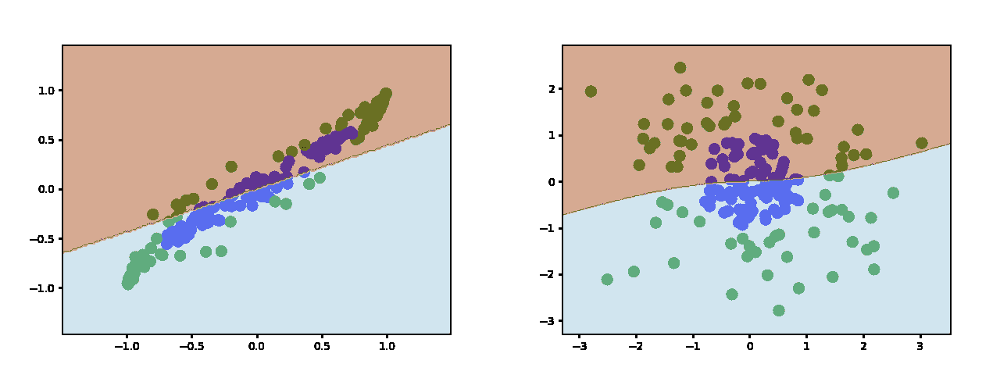

LEFT: learned feature space (using tanh on 2 hidden neurons) | RIGHT: decision boundary in the input space

这和 **ReLU** 和 **sigmoid** 学的东西很像。我喜欢把激活功能想象成拉伸和折叠输入空间。**乙状结肠**和 **tanh** 轻轻折叠空间，同时 **ReLU** 折叠空间，留下折痕。

使用 3 个隐藏神经元，我们学习以下特征和决策边界:


LEFT: decision boundary in the learned feature space (using tanh) | RIGHT: decision boundary in the input space

决策边界是(未变换的)分离超平面和(这里是 2D)输入空间的交集。左侧的蓝色表面显示了输入空间是如何被扭曲的。如果我们取消扭曲空间(以获得右边的图)，那么橙色超平面就会被扭曲。在非扭曲操作中，蓝色的表面穿过橙色的表面，你可以看到在右边的确切位置。

**Tanh** 也遭受类似 **sigmoid** 的消失梯度问题，因为它的导数被限制在区间[0，1]。

虽然 **tanh** 的输出以 0 为中心，但深度神经网络可能会学习权重，从而在数据通过网络时显著改变数据的分布，从而冻结更深层。但是初始化时的分布一般不会受到这种偏移的影响。

# 非标准激活

## 多项式激活

由于我们可以绘制数据，我们可以看到决策边界可能是一个圆，它是输入平方的线性函数。

所以我们可以尝试使用𝞂 **(x) = x** 作为激活函数:

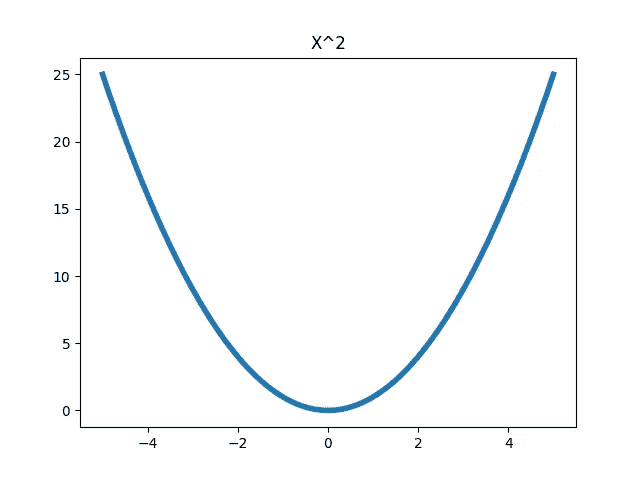

在 Keras 中，您可以使用如下自定义激活功能:

```
def custom_act(x):
    return x**2model = keras.models.Sequential()
model.add(keras.layers.Dense(2, input_dim=2, use_bias=False, activation=custom_act))
model.add(keras.layers.Dense(1, activation='sigmoid'))
model.compile(loss="binary_crossentropy")
```

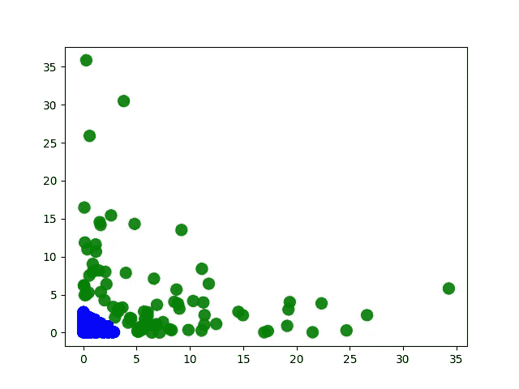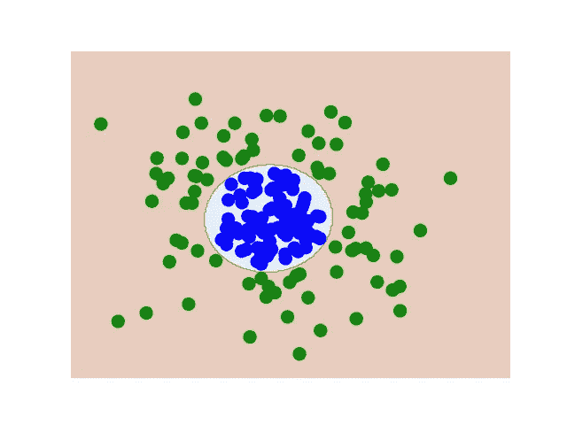

LEFT: learned features | RIGHT: decision boundary using 2 hidden neurons

使用多项式激活函数的主要缺点是梯度是无限的。这意味着梯度的大小可能非常大(称为爆炸梯度问题)，特别是当它们在反向传播过程中通过网络向后倍增时，会产生溢出等计算复杂性和权重可能急剧更新的学习复杂性。

这里的另一个问题是，对于偶数多项式，激活仅是正的，因此我们将在深度神经网络中看到类似的分布变化。如上所述，使用**符号(x) * x** 将有助于区分激活和未激活的神经元，并提供更大的学习灵活性。

## 周期性激活

从技术上讲，圆在极坐标域中是周期性的。对于神经网络来说，转换到极坐标并不简单。

请注意，如果您对 z = 1+**cos**(x)+**cos**(y)进行切片，您会得到类似于圆形的东西。

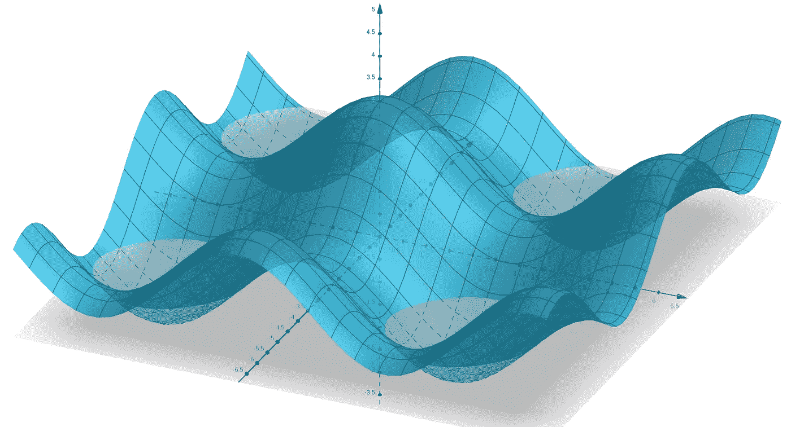

generated by [geogebra.org/](https://www.geogebra.org/)

因此，在 2 个隐藏神经元上使用类似于 **sin** 或 **cos** 的东西在理论上应该可行。实际上，网络很难学习这个函数而不经历停止学习的局部最小值。向隐藏层添加额外的神经元有助于解决这一问题:

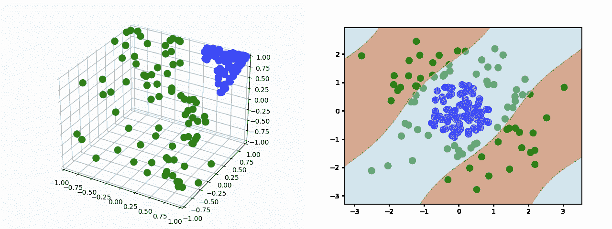

LEFT: learned features | RIGHT: decision boundary using 3 hidden neurons

输出层的学习权重(它是这些余弦激活神经元的函数)是:[-3.8，1.4，-3.8]，偏差是 1.4。这意味着第一神经元和第三神经元是冗余的，但是允许学习(近似)上面的 z = 1+**cos**(x)+**cos**(y)。

这里的问题是，由于周期性，这些圆圈将出现在整个 2D 平面上——显然这不是我们想要的。

周期性决策边界的一个更好的例子可能如下:

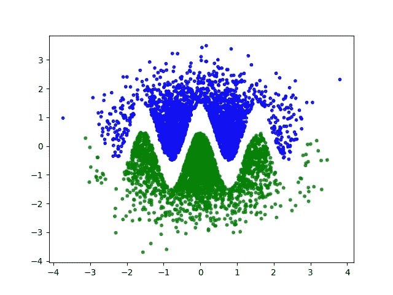

正如我们在上面看到的，如果我们选择使用 **ReLU** ，我们将需要相当多的片段来估计这个决策边界。

```
model = keras.models.Sequential()
model.add(layers.Dense(8, input_dim=2, activation='relu'))
model.add(layers.Dense(1, activation='sigmoid'))
model.compile(loss="binary_crossentropy")
```

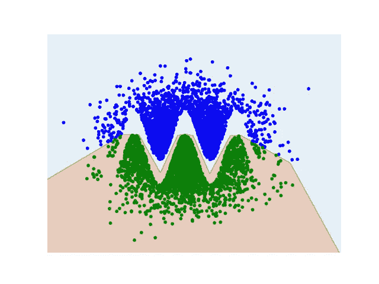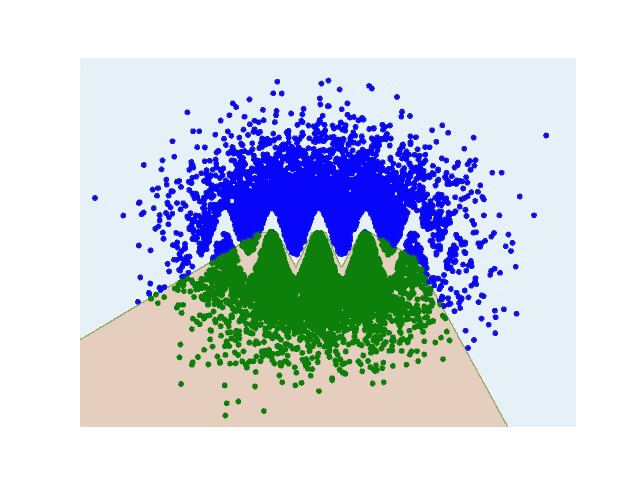

但是，这并不是真正的学习分隔两个类的函数，正如我们在右边看到的。 **ReLU** (事实上，所有标准激活函数)无法学习这种重复模式，因为**用于近似的片段数量是由网络架构中定义的神经元数量固定的**。为了学习右边的决策边界，我们需要增加隐藏神经元的数量，并重新训练我们的模型，以便获得更多的线性块进行逼近。

通常**激活功能是为整个层**定义的。这意味着创建一个可以学习类似 Y = X + log(X)或上述 Z = Cos(X) + Y 的函数的神经网络，如果每个神经元都没有激活函数，这是不可能的。

这里我们只对两个神经元中的一个引入余弦激活，因为决策边界是一个坐标是另一个的余弦:

```
def custom_activation(x):
    x_0 = math.cos(x[...,0])
    x_1 = x[...,1]
    return stack([x_0, x_1], axis = 1)model = keras.models.Sequential()
model.add(layers.Dense(2, input_dim=2, use_bias=False, activation=custom_activation))
model.add(layers.Dense(1, activation='sigmoid'))
model.compile(loss="binary_crossentropy")
```

其学习以下特征和决策边界:

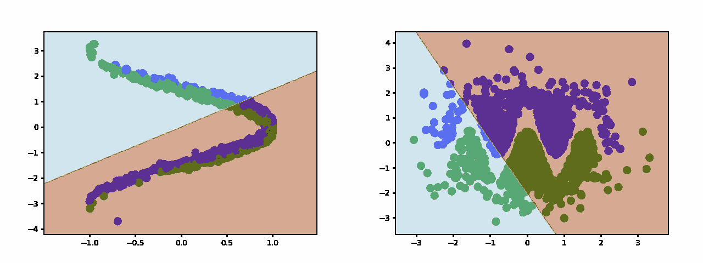

你可能还记得傅立叶级数仅仅是正弦和余弦的加权和。你可能想知道是否有神经网络可以通过学习函数的傅立叶级数的系数来学习函数。这个被称为傅立叶神经网络的正在进行的研究领域没有忽略周期性激活函数。

# 确认

感谢杨易进、卡梅隆·加里森、玛利亚·舍甫琴科、詹姆斯·昆斯特勒、林、克里斯蒂娜·徐、的贡献。

[](/mlearning-ai/mlearning-ai-submission-suggestions-b51e2b130bfb) [## Mlearning.ai 提交建议

### 如何成为 Mlearning.ai 上的作家

medium.com](/mlearning-ai/mlearning-ai-submission-suggestions-b51e2b130bfb)