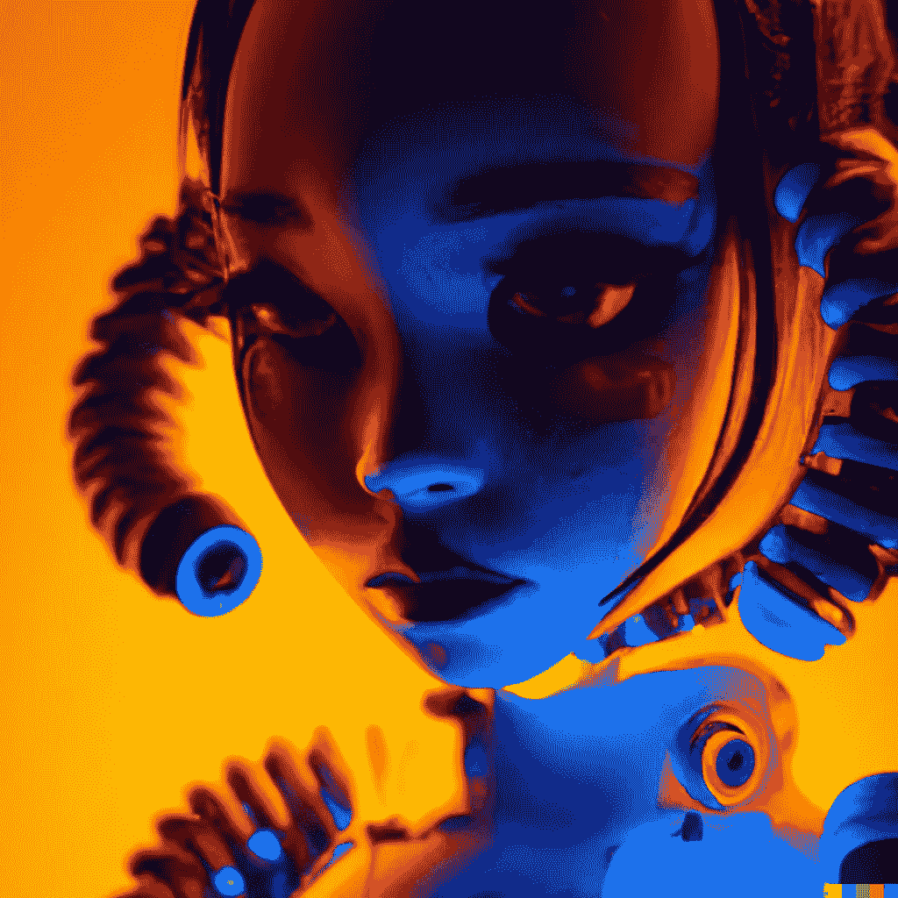

# 将文本转换为 3D 人工智能艺术

> 原文：<https://medium.com/mlearning-ai/turn-text-to-3d-ai-art-a6911bf5c43d?source=collection_archive---------1----------------------->

## [机器学习艺术](https://mlearning.substack.com/p/image-completion-new-free-method?r=z7zu8&s=w&utm_campaign=post&utm_medium=web)

## 开放世界场景:3D 数字艺术的未来

[Could It Be A New Creative Renaissance?](https://mlearning.substack.com) — [Next AI art generator](https://mlearning.substack.com/p/top-features-of-dalle-3?r=z7zu8&s=w&utm_campaign=post&utm_medium=web)

## 3D 视觉语言模型

我很早就看到了令人印象深刻的关于语言界面如何被用来控制人工智能艺术生成器的[演示。](https://evartology.substack.com/p/the-largest-text-ai-art-video-generator?r=9hp4d&s=w&utm_campaign=post&utm_medium=web)

*   【2022 年 7 月— AI 美工工具更新可以在这里找到➡️****⬅️****