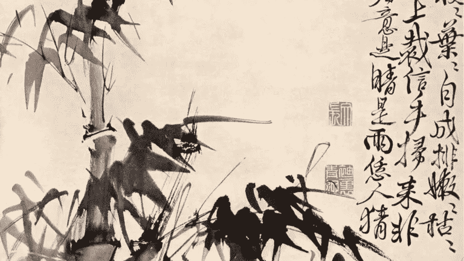
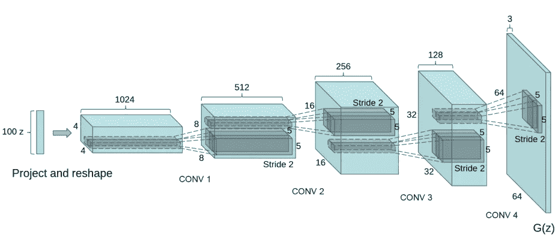
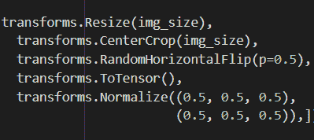
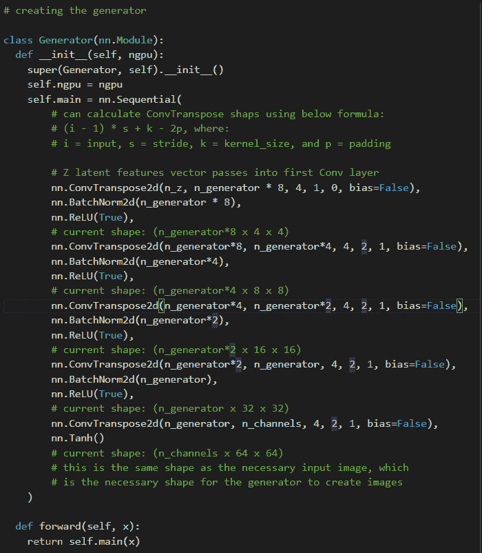
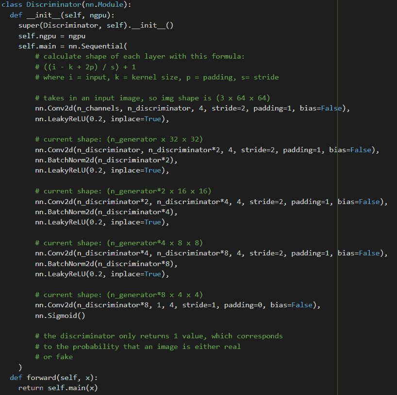
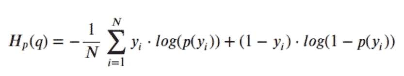
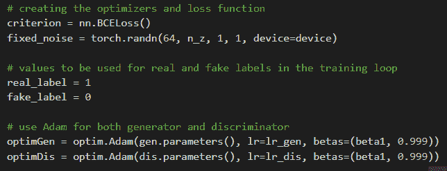
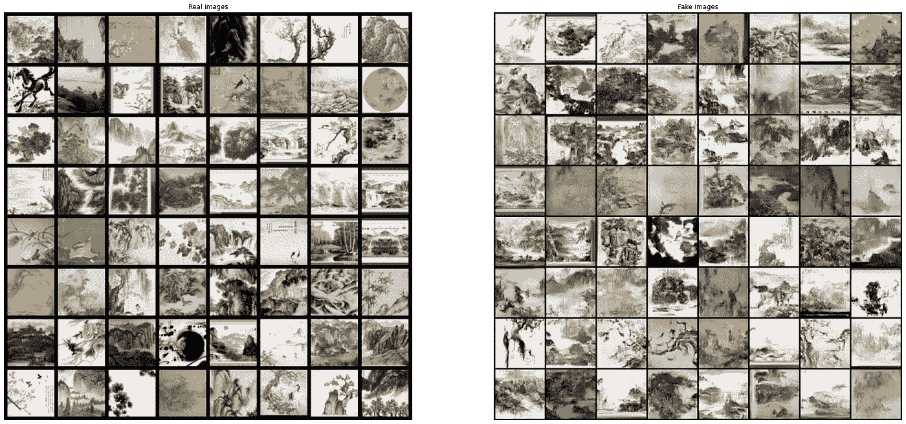
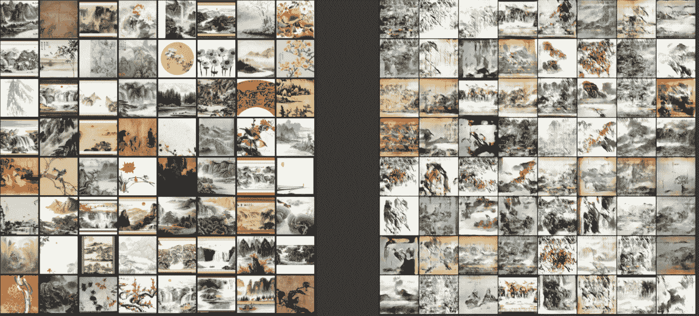

# 用人工智能把你的电脑变成艺术家

> 原文：<https://medium.com/mlearning-ai/turn-your-computer-into-an-artist-with-ai-8a58014bb5d4?source=collection_archive---------1----------------------->

想象一下，如果文森特·梵高是一台电脑。

想象一下，如果梵高的电脑可以学习创作梵高名画的数字版本，而不是绘制画布和混合颜色来创造星空。

一台可以创造艺术的电脑，就像这台假设的梵高电脑，看起来相当令人印象深刻。很难想象计算机拥有创作像《星夜》这样的画作所必需的创造力和灵活性。

然而，事实是，任何计算机都可以像梵高一样学习创造艺术。

不幸的是，你的电脑不能像梵高那样在画布上绘画。但它可以创造数字艺术，为了教它如何创造这样的艺术，我们求助于生成性对抗网络(GANs)。

## **GANs 简介**

我不会深入研究 GANs 的技术细节，但是如果你对它们的内部工作方式感兴趣，[这里有一篇我写的深入描述 GANs 复杂性的文章。](/@ayannair2021/a-deep-dive-into-gans-c8b8eb6a4dac)

给定一些原始数据，**阿甘的最终目标是学习如何生成看起来像是直接来自原始数据的新数据样本**。用技术术语来说，GAN 学习从潜在空间映射到所需的数据分布(这只是人工智能专家前一句话中的复杂方式)。

这里有一个例子——假设给一只甘一个装满香蕉图像的数据集。GAN 希望通过检查提供给它的香蕉数据集来学习创建自己的香蕉图像。

GANs 通过利用两个组件——生成器和鉴别器，实现了生成与原始数据集相匹配的数据的目标。**生成器负责创建新数据，而鉴别器则试图区分真实数据和虚假数据。**GAN 的预期最终结果是发生器能够欺骗鉴别器，使其相信其产生的数据是真实的。

创建 GAN 时，生成器和鉴别器将是两个独立的[神经网络](https://www.forbes.com/sites/bernardmarr/2018/09/24/what-are-artificial-neural-networks-a-simple-explanation-for-absolutely-anyone/?sh=793d9fe81245)。生成器将一个随机向量(换句话说，一行随机数)作为输入，并在通过网络发送该向量时将该向量转换为新的数据样本。鉴别器接收数据样本并转换该数据样本以返回对应于数据样本真实性的概率。

**深度卷积 GANs (DCGANs)**

为了训练我们的甘成为一名艺术家，它必须在处理和生成图像方面变得熟练。这使得我们的艺术家甘成为卷积神经网络(CNN)应用的理想领域。

CNN 是一种神经网络，以擅长分析图像数据而闻名([在此了解更多关于 CNN 的信息](https://towardsdatascience.com/a-comprehensive-guide-to-convolutional-neural-networks-the-eli5-way-3bd2b1164a53))。由于其处理图像的能力，细胞神经网络可以应用于 GANs 以帮助他们有效地产生图像样本。**CNN 和 GANs 的这种组合被称为深度卷积生成对抗网络，或 DCGAN。**

DCGAN 架构的关键区别在于，鉴别器和发生器不是由普通神经网络组成，而是由多层 CNN 组成。然而，鉴别器和发生器的功能保持不变。

Diagram for the structure of the DCGAN’s generator. The diagram depicts how an input is transformed as it goes through the network, with each rectangle object representing the input shape after passing through a convolutional layer.

DCGAN 为普通 GAN 增加了惊人的功能；**生成逼真、高质量图像的能力使 DCGAN 成为艺术生成等应用的关键 GAN 架构。**

## **py torch 简介**

由于复杂的底层算法和数学，从头开始编写创建 DCGANs 和其他类似架构的程序相当困难。像 PyTorch 这样的工具，一个为开发人工智能模型而开发的库，为我们处理了困难的数学问题，并使创建和训练像 DCGANs 这样的模型变得容易得多。

PyTorch 具有相当广泛的功能，但这里是用于创建 DCGAN 的主要 PyTorch 概念。

*   PyTorch Tensors: 本质上是 PyTorch 存储数据集合的方式。如果你熟悉矩阵和向量，张量就是矩阵的 PyTorch 版本。
*   **数据集和数据加载器:** PyTorch 的工具可以轻松定义和修改 GAN 训练的数据。
*   **Conv/Conv 转置层:**构成我们的发生器和鉴别器的 CNN 中的主要层。
*   **优化器:**这些优化器允许模型从数据集中学习。
*   **Transforms:** 允许 PyTorch 改变数据集中的图像，使我们能够执行调整大小、裁剪或翻转图像等操作。
*   **归一化:** PyTorch 将图像视为一个范围从 0 到 255 的像素值矩阵。众所周知，人工智能不擅长处理大范围的数据，因此使用归一化来压缩这些数字的范围，使它更容易从图像中学习。
*   **损失函数:**本质上是模型如何从错误中学习。

如果你在下面的代码中看到这些词，不要害怕！这些解释给出了这些术语含义的要点。

## **数据转换**

*快速说明——这段代码摘自* [*PyTorch 的 DCGAN 预排*](https://pytorch.org/tutorials/beginner/dcgan_faces_tutorial.html)*；我只是做了一些调整，并将其应用于一个新的数据集。如果你对 GANs 感兴趣，我强烈推荐你看看这个教程！*

现在我们已经了解了所使用的技术，我们可以开始把我们的电脑变成一个艺术家了！

第一步是**识别 DCGAN 将从**学习的数据集。对于艺术创作，数据集应该主要由某种艺术风格的绘画组成；GAN 将学会以选择的风格合成新的图像。作为起点，我摆弄了一下这个中国古代艺术数据集，它包含了大约 5800 幅中国画的图片。

在识别数据集之后，我们需要**定义一些变换来增加图像并产生更好的训练结果**。以下是我应用的图像转换:

Set of transforms that I utilized for augmenting the dataset images.

前两个转换调整原始数据集图像的大小并对其进行裁剪，以创建 64x64 的图像，从而可以将图像传递到鉴别器中进行训练。下一个变换随机水平翻转图像。然后将图像转换成 PyTorch 张量并归一化。

## **定义发生器和鉴别器**

应用转换后，我们可以继续创建我们的生成器和鉴别器了！

快速回顾一下——生成器将随机向量作为输入，输出新合成的图像，而鉴别器将图像作为输入，输出表示它认为图像有多“真实”的概率。知道了它们的输入和输出，发生器和鉴别器可以定义为 PyTorch 中的 CNN。

现在事情变得有点像 T21 的技术了。

把图像想象成一个三维物体。它的高度和宽度由像素值定义，深度为三。彩色图像需要红色、绿色和蓝色的组合来创建它们的颜色，并且每个深度单位表示图像的每个像素中红色、绿色和蓝色的量。

生成器尝试从一维的向量映射到三维的彩色图像。这个过程被称为**上采样**，因为当输入通过发生器时，维度会增加。

然而，正常的 CNN 层用于**下采样**；它通常将其输入压缩成更小的维度。因此，发生器需要一种称为卷积转置层的 CNN 层，它对其输入进行上采样。

这些层在生成器中被大量使用，在生成器中，随机向量通过由卷积转置、批量归一化(帮助神经网络更快训练的归一化步骤)和 ReLU 层(这实质上允许神经网络学习更复杂的信息)的堆栈组成的 CNN 发送。最终输出是三维的、新合成的彩色图像。

Code for creating the generator in PyTorch.

与发生器不同，鉴别器对其输入进行下采样，将三维图像转换为概率。它通过卷积、批量归一化和泄漏 ReLU(非常类似于 ReLU 的功能)层的堆栈来实现这一点，这些层将图像逐步压缩为单个概率。

Code for creating the discriminator in PyTorch.

generator 和 discriminator 类都有一个 forward 方法，该方法允许输入进入函数并被函数修改。输入被传递到网络并被转换的过程的正式术语叫做**前向传播。**

## **定义损失函数和优化器**

生成器和鉴别器在定义后不会立即工作；相反，他们学习如何通过处理数据分别生成图像和识别假图像。而这两个网络要学习，就需要**损失函数和优化器。**

对于 DCGAN，使用一种称为二进制交叉熵(BCE)损失的特定类型的损失。这种损失函数特别适合处理需要分类的输出(比如鉴别器预测图像是真是假)。

Binary Cross-Entropy Loss Function. Image source [here](https://i.stack.imgur.com/HlYNr.png).

用于生成器和鉴别器的优化器是 Adam，它是训练大多数神经网络的首选优化器。

Code for defining the loss function and optimizers in PyTorch.

现在我们已经创造了一切，我们需要训练甘创造一些艺术！

## **结果**

在训练 DCGAN 大约 650 个时期后，输出看起来有些真实。DCGAN 似乎捕捉到了训练图像的风格。它甚至能够复制训练集中出现的树木和山脉等结构！

Outputs of the 64x64 DCGAN. The left-hand images are images directly from the dataset, and right-hand images are synthesized by the GAN. Notice how the GAN was able to replicate waterfalls, flowers, and mountains!

我对输出非常满意，并认为 GAN 达到了相当好的性能水平。然而，我唯一的问题是图像太小了。

之前创建的 DCGAN 仅限于创建 64x64 像素的图像。然而，通过对生成器和鉴别器的代码进行一些轻微的调整，我让它们能够生成 128x128 像素的图像。

Outputs of the 128x128 DCGAN. Left side contains training images and right hand side contains generated images.

输出质量的下降相当明显。**当增加输出大小时，模型有更多的参数需要训练，因此需要更多的训练时间来生成清晰的输出。**如果我增加了训练历元的数量，图像质量无疑会更清晰。

## **可能的改进**

虽然该模型能够生成一些高质量的图像，但 DCGAN 生成的大多数图像看起来与数据集中的图像非常不同。要提高图像质量，以下是一些可行的方法:

**利用不同的 GAN 架构。**DCGAN 虽然令人印象深刻，但并不是最好的 GAN 架构。像 NVIDIA StyleGAN 或 Wasserstein GAN 这样的替代产品已经获得了更高的图像质量。

**训练模型的时间更长。**让模型扫描数据集进行更多次迭代可能会使它能够获得新的艺术特征，然后可以用来生成更好的图像。

**寻找更大的数据集。**用于训练该模型的数据集仅包含约 6000 幅图像，而[本 PyTorch 教程](https://pytorch.org/tutorials/beginner/dcgan_faces_tutorial.html)中用于测试 DCGAN 的数据集包含约 200，000 幅图像。更多的数据为模型提供了更多的信息来分析，使它能够对它试图复制的图像有更深的理解。

无论如何，训练一台计算机来创造艺术不是一件容易的事，毫无疑问，DCGAN 在复制数据集中的图像方面做得非常出色！

通过使用 DCGAN 和可用的艺术数据集，任何计算机都可以获得任何艺术家的能力。而这仅仅是甘的开始；这项技术正在进行许多改进，很快计算机生成的艺术可能会与人类制作的艺术相媲美。因此，人工智能的力量并不局限于技术领域——GANs 通过允许它通过技术改变艺术来扩展人工智能的能力。

## **TL；博士**

GANs 能够使用两个神经网络(称为生成器和鉴别器)生成图像；鉴别器试图区分真实图像和生成图像，而生成器试图欺骗鉴别器，使其相信其图像是真实的。DCGANs 使用两个卷积神经网络(CNN)来构成生成器和鉴别器。因为 CNN 擅长图像处理，所以 DCGANs 擅长生成图像。在这个项目中，我使用 DCGAN 的图像生成功能来生成中国古代艺术和新的梵高画作。

*如果你想亲自尝试一下 art DCGAN，可以看看我的*[*Github Repo*](https://github.com/ayan-aji-nair/art-generation-gan)*！*

*点击* [*此处*](https://arxiv.org/abs/1511.06434) *查看 DCGAN 论文原文链接。*

*谢谢你看完！别忘了留个*👏*也是！*

简单介绍一下我——我今年 17 岁，非常喜欢颠覆性技术，主要是人工智能。如果你喜欢这篇文章或者想谈谈有趣的深度学习/机器学习项目、研究论文或想法，请通过我的[*LinkedIn*](https://www.linkedin.com/in/ayan-nair-31388a1b7/)*，*[*insta gram*](https://www.instagram.com/nair.030/)*或电子邮件(ayan.aji.nair@gmail.com)给我留言！你也可以通过我的每月简讯获得我的酷项目的更新和我写的新文章——在这里订阅***！**