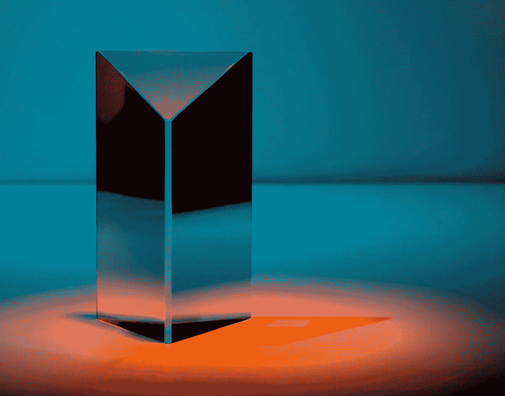

# 通过使用 DALL-E 2 AI，将您最疯狂的想象转化为有形的艺术

> 原文：<https://medium.com/mlearning-ai/turn-your-wildest-imaginations-into-tangible-art-by-using-dall-e-2-ai-41fa4bcfe790?source=collection_archive---------5----------------------->

## 人工智能生成的图像 DALL-E2

Photo by [Michael Dziedzic](https://unsplash.com/@lazycreekimages?utm_source=unsplash&utm_medium=referral&utm_content=creditCopyText) on [Unsplash](https://unsplash.com/s/photos/artificial-intelligence?utm_source=unsplash&utm_medium=referral&utm_content=creditCopyText)

一个名为 Dall-E 的人工智能工具是一个神奇的人造工具，它可以将任何描述性文本转换为艺术形式。这是一个没有画笔的艺术家。这是艺术的未来。有趣吗？进一步阅读，了解所有关于 Dall-E。在这篇文章中，你将了解其利弊…