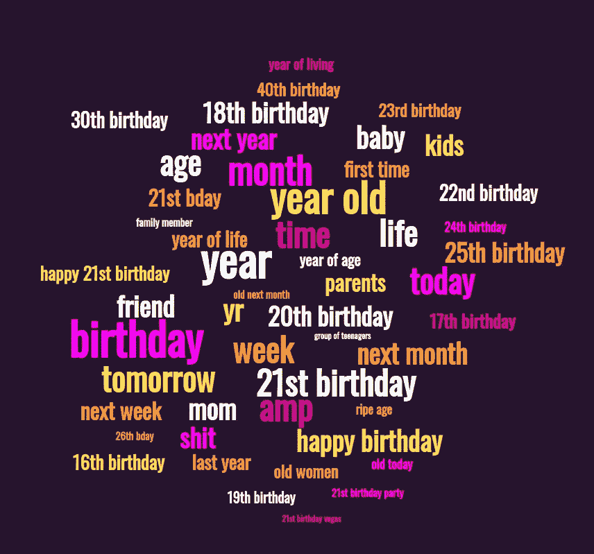
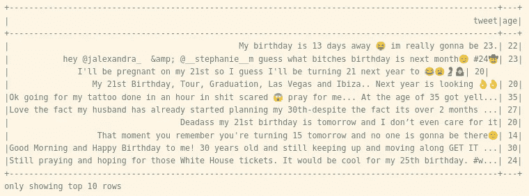
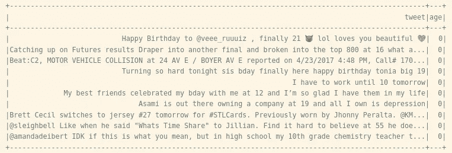
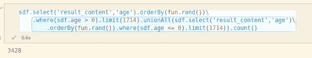
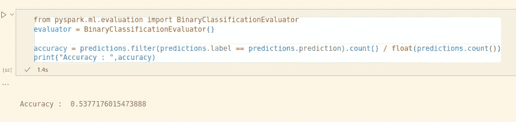
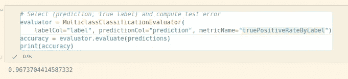

# 你写的推文透露了你的年龄

> 原文：<https://medium.com/mlearning-ai/tweets-you-write-reveal-your-age-949d6e89ecf6?source=collection_archive---------7----------------------->

如何知道一个高音有多老！

我从使用来自论文“报告文学:根据推文中的自我报告自动提取推特用户的确切年龄”的数据集开始。这个数据集将作为我的真实来源，通过它我可以确信年龄是从推文文本中正确提取的。当电子邮件中的人的年龄可以在文本中发现时，这个数据集是通过使用正则表达式和手动标记推文创建的。我将使用该数据集作为我的机器学习算法的模型。

Tweet with calculated age

从一条推文中获取年龄并不总是可能的，但你可以想象人们随着时间的推移写了许多推文，这些推文可以揭示他们未来的年龄。想象一下，如果有人在 Twitter 上收集与某个特定用户相关的信息，并建立该信息的数据库。

Age could not be gathered

显然，一条推文不能透露一个用户是 0 岁，但这就是我们在不知道他们多大的情况下定义年龄的方式。现在，我将通过确保有 50–50 的几率可以破译年龄来平衡数据集。

Balanced Age dataset

Accuracy when predicting age

考虑到实际包含年龄信息的推文并不多，这种准确性是有意义的。在这种情况下，标记的真实阳性率可能给我们更多的这种方法的潜力的指示。

True Positive Rate by label

这表明，一旦确定了高音扬声器的年龄，该方法在确定其年龄方面是多么有把握。我计划进一步探索这个问题。

 [## Mlearning.ai 提交建议

### 如何成为 Mlearning.ai 上的作家

medium.com](/mlearning-ai/mlearning-ai-submission-suggestions-b51e2b130bfb)