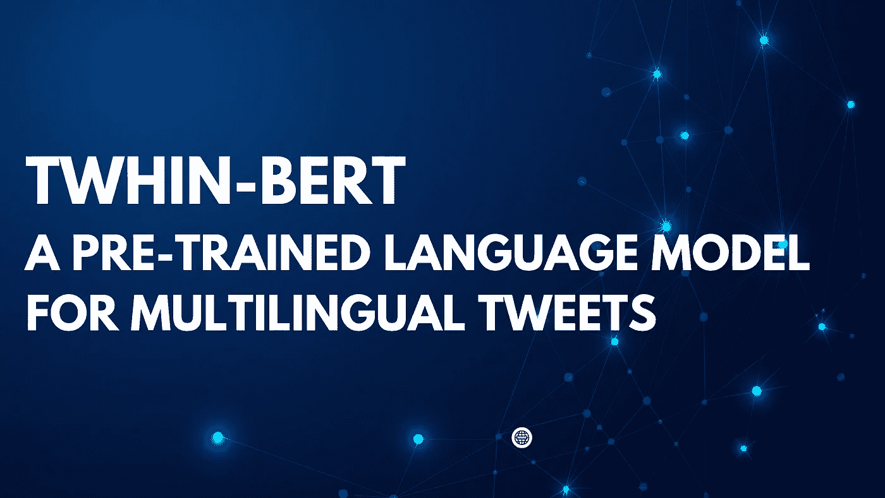
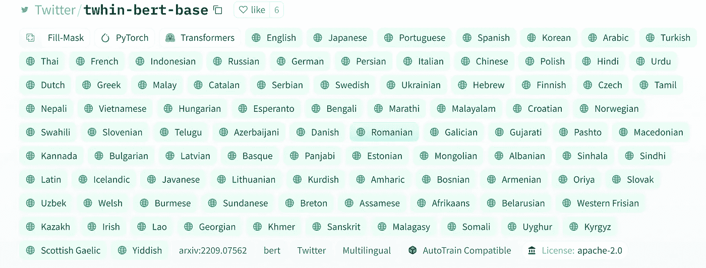

# TwHIN-BERT:用于多语言 Tweets 的大型预训练语言模型

> 原文：<https://medium.com/mlearning-ai/twhin-bert-a-pre-trained-language-model-for-multilingual-tweets-f651628e61e0?source=collection_archive---------1----------------------->

Twitter 异构信息网络(TwHIN)接受了 100 多种不同语言的 70 亿条推文的训练。该模型已经在多种多语言社交推荐和语义理解任务上进行了评估。策划的 TwHIN 由大约 2 亿不同的用户、10 亿条推文和超过 1000 亿条边组成。

图表显示，在构建 TwHIN-BERT 的过程中有三个步骤。

(1)通过嵌入 Twitter 异构信息网络来挖掘社交相似的 tweet 对

(2)以社会和 MLM 为共同目标的 TwHIN-BERT 培训，最后

(3)在下游任务上微调 TwHIN-BERT。

据 Huggingface Hub 称，该模型支持 89 种语言。泰语也在列表中。

有 4 个基准模型已经在下游任务中进行了性能比较。(不包括 **TwHIN-BERT)**

**多语言 BERT(mBERT)** 是一种广泛使用的预训练语言模型，在通用领域 web 语料库上进行训练。

**BERTweet** 是之前在推特上训练的单语语言模型，然而这个模型只在英语推特上训练。

XLM-T 是一个基于 XLM-R 的多语言语言模型，在 Tweet 语料库上进行持续训练。

**TwHIN-BERT-MLM** 使用与 **TwHIN-BERT** 相同的语料库进行训练，但这个版本仅在掩蔽语言模型上进行训练。

本文中使用了两个主要任务。

1.  社会参与预测
2.  推文分类:已应用数据集，如推文标签预测、英语推文情感分析数据集、英语和西班牙语表情预测数据集、阿拉伯语推文情感数据集、日语推文主题分类数据集、印地语+英语和西班牙语+英语的代码混合推文。

此外，有两种主要类型的预训练 TwHIN-BERT 模型(基本模型和大模型),它们与 HuggingFace BERT 模型兼容。

特温伯特基地:([https://huggingface.co/Twitter/twhin-bert-base](https://huggingface.co/Twitter/twhin-bert-base))

特温-伯特-拉奇:([https://huggingface.co/Twitter/twhin-bert-large](https://huggingface.co/Twitter/twhin-bert-large))

为了应用模型，您可以选择适合特定任务的模型。这些模型存在一些差异，因为 TwHIN-BERT-base 包含 280M 参数，而 TwHIN-BERT-large 包含 550M 参数。

除了广受欢迎的 M-BERT 和 XLM-罗伯塔，TwHIN-BERT 可能是多语言任务的最佳选择之一。

**更多信息:**

 [## TwHIN-BERT:一个面向多语言 Tweet 表示的社交丰富的预训练语言模型

### 我们提出 TwHIN-BERT，一个基于流行的社交网络 Twitter 的领域内数据训练的多语言语言模型…

arxiv.org](https://arxiv.org/abs/2209.07562)  [## Mlearning.ai 提交建议

### 如何成为 Mlearning.ai 上的作家

medium.com](/mlearning-ai/mlearning-ai-submission-suggestions-b51e2b130bfb)