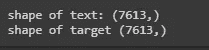
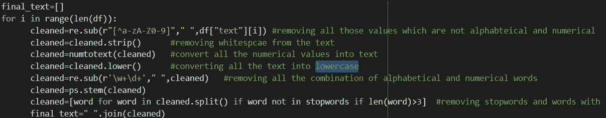
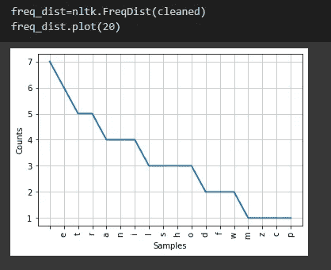
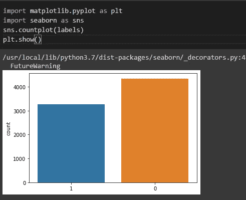
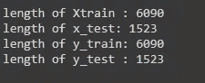
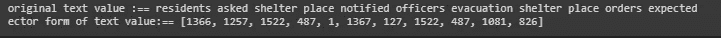
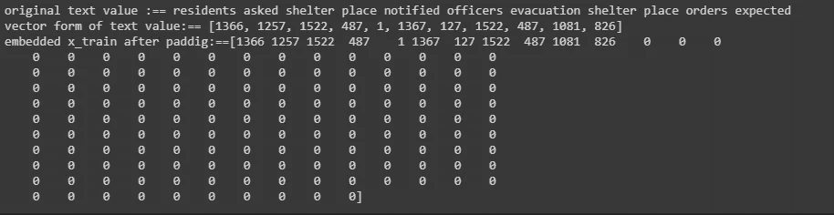
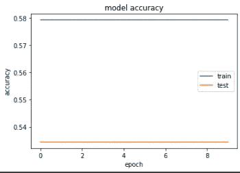
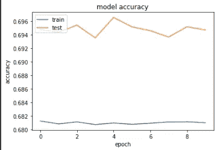
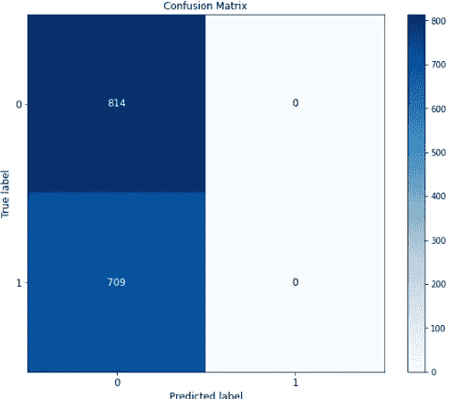

# 推特灾难预测

> 原文：<https://medium.com/mlearning-ai/twitter-disaster-prediction-79dae17d5e?source=collection_archive---------11----------------------->

使用 tensorflow 2.0 预测灾难微博


[Source](https://www.google.com/search?q=disaster+large+size+image&tbm=isch&ved=2ahUKEwi76Yvflq3vAhVuiksFHW8uBWoQ2-cCegQIABAA&oq=disaster+large+size+image&gs_lcp=CgNpbWcQAzoGCAAQCBAeUOD4BFi7mwVg8pwFaABwAHgCgAG7B4gB2SOSAQ0wLjMuMi4yLjEuMS4ymAEAoAEBqgELZ3dzLXdpei1pbWfAAQE&sclient=img&ei=oqNMYLuQMe6UrtoP79yU0AY&bih=625&biw=1366#imgrc=0-4EUvAjuRufhM)

在这里，我们将应用基于深度学习的 NLP 方法，根据推文预测灾难。我从 [**这里**](https://github.com/laxmimerit/twitter-disaster-prediction-dataset) **取了数据集。**数据集以 csv 格式呈现。数据集中存在各种特征，即:- **id、位置、关键字、文本和目标。Target** 列以二进制格式给出，其中 1 代表异常情况(灾难)，0 代表正常情况(无灾难)。让我们开始吧……

## **第一步:-加载数据集并导入必要的库**

```
import numpy as np
import pandas as pd
import seaborn as sns
import matplotlib.pyplot as plt
from tensorflow import keras
from keras.layers import Embedding,Dense,Dropout,Bidirectional,LSTM
from keras.models import Sequential
from sklearn import metrics
from sklearn.metrics import accuracy_score,confusion_matrix
import scikitplot as splt
```

现在我们将加载数据集

```
df=pd.read_csv("train.csv")
df.head()  #printing first five rows
```


figure 1

从 csv 文件中提取文本和目标

```
x=df.loc[:,"text"]
y=df.loc[:,"target"]
print(f"shape of text: {x.shape}")
print(f"shape of target {y.shape}")
```



figure 2

## 步骤二:-文本预处理

文本预处理包括以下步骤:

1.  **移除 Html 标签** :- Html 标签在实际语言中没有任何意义，因此我们将移除文本中出现的所有此类标签
2.  **删除标点符号** :-标点符号，即:-空格，"，"，" # "，" @ "等没有任何意义，因此我们将从文本中删除所有这些数据
3.  **移除停用词** :-停用词只会增加数据中的冗余，特别是在我们处理文本分类等问题时。但是在机器翻译的情况下，我们不需要删除停用词。由于我们正在处理文本分类，因此我们可以从文本中删除停用词。
4.  **将文本转换成小写** :-我们需要将所有文本转换成小写。让我们举个例子来更精确地理解它。

假设你有 **text 1:-这个披萨味道不错。还有文字 2:-这个披萨味道不错。作为人类，我们可以说这两个词有相同的意思，但是机器会把这两个词当作不同的词。因为机器不会将**披萨**和**披萨(因为 P 在这里是大写的)**理解为同一个单词，因此为了避免这种误导，我们将所有文本转换为小写。**

5.**短词删除** :-删除所有小于三的单词。根据语言学专家的说法，任何小于三的单词除了停用词之外没有任何语义。

6.将所有单词转换成它的词根。例如，如果我们有 **go、GoE 和 GoE**，那么通过将这些单词与动词相关联的词汇化，我们将得到词根为 **go。**

导入用于文本预处理的库

```
import re
import nltk
from nltk.corpus import stopwords
from nltk.stem.porter import PorterStemmer
import spacy
import textblob
```

让我们做文字清理；

```
nltk.download('stopwords')
stop_words=set(stopwords.words("english")
stopwords
ps=PorterStemmer()
#code to convert all the numerical values into text
import inflect
q=inflect.engine()
def numtotext(data):
    temp_str=data.split()
    new_string=[]
    for word in temp_str:
        if word.isdigit():
            temp=q.number_to_words(word)
            new_string.append(temp) 
        else:
            new_string.append(word)
    new_string=" ".join(new_string)
    return new_string
```

**最终文本清理:-**



Figure 3

## 步骤三:-文本可视化:

**一个**。单词云可视化，查看文本文件中最重要单词的贡献。


figure 4

**b** 。每个字母在干净的文本数据中出现的频率分布。在这里，我将打印出数据集中最常出现前 20 个单词。



figure 5

**c** 。打印灾难性和非灾难性推文的计数



Figure 6

## 第四步:-超参数调整和列车测试分离

```
vocab_size=5000
len_train=0.8   #assigning 80% part as train set and 20% as test set
oov_token="<oov>"
len_sen=400
train_sizeX=int(len(final_text)*len_train)
train_sizeY=int(len(labels)*len_train)
x_train=final_text[0:train_sizeX]
x_test=final_text[train_sizeX:]
y_train=df["target"][:train_sizeY]
y_test=df["target"][train_sizeY:]
```

将 20%的文本指定为测试集，剩余的 80%的文本指定为训练集

```
#extracting train and test dataset from the dataframe
print(len(x_train))
print(len(x_test))
print(len(y_train))
print(len(y_test))
```



figure 7

**什么是 vocab_size？**

当我们将有非常大的文本数据序列，并且我们试图一次处理所有的文本数据时，那么它将给出低计算设备的内存不足错误。因此，我们将通过另一条路径，即:-我们将使用某些 **vocab_size** 来构建我们的 NLP 模型，如果 **vocab_size=5000** 我们将从文本数据集中取出 **5000** 个最常出现的单词，然后构建我们的模型。

**oov_token？**

文本中不属于前 5000 个单词的任何单词将被指定为 **oov_token** 。

**让我们检查一下目标变量中有多少不同的变量。**

```
>> set(y_train)
[out]>> {0,1}
```

## 步骤五:单词嵌入

众所周知，机器只能理解数值。因此，每当我们有数值以外的值时，我们需要将所有这些值转换成向量或数值形式。在这里，将文本转换成数字的过程称为单词嵌入。这里我们将使用内置的方法**标记器**将文本转换成矢量。

```
tokenizer=Tokenizer(num_words=vocab_size,oov_token=oov_token)
tokenizer.fit_on_texts(final_text)  #tokenizing the text
```

让我们看看这个**分词器**如何将我们的文本转换成序列

```
embed_x_train=tokenizer.texts_to_sequences(x_train)
print(f"original text value :== {x_train[2]}")
print(f"ector form of text value:== {embed_x_train[2]}")
```



figure 8

现在的主要任务是使所有的句子长度相同，所以这里我们将应用填充。

**衬垫有什么作用？**

假设我们想用 100 个单词来构造每个句子。有些句子可能只有 50 个单词或 60 个单词或 95 个单词，在这种情况下, **pad_sequences** 将为剩余句子的位置添加零，并使所有句子大小相同。

```
padded_x_train=pad_sequences(embed_x_train,maxlen=len_sen)
padded_x_test=pad_sequences(embed_x_test,maxlen=len_sen)
print(f"original text value :== {x_train[2]}")
print(f"vector form of text value:== {embed_x_train[2]}")
print(f"embedded x_train after paddig:=={padded_x_train[2]}")
```



figure 9

## **步骤六:-模型准备**

这里我们将把顺序层添加到模型中

```
model=Sequential()model.add(Embedding(vocab_size,output_dim=100,input_length=len_sen))#here we will use stacked LSTM layer to predict the result
model.add(LSTM(128,return_sequences=True,activation="relu"))
model.add(LSTM(128,return_sequences=True,activation="relu"))
model.add(LSTM(128,return_sequences=True,activation="relu"))
model.add(LSTM(128,return_sequences=False,activation="relu"))
model.add(Dense(48,activation="relu"))
model.add(Dropout(0.2))
model.add(Dense(24,activation="relu"))
model.add(Dropout(0.2))
model.add(Dense(1,activation="sigmoid"))
model.summary()
```


figure 10

## 第七步:-模型验证

```
plt.plot(history.history['accuracy'])
plt.plot(history.history['val_accuracy'])
plt.title('model accuracy')
plt.ylabel('accuracy')
plt.xlabel('epoch')
plt.legend(['train', 'test'])
plt.show()
```



figure 11

模型没有给出更好的准确性，因此这里基本的 LSTM 模型将不会很好地工作，我们将不得不使用基本的艺术方法，如**伯特**或 **GPT** 。

```
plt.plot(history.history['loss'])
plt.plot(history.history['val_loss'])
plt.title('model accuracy')
plt.ylabel('accuracy')
plt.xlabel('epoch')
plt.legend(['train', 'test'], loc='upper left')
plt.show()
```



figure 12

```
from sklearn import metrics
splt.metrics.plot_confusion_matrix(y_test,predicted,figsize=(10,8),text_fontsize="large")
plt.show()
```



figure 13

正如我们看到的混淆矩阵，我们可以说，我们得到了大量的假阴性结果，这意味着大多数时候我们的模型预测的是**非灾难性**情况，而实际上是灾难性的，这将导致巨大的财产和生计损失。

## 第八步:-检查看不见的数据的结果

```
def predict(data):
    data=tokenizer.texts_to_sequences(data)
    data=pad_sequences(data,maxlen=150,padding="post")
    result=model.predict_classes(data)
    if result==0:
        return "Non Disastrous" 
    else:
        return "Disastrous"
```

选择任何一条你自己选择的推文来预测结果

```
predict(["Thank you Goa for the continuous support to BJP. The results of the Municipal Elections 2021 show the people’s appreciation towards our Party’s development agenda. I laud all hardworking BJP Karyakartas who went among people and worked hard during the campaign"])
```


Result

结论:-

尽管这是我实现的最差的预测模型。我试图在这里展示 LSTM 的基本实现。请耐心等待，我们将使用 BERT 解决同样的问题，它将比我们现在实现的模型提供更好的准确性。非常感谢拉克西米·康德提供了这个惊人的数据集。不断学习，不断探索……..