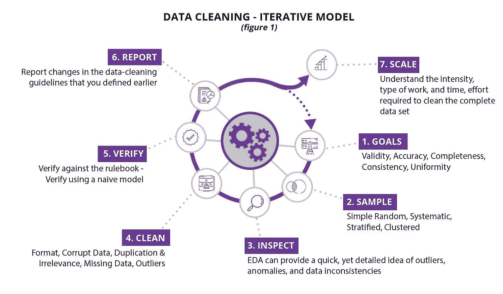
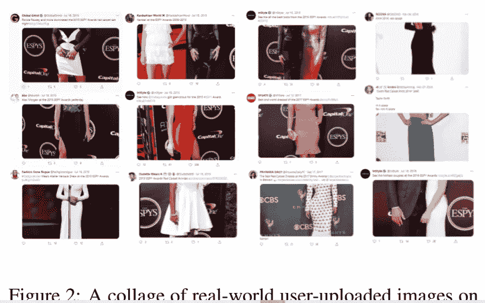
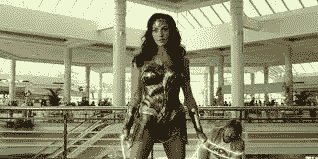
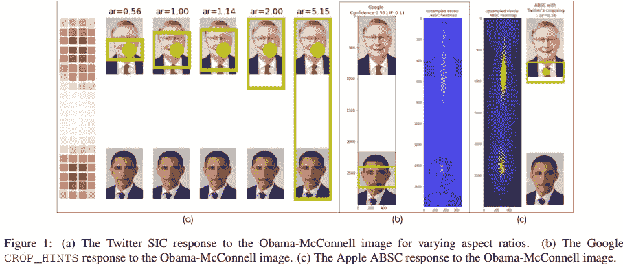
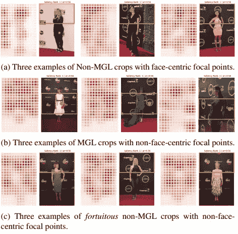
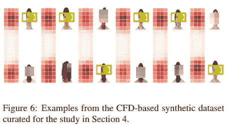
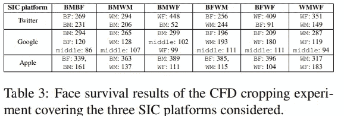
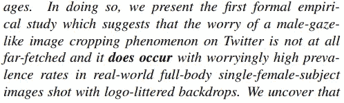
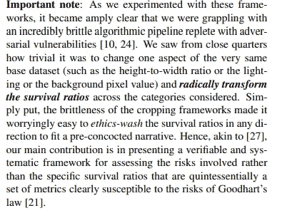

# 推特、种族主义和男性凝视

> 原文：<https://medium.com/mlearning-ai/twitter-racism-and-the-male-gaze-a02188417e42?source=collection_archive---------4----------------------->

## 以谷歌和苹果的人工智能为特色。他们都有偏见吗？

为了帮助我了解您[请填写此调查(匿名)](https://forms.gle/7MfQmKhEhyBTMDUD7)

如果你已经关注我的内容有一段时间了，你会知道我经常强调在你的机器学习模型中寻找偏见来源的重要性。由于最大似然模型是黑箱，一旦发现偏差，这将是一个非常昂贵的过程。在修复过程中，它还会导致一些(有时)致命的后果。因此，快速检测您的 AI 学习代理中可能存在的偏差非常重要。这也是数据科学家花那么多时间在数据清理上的原因之一。做好这件事有很多步骤，但伟大的数据集是减轻偏见、减少深度学习模型的脆弱性，甚至提高性能的一种伟大方式。

Good data cleaning has a lot of steps that require time and analysis. But it is one of the best ROI decisions you will make in your pipeline.

所以，我对这篇论文非常感兴趣也就不足为奇了，[审计显著性裁剪算法](https://openaccess.thecvf.com/content/WACV2022/papers/Birhane_Auditing_Saliency_Cropping_Algorithms_WACV_2022_paper.pdf)。该论文旨在评估科技巨头 Twitter、谷歌和苹果使用的人工智能裁剪算法是否具有种族主义和性别歧视。这显然是一个非常重要的探索领域，因为许多人依靠这些平台谋生。这篇论文提出了一些关于这个领域和机器学习研究的相当有趣的问题/讨论点。我个人认为这篇论文非常重要，所以我放弃了原本为本周的文章准备的研究来写这篇文章。

在这篇文章中，我将回顾这篇论文的发现，以及这些讨论要点。因为这是一次讨论，我也很想听听你的想法。把它们留在评论里，或者通过我的社交链接联系我。

# 背景

许多网络都使用自动图像裁剪。当图像对于预览来说太长时，平台将自动使用图像的一部分进行预览。人工智能自动检测最重要的部分，因此这些算法被称为**显著性裁剪算法**。Twitter 用户注意到一个有趣的现象。对于女明星的照片，算法会裁剪出她们的脸，聚焦在她们的身体上。

Why is the algorithm consistently focusing on the body of the women instead of their faces? You’ll be surprised

人们将此归因于潜移默化进入训练/数据的可能的“男性凝视”偏见。这是一个合理的解释。请记住，由于科技在很大程度上是男性主导的，这类事情可能会被忽视。所以男性凝视并不是完全不合理的解释。

Wonder Woman should logically be armored up. Try getting kicked in your thighs. It will leave you on the ground

对于那些不熟悉这个术语的人来说，术语男性凝视(姑且称之为 MG)是在 70 年代创造的，用来指出给予女性角色的待遇。回想一下电子游戏/漫画/电影。女性经常被描绘成穿着迷人的服装，而这些服装从逻辑上讲是没有任何用途的。他们的角色设计/动作是为了符合美学而不是功能。用户担心 Twitter 人工智能在展示男性凝视。

自然，这引起了很多愤怒。以至于 Twitter 调查了这一现象，并发布了他们自己的报告，题为[“Twitter 上的图像裁剪:公平指标，它们的局限性，以及表现、设计和代理的重要性”](https://arxiv.org/abs/2105.08667)。本文详细介绍了他们的算法，并解释了这种裁剪的可能原因。它非常冗长，所以我决定不分解它。文章[分享我们的图像裁剪算法](https://blog.twitter.com/engineering/en_us/topics/insights/2021/sharing-learnings-about-our-image-cropping-algorithm)是一个很好的总结。

[审计显著性裁剪算法](https://openaccess.thecvf.com/content/WACV2022/papers/Birhane_Auditing_Saliency_Cropping_Algorithms_WACV_2022_paper.pdf)也评估 Twitter 使用的显著性图像裁剪(SIC)算法。它将结果与谷歌和苹果的 SICs 进行了比较。结果很有趣。

# 理解这些算法的工作原理

这些算法在功能上有些相似。虽然在架构和具体实现上存在差异，但所有 3 个代理都将图像作为输入，并识别该图像中的“显著”区域。

如果你对算法的技术差异感兴趣，细节在第二部分。然而，我们简单的解释足以理解和讨论这篇论文及其发现。下面是 Twitter 的 SIC 的一个非常简洁的端到端的图示。

Taken from Twitter’s Article. This is a pretty neat visual that explains the process end to end

现在问题变成了，算法是不是在裁剪中物化了女性？种族是如何参与其中的？白人的形象被认为比黑人的形象更重要吗？这些发现非常有趣。

# 男性凝视背后的原因

当人们开始观察这些图像时，他们注意到了一个有趣的模式。最高的显著点与人毫无关系。相反，人工智能将企业和品牌标志视为图像中最重要的方面。引用该论文“*”在图 3b 中，我们看到焦点如何映射到名人佩戴的时尚配饰(最左边的图像)或活动徽标(中间图像中的 ESPYs 徽标)或背景中的公司徽标(最右边图像中的大写字母 1 徽标)，这导致了最终裁剪图像中的 MGL 伪像。在图 3c 中，我们展示了一些案例，其中一个良性的裁剪(没有 MGL 伪像)出于幸运的意外发现，焦点不是以面部为中心，而是实际上位于背景事件或公司徽标上，但徽标碰巧位于面部附近或图像的上半部分，从而导致最终的裁剪看起来像是以面部为中心的裁剪。*

MGL=Male Gaze Like. Was not expecting this result. Important parts correspond with symbols/logos

**事实证明，人工智能拥有资本家的目光，而不是男性的目光。**这一结果出乎意料，并强调了检查您的 AIs 评估的重要性。

# 调查机器人种族主义

现在进入下一个重要的问题，“人工智能代理是种族主义者吗？”作者进行了以下实验。

> *为了将结果与 Twitter 的研究[27]进行比较，我们从六个种族性别有序对[(BM，BF)，(BM，WM)，(BM，WF)，(BF，WM)，(BF，WF)，(WM，WF)]中统一采样生成了一个合成图像数据集，其中 B 是黑人，W 是白人，M 是男性，F 是女性。*

他们肯定会控制外来因素，如图像大小、光线、表情等。从事机器学习工作，像这样设置实验的能力是非常重要的。这些图像看起来像这样:

We have a face, white space, face format for all images. Remember each image is vertical

作者认为，由于图像很长，SIC 算法必须选择一张脸来丢弃。通过在多个实验中进行计算，我们可以看到一个人口统计是否确实是首选的。"*在表 3 中，我们给出了在 6 × 3 种族性别和 SIC 平台组合中，两个类别中哪一个在 SIC 中存活下来的原始计数。例如,( Twitter，BFWF)索引单元格显示 WF: 409，BF: 91，这意味着当来自 CFD 数据集的 500 张由随机采样的黑人女性(BF)和白人女性(WF)面部图像组成的 3 × 1 网格图像通过 Twitter 的 SIC 时，在这些图像中的 409 张中，白人女性的面部比黑人女性的面部更受青睐*

Some….interesting results here

我们在这里看到一些有趣的结果。Twitter 似乎真的很爱女性(尤其是白人女性)。苹果是黑人的巨大盟友。

尽管推测结果很有趣(我有一些有趣的理论)，但重要的是要记住这是一个单独的实验。我们需要重现这一点，用不同的数据集/条件进行实验。此外，整合一些交叉验证和大量的图像对也很重要。

# 重要的补充说明

如果你来自我的 YouTube 视频，[机器学习发展你应该知道:2022 年 1 月](https://youtu.be/AH1LkgrkyU8)(我在那里提到了这篇论文和其他重要的 ML 新闻)，你会记得我不是这篇论文某些方面的超级粉丝。我将简要说明原因。它很重要，因为它反映了这个世界和 ML 系统的方方面面。

They even bolded the does occur

你会注意到，尽管知道 Twitter SIC 主要关注的是标志，但他们继续使用“男性凝视”这个术语。我觉得这是一种点击诱饵，因为它留下了图片的一个重要部分。摘要甚至强烈断言性别和种族偏见确实存在，但没有提到细微差别。在演示中使用如此强烈的细微差别(不提细微差别)似乎有点不诚实。在“[这是令人窒息的机器学习研究](/mlearning-ai/this-is-stifling-machine-learning-research-1796479a7da9)”中，我谈到了同行评审系统如何激励提交。这种故意煽动性的语言似乎是为了让报纸得到更多的关注。然而，我确实相信，当涉及这种分歧和个人问题时，我们在交流细节时需要更加谨慎。根据作者的以下引述，我想他们会同意我的观点

Taken from this paper. Remember, there’s always tons of nuance in ML

如果你喜欢这篇文章，看看我的其他内容。我定期在 Medium、YouTube、Twitter 和 Substack 上发帖(所有链接都在下面)。我专注于人工智能、机器学习、技术和软件开发。如果你正在准备编码面试，看看:[编码面试变得简单](https://codinginterviewsmadesimple.substack.com/)，我的每周简讯。您可以以每天不到 0.5 美元的价格获得高级版本。高级版将解锁每周编码问题的高质量解决方案、特殊讨论帖子和一个伟大的社区。它帮助了很多人做准备。

如果你也有任何有趣的工作/项目/想法给我，请随时联系我。总是很乐意听你说完。

以下是我的 Venmo 和 Paypal 对我工作的金钱支持。任何数额都值得赞赏，并有很大帮助。捐赠解锁独家内容，如论文分析、特殊代码、咨询和特定辅导:

https://account.venmo.com/u/FNU-Devansh

贝宝:[paypal.me/ISeeThings](https://www.paypal.com/paypalme/ISeeThings)

# 向我伸出手

如果你想讨论家教，发短信给我。查看免费的罗宾汉推荐链接。我们都得到一个免费的股票(你不用放任何钱)，对你没有任何风险。不使用它就是在浪费钱。

查看我在 Medium 上的其他文章。:【https://rb.gy/zn1aiu 

我的 YouTube:[https://rb.gy/88iwdd](https://rb.gy/88iwdd)

在 LinkedIn 上联系我。我们来连线:[https://rb.gy/m5ok2y](https://rb.gy/f7ltuj)

我的 insta gram:[https://rb.gy/gmvuy9](https://rb.gy/gmvuy9)

我的推特:[https://twitter.com/Machine01776819](https://twitter.com/Machine01776819)

如果你正在准备编码/技术面试:[https://codinginterviewsmadesimple.substack.com/](https://codinginterviewsmadesimple.substack.com/)

获得罗宾汉的免费股票:[https://join.robinhood.com/fnud75](https://www.youtube.com/redirect?redir_token=QUFFLUhqa0xDdC1jTW9nSU91WXlCSFhEVkJ0emJvN1FaUXxBQ3Jtc0ttWkRObUdfem1DZzIyZElfcXVZNGlVNE1xSUc4aVhSVkxBVGtHMWpmei1lWWVKNzlDUXVJR24ydHBtWG1PSXNaMlBMWDQycnlIVXNMYjJZWjdXcHNZQWNnaFBnQUhCV2dNVERQajFLTTVNMV9NVnA3UQ%3D%3D&q=https%3A%2F%2Fjoin.robinhood.com%2Ffnud75&v=WAYRtSj0ces&event=video_description)

 [## Mlearning.ai 提交建议

### 如何成为 Mlearning.ai 上的作家

medium.com](/mlearning-ai/mlearning-ai-submission-suggestions-b51e2b130bfb)