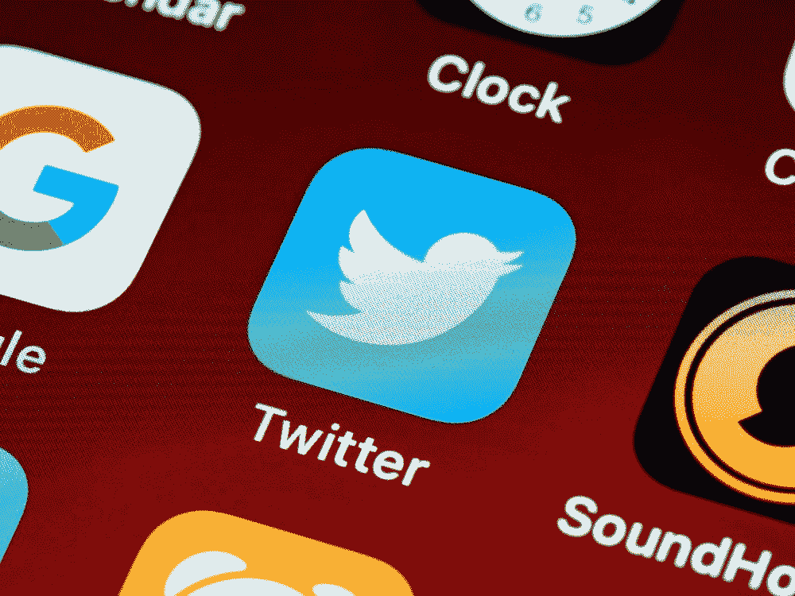
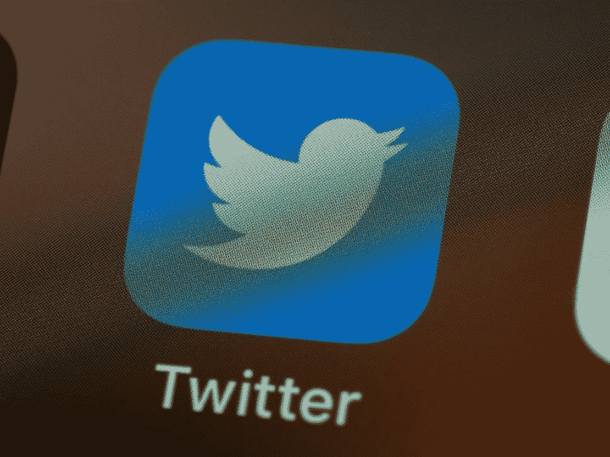
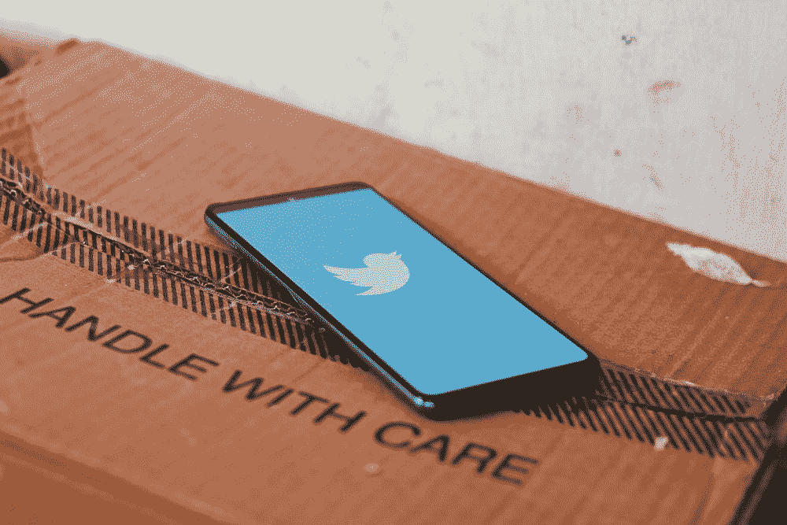

# Twitter 的收购给科学界敲响了警钟

> 原文：<https://medium.com/mlearning-ai/twitters-acquisition-raises-red-flags-for-scientific-community-9b865fb2f694?source=collection_archive---------3----------------------->

## 为什么科学家和数据科学家会关注

image by [Alexander Shatov](https://unsplash.com/@alexbemore) at unsplash.com

Twitter 多年来一直是科学和数据科学社区的有用工具。今天，一些研究人员敲响了警钟:最近的收购可能改变了一些事情。

# Twitter 和在科学和数据科学中的重要性

image by [Brett Jordan](https://unsplash.com/@brett_jordan) at unsplash.com

几乎可以肯定地说，几乎每个数据科学家或人工智能从业者都会关注 Twitter， [Yann LeCun](https://twitter.com/ylecun) 。他不是人工智能界唯一的杰出成员；事实上，大多数教授和研究人员都有 Twitter 账户。

首先，我们可以说，Twitter 多年来已经证明了它在本地和全球的相关性。例如，在自然灾害应对期间，[在促进应对和预警](https://www.science.org/doi/10.1126/sciadv.1500779)方面都至关重要。此外，它还允许持不同政见者逃避审查。《连线》指出[黑色推特](https://en.wikipedia.org/wiki/Black_Twitter#Reciprocity_and_community)已经成为一个能够推动社会文化变革的社区，而且目前[还没有替代者](https://www.wired.com/story/black-twitter-elon-musk/)。

对科学来说，首先也是最重要的是，它是一个取之不尽的数据来源。例如，对推特的分析已经被用来理解人们对气候变化的看法。许多社会科学研究已经使用 Twitter 来理解观点的传播、社会运动、激进主义、政治理念、[及其演变](https://www.nature.com/articles/s41598-017-18007-4)。这是因为 Twitter 允许研究人员以其他社交网络不允许的方式访问和分析数据。

Twitter 通过构建一个健壮的 API 来实现这一点，方便了研究人员的工作。事实上，仅 Kaggle 上就有超过一千个数据集。这些数据集已经被研究人员用于科学文章，也用于各种[教程和博客文章](https://towardsdatascience.com/how-do-data-scientists-use-twitter-let-us-count-the-ways-50494e2a95c8)。例如，Twitter 数据已被广泛用于图形神经网络等模型的开发:允许在从社交网络获得的静态和动态、小型和大型图形上测试深度学习模型。

第二个原因，Twitter 使得建立合作、宣布职位空缺或联系未来雇主成为可能。在科学领域，既有致力于宣布博士和博士后的账户，也有致力于促进 STEM 院系博士多样性的标签(更不用说其中一些)。

> “Twitter 是一个促进科学去中心化的工具；你能够向社区展示自己，发展你的个人品牌，与你研究领域内外的人建立对话，创造或加入你所在领域的专业环境，而无需像你的直接上司这样的中间人。”— [来源](https://www.ncbi.nlm.nih.gov/pmc/articles/PMC7010239/)

正如《科学》杂志所指出的，Twitter 已经成为分享想法的首要场所。在冠状病毒爆发期间，关于病毒和序列出版物的信息在 Twitter 上的传播速度比传统渠道快得多，这推动了研究。

此外，已经发推的文章被证明获得了更多的引用(几项研究证明了这一点:此处[此处](https://pubmed.ncbi.nlm.nih.gov/34428984/)和[此处](https://www.sciencedirect.com/science/article/abs/pii/S0003497520308602))。其他人注意到，在前三天被高度分享的文章随后要么在具有更高影响因子的期刊[中被接受，要么在更有声望的会议上被接受](https://www.labsexplorer.com/c/twitter-and-scientists-a-love-story_185)。

[DeepMind](https://twitter.com/DeepMind) 、 [OpenA](https://twitter.com/OpenAI) I、 [Google](https://twitter.com/GoogleAI) 等定期在推特上公布自己的最新机型。这不仅允许他们传播出版物或作为免费宣传。另一方面，一些人测试算法并在 Twitter 上发布他们的印象。这允许他们接收关于模型如何工作、其局限性、潜在错误和偏差的信息。

一个例子是，在 ChatGPT 发布后，标签#chatGPT 的推文数量超过了 10 万条。许多用户表现出热情，并从一开始就显示出聊天机器人的局限性。这使得研究人员能够更快地找到他们的模型不能正常工作的极限情况。

# Twitter 最近的收购引起了科学界的关注

image by [Brett Jordan](https://unsplash.com/@brett_jordan) at unsplash.com

作为某种担忧的证明，最近有两封信被写给了《自然》(此处[此处](https://www.nature.com/articles/d41586-022-04362-4)和[此处](https://www.nature.com/articles/d41586-022-04361-5))。他们的发表是科学界关注 Twitter 最近发展的一个迹象。

第一个原因是，尚不清楚 Twitter 是否仍将允许研究人员自由访问数据，或者这是否会受到某种限制。其次，如果研究人员迁移到其他平台，这将使数据和社区碎片化。第三，Twitter 的数据有价值的一个原因是它是纵向的(允许分析趋势及其演变)，如果 Twitter 被放弃，这些数据将不再用于时间序列分析。

Twitter 是一个重要的数据来源，因为它们是可靠的。一些研究人员担心情况不再如此。马斯克最近[减少了 Twitter 的版主团队](https://fortune.com/2022/11/29/elon-musk-twitter-apple-tyranny-free-speech/)，并一直公开为“言论自由”辩护。在严厉的裁员之后，推特上的温和倾向于自动化。许多研究人员担心这意味着仇恨言论、机器人和错误信息的扩散。

此外，[埃隆·马斯克(Elon Musk)宣布计划删除超过 10 亿个不活跃账户](https://www.businessinsider.com/elon-musk-delete-inactive-twitter-accounts-free-up-handles-2022-12?r=US&IR=T)。目前还不清楚一个账户多久后会被宣布为不活动并面临被删除的风险。尽管最近的迹象表明可能会在一年后。这些账号的删除很可能导致历史信息的丢失，让研究者的研究更成问题。

同样如前所述，Twitter 已被用于讨论模型的局限性，并被研究人员用于在重要会议之前进行联系(例如，在 NeurIPS 2022 期间，许多研究人员在 Twitter 上讨论他们的工作或安排会面)。不幸的是，目前没有替代方案([乳齿象不是 Twitter](https://thewire.in/tech/why-mastodon-cant-be-a-replacement-for-twitter) 的翻版，被分成几个服务器或社区)。

# 结论

image by [Ravi Sharma](https://unsplash.com/@ravinepz) at unsplash.com

几年来，Twitter 一直是许多研究人员讨论的话题。它的政策使得收集用于重要研究的数据集成为可能。另一方面，几乎所有的数据科学家在学习用至少一个从 Twitter 获得的数据集编程时都尝试过(比如著名的 [Twitter 情绪分析](https://www.kaggle.com/datasets/crowdflower/twitter-airline-sentiment))。

Twitter 甚至比 LinkedIn 更是第一个宣布新文章和人工智能新模型的受众。Twitter 上的用户总是非常积极地提出对模型中存在偏见的担忧，角落案例，等等。

研究人员对 Twitter 最近的收购表示担忧。这既是因为 Twitter 可能不再是收集可靠数据的基地，也是因为相关信息可能会在错误信息的浪潮中丢失。你怎么想呢?请在评论中告诉我。

# 如果你觉得有趣:

你可以寻找我的其他文章，你也可以 [**订阅**](https://salvatore-raieli.medium.com/subscribe) 在我发表文章时获得通知，你也可以在**[**LinkedIn**](https://www.linkedin.com/in/salvatore-raieli/)**上连接或联系我。**感谢您的支持！**

**这是我的 GitHub 知识库的链接，我计划在这里收集代码和许多与机器学习、人工智能等相关的资源。**

** [## GitHub - SalvatoreRa/tutorial:关于机器学习、人工智能、数据科学的教程…

### 关于机器学习、人工智能、数据科学的教程，包括数学解释和可重复使用的代码(python…

github.com](https://github.com/SalvatoreRa/tutorial) 

或者随意查看我在 Medium 上的其他文章:

 [## 人工智能可以成为数据科学家吗？

### OpenAI 的 ChatGPT 让数据科学家们大吃一惊。它会偷走他们的工作吗？

medium.com](/mlearning-ai/can-an-ai-be-a-data-scientist-2d4d9b6c5d5)  [## 数据主权:分享不是关心

### 研究人员正在敦促提高数据透明度，总是授予数据访问权是正确的吗？

medium.com](/mlearning-ai/data-sovereignty-sharing-is-not-caring-f816f77c04fc)  [## 人工智能如何帮助保存艺术品

### 艺术杰作随时都是风险；人工智能和新技术可以助一臂之力

towardsdatascience.com](https://towardsdatascience.com/how-ai-could-help-preserve-art-f40c8376781d)  [## 人工智能如何拯救亚马逊雨林

### 亚马逊正处于危险之中，人工智能可以帮助保护它

towardsdatascience.com](https://towardsdatascience.com/how-artificial-intelligence-could-save-the-amazon-rainforest-688fa505c455)  [## Mlearning.ai 提交建议

### 如何成为 Mlearning.ai 上的作家

medium.com](/mlearning-ai/mlearning-ai-submission-suggestions-b51e2b130bfb)**