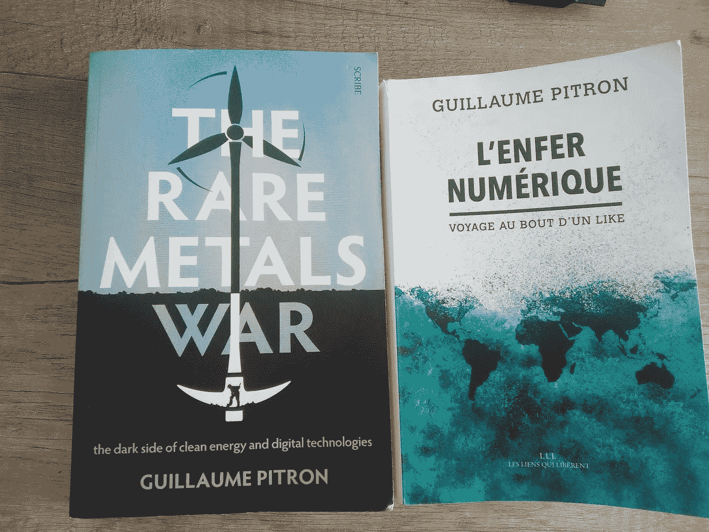

# 两本了解绿色和数字技术阴暗面的书

> 原文：<https://medium.com/mlearning-ai/two-books-to-understand-the-dark-side-of-green-and-digital-technologies-45c20431d10f?source=collection_archive---------6----------------------->

## 减少互联网接入和能源消耗对于应对气候危机至关重要

技术经常被认为是对抗气候危机的有力武器。绿色技术和数字技术都得到政府和社会的大力支持。虽然他们肯定可以提供创新的解决方案来减少我们社会的碳排放，监测气候变化并减轻其最严重的后果，但我们必须持批评态度并保持谨慎。

越来越多的文献警告绿色和数字技术对环境的负面影响。事实上，互联网的运行需要一个庞大的基础设施。这带来了巨大的材料和能源成本。由于我们对数字的沉迷，以及这个主要由增长而非道德或环境意识驱动的行业的动态，这些资源正在快速稀缺。

考虑到主题的复杂性，解释绿色和数字技术是如何工作的远非易事。这就是为什么 Guillaume Pitron 的事业如此引人注目和受欢迎。我强烈推荐他的两本书(都有法语和英语版本)，这两本书合在一起，对这个主题进行了令人愉快的深入介绍。

*   [**La guerre des métaux rares**](https://www.amazon.es/guerre-m%C3%A9taux-rares-transition-%C3%A9nerg%C3%A9tique/dp/B07SCHC2JD)**(**[**稀有金属战争**](https://www.amazon.es/Rare-Metals-War-digital-technologies/dp/1912854260/ref=sr_1_1?keywords=the+rare+metals+war&qid=1668761880&qu=eyJxc2MiOiIwLjAwIiwicXNhIjoiMC4wMCIsInFzcCI6IjAuMDAifQ%3D%3D&sprefix=the+rare+metal%2Caps%2C110&sr=8-1) **)** 聚焦绿色和数字技术的阴暗面，即让我们的技术发挥作用所需的大量物质资源和能源。通过查看技术冰山的隐藏部分，这本书是一次充满激情的环球之旅，访问了技术供应链中的不同热点。或许最重要的一点是，绿色技术几乎是“绿色的”，这给世界各国政府正在推动的绿色转型投下了巨大的阴影。
*   ****(**[**数字地狱**](https://www.amazon.es/Digital-Hell-Inner-Workings-Like/dp/1957363010/ref=sr_1_1?__mk_es_ES=%C3%85M%C3%85%C5%BD%C3%95%C3%91&crid=9O9TJIBTYSXR&keywords=digital+hell+guillaume&qid=1668761915&qu=eyJxc2MiOiIwLjQwIiwicXNhIjoiMC4wMCIsInFzcCI6IjAuMDAifQ%3D%3D&sprefix=digital+hell+guillaum%2Caps%2C92&sr=8-1) **)** 关注我们数字活动的环境足迹。作为他上一部作品的延续，这本书再次环游世界，详细展示了数字基础设施的不同组成部分:美国的煤电厂、北极的数据中心、每个海洋的海底电缆，以及一场控制互联网的巨大地缘政治游戏，这对理解我们生活的世界至关重要。我的建议:我们最好关闭我们的社交媒体账户，减少我们对数字的依赖，对地球的震动和我们的心理健康。**

** [## Mlearning.ai 提交建议

### 如何成为 Mlearning.ai 上的作家

medium.com](/mlearning-ai/mlearning-ai-submission-suggestions-b51e2b130bfb)**