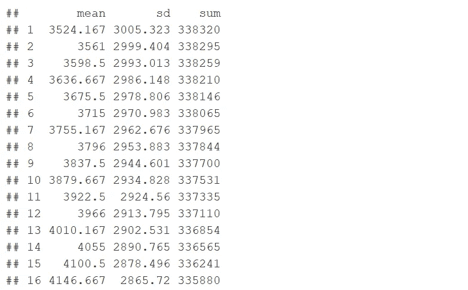
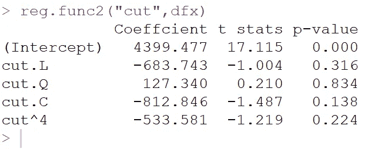

# R 语言中的函数式编程:一种立即增强您编码能力的武器

> 原文：<https://medium.com/mlearning-ai/two-weapons-to-instantly-buff-your-r-coding-power-part-2-de8e95b92dc2?source=collection_archive---------4----------------------->


我已经在第一部分中介绍了管道操作。我将介绍 R 编程中的另一个强大武器:函数。这个想法是，任何你期望做多次的事情，你都应该考虑使用函数，例如，运行多重回归，或者绘制一系列相似的图。通过将管道操作嵌入到函数中，您可以充分利用 R 编程的优势。

让我们从一个简单的例子开始。假设你的孩子给你布置了一个小的算术作业，要你找出一个给定的数字，比如 4 和 100 之间所有整数的平方和。你不需要一个函数来得到答案:

```
x=4
value=seq(from=x,to=100,by=1)
sum(value^2)
```

但是如果你孩子的老师要求 5 到 20 的计算结果呢？或者任何小于 100 的整数？你当然可以重复上述代码 16 次或更多。但是 R 函数提供了一种更简单的方法。

我们现在正式将这个小任务指定给一个函数。我们将从例子中解释写一个 R 函数需要什么。

```
myfunc1=function(x){
value=seq(x,to=100,by=2) 
y=sum(value^2) 
return(y)  
}
```

要创建一个函数，你需要指定一个函数名( *myfunc1* 此处)，圆括号中的参数，一个名为 x 的值。你可以随便叫它什么，但要确保这个名字出现在正在工作的函数中。在两个大括号({})之间，您编写希望函数根据您的输入执行的代码。在上面的例子中，x 用于生成一个整数序列。你不用标点符号来分隔不同的代码行；使用软回报或硬回报。当您准备好函数时，通过将光标移动到结束大括号(})的最末端，并单击“run”或按“Ctrl”+“Enter”，将它加载到 R 中。您的函数现在可以被调用使用了。

函数 *myfunc1* 现在已经创建并加载。要使用 myfunc1 来做这项工作，您需要向它提供参数:myfunc1(5)，myfunc1(6)，一直到 myfunc1(20)。这也不是一个好方法，因为:1)我们仍然在重复输入一些东西，2)结果没有放在一起。

下面的代码是正确的方法。下面我来解释一下。

```
v1=5:20
v2=sapply(v1,function(x)myfunc1(x))
```

*sapply* 允许自定义 R 函数 *myfunc1* 应用于向量 v1 的每个元素，向量 v1 的序列从 5 到 20。结果存储在一个名为 v2 的新向量中。您可以使用 *cbind* (v1，v2)创建一个矩阵，该矩阵可以使用 *as.data.frame* 进一步转换为 dataframe:

```
as.data.frame(cbind(v1,v2)
```

上面的例子说明了 R 函数的基本语法和用法。接下来，我们进一步探讨 r 语言中的函数式编程。

1.  *添加警告信息*

现在假设您希望 *myfunc1* 发送一条警告消息:如果 x 不是整数，或者大于 100，则停止函数中剩余代码的执行。我们在函数中添加了一个停止句。这条警告消息类似于您遇到的错误执行内置 R 函数的消息。

```
myfunc2=function(x){
if(round(x)!=x|x>=100) stop('your entered value is not correct!')
value=seq(from=x,to=100,by=1)
sum(value^2) 
}
```

*2。多种功能输出。*

有时我们期望函数给出多个输出。例如，除了平方和之外，您还想生成平均值和标准差。我们可以添加一个 return 命令并创建一个多输出列表，而不是有多个函数，一个用于 sum，一个用于 mean，一个用于 sd。

```
myfunc3=function(x){
if(round(x)!=x|x>=100) stop('your entered value is not correct')
value=seq(from=x,to=100,by=1)
output1=mean(value^2)
output2=sd(value^2)
output3=sum(value^2)
return(list(output1,output2,output3))
}
```

为了将 myfunc3 应用于 vector v1，并将结果很好地存储在 dataframe 中，我们使用下面的代码。

```
v1 %>% sapply(function(x)myfunc3(x)) %>% t() %>% as.data.frame() %>% setNames(c("mean","sd","sum"))
```

*t()* 用于成功转置*的输出*，因此结果按列给出。*设置名称*用于改变管道操作中的名称。你可以按照我在[第 1 部分](https://martinqiu.medium.com/two-weapons-to-instantly-buff-your-r-coding-power-part-1-79446ddb8cd0)中的描述一个管道一个管道地执行代码来查看数据流。结果如下所示。



*3。运行回归的功能*

r 函数可以使用对象而不是值(如上例)作为输入。假设我想对不同的数据集进行回归以获得最佳拟合。实际上，这叫做数据挖掘，不推荐使用。但是为了便于说明，我们使用了钻石数据。我们希望对多个数据集的钻石要素运行钻石价格回归模型。

```
reg.func=function(df){
  reg=lm(price~carat+cut+clarity+color,data=df)
  sum=summary(reg)
  result= unlist(sum$coefficients[,c(1,3,4)]) %>% as.data.frame() %>% round(3)%>% setNames(c("Coefficient","t stats","p-value"))
  return(result)
}
```

我写了函数 *reg.func* 。它使用 dataframe 作为输入，并返回另一个 dataframe 作为输出。我随机取样 500 颗钻石，并应用 *reg.func* 。可以查查结果。

```
set.seed(450)
dfx=sample_n(diamonds, 500)
reg.func(dfx)
```

其他对象，如公式、变量名也可以作为函数输入。假设我们要对价格和一个分类变量(切割、颜色或净度)进行回归，以比较不同特征维度对价格的影响。重复的工作需要函数编程。(以下代码是学习中的一点跳跃。)

```
reg.func2=function(x,df){
  lm.formula=as.formula(paste0("price~",x))
  reg=lm(lm.formula,data=df)
  sum=summary(reg)
 result=unlist(sum$coefficients[,c(1,3,4)]) %>% as.data.frame() %>% round(3)%>% setNames(c("Coeffcient","t stats","p-value"))
  return(result)
}reg.func2("cut", dfx)#"cut" is quoted.
```

在上面的代码中，您会注意到我们为一个函数使用了两个参数(x，我们在回归中使用的特性，以及 df，回归将在其上运行的数据帧)。您还注意到，我需要为线性回归指定 *lm.formula* ，这是通过*将*和*粘贴为. formula* 使用函数参数 x 之一创建的。其余都一样。输出如下。



如果有人说她不想在函数中使用字符串类型的输入；她更喜欢不带引号的论点。我们只是添加一行 *deparse(substitute(x))* 来从输入中提取字符串值。

```
reg.func3=function(x,df){
  x_name <- deparse(substitute(x))
  formula=as.formula(paste0("price~",x_name))
  reg=lm(formula,data=df)
  sum=summary(reg)
  result=unlist(sum$coefficients[,c(1,3,4)]) %>% as.data.frame() %>% round(3)%>% setNames(c("Coefficient","t stats","p-value"))
  return(result)
}
reg.func3(color,dfx)#color has no quotation marks
```

在这个新函数中，我们使用颜色作为 x 的输入，以使输出多样化。

函数参数的字符串值对于定制绘图元素(如 title)非常有用，这就引出了本文的最后一个例子。

*4。创建图的功能*

假设我们想选择一个分类特征/变量，按其级别分组，并计算每组中有多少菱形。然后，我们使用一个条形图来说明计数，标题为“不同 xxx 组的钻石计数”，其中 xxx 是我们选择的特征。我们希望为切割、颜色和透明度这三个分类特征分别创建三个图，并将它们保存到本地驱动器。

```
library(ggplot2)
plot.func=function(x){
 x_name <- deparse(substitute(x))
plot= diamonds %>% group_by({{x}}) %>% summarize(count=n()) %>% ggplot()+ geom_col(aes(x={{x}},y=count,fill={{x}}))+  
  labs(title=paste("Diamond Counts by Different Groups of" ,toupper(x_name)),x=x_name,y="count")
return(plot)
}
```

我们首先使用上面的函数 *plot.func* 来完成绘图工作。注意，x_name 是从函数参数 x 中剥离的字符串，并输入 ggplot2 的*标题*和 x 实验室参数。若要在数据帧的管道操作中引用函数参数，请使用{{x}}。

这里我还提供了函数参数是带引号的字符串的版本。以及保存到文件代码。

```
plot.func1=function(x){
 plot= diamonds %>% group_by(!!sym(x)) %>% summarize(count=n()) %>% ggplot()+ geom_col(aes(x=reorder(!!sym(x),-count),y=count,fill=!!sym(x)))+  
  labs(title=paste("Diamond Counts by Different Groups of" ,toupper(x)),x=x,y="count")
ggsave(paste0("F:/count.plot_",x,".jpg"),plot,width = 8, height = 6, units = "in")
}
```

在这个版本的函数中，x 是一个字符串，所以它可以直接输入到绘图标题和标签中。此外，它还在 *ggsave* 参数中输入文件名。但是，要引用它所代表的变量的名字，我们需要使用*！！sym(x)* 。这是本文中最棘手的部分。它为在 R 函数中生成动态变量名打开了大门，这超出了本文的范围。

最后一步是创建一个菱形特征的向量，并用我们刚刚编写的函数应用它。

```
feature=c("cut","clarity","color")
sapply(feature,plot.func1)
```

你会看到这三块地静静地躺在你的 F 盘里。

*专门介绍贸易工具的系列文章。我希望这篇文章对你有用。当你掌握了管道操作和函数式编程，写 R 代码就会变成你喜欢和怀念的东西。*