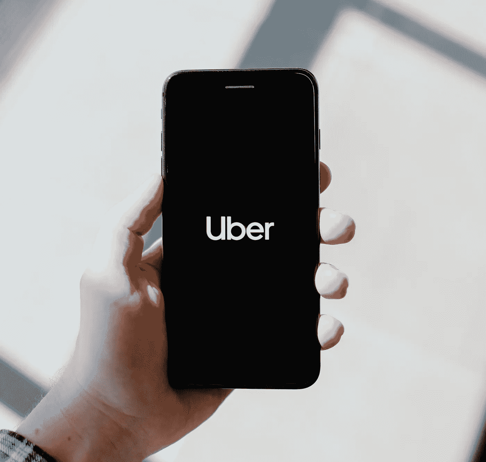

# 优步的市场匹配:案例研究

> 原文：<https://medium.com/mlearning-ai/ubers-marketplace-matching-algorithm-case-study-441853410a6b?source=collection_archive---------2----------------------->

# 介绍

优步是美国的一项移动服务，让交通变得容易。它的愿景是通过点击一个按钮来实现交通运输，并且取得了巨大的成功。参与实现这一切的机器学习和人工智能系统是这一成功的重要组成部分。

Photo by [Tingey Injury Law Firm](https://unsplash.com/@tingeyinjurylawfirm?utm_source=unsplash&utm_medium=referral&utm_content=creditCopyText) on [Unsplash](https://unsplash.com/s/photos/uber?utm_source=unsplash&utm_medium=referral&utm_content=creditCopyText)

使用数据科学和机器学习技术的目标是为用户提供便利性、经济性和安全性。做到这一点的一个方法是将正确的服务提供商与正确的骑手相匹配。

# 典型的优步骑行

当一个乘客请求搭车时，优步的系统就会产生一个工作。骑手上下车的位置被保存。然后联系司机，他们的供应商选择模型确保他们有权接受或拒绝乘坐。以前，符合乘客偏好的最近的出租车司机被分配给他们，但有时即使是最近的司机也无法按时到达，导致等待时间和取消订单的时间更长。这可能是由各种原因造成的，包括路障和交通堵塞。

为了克服这一点，他们开发了分批匹配，它考虑了给定区域内请求的所有行程，计算 eta，并分配司机，以便所有客户的总等待时间尽可能短。成功的平台赋予用户权力。鉴于打车公司的竞争性质，优步不希望它的客户等待。另一方面，减少等待时间也增加了司机合作伙伴的赚钱时间。因此，配对算法对优步的商业模式至关重要，因为它不仅创造了便利，还帮助优步以更低的成本创建了一项业务。

# 数据描述

## 硬过滤器

硬过滤器是帮助模型理解特定客户想要的乘坐类型的基本特征。在这些过滤器的基础上，该算法将试图找到可用的最佳驾驶员伙伴列表。

*   **位置:**位置是要考虑的最重要的特征。骑手的上车地点和下车地点在决定将哪个驾驶员分配给该游乐设备时起着重要作用。
*   **请求的服务类型和价格:**这将包括请求的汽车类型，每种类型都有一个相关的价格，该价格是根据燃油价格、距离、拥堵、需求和天气条件计算的。优步目前提供三种类型的出租车服务:UberGo，提供经济和紧凑的乘坐服务 GoSedan，提供负担得起的轿车乘坐服务 Premium，提供舒适的轿车和顶级司机。能够满足这些要求的服务提供商将被匹配。
*   **服务时间:**在定价和匹配司机时，服务时间至关重要。当请求乘坐时，通知当时的可用供应。当供应在一天中的任何时候都不足时，例如在晚上，它会对乘坐成本产生影响。

## 软过滤器

在评估了上述标准后，一些车手将被列入候选名单。软过滤器在后台运行，帮助缩小搜索范围。这些标准定义了某项特定任务应联系哪家入围供应商。一些软过滤器是:

*   **预计到达时间(ETA):** 为了减少客户的总体等待时间，将计算整批(批量匹配)最接近的匹配供应商的 ETA，平台将首先在特定范围内请求最佳供应商，例如半径 2 公里，如果在设定的时间范围内没有一个供应商接受请求，半径将稍微增加。
*   **评级:**在缩小范围的服务提供商中，该模型将避免将特定的交付合作伙伴发送给之前给了他们负面评级的用户。
*   **负载均衡:**负载均衡是在服务提供者之间平均分配任务的过程。先前已经完成许多次乘坐的驾驶员不应该被匹配算法加重负担，而让其他驾驶员自由。这是通过实时记录一天内完成的骑行、正在进行的骑行以及它们是否已经开始来实现的，但是如果驾驶员即将完成一次骑行，并且最适合附近刚刚请求的新骑行，则他们被请求首先完成该任务，然后搭载新的骑行者。

# 结论和模型评估

优步怎么知道匹配的车是不是好的匹配？我想到两件事可以作为评估婚介的标准:

*   **评级:**当一次乘坐完成后，客户有机会对乘坐进行评级，司机有机会根据乘客在驾驶室中的行为对其进行评级。该信息可用于确定匹配的服务提供商是否是合适的。为了区分正面和负面评级，可以利用阈值，并且可以评估回忆以查看在所有匹配的乘坐中有多少良好的乘坐匹配。
*   **取消:**如果在取车前取消了一次乘车，那就表明配对的车没有达到标准。这可能是由于较长的等待时间，不适当的负载平衡和许多其他因素。

## 参考

*   [https://analyticsindiamag . com/how-Uber-fixes-the-best-job-supply-match-to-full-trips-anywhere-it-operated/](https://analyticsindiamag.com/how-uber-fixes-the-best-job-supply-match-to-fulfil-trips-anywhere-it-operates/)
*   【https://www.uber.com/us/en/marketplace/matching/ 号
*   [https://jungle works . com/matching-algorithm-works-demand-economy-part-three-user-journey-series/](https://jungleworks.com/matching-algorithm-works-demand-economy-part-three-user-journey-series/)
*   https://www . enjoyalgorithms . com/blog/how-Uber-use-machine-learning
*   [https://www . promatics India . com/blog/what-goes-behind-a-ride-hailing-apps-matching-algorithm/](https://www.promaticsindia.com/blog/what-goes-behind-a-ride-hailing-apps-matching-algorithm/)

 [## Mlearning.ai 提交建议

### 如何成为 Mlearning.ai 上的作家

medium.com](/mlearning-ai/mlearning-ai-submission-suggestions-b51e2b130bfb)