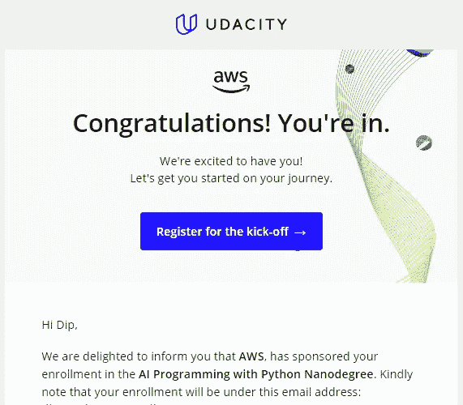

# Udacity AWS AI & ML 奖学金:详细解释

> 原文：<https://medium.com/mlearning-ai/udacity-aws-ai-ml-scholarship-explained-in-detail-5350f6681445?source=collection_archive---------3----------------------->

Udacity 经常与各种组织合作，提供奖学金，允许免费进入他们的高级纳米学位课程。Udacity 最近与 AWS 合作，为那些被选中获得奖学金的人提供免费的人工智能& ML 纳米学位课程。这篇文章讨论了从奖学金项目中可以期待什么，包括内容，规则和好处。

