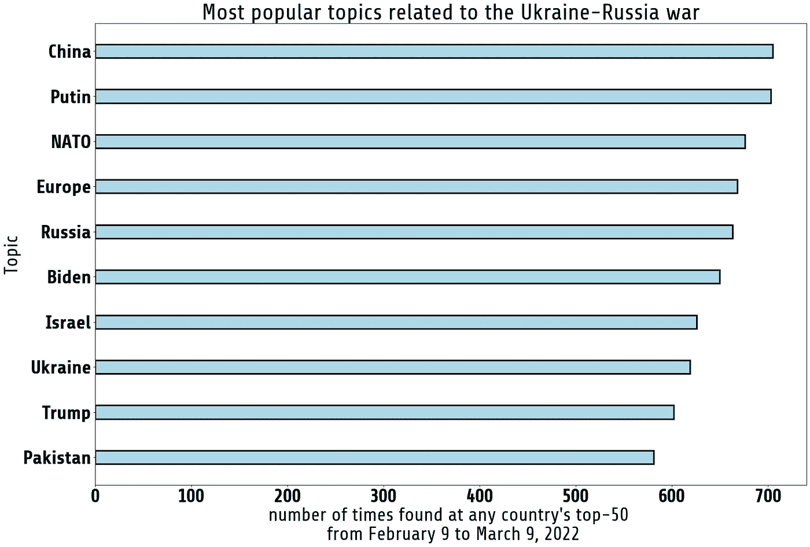
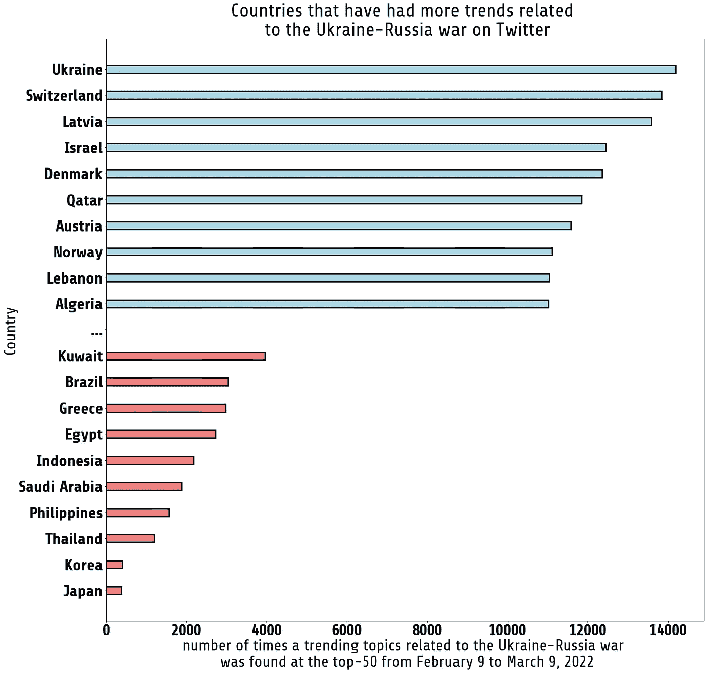
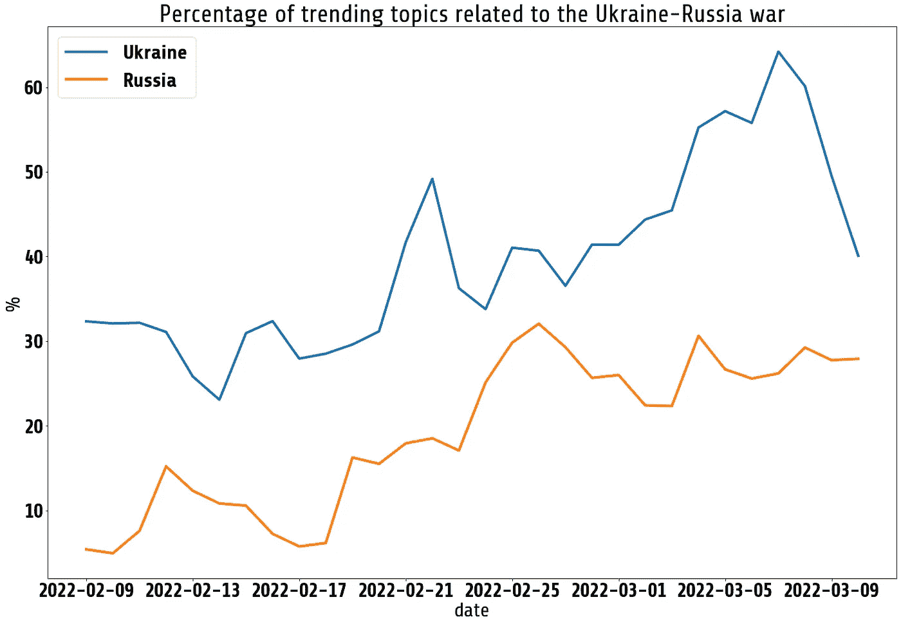

# 乌克兰-俄罗斯战争:我们能从推特数据中学到什么？

> 原文：<https://medium.com/mlearning-ai/ukraine-russia-war-analysis-from-twitter-data-3be1addbbc50?source=collection_archive---------8----------------------->

## 热门话题、每个国家的认知度和其他见解

Photo of [Joshua Hoehne](https://unsplash.com/@mrthetrain) on [unsplash](https://unsplash.com/)

就在 2022 年 2 月 24 日，俄罗斯开始军事入侵乌克兰，这场冲突对全世界产生了严重影响:从欧洲的移民危机到给世界经济带来的风险。从 Twitter 趋势的角度来看，自今年年初以来，这一事件已经塑造了很大一部分人的观点，我们将在本帖中对此进行分析。

在本帖中，我们将分析与乌克兰-俄罗斯战争相关的热门话题的行为，并找出 Twitter 用户对这一事件的反应。

由于入侵当天是 2 月 24 日，我们将分析入侵前 2 周和入侵后 2 周 Twitter 上发生的事情，因此我们将处理大约 30 天的数据，并将重点回答以下问题:

*   最受欢迎的话题是什么？
*   **哪些国家有更多与乌俄战争相关的热门话题？**
*   **如何改变这个话题在推特上的流行程度？**

除了了解最受欢迎的话题和哪些国家对这一事件谈论最多之外，回答这些问题将让我们了解各国是如何意识到这一冲突的，以及这种意识如何随着时间的推移而变化。

# 数据

由于入侵当天是 2 月 24 日，我们将分析入侵前 2 周和入侵后 2 周左右 Twitter 上发生了什么。

我从我的初创公司[趋势预测](https://trendspredictions.com/)收集这些数据。在那里，我每小时从推特上收集数据。我收集的数据是世界上每个国家(62 个国家和许多其他城镇)的前 50 个趋势主题，我为这些趋势主题的很大一部分添加了附加信息，例如它们所属的类别和实体。后者指的是与任何热门话题相关的“事物”，例如:对于热门话题“基辅”，根据人们在推特上发布的内容，我们可能会发现“俄罗斯”和“北约”是两个提到的实体(或“事物”)。我使用这些信息来过滤与乌克兰-俄罗斯战争相关的趋势主题，包括其中提到实体的每个趋势主题:*乌克兰*、*乔·拜登*、*弗拉基米尔·普京*、*北约*或*沃洛季米尔·泽伦斯基*。

所以，现在我们知道我们有什么，我们准备分析这些数据。

# 最受欢迎的话题是什么？

我们首先想知道的是，与乌克兰-俄罗斯战争相关的最受欢迎的话题是什么。为了做到这一点，我们会计算每一次我们在任何国家发现的与乌克兰-俄罗斯战争相关的热门话题。例如:2 月 10 日 10:00，我们收集了每个国家的 50 大热门话题。由于我们跟踪 62 个国家，我们可能已经收集了多达 3100 个完全不同的趋势主题，但从来没有过这种情况，通常情况下，各国从彼此那里获取趋势主题。因此，在那个特定的时间框架内，我们有 2628 个不同的热门话题，其中 221 个热门话题与乌克兰-俄罗斯战争有关。所以最后，我们统计了所有这些出现的次数，基本上我们得到的是在至少一个国家，热门话题出现在前 50 名的总时间。

(image by author)

从 2 月 9 日到 3 月 9 日，我们有 720 个小时，话题**中国**和**普京**在至少一个国家的前 50 名中出现了 720 次，这意味着它们从未停止成为一种趋势。在列表中，我们还有其他一些话题，比如**北约**、**欧洲、**和**俄国**，这些话题也很受欢迎。

# 哪些国家有更多与乌克兰-俄罗斯战争相关的热门话题？

现在我们知道了什么是最受欢迎的热门话题，我们想知道哪些国家有更多与乌克兰-俄罗斯战争相关的热门话题。这些信息将让我们了解每个国家对这场战争的关注程度。

我们在这种情况下所做的是计算每个国家每小时与乌克兰-俄罗斯战争相关的趋势话题的数量，下图总结了这种计算。

(image by author)

在图的顶部，我们有 10 个国家有更多与乌克兰-俄罗斯战争相关的热门话题，我们可以发现乌克兰、瑞士和拉脱维亚位于顶部。在列表中，我们可以找到关于乌克兰-俄罗斯战争的话题较少的国家，我们可以找到日本、韩国和泰国(*注意:拥有大量 Twitter 用户的国家，如美国、巴西和日本，往往每小时都有新的热门话题，换句话说，他们的前 50 名有些不稳定。这解释了为什么日本在这个名单的末尾。*

现在，我们知道了哪些国家与乌克兰-俄罗斯战争相关的热门话题越来越少，让我们来比较一下前 3 名:乌克兰、瑞士和拉脱维亚，以及后 3 名:日本、韩国和泰国。但在这种情况下，让我们分析一下与乌克兰-俄罗斯相关的热门话题在前 50 名中所占的比例。结果如下图所示。

(image by author)

有趣的是，2 月 24 日这一天有更多与这场战争相关的热门话题，我们可以看到所有这些国家都有所增加。更有趣的是，在入侵当天，瑞士是与这场冲突相关的热门话题最多的国家。我们还可以注意到，随着时间的推移，唯一稳定增长的曲线是乌克兰的曲线，其他国家也有非常相似的行为，在 2 月 24 日出现了显著增长。

我们可以认为乌克兰的热门话题非常不同，因为它是一个直接卷入这场战争的国家，这是有道理的。所以我们来对比一下俄罗斯的这种行为，看看他们是否也有类似的曲线。

(image by author)

这里我们可以看到俄罗斯的受欢迎程度曲线也是不同的。似乎在入侵后，俄罗斯推特用户在推特上谈论战争更加活跃，但在入侵前几天，它似乎不是用户中一个有趣的热门话题，至少与乌克兰、拉脱维亚或瑞士相比不太有趣。

最后，为了用另一个有趣的可视化来结束这个分析，让我们来看一个时间推移地图，上面显示了每个国家与乌克兰-俄罗斯战争相关的热门话题的总数。这里需要注意两个重要的日期:

*   2022 年 2 月 22 日:弗拉基米尔·普京承认顿涅茨克和卢甘斯克人民共和国独立
*   2022 年 2 月 24 日:俄罗斯入侵开始

我们可以注意到，在这两个重要的日子里，来自世界各地的 Twitter 用户更积极地谈论这场冲突，但仅仅几天后，一些国家的 Twitter 用户就不再那么活跃了。

# 摘要

为了结束这项工作，让我们列出我们从这项分析中发现的最有趣的见解:

*   与乌俄战争相关的热门话题是**中国**、**普京、**和**北约**。
*   与乌俄战争相关的热门话题较多的国家有**乌克兰**、**瑞士**、**拉脱维亚**。
*   与乌俄战争相关的热门话题较少的国家有**日本**、**韩国**、**泰国**。
*   乌克兰的推特用户一直在稳步增加与这场战争相关的热门话题数量。
*   俄罗斯的推特用户在入侵当天就开始更积极地参与这场冲突
*   2022 年 2 月 22 日和 2 月 24 日是与这场冲突相关的活动较多的日子

*本帖原载于* [*趋势预测博客*](https://trendspredictions.com/blog/) *。*

*感谢阅读！*

 [## Mlearning.ai 提交建议

### 如何成为 Mlearning.ai 上的作家

medium.com](/mlearning-ai/mlearning-ai-submission-suggestions-b51e2b130bfb)