# PyTorch 几何图形神经网络实验(1): Cora 数据集

> 原文：<https://medium.com/mlearning-ai/ultimate-guide-to-graph-neural-networks-1-cora-dataset-37338c04fe6f?source=collection_archive---------0----------------------->


Photo by [JJ Ying](https://unsplash.com/@jjying?utm_source=medium&utm_medium=referral) on [Unsplash](https://unsplash.com?utm_source=medium&utm_medium=referral)

社交媒体近年来变得流行，用户通过关注者-关注者关系相互联系。还有许多其他类型的数据具有网络结构，其中数据相互连接。一个可以应用于此类数据的机器学习模型是**图形神经网络(GNNs)** ，它吸引了很多关注。在本文中，我们将解释图形数据的特征，以及与图形神经网络相关的库和可视化技术的使用。

通过这篇文章，你将学到以下内容；

*   如何处理 PyTorch 几何和 networkx
*   Cora 数据集的特征
*   如何有效地可视化数据

```
import os
import collectionsimport numpy as np
import pandas as pd
import matplotlib.pyplot as plt
import seaborn as sns
import scipy.sparse as sp
import torch
from torch import Tensor
import torch_geometric
from torch_geometric.utils import to_networkx
from torch_geometric.datasets import Planetoid
import networkx as nx
from networkx.algorithms import communitydevice = torch.device('cuda' if torch.cuda.is_available() else 'cpu')data_dir = "./data"
os.makedirs(data_dir, exist_ok=True)
```

# **科拉数据集**

Cora 数据集是图研究领域中众所周知的数据集。这包括 2708 份科学出版物，分为七类。引文网络由 5429 个链接组成。数据集中的每个出版物由 0/1 值的词向量来描述，该词向量指示字典中相应词的存在与否。这部词典由 1433 个独特的单词组成。

顺便提一下，有一项服务可以显示通过引用关系连接的论文网络。这在寻找相关研究时非常有用。详见[此处](http://connectedpapers.com)。

首先，通过运行下面的命令下载数据集。在本文中，我们将使用**py torch**G**geometric**和 **networkx** 处理数据。

```
dataset = Planetoid(root=data_dir, name='Cora')
data = dataset[0]
```

## **节点**

Cora 数据集包含 **2708** 篇论文，在图中表示为节点。

```
print(f'Number of nodes: {data.num_nodes}')
# Number of nodes: 2708
```

## **边缘**

Cora 数据集中的论文有 **5429** 引用连接，在图中表示为边。边信息对于图形数据是唯一的。

```
print(f'Number of edges: {data.num_edges}')
# Number of edges: 10556
```

边数好像是 **10556** 。我们来看看为什么边数是 5429 的两倍。

```
print(f'Has isolated nodes: {data.has_isolated_nodes()}')  # False
print(f'Has self-loops: {data.has_self_loops()}')  # False
print(f'Is undirected: {data.is_undirected()}')  # True
```

第一行代码确认没有不通过边连接的节点，第二行代码显示没有自循环，第三行代码显示边没有方向。这意味着边计数是实际计数的两倍，因为包括了双向边信息。

让我们看看边缘信息是如何存储的。我们以第 30 个节点持有的边为例来看。

```
edge_index = data.edge_index.numpy()
print(edge_index.shape)
edge_example = edge_index[:, np.where(edge_index[0]==30)[0]]
edge_example
```

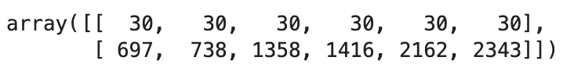

我们已经以边所连接的节点对的形式获得了数据。

现在，让我们试着画一个以这个节点为中心的网络。

```
node_example = np.unique(edge_example.flatten())plt.figure(figsize=(10, 6))
G = nx.Graph()
G.add_nodes_from(node_example)
G.add_edges_from(list(zip(edge_example[0], edge_example[1])))
nx.draw_networkx(G, with_labels=False)
```

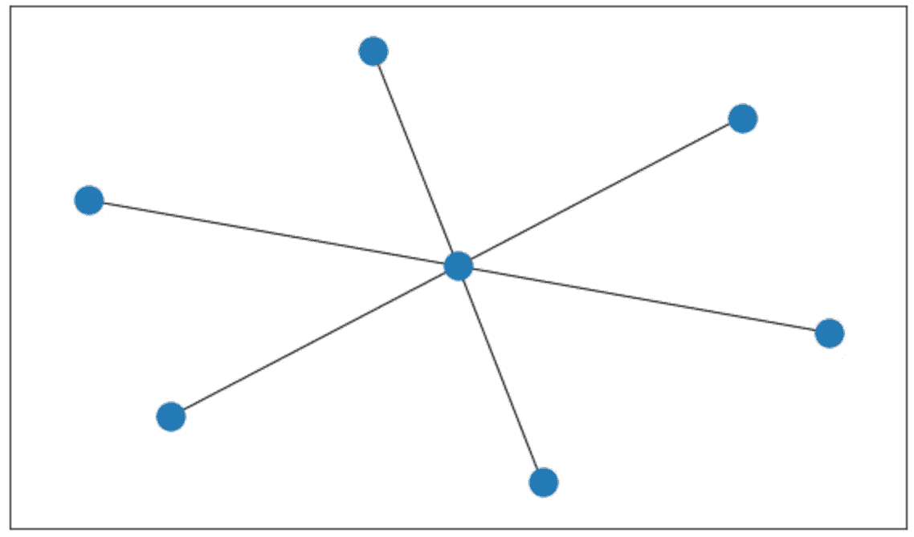

## 节点度

图论中的度是指一个图中连接一个顶点(节点)的边数。我们前面看到每个节点总有一条边，那么每个节点平均有多少条边呢？

```
print(f'Average node degree: {data.num_edges / data.num_nodes:.2f}')
# Average node degree: 3.90
```

我们发现平均节点度为 3.9。你可能觉得低得惊人。我们可以通过绘制度的直方图来检查总体分布。

```
G = to_networkx(data, to_undirected=True)
degrees = [val for (node, val) in G.degree()]display(pd.DataFrame(pd.Series(degrees).describe()).transpose().round(2))print(len(degrees))
print(sum(degrees))plt.figure(figsize=(10, 6))
plt.hist(degrees, bins=50)
plt.xlabel("node degree")
plt.show()
```

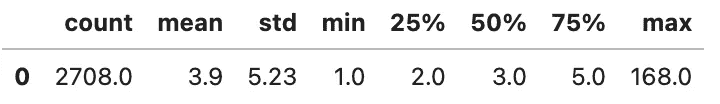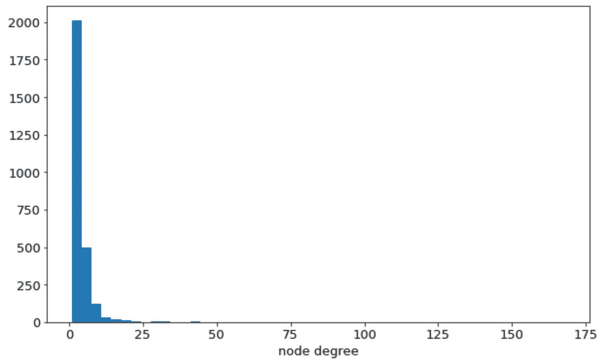

高学位意味着它们与许多节点(论文)相连。换句话说，度数高的**节点很可能是重要的**。记住，找论文的时候，总是可以通过看论文被引用的次数来推断论文的好坏。

让我们绘制图表，看看具有最高程度的前 10 个节点位于何处。

```
G = to_networkx(data, to_undirected=True)
pos = nx.spring_layout(G, seed=42)cent = nx.degree_centrality(G)
node_size = list(map(lambda x: x * 500, cent.values()))cent_array = np.array(list(cent.values()))
threshold = sorted(cent_array, reverse=True)[10]
print("threshold", threshold)
cent_bin = np.where(cent_array >= threshold, 1, 0.1)plt.figure(figsize=(12, 12))
nodes = nx.draw_networkx_nodes(G, pos, node_size=node_size,
                               cmap=plt.cm.plasma,
                               node_color=cent_bin,
                               nodelist=list(cent.keys()),
                               alpha=cent_bin)edges = nx.draw_networkx_edges(G, pos, width=0.25, alpha=0.3)plt.show()
```

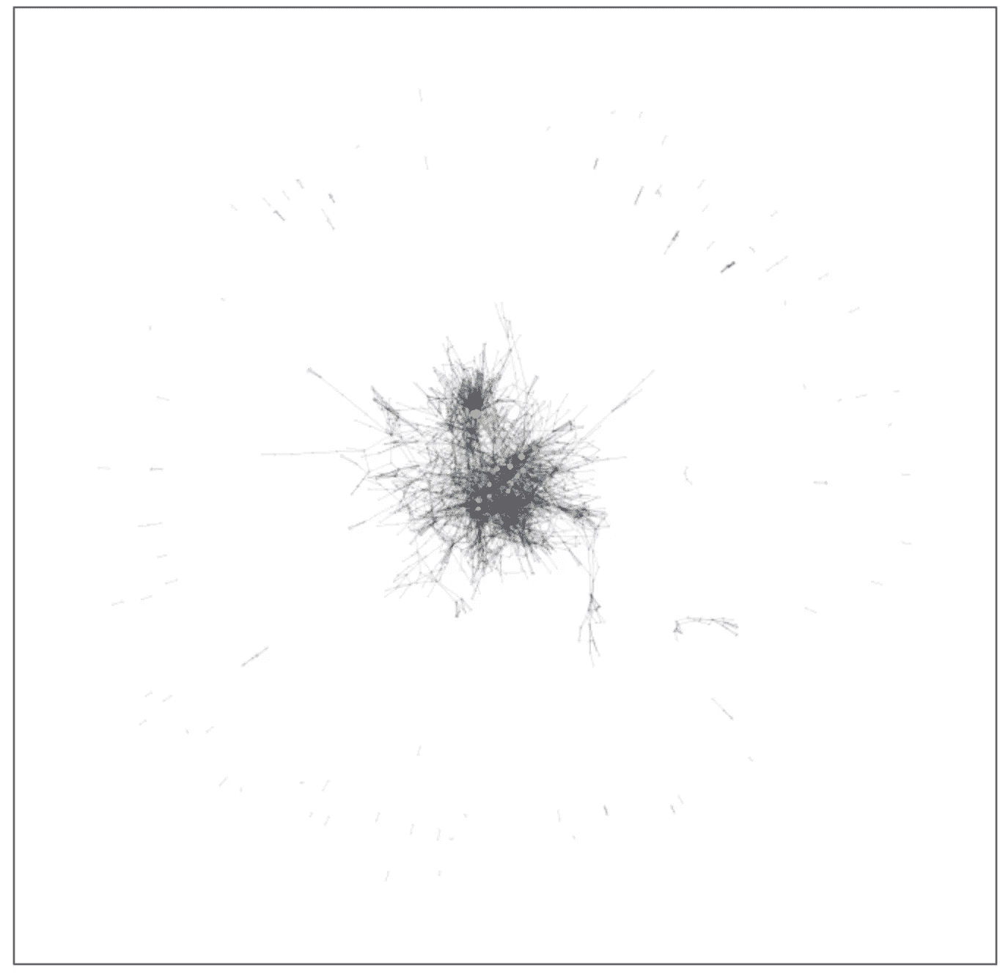

度最高的前 10 个节点用黄点表示，其他节点用灰点表示。黄点与度数的大小成正比。你可以看到黄色的点都位于网络的中心部分。

## 特征

Cora 数据集中的论文具有 **1433** 特征。

对于 1433 个单词中的每一个，如果该单词在论文中被包括或不被包括，则特征的数量被表示为 0 和 1。

```
print(f'Number of features: {data.num_node_features}')
# Number of edge features: 0
```

让我们展示一些特征，你可以看到它们是由 0 和 1 组成的。

```
print(len(data.x[0]))
data.x[0][:20]
```

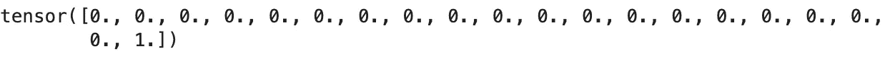

请注意，我们现在正在查看节点功能。边也可能具有特征值(边要素)，但它们不包含在 Cora 数据集中。

```
print(f'Number of edge features: {data.num_edge_features}')
# Number of edge features: 0
```

## **学习班**

Cora 数据集中的论文标有 **7** 不同的标签。

```
print(f'Number of classes: {dataset.num_classes}')
# Number of classes: 7
```

让我们显示这个类的一部分，我们可以看到它由 0 到 6 之间的整数组成。每个数字对应一个主题，如下所示。详见[此处](https://keras.io/examples/graph/gnn_citations/)。

```
label_dict = {
    0: "Theory",
    1: "Reinforcement_Learning",
    2: "Genetic_Algorithms",
    3: "Neural_Networks",
    4: "Probabilistic_Methods",
    5: "Case_Based",
    6: "Rule_Learning"}
data.y[:10]
```


通常班级的数量是不相等的。让我们找出每个班级的人数。

```
counter = collections.Counter(data.y.numpy())
counter = dict(counter)
print(counter)count = [x[1] for x in sorted(counter.items())]plt.figure(figsize=(10, 6))
plt.bar(range(7), count)
plt.xlabel("class", size=20)
plt.show()
```

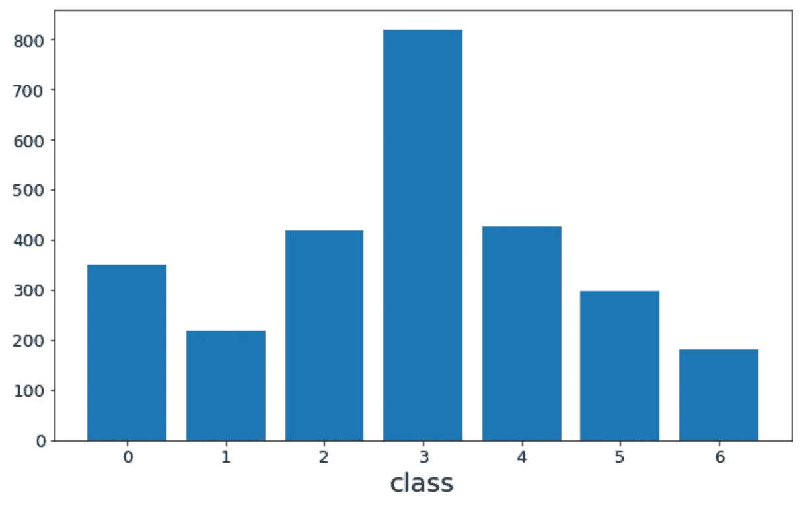

班级人数最高的是 3 班 818 人，最低的是 6 班 180 人。在训练机器学习模型时，我们需要小心谨慎。

接下来，画一个网络图，看看这些类的分布是否连贯。

```
G = to_networkx(data, to_undirected=True)node_color = []
nodelist = [[], [], [], [], [], [], []]colorlist = ['#e41a1c', '#377eb8', '#4daf4a', '#984ea3', '#ff7f00', '#ffff33', '#a65628']
labels = data.y
for n, i in enumerate(labels):
    node_color.append(colorlist[i])
    nodelist[i].append(n)pos = nx.spring_layout(G, seed = 42)plt.figure(figsize = (10, 10))
labellist = list(label_dict.values())for num, i in enumerate(zip(nodelist, labellist)):
    n, l = i[0], i[1]
    nx.draw_networkx_nodes(G, pos, nodelist=n, node_size = 5, node_color = colorlist[num], label=l)nx.draw_networkx_edges(G, pos, width = 0.25)
plt.legend(bbox_to_anchor=(1, 1), loc='upper left')
```

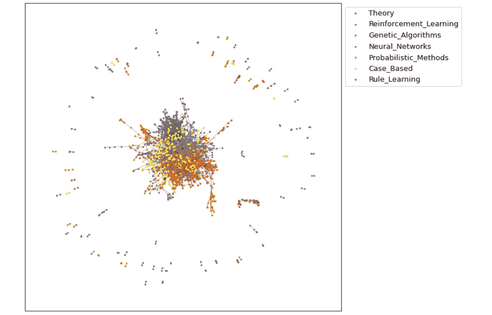

因为它是在二维空间中绘制的，所以看起来有点困难，但是看起来好像这些类被组合在一起了。我们将在下一节从不同的角度分析这一点。

## **同性**

具有相同特征的节点通常是相连的。这种性质叫做同质性。对于我们之前看到的七个类，我们将看到有多少相同类的节点通过边连接，反之亦然。

```
labels = data.y.numpy()
connected_labels_set = list(map(lambda x: labels[x], data.edge_index.numpy()))
connected_labels_set = np.array(connected_labels_set)def add_missing_keys(counter, classes):
    for x in classes:
        if x not in counter.keys():
            counter[x] = 0
    return counterlabel_connection_counts = []
for i in range(7):
    print(f"label: {i}")
    connected_labels = connected_labels_set[:, np.where(connected_labels_set[0] == i)[0]]
    print(connected_labels.shape[1], "edges")
    counter = collections.Counter(connected_labels[1])
    counter = dict(counter)
    print(counter)
    counter = add_missing_keys(counter, range(7))
    items = sorted(counter.items())
    items = [x[1] for x in items]
    label_connection_counts.append(items)label_connection_counts = np.array(label_connection_counts)plt.figure(figsize=(9, 7))
plt.rcParams["font.size"] = 13
hm = sns.heatmap(label_connection_counts, annot=True, cmap='hot_r', cbar=True, square=True)
plt.xlabel("class",size=20)
plt.ylabel("class",size=20)
plt.tight_layout()
plt.show()
```

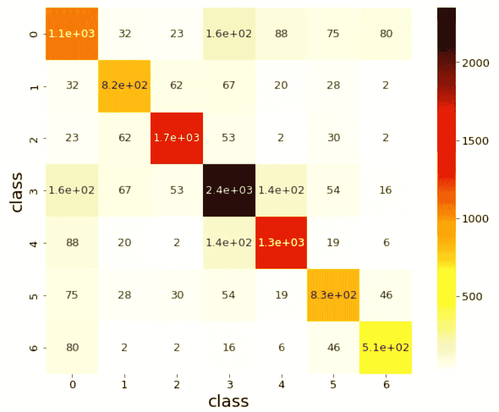

我们可以看到，有许多属于同一个类的相互连接的节点。

通过将矩阵的对角线分量的和除以所有分量的和，我们计算出在同一类内连接的边的百分比。

```
label_connection_counts.diagonal().sum() / label_connection_counts.sum()
# 0.8099658961727927
```

似乎有 81%左右的边是在同一个类内连接的。

```
def scaling(array):
    return array / sum(array)label_connection_counts_scaled = np.apply_along_axis(scaling, 1, label_connection_counts)plt.figure(figsize=(9, 7))
plt.rcParams["font.size"] = 13
hm = sns.heatmap(
    label_connection_counts_scaled,
    annot=True,
    cmap='hot_r',
    fmt="1.2f",
    cbar=True,
    square=True)
plt.xlabel("class",size=20)
plt.ylabel("class",size=20)
plt.tight_layout()
plt.show()
```

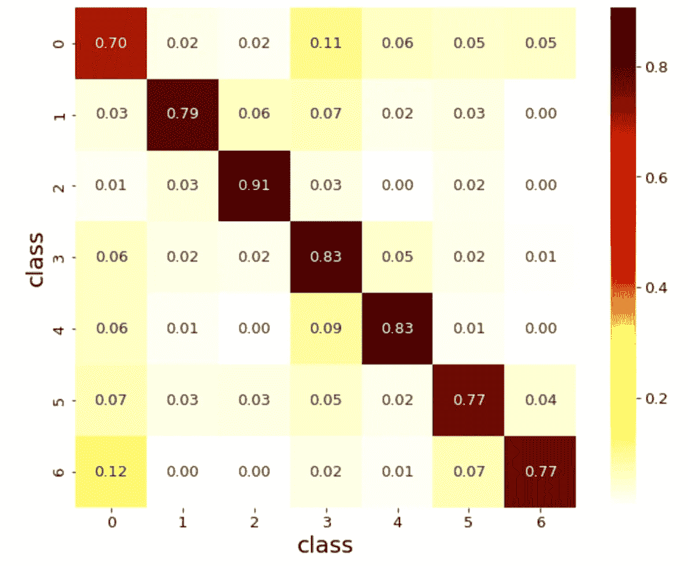

太棒了。我们可以看到，对于所有类，最高数量的边与同一个类相关联。对于类 2 也是如此，其中大约 91%的边在同一类内连接。另一方面，趋势在类 0 中相对较弱，大约 70%的边在同一类内。

## 列车测试分离

最后但同样重要的是，我们将讨论数据拆分。我们现在处理的数据类具有掩码形式的拆分信息，可以分为训练数据、验证数据和测试数据。首先，让我们看看每个包含多少数据。

```
print(f'Number of training nodes: {data.train_mask.sum()}')
print(f'Number of validation nodes: {data.val_mask.sum()}')
print(f'Number of test nodes: {data.test_mask.sum()}')
```

数据被分成 140 个训练数据、500 个验证数据和 1000 个测试数据。然而，这些案件的总数加起来不到 2708 起。让我们检查一下哪些数据被使用，哪些数据没有被使用。

```
split_type_array = np.zeros(data.num_nodes)
split_type_array[np.where(data.train_mask == True)[0]] = 1
split_type_array[np.where(data.val_mask == True)[0]] = 2
split_type_array[np.where(data.test_mask == True)[0]] = 3
split_type_arrayplt.scatter(range(2708), split_type_array)
plt.xlabel("index")
plt.show()
```

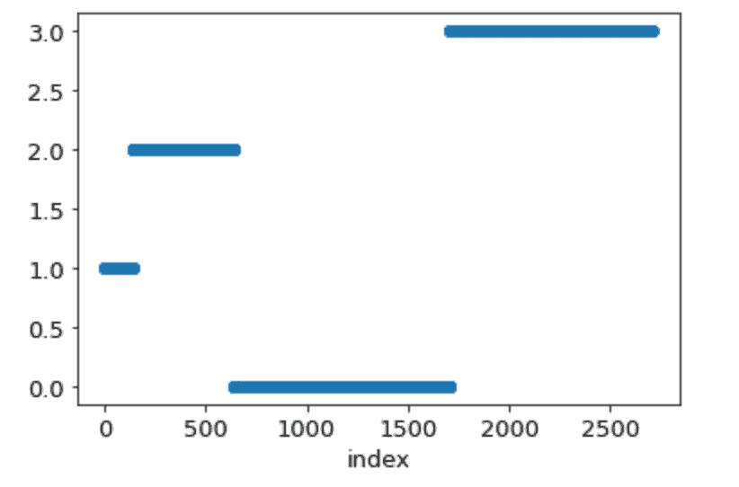

我们将 x 轴标为索引，y 轴标为 0 表示未使用的数据，1 表示训练数据，2 表示验证数据，3 表示测试数据。这是一个奇怪的分割，但看起来数据是如上分割的。

```
titles = ["Training", "Validation", "Test"]
fig, axes = plt.subplots(ncols=3, figsize=(21, 6))for i in range(3):
    counter = collections.Counter(data.y.numpy()[np.where(split_type_array == i + 1)[0]])
    counter = dict(counter)
    print(titles[i], counter)count = [x[1] for x in sorted(counter.items())]# plt.figure(figsize=(10, 6))
    axes[i].bar(range(7), count)
    axes[i].set_xlabel("class", size=20)
    axes[i].set_title(titles[i])plt.show()
```

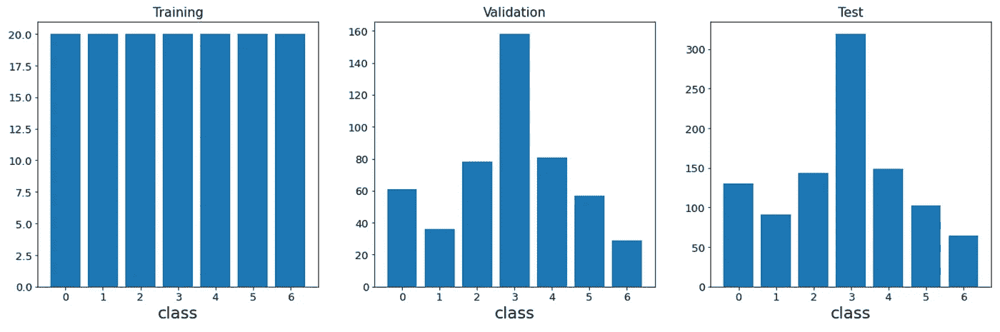

有意思！训练数据包含每个类别的 **20 个数据。验证和测试数据不具有相等的类别比例，但是两者具有相似的分布。这些类似于在类部分看到的总体数据中类的百分比。**

# 结论

在本文中，我们使用 Cora 数据集来解释具有图形结构的数据的特征以及如何绘制图表。我们希望你已经提高了对 PyTorch Geometric 和 networkx 的处理能力。

以后会讲解图形神经网络，一定要关注我，不要错过。

[](/@koki_noda/ultimate-guide-to-graph-neural-networks-2-texas-dataset-f70782190f80) [## 图形神经网络终极指南(2):德克萨斯数据集

### 近年来，社交媒体变得流行起来，用户通过关注者-关注者相互联系…

medium.com](/@koki_noda/ultimate-guide-to-graph-neural-networks-2-texas-dataset-f70782190f80) [](/mlearning-ai/mlearning-ai-submission-suggestions-b51e2b130bfb) [## Mlearning.ai 提交建议

### 如何成为 Mlearning.ai 上的作家

medium.com](/mlearning-ai/mlearning-ai-submission-suggestions-b51e2b130bfb)