# 揭开神经网络的深层状态

> 原文：<https://medium.com/mlearning-ai/uncovering-the-deep-state-of-neural-networks-925af2fc2a63?source=collection_archive---------1----------------------->

深度学习数学走查和代码逻辑

在之前的博文中，我们介绍了一个例子，其中我们使用了一个具有两个神经元和一个隐藏层的神经网络来产生一个(非常不准确的)预测函数。正如我们之前讨论的，如果你的函数中有两个弯折就足够了，这是没问题的，但是如果你需要函数形状更复杂，你必须要么在你的隐藏层中添加更多的节点，要么添加另一个隐藏层(或者两者都添加！)在这篇文章中，我们将看看当我们决定引入第二个具有相同数量节点的隐藏层时会发生什么，并通过数学运算使它更真实一些。

在我的[深度学习的理论概述](http://jasoneden.medium.com/kinks-in-the-works-2a1e2b609cc9)中，我们展示了一个深度学习神经网络的概述，看起来像这样:

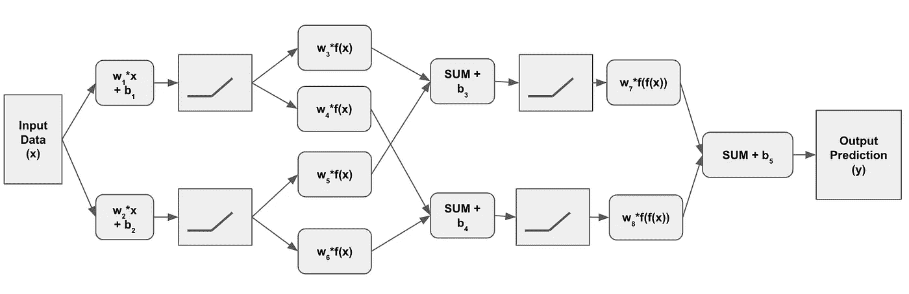

我们[已经知道](https://jasondeden.medium.com/form-of-an-innacurate-prediction-c95e338e63db)在第一个激活层之前会发生什么，但这就是深度学习路径的分歧之处。这些输出不是立即对激活节点输出求和，而是分别通过另一组权重和偏置计算——下一层中的每个节点一组(因此在我们的示例中是两组),这些结果被合并并作为输入馈入下一个激活层。

回到我们的工作示例:我们从第一组权重/偏差的输出开始(使用随机权重、实际数据和随机偏差值的内积计算):

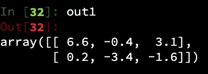

这通过 ReLU 激活层传递:

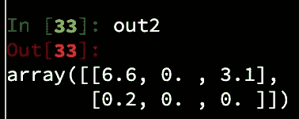

在我们的单一隐藏层中，这个输出被直接转换成最终的预测。但是现在，我们将两组权重和偏差值应用于每个神经元，而不是单一的一组权重和偏差值，在我们的图中指定为一组权重 3 和 5(矩阵形式的 w35)，然后是 4 和 6(或 w46)。让我们生成这些:

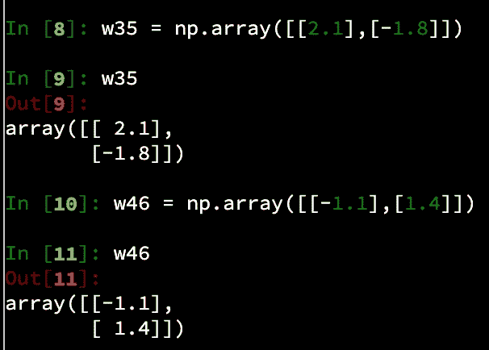

并生成随机偏差值(图中的 b3 和 b4):

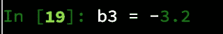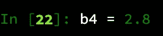

现在我们已经设置好了，可以开始计算了！

# 咕嘟咕嘟

我们将第一个神经元的输出乘以我们的两个权重，计算此阶段每个预测的总和，并添加适当的偏移值。让我们一步一步地演示顶层神经元:

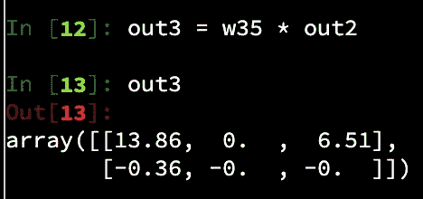

The “*” is shorthand for np.multiply()

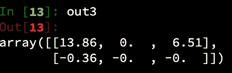

**如果我们为了可视化的目的来绘制这个图，这将是一个有两个扭曲的函数，就像单层例子中的最终预测一样。**

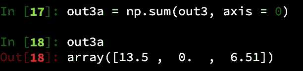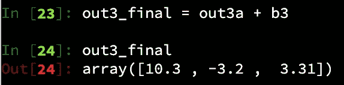

在单层示例中，这将是我们的最终预测，但现在我们需要对隐藏层中的第二个节点进行相同的计算，并传递这些值。单步将如下所示:

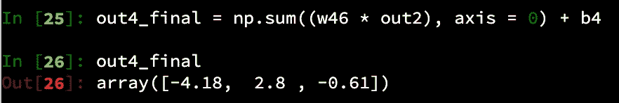

我们在逻辑上创建了两个函数，每个函数有两个扭结(就像我们上一篇文章中的单层神经网络一样)，作为第一个隐藏层的输出/预测。现在，这些预测被合并到一个矩阵中，这样我们就可以在下一层执行一个乘法步骤:

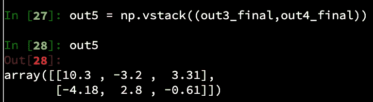

此时，我们应该处于非常熟悉的领域——这基本上是前面步骤的重复。我们通过激活函数运行这个输出:

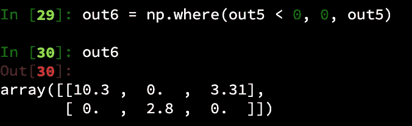

…创建一组随机权重和最终偏移:

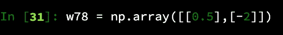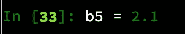

…并创建我们的最终输出集，这是我们对这次向前传递的最终预测，它基于一个函数，如果用图表表示，该函数将包含四个独立的结:

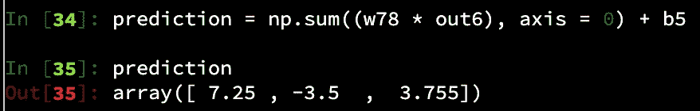

# 纲领性的方法

让我们创建几个函数来简化我们的生活。首先，让我们将激活节点编码为一个函数，这样我们就可以简单地调用 ReLU()并为它提供一个矩阵，它将转换它并返回没有负值的激活版本:

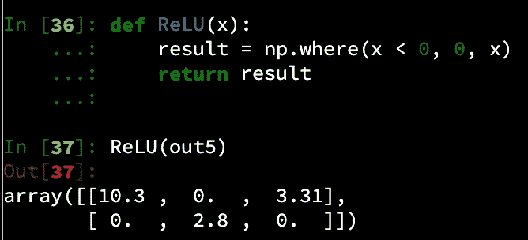

接下来，我们将定义一个函数，它为我们计算将我们的权重应用到前面的输出。请注意，我已经添加了一些逻辑，以便在丢失权重时动态生成随机权重，但实际上，应该预先为每个图层计算所有权重，并在此函数之外进行跟踪，因为它们将在梯度下降过程中进行修改。

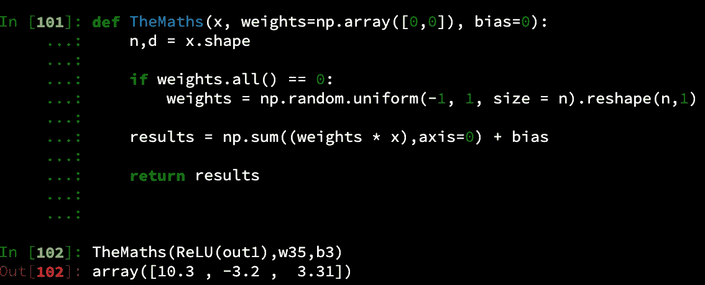

作为健全性检查，将其与 out3_final 的长格式结果进行比较:

到目前为止一切顺利！

现在，我们只需要对相同的输出重复这一步，但是在下一层中对每个激活节点使用不同的权重和偏差。我们可以简单地再运行一次:

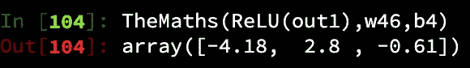

…然后使用 np.vstack()重新组合它们以进行最终处理，或者我们也可以将所有工作放入另一个函数中:

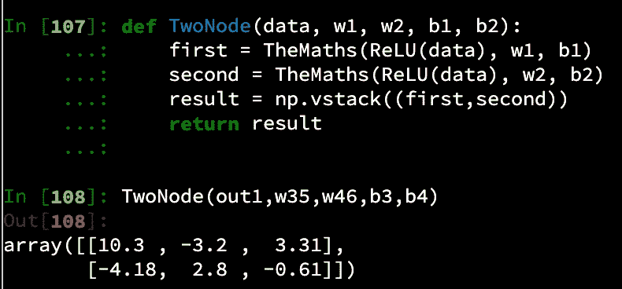

我们现在可以有 10 个隐藏层，每个层有两个节点，并对每个层重用相同的功能代码，同时提供适当的权重和偏差值。

现在我们有了一行代码，它传入了前一个隐藏层的输出，加上(最初)随机生成的权重和偏差。这用一个命令就把我们从最初的 out1 一直带到了前面的 longform 示例的 out5 阶段。检查下面的输出，让我保持诚实！

现在对于最终的预测，我们只需要一个输出，所以我们重用 TheMaths 函数来生成最终的数组，然后添加最终的偏移值。

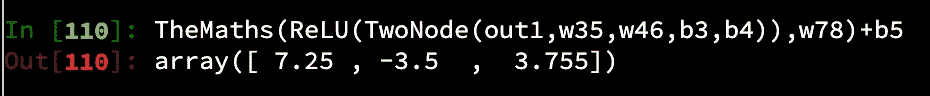

请注意，我们已经封装了深度网络中从输入层的第一个输出到最终预测的所有内容。

如果我们想要添加更多的层，您可以简单地根据需要多次嵌套 Relu(TwoNode(…))模式。当然，还有更复杂的方法可以做到这一点。你可能想考虑某种递归函数,它简单地调用自己，直到达到隐藏层数。但是从概念的角度来看，数学逻辑的框架现在已经完成了。

现在剩下的就是根据不同的参数修改方法。例如，我们可能希望允许用户更宽松地配置层和节点，或者可能修改激活函数以避免零值(可能使用被称为“泄漏 ReLU”的修改)。我们还需要确定如何生成和跟踪随机权重和偏差值。有很多建议的方法，有一天这可能会成为这个博客感兴趣的话题。然而，今天不是那一天。:)

虽然这有点复杂，但归根结底，这实际上是一个有很多重复逻辑的简单过程。理解它如何工作意味着你理解，在一个非常基础的层面上，深度神经网络如何做出预测。同样，在第一遍中，你几乎可以保证这些是非常非常糟糕的预测，所以我们仍然需要弄清楚整个反向传播/梯度下降是如何工作的。但是理解深度神经网络实际上是如何计算它们的值，现在已经足够好了。我们会继续讨论的。

 [## Mlearning.ai 提交建议

### 如何成为 Mlearning.ai 上的作家

medium.com](/mlearning-ai/mlearning-ai-submission-suggestions-b51e2b130bfb)