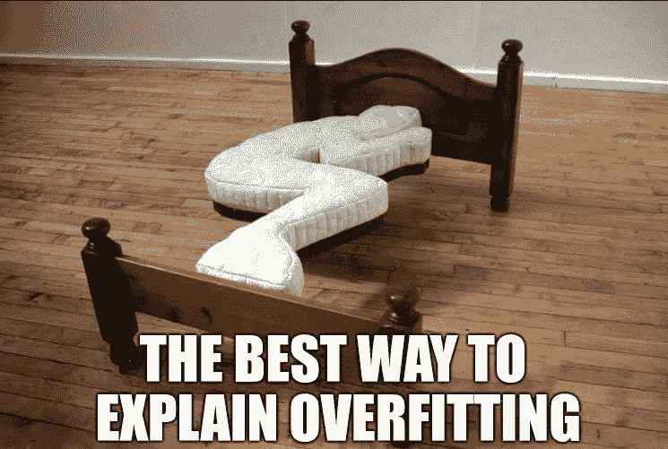

# 深度学习中的欠拟合和过拟合

> 原文：<https://medium.com/mlearning-ai/underfitting-and-overfitting-in-deep-learning-687b1b7eb738?source=collection_archive---------0----------------------->

## 不确定是否是好模型…或者只是过度拟合？

Source: Authors own image.

在应用深度学习中，我们经常面临过拟合和欠拟合的问题。这是一个详细的指南，应该回答了深度学习中什么是过拟合和欠拟合以及如何防止这些现象的问题。