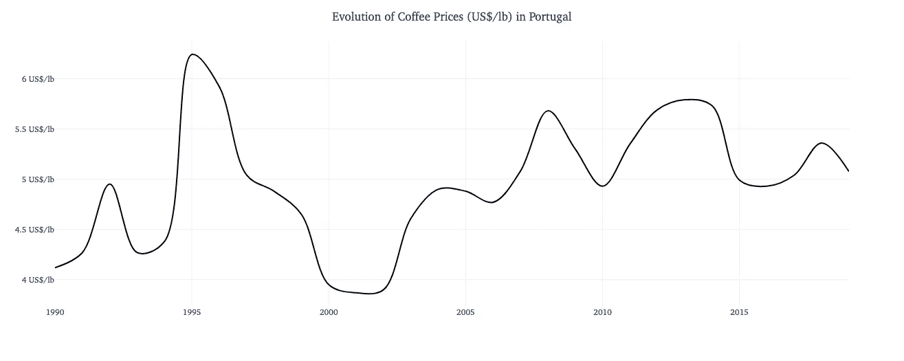
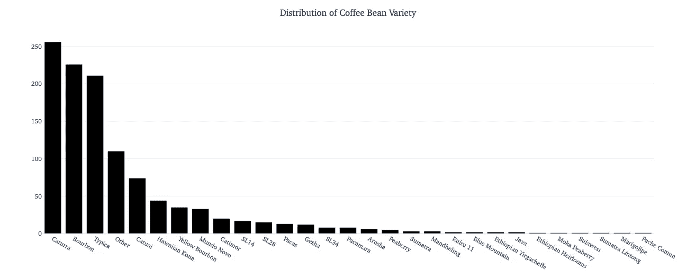
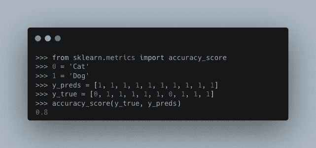
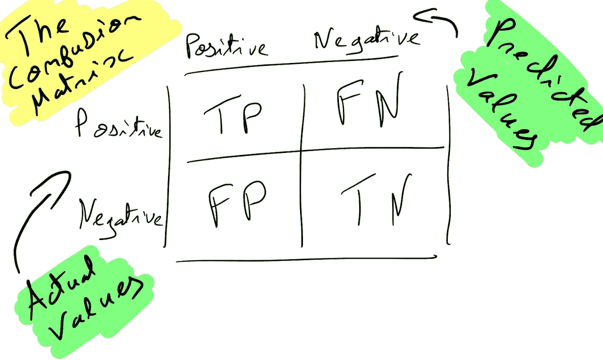
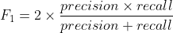
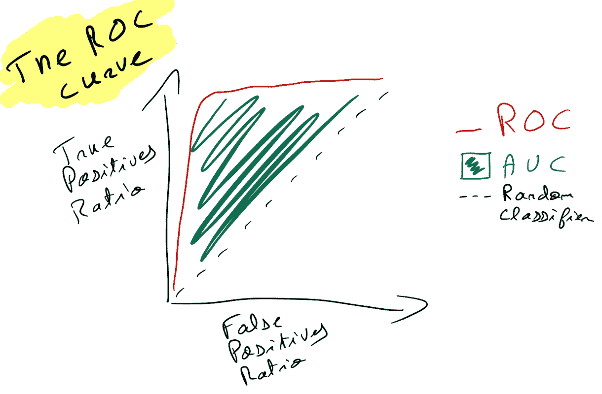

# 在不到 5 分钟的时间内理解分类问题

> 原文：<https://medium.com/mlearning-ai/understand-classification-problems-in-less-than-5-minutes-712244d259c8?source=collection_archive---------6----------------------->

分类是机器学习中最著名的监督问题之一，我们来试着快速解释一下吧！

Photo by [Nathan Dumlao](https://unsplash.com/@nate_dumlao?utm_source=medium&utm_medium=referral) on [Unsplash](https://unsplash.com?utm_source=medium&utm_medium=referral)

在本文中，我们将看到:

1.  什么是分类问题？
2.  不同类型的分类问题。
3.  如何评价一个分类模型？

# 我们如何定义一个分类问题？

为了能够理解什么是分类，让我们用回归来比较两者。

## 什么使得分类问题不同于回归问题？

两者都与它试图预测的目标大相径庭。一方面，您希望**预测数值连续变量**，例如基于某些特征的咖啡价格(数据集来源:【https://www.ico.org/new_historical.asp】T2):

By the author (with the [Plotly](https://plotly.com/) Library)

你的目标将分布在一个范围内，所以在每磅 4 美元和每磅 6.3 美元之间有大量的可能性。

另一方面，你要**预测类**，例如咖啡豆的品种:

By the author (with the [Plotly](https://plotly.com/) Library)

在这种情况下，目标将不在一个范围内，而是在有限数量的可能类中:29，从帕卡马拉到蓝山(数据集来源:[https://database.coffeeinstitute.org/](https://database.coffeeinstitute.org/))。

总而言之，分类问题是一个你的目标可以被定义为类别的问题:交通灯是绿色、黄色还是红色？这张照片包含哪些项目？

# 不同类型的分类问题

我们可以区分 4 种分类问题:

*   二元分类:预测 0 或 1(来自一条推文的正面或负面情绪)。
*   多类分类:预测 0、1、2 或 4(一杯卡布奇诺、浓缩咖啡、拿铁、拿铁玛奇朵)。
*   多标签分类:预测 0 或/和 1(一张图上的狗和/或猫)。
*   多输出分类:预测 0 或/和 1 或/和 2(多类多标签结合)。

除此之外，分类问题还出现在计算机视觉、自然语言处理、自动语音识别等领域

# 如何评估一个分类模型

由于目标是一个类，并且大多数数据集不是完美分布的，因此仅使用传统精度分数等性能测量来评估分类模型并不是一个好的选择。

让我们以一个对狗和猫的照片进行分类的模型为例:

By the author (from [Carbon](https://carbon.now.sh))

准确率相当不错:80%。然而，如果我们看一下预测( *y_preds* )，模型只返回狗，没有猫，而 2 张照片是猫。这个问题来自一个不平衡的数据集，它导致了一个糟糕的学习和一个犯错误但不足以在准确性分数中看到的模型。

因此，我们需要更好的评估类型来了解系统是否运行良好，让我们看看两个主要的评估类型:

## **混淆矩阵**

混淆矩阵显示了每个类中的每个元素是如何存储的。有多少个 0 被预测为 0 或 1，反之亦然。我们称真阴性、真阳性、假阳性和假阴性为矩阵的细胞。

真阳性是模型正确预测的来自 1 的类元素。

存在 2 个比率，可以更好地理解模型的作用:

1.  **精度** : TP / (TP + FP)
2.  **回忆** : TP / (TP + FN)

最后，通过结合这两个，我们获得一个调和平均值，称为 **F1** - **得分**:

By the author (with [Codecogs](https://latex.codecogs.com/legacy/eqneditor/editor.php))

注意:精度增加越多，回忆减少越多，这可以从*精度—回忆曲线*中看出。

## 受试者工作特征曲线

ROC 曲线穿过真阳性比率和假阳性比率。曲线越靠近左上角，你的模型越好(当然取决于你数据的平衡)。

By the author

AUC 是曲线下的面积，也是业绩的衡量标准。它越高，你的模型越好(最大 AUC 为 1)。

感谢您阅读这篇文章，我希望您了解在数据科学中如何处理分类问题，以及如何评估您的机器学习模型的性能！

 [## Mlearning.ai 提交建议

### 如何成为 Mlearning.ai 上的作家

medium.com](/mlearning-ai/mlearning-ai-submission-suggestions-b51e2b130bfb)