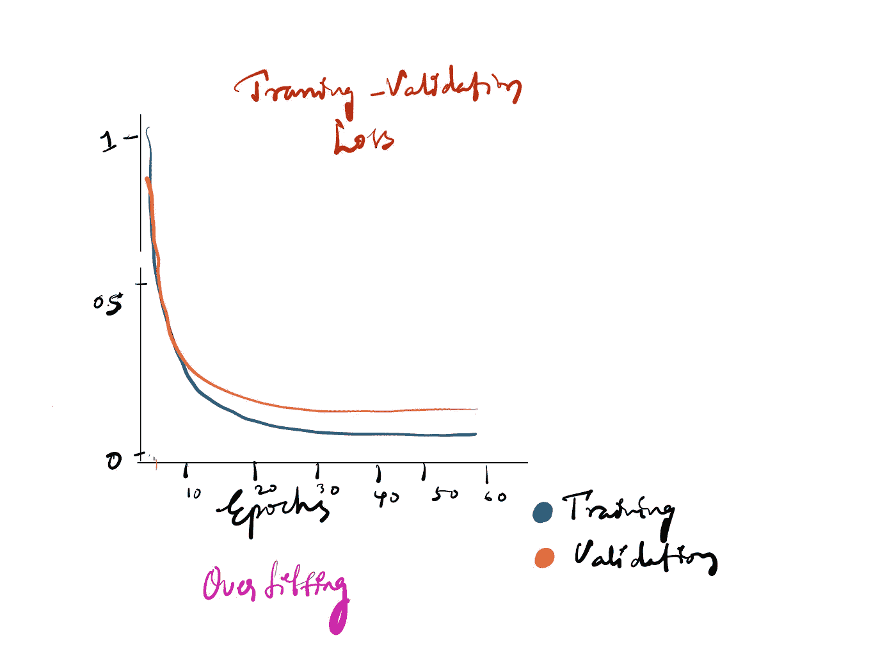
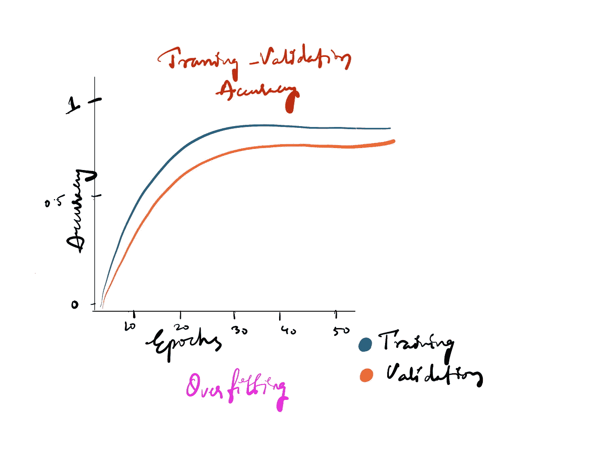
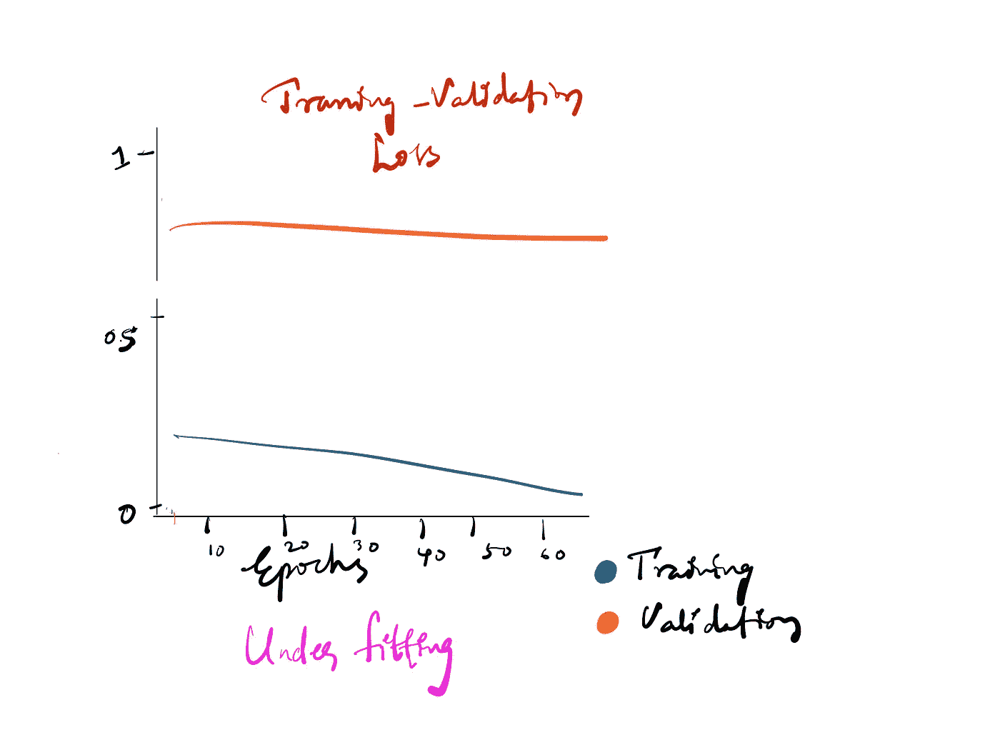
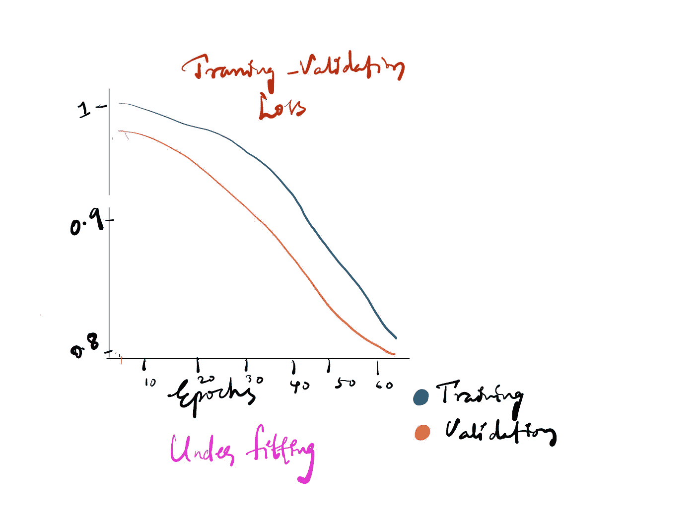
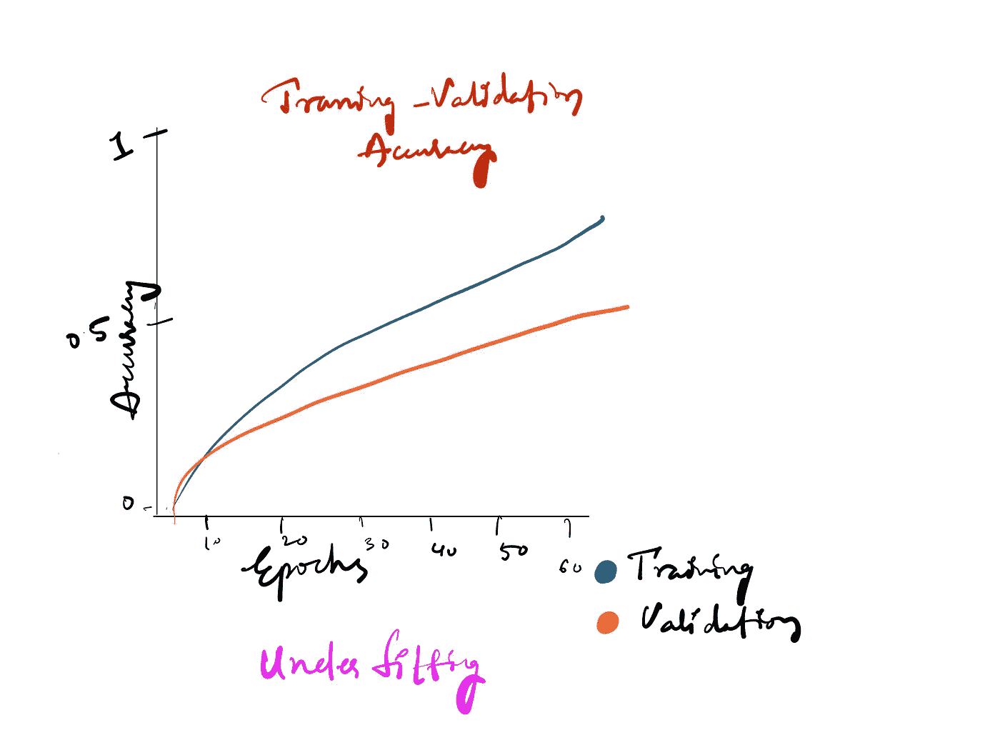
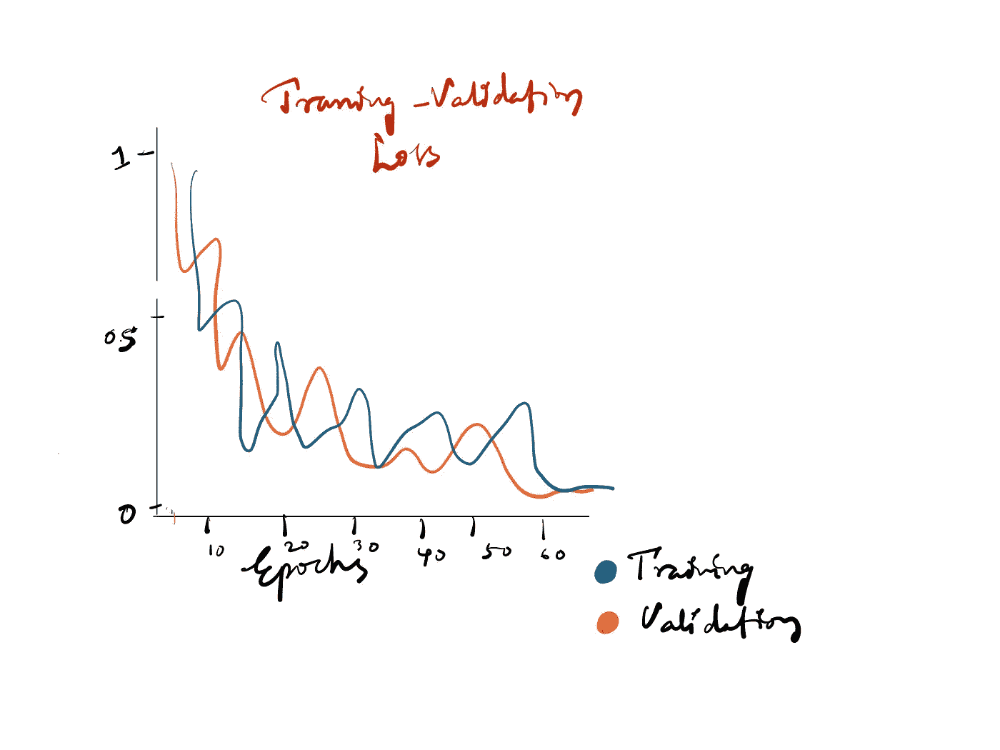
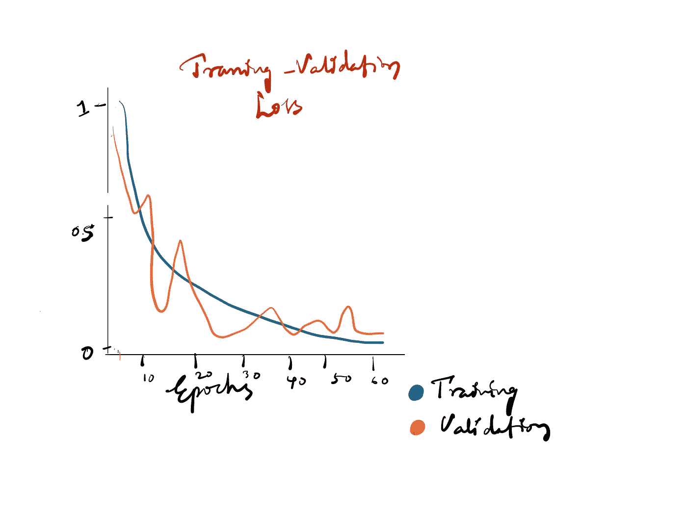
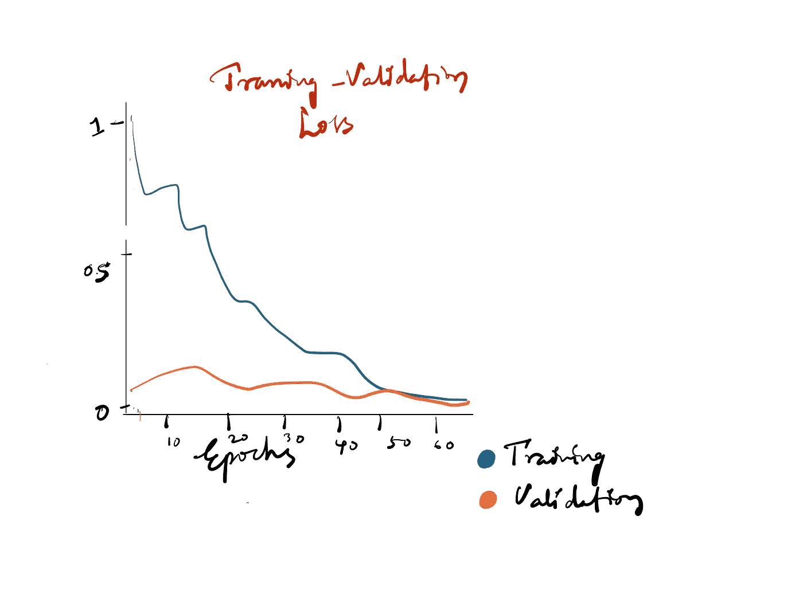

# 了解深度学习，模型超调的学习曲线

> 原文：<https://medium.com/mlearning-ai/understand-the-deep-learning-curves-for-model-hyper-tuning-19ae2c41b883?source=collection_archive---------2----------------------->

我知道，一旦你在训练数据集上拟合了一个模型，却不知道下一步该做什么是多么令人恼火。你应该知道如何判断你的模型的准确性和损失曲线。这些学习曲线将引导你进入下一步。

这里的关键方面是检查模型是否欠拟合或过拟合，或者是否有一些奇怪的幽灵攻击了你的模型，曲线是如此该死的之字形。这是什么意思？这里到底发生了什么？

让我们开始调查最可能的情况。

**过度拟合-**
易如反掌！很容易识别。如果验证损失大于训练损失，并且验证准确度小于训练准确度。
曲线看起来像这样:

治愈:正规化方法

**欠拟合—**
欠拟合意味着模型与您提供的数据不完全吻合。它还需要学习更多。
曲线看起来像这样:

治愈:
1。降低学习率
2。为更多的时代而训练
3。使用小型架构(减少层数)

之字形—
如果曲线是之字形且怪异的，问题主要取决于你提供的数据。

Both Training and Validatation data is not proper

如果训练曲线和验证曲线都是锯齿形的，这意味着模型无法从训练数据中学习任何模式。显然，如果它不能学习任何模式，它也会在验证过程中表现怪异。它会随机预测，因为它不知道如何预测，而且曲线是之字形的。

Validation data doesn’t represent Training data

如果训练学习曲线是改进的，而验证曲线是曲折的，这意味着验证数据不代表训练数据。显然，如果您在 cats 数据集上训练模型，并且不能期望它在 elephant 验证数据集上正常执行。

**冗余数据-**

下图表示验证数据太容易预测了。这可能是因为验证数据与训练数据非常相似。有时可能会有冗余数据。
解决方法取决于您的使用案例。如果有类似的数据没问题，那这个也没问题。但是，如果您实时看到不同的数据，这不是一个好现象。

Redundant validation data

这些是您在训练模型时会看到的一些情况。我希望这是有帮助的。

ref:[https://machine learning mastery . com/learning-curves-for-diagnostic-machine-learning-model-performance/](https://machinelearningmastery.com/learning-curves-for-diagnosing-machine-learning-model-performance/)

干杯！

快乐超调💚

 [## Mlearning.ai 提交建议

### 如何成为 Mlearning.ai 上的作家

medium.com](/mlearning-ai/mlearning-ai-submission-suggestions-b51e2b130bfb)